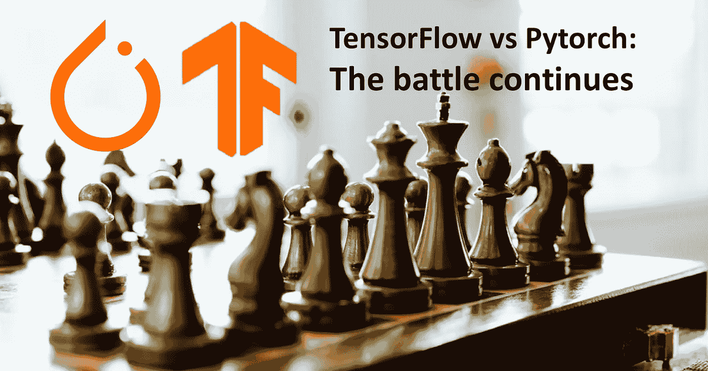

# TensorFlow vs PyTorch:战斗仍在继续

> 原文：<https://towardsdatascience.com/tensorflow-vs-pytorch-the-battle-continues-9dcd34bb47d4?source=collection_archive---------29----------------------->

## 本周，脸书宣布 PyTorch 1.5 的发布

照片由 [@evanthewise](https://unsplash.com/@evanthewise) 在 [Unsplash](https://unsplash.com/@evanthewise) 上拍摄

上周我们回答了问题 [*哪个是编程深度学习网络的最佳框架？*](/tensorflow-or-pytorch-146f5397278a) *。*而今天呢？脸书发布了新的 PyTorch 1.5，其中包括几个基于脸书和 AWS 合作的项目？

# 领先的深度学习框架

## 张量流

如今有许多可用的深度学习框架，然而， [TensorFlow](https://www.tensorflow.org) (由谷歌开发并于 2015 年 11 月作为开源发布)是目前业界使用最多的。

几周前 TensorFlow 发布了 TensorFlow 2.2 的[发布候选。在这个候选版本中，我将重点介绍已宣布的性能改进和帮助测量性能的新工具的引入，如新的](https://github.com/tensorflow/tensorflow/releases)[性能分析器](https://www.tensorflow.org/guide/profiler)。他们还增加了 TensorFlow 生态系统的兼容性，包括像 [TensorFlow Extended](http://tensorflow.org/tfx) 这样的关键库。

## PyTorch

三年前出现了 PyTorch 的第一个版本，毫无疑问，它正在获得巨大的发展势头。PyTorch 最初由脸书孵化，作为快速实验和原型制作的理想灵活框架，迅速赢得了声誉，在深度学习社区中赢得了成千上万的粉丝。例如，我的研究团队中的博士生选择使用 PyTorch，因为它很简单。它允许他们编写具有本机外观的 Python 代码，并且仍然可以获得良好框架的所有好处，如自动微分和内置优化。

> 深度学习框架领域的明确领导者现在是谷歌开发的 TensorFlow 和脸书开发的 PyTorch，他们正在从使用量、份额和势头上拉开市场的距离。

# 模型部署

然而，构建和训练模型只是故事的一半。在生产中部署和管理模型通常也是一个困难的部分，例如，构建定制的预测 API 并扩展它们。

处理模型部署过程的一种方法是使用一个*模型服务器*，以便于加载一个或多个模型，自动创建一个由可伸缩 web 服务器支持的预测 API。到目前为止，生产环境中的可部署性仍然是 TensorFlow 的强项，而服务于的 [TensorFlow 是最受欢迎的模型服务器。](https://www.tensorflow.org/tfx/guide/serving)

正如我们已经说过的，本周脸书发布了 PyTorch 1.5。新版本的重点是提供工具和框架，使 PyTorch 工作流可以投入生产。这篇文章中最引人注目的方面是 AWS 和脸书在项目 [TorchServe](https://github.com/pytorch/serve) 中的合作，这是 PyTorch 的开源模型服务器。

据 AWS 博客报道，一些客户已经享受到了 TorchServe 的好处。[丰田研究所高级开发公司](https://www.tri-ad.global/)正在丰田汽车公司开发自动驾驶软件。或者是 [Matroid](https://www.matroid.com/) ，一家检测视频片段中的物体和事件的计算机视觉软件制造商。

> 随着 PyTorch 不可阻挡的崛起，TensorFlow 在深度学习方面的主导地位可能正在减弱。

# PyTorch 1.5 版本

显然，这个新的 PyTorch 版本包含了更多的特性。亮点是 torch_xla、torchaudio、torchvision、torchtext 的更新包以及与 TorchElastic 集成的新库。我来简单总结一下:

*   [TorchElastic](https://github.com/pytorch/elastic) 是一个用于大规模训练大规模深度神经网络的库，具有动态适应服务器可用性的能力。在这个版本中，AWS 和脸书合作扩展 TorchElastic 的功能，将它与 Kubernetes 集成在一起，成为 Kubernetes 的 TorchElastic 控制器[。要了解更多信息，请参见](https://github.com/pytorch/elastic/tree/master/kubernetes)[火炬信贷回购](http://pytorch.org/elastic/0.2.0rc0/kubernetes.html)。
*   [torch_xla](http://pytorch.org/xla/) 是使用 [XLA 线性代数编译器](https://www.tensorflow.org/xla)在[云 TPUs](https://cloud.google.com/tpu/) 和[云 TPU Pods](https://cloud.google.com/tpu/docs/tutorials/pytorch-pod) 上加速 [PyTorch 深度学习框架](https://pytorch.org/)的 Python 包。torch_xla 旨在让 PyTorch 用户能够在云 TPU 上做他们在 GPU 上能做的一切，同时最大限度地减少用户体验的变化。完整的文档和教程可以在[这里](https://pytorch.org/xla/)和[这里](https://cloud.google.com/tpu/docs/tutorials)找到。
*   torchvision 0.6 版本包括对数据集、模型和大量错误修复的更新。完整的文档可以在[这里](https://pytorch.org/docs/stable/torchvision/index.html)找到。
*   torchaudio 0.5 版本包括新的变换、泛函和数据集。参见[这里的](https://github.com/pytorch/audio/releases)发布完整说明。
*   torchtext 0.6 版本包括许多错误修复，对文档的改进，根据用户的反馈，数据集抽象目前也正在重新设计。完整的文档可以在这里找到[。](https://pytorch.org/text/)
*   这个版本包含了重要的核心特性，比如对 C++前端的重大更新，或者用于模型并行训练的分布式 RPC 框架的稳定版本。该版本还有一个 API，允许创建定制的 C++类。你可以在这里找到详细的发行说明[。](https://github.com/pytorch/pytorch/releases)

> PyTorch 1.5 版本暗示，AWS-脸书的合作可能是使 AWS 成为运行 PyTorch 程序的首选云运行时的第一步。

# 综上

虽然 PyTorch 在脸书(和 AWS)的帮助下在市场上获得了发展势头，但 TensorFlow 继续在各个方面保持领先，例如已经推出的[认证计划](https://www.tensorflow.org/certificate)就是证明。

谷歌继续在加强其 TensorFlow 平台堆栈方面进行大量投资。但仍有待观察的是，脸书是否会继续以同样的节奏投资 PyTorch，以保持其至少与 TensorFlow 在功能上旗鼓相当。

> 展望未来，这些框架之间的功能差距将继续缩小，正如我们在之前的文章中已经讨论过的那样。

**2021 年 5 月 29 日更新:本周我们看到了微软和脸书合作推出的 PyTorch 企业支持计划，为在 PyTorch 中构建生产应用的企业用户提供支持。作为计划的一部分，微软宣布在微软 Azure** **上发布** [**PyTorch Enterprise。**](https://email.mg1.substack.com/c/eJwlkM1uxCAMhJ9mOUZAICQHDq3Uqsceeo8MeBPaBFJ-WuXtS7qSZVkaW-P5LBRcYjr1EXMhV5vLeaAO-Js3LAUTqRnT7J1mfKKjYj1xmipulSE-z_eEuIPfNDmq2byF4mO4tqXo6URWTWGSUqCalBuE4OZuGAWhDJXSObT3hydU5zFY1PiD6YwByabXUo58659u_LUVfEG35za8nx8x2fUltN-O5DO-YYrPW1yI15xyRmVPGacjZx3rUNJRGk6n5jcOnKpBOKMkCFCqVwPcBN0X1uVqcgH71dm4k6Q_Y3K-SSWmhLkDf4Wbm7bX4Ms5YwCzodMlVSTlge6fwrxgwNSQuhmKZgPnzUSycezlI2cD0w_TKJSYSDN1sV0FXVbM-F0vAH-guoUp)

 [## TensorFlow 还是 PyTorch？

### 深度学习网络编程的最佳框架是什么？

towardsdatascience.com](/tensorflow-or-pytorch-146f5397278a)