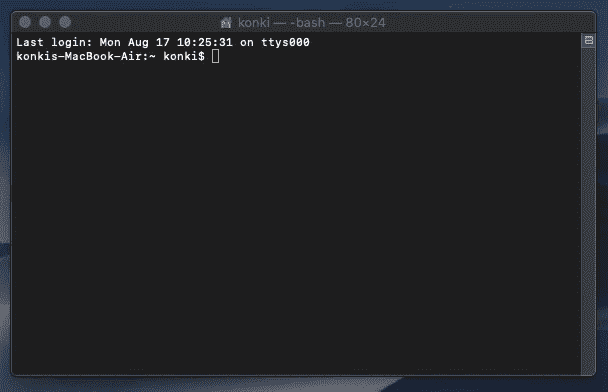
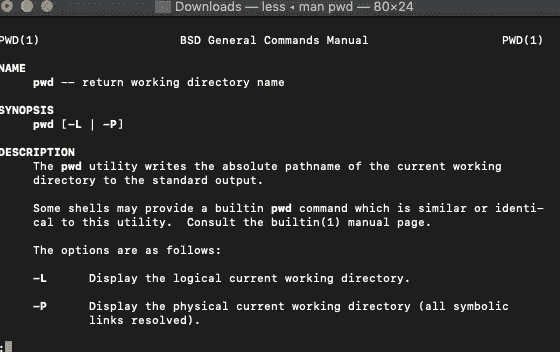

# 数据科学家的终端

> 原文：<https://towardsdatascience.com/terminal-for-data-scientists-3615159e936c?source=collection_archive---------51----------------------->

## 学习你的第一个命令


图片来自 [Pixabay](https://pixabay.com/?utm_source=link-attribution&utm_medium=referral&utm_campaign=image&utm_content=4037008) 的 [IRCat](https://pixabay.com/users/IRCat-10981235/?utm_source=link-attribution&utm_medium=referral&utm_campaign=image&utm_content=4037008)

**简介**

如果您还没有使用过命令行工具，那么是时候开始使用了。

本文介绍了让您开始这一旅程的第一批命令。

您将学习如何浏览文件夹和文件，并在不打开任何编辑软件或使用图形用户界面的情况下修改它们。

这将使你成为一个更有生产力和更好的数据科学家。

**午餐你的终端窗口**


如你所见，我把终端放在 Mac 的 Dock 中，所以我可以在那里吃午饭。

应用程序打开后，您应该会看到类似下面的终端窗口。它应该在当前用户空间中打开。我这里的用户叫‘konki’。



这是您将要输入命令的窗口！！！

** * *注意，我将在这里展示的命令对 MacOS 和其他 Unix 操作系统有效。如果您使用的是 Windows 命令提示符，这些命令中的大部分应该可以工作，但是其他的可能需要一些替换。*

1.  **pwd(打印工作目录)**

第一个命令将显示您当前所在的目录。只需键入“pwd ”,如下所示:

```
konkis-MacBook-Air:~ konki$ pwd

/Users/konki
```

你可以看到我现在在'/Users/konki '目录中。

**2。ls(列表)**

这个命令列出了一个目录中所有文件。让我们看一看。

```
konkis-MacBook-Air:~ konki$ ls

Applications Downloads Music  cd
Desktop  Library  Pictures seaborn-data
Documents Movies  Public
```

你可以看到我有 11 个目录，没有文件(如果我有一些文件，你会看到一些扩展名的名称。例如 txt. or。py)

您可以使用带-a 参数的 ls 来显示隐藏文件:

```
konkis-MacBook-Air:~ konki$ ls -a

.   .ipython  Downloads
..   .jupyter  Library
.CFUserTextEncoding .matplotlib  Movies
.DS_Store  .pgAdmin4.startup.log Music
.Trash   .pgadmin  Pictures
.astropy  Applications  Public
.bash_history  Desktop   cd
.bash_sessions  Documents  seaborn-data
```

看起来我有相当多的隐藏文件。那些是以点开头的(。).

还可以通过传递相对路径来检查当前不在的文件夹的内容。

```
ls Desktop/
```

上面的命令应该列出桌面目录的内容。

**3。mkdir (** 制作目录)

该命令用于创建新目录。以下代码行在名为 test 的当前文件夹中创建一个新目录。

```
konkis-MacBook-Air:~ konki$ mkdir test
```

您可以使用' ls '命令来检查它是否已被创建。

**4。光盘(更改目录)**

该命令用于将目录更改为给定路径的目录。一旦你创建了“测试”目录，你应该能够进入它。

```
konkis-MacBook-Air:~ konki$ cd test/
konkis-MacBook-Air:test konki$ pwd
/Users/konki/test
```

您可以使用上面的“pwd”命令来确认您的位置。

“cd”命令的其他有用变体是“cd”(不带参数)和“cd~”。它们都将带您到主目录。

```
cd
```

```
cd~
```

同样,“cd”的常见用法是返回到父目录，这可以用两个点来完成。

```
cd ..
```

**5。触摸**

您可以用它来创建一个新文件。下面的代码创建 my_file.py .然后使用' ls '命令检查目录的内容。

```
konkis-MacBook-Air:test konki$ touch my_file.py
konkis-MacBook-Air:test konki$ ls
my_file.py
```

我们创建的文件只是一个空文件。py 扩展名。稍后我们可以添加一些 python 代码。

**6。rm(删除)**

我们可以用 remove 命令删除文件或目录。有了文件，用如下所示的文件名调用这个命令就足够了。

```
konkis-MacBook-Air:test konki$ rm my_file.py 
konkis-MacBook-Air:test konki$ ls
konkis-MacBook-Air:test konki$
```

您总是可以确认文件是否是用上面的' ls '命令删除的。

如果您想删除整个目录，您必须添加-r 参数。这将使 remove 命令递归地工作，并进入所有子目录来删除它们的内容。

```
rm -r <directory_name>
```

**7。mv(移动)**

你可以用“mv”命令移动文件和目录。您只需要指定要移动的文件或文件夹名称以及新的所需位置(文件夹或文件名)。

```
mv <file_name> <new_location>
```

让我们创建一个新文件，并将其移动到父目录。

```
konkis-MacBook-Air:Downloads konki$ touch file.txt
konkis-MacBook-Air:Downloads konki$ mv file.txt ..
```

最后一行将 file.txt 移动到父目录。记住，两个点**(..)**是父目录的快捷方式。

**8。cp(副本)**

您也可以复制文件和文件夹，而不是移动它们。该命令的结构类似于 move 命令。您需要指定要复制的文件和目的地。

```
cp <file_name> <new_location>
```

让我们创建一个新文件，并将其复制到父目录。

```
konkis-MacBook-Air:Downloads konki$ touch file_to_copy.txt
konkis-MacBook-Air:Downloads konki$ cp file_to_copy.txt ..
```

现在，如果您使用' ls '命令，您将看到该文件仍然在它的原始位置。

如果您返回到带有“cd ..”的父文件夹再次使用“ls ”,您会看到“file_to_copy.txt”也在那里。它在没有删除原始文件的情况下被复制到了那里。

**9。man(手动)**

当您忘记如何使用上述任何命令时，此命令非常有用。它会调出特定命令的手册。

```
man <command>
```

您可以使用“pwd”命令进行测试。

```
man pwd
```

这将打开对“pwd”命令的描述，如下图所示。



您可以使用箭头向下滚动访问底部的文本，并键入“q”退出文本文件。

**总结**

我想这是我在浏览 Macbook 和处理项目时最常使用的命令列表。与使用图形用户界面相比，它节省了我大量的时间和精力。

从学习这九条开始，努力做到每天都使用命令行。

*原载于 aboutdatablog.com:* [数据科学家终端](https://www.aboutdatablog.com/post/terminal-for-data-scientists-learn-your-first-commands)，*2020 年 8 月 26 日。*

*PS:我正在 Medium 和*[](https://www.aboutdatablog.com/)**上撰写深入浅出地解释基本数据科学概念的文章。你可以订阅我的* [***邮件列表***](https://medium.com/subscribe/@konkiewicz.m) *每次我写新文章都会收到通知。如果你还不是中等会员，你可以在这里加入**[***。***](https://medium.com/@konkiewicz.m/membership)**

**下面是一些你可能会喜欢的帖子**

**[](/jupyter-notebook-autocompletion-f291008c66c) [## Jupyter 笔记本自动完成

### 数据科学家的最佳生产力工具，如果您还没有使用它，您应该使用它…

towardsdatascience.com](/jupyter-notebook-autocompletion-f291008c66c) [](/top-9-jupyter-notebook-extensions-7a5d30269bc8) [## 9 大 Jupyter 笔记本扩展

### 改进笔记本电脑功能，提高您的工作效率

towardsdatascience.com](/top-9-jupyter-notebook-extensions-7a5d30269bc8) [](/medium-writers-you-should-follow-as-an-aspiring-data-scientist-13d5a7e6c5dc) [## 作为一名有抱负的数据科学家，你应该关注的中型作家

### 我最喜欢的 10 个数据科学博主，让你的学习之旅更轻松。

towardsdatascience.com](/medium-writers-you-should-follow-as-an-aspiring-data-scientist-13d5a7e6c5dc)**