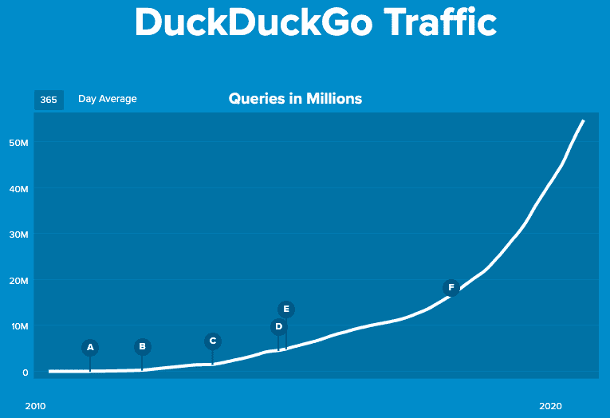
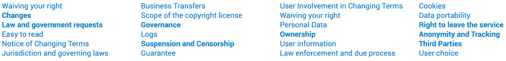
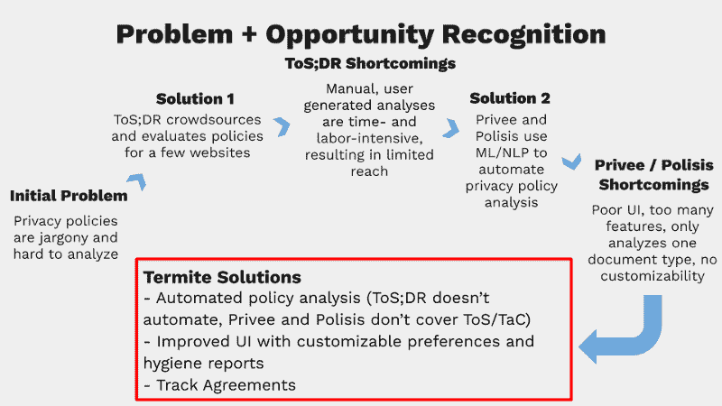

# 白蚁第一部分:对隐私难题的回应

> 原文：<https://towardsdatascience.com/termite-part-one-a-response-to-privacy-conundrums-3963f97bb187?source=collection_archive---------63----------------------->

## 没有人真正阅读的隐私政策的数据科学解决方案

# **为什么是隐私？**

“如果你没什么好隐瞒的，就不该担心。”这种经常听到的论点是一种错误的尝试，试图证明一个人的隐私受到损害是合理的。此外，我认为正是像这样的旁观者逻辑使得强者逐渐侵犯你的权利，直到为时已晚。

在加州大学伯克利分校信息学院的[数据科学硕士(MIDS)项目](https://www.ischool.berkeley.edu/programs/5th-year-mids)的最后一个学期，学生们的任务是构建一个最小可行产品(MVP)。进入研究生院的最后阶段，我对有机会使用我在过去一年中发展的数据科学技能来促进我对一项有价值的事业的理解感到乐观。我和我的团队([詹妮弗·帕特森](https://www.linkedin.com/in/jen-pattersonradovancevic/)、[朱利安·佩尔茨纳](https://www.linkedin.com/in/julian-pelzner/)和[奥利·唐斯](https://www.linkedin.com/in/ollie-downs/))选择追求的目标是互联网隐私。

我对隐私的探索是由我同时受雇于安全与技术研究所而激发的。在对数字平台如何影响人类认知以及如何反过来影响民主制度进行初步研究时，我发现自己一直在想，为什么人们如此信任在线平台。反过来，为什么要对网络论坛持怀疑态度？(免责声明:对我设计的产品/插件的任何提及都不以任何方式隶属于安全与技术研究所，或他们的任何项目或程序。)虽然我仍然无法完全回答这些问题，但我参与的顶点项目为我提供了一个解决这些问题的机会。

在全球化的新冠肺炎疫情中，我们花在网上的时间比以往任何时候都多。因此，数据收集和监测也在增加。关于接触者追踪和监视的权衡的辩论正在我们眼前展开。一方面，追踪接触者可能有助于减少病毒的传播。另一方面，在我们战胜疫情后，政府将如何使用同样的监控技术？我们真的相信政府会放弃使用这些先进工具的特权吗？谁敢说权力机构不会转而使用类似的技术来驱逐移民或识别和骚扰表达其第一修正案抗议权利的公民？

我 11 年级的历史老师安迪·欧文斯曾经说过，“特权永远不会自动放弃。”我认为在这个不确定的时代，这仍然是真理。关于在线隐私的讨论再恰当不过了。这不是一个新问题。有关隐私风险规避和隐私行为的更深入讨论，请阅读[与我们在一起很安全！消费者隐私科学](https://www.canvas8.com/content/2020/07/31/science-of-consumer-privacy.html)作者亚里沙·弗里克和玛蒂尔达·拉克。本文中提到了几个有趣的发现:

1.  [十分之六](https://www.pewresearch.org/internet/2019/11/15/americans-and-privacy-concerned-confused-and-feeling-lack-of-control-over-their-personal-information/)的美国成年人认为日常生活中不可能不收集他们的数据，81%的人认为潜在的风险大于好处。
2.  全球 69%的人表示，如果某个品牌的数据使用太具侵犯性，他们会避免与该品牌做生意。
3.  在英国、美国、法国和德国，78%的人表示他们会保护自己的财务信息，相比之下，只有 57%的人会保护自己的联系信息。
4.  只有 9%的美国人在签署条款和条件(T & Cs)之前会阅读隐私政策，47%的人表示对围绕欧盟一般数据隐私法规的信息感到厌倦。
5.  72%的美国人觉得他们在网上或手机上做的几乎所有或大部分事情都被广告商和科技公司追踪。
6.  [48%](https://www.cisco.com/c/dam/en/us/products/collateral/security/cybersecurity-series-2019-cps.pdf) 关心隐私的消费者因为公司或服务提供商的数据政策和做法而转向他们。
7.  14%的英国人愿意分享数据，如果他们能得到报酬的话。但这些回报也可能是间接的。来自约克大学的研究表明 [54%的英国人](https://www.york.ac.uk/news-and-events/news/2020/research/lockdown-study-rules/)愿意牺牲一些数据隐私来缩短封锁期*。此外，如果一家公司在如何使用数据方面更加透明，73%的人会愿意分享数据。*

我们通过自己的用户研究证实了这些统计数据，研究显示，50%的受访者表示他们从未阅读过网站的隐私政策，我们的受访者中没有人表示他们总是阅读政策。此外，当被问及是否对互联网负有责任时，67.2%的受访者回答“不”或“我不知道”这不仅向我们表明互联网用户没有感觉到他们的安全需求得到了满足，也向我们表明许多用户只是不知道他们的信息是否安全。

我们寻求解决的问题与隐私政策有关，理想情况下，隐私政策应该是让用户对一家公司的安全数据收集做法感到放心的地方。然而，这种情况很少发生。隐私政策的主要问题是它们太长，充满了技术术语和“法律术语”隐私政策通常是由寻求使公司免受诉讼的律师撰写的。它们很少是为了保护用户利益和促进他们的意识而写的。最近，从公共关系的角度来看，构建更加透明的隐私政策变得越来越流行。然而，这些都是边缘案例，隐私政策对于普通互联网用户来说仍然难以阅读、理解、总结和分析。事实是大部分人都不看，不知不觉就同意了。

# 白蚁

这就是我们推出[白蚁](https://odowns3.wixsite.com/termite)的原因:这是一款*免费的*浏览器附加工具，使用网页抓取和 NLP 方法来自动化和扩展在线服务条款、条款和合同以及隐私政策的评估和评级。白蚁还为用户提供定制的网络卫生报告，并使用户能够跟踪他们的在线协议，所有这些都是实时的。我们的目标是优化用户界面、感知和可操作性。当隐私政策和条款和条件是不可读的，白蚁率和跟踪他们。当用户对他们的信息安全感到不确定时，白蚁赋予他们权力。当网站利用用户不阅读他们的政策，白蚁让用户知道，保护他们。[点击这里](https://www.youtube.com/watch?v=dYMx4Lvd3rI&feature=youtu.be)查看我们的简短演示！

克里斯·里瓦斯的标志(@the_hidden_talents)

有一些工具和服务，都服务于自己的领域。他们每个人在解决各自的问题空间方面都做得很好。总的来说，风景仍然不完美。在这些不同的努力之间缺乏一个哲学上的桥梁，留下了进一步连接这些点的机会。以下是我们当前隐私问题的一些现有解决方案及其各自的缺点:

# Mozilla Firefox

Mozilla Firefox 是一款开源的网络浏览器，具有[展示的](https://www.mozilla.org/en-US/about/manifesto/) [隐私第一](https://www.mozilla.org/en-US/firefox/privacy/) [的精神](https://blog.mozilla.org/opendesign/firefox-the-evolution-of-a-brand/)，是市场份额第二大的浏览器。2018 年，Mozilla 基金会和 Mozilla 公司的[总收入为 4.36 亿美元。他们目前占据了浏览器市场 7.58%的份额。相比之下，谷歌 Chrome 是最大的浏览器，目前占浏览器市场的 68.81%。Mozilla Firefox 培养了一家在隐私问题上言行一致的公司。](https://www.mozilla.org/en-US/foundation/annualreport/2018/)

# 达克达克戈

DuckDuckGo 是一个搜索引擎，它会在可能的情况下自动加密用户与网站的连接(这样你的个人信息就不会被收集或泄露)，阻止广告追踪器，并警告用户不良的隐私做法。按市场份额计算，他们是第六大搜索引擎，拥有超过 5000 万用户。2018 年，他们的估值在[1000 万至 5000 万美元之间](https://www.crunchbase.com/organization/duck-duck-go#section-overview)，目前他们代表着 [1.36%的搜索引擎市场](https://gs.statcounter.com/search-engine-market-share/all/united-states-of-america)。相比之下，谷歌是最大的搜索引擎，目前占据 70.37%的市场份额。DuckDuckGo 代表了最全面、最成功的解决方案。

来源:[https://duckduckgo.com/traffic](https://duckduckgo.com/traffic)

# 服务条款；没读过(ToS；博士)

[服务条款；没读过(ToS；DR)](https://tosdr.org/) 的成立是为了众包在线隐私政策分析和隐私等级。它值得被认为是对用户进行在线隐私教育的最佳尝试。对 ToS 的公正批评；然而，DR 认为，通过众包政策分析和评级，他们的网站得分缺乏一致性。此外，他们的隐私主题索引跨越了 24 个类别，太多了以至于没有帮助和用户友好。此外，他们的分析是用户生成的，这意味着由人类手动进行，导致站点分析的范围有限。

来源:[https://tosdr.org/topics.html#topics](https://tosdr.org/topics.html#topics)

# 波利西斯

Polisis 是一个 [chrome 扩展](https://chrome.google.com/webstore/detail/polisis/bkddolgokpghlbhhkflbbhhjghjdojck)，为用户提供人工智能驱动的任何隐私政策摘要。作为一种可视化隐私政策的独特方式，Polisis 利用深度学习和人工智能来教育用户公司正在收集关于你的哪些数据，它正在分享什么，等等。你不必阅读完整的隐私政策和所有的法律术语来理解你在注册什么。用 Polisis 的话说，他们认为他们的产品“实现了对自然语言隐私政策的可扩展、动态和多维查询。Polisis 的核心是一个以隐私为中心的语言模型，由 13 万个隐私策略和一个新颖的神经网络分类器层次结构构建而成，既考虑了隐私实践的高级方面，也考虑了隐私实践的精细细节。”据 Chrome 扩展商店称，Polisis 拥有 1000 多名用户。他们将其隐私类别分为以下 10 类:1)第一方收集，2)第三方收集，3)访问、编辑、删除，4)数据保留，5)数据安全，6)特定受众，7)不跟踪，8)政策变化，9)其他，以及 10)选择控制。尽管 Polisis 是一个很好的工具，它采用了非常有趣的数据可视化，但我的经验是它很慢，而且不太用户友好。

# 特权者

[Privee](https://www.usenix.org/conference/usenixsecurity14/technical-sessions/presentation/zimmeck) 是一个概念验证浏览器扩展，旨在自动分析隐私政策。他们夸口说他们已经分析了 38522 个网站，而且还在继续。Privee 自 2014 年以来一直没有被开发，在谷歌 chrome 扩展商店上只有 42 个用户。为了训练他们的模型，他们依靠 ToS；灾难恢复策略摘录注释。为了开发和测试他们的模型，他们使用正则表达式从新网站中提取适当的政策摘录。它们涵盖的以下六个隐私类别包括:1)收集、2)加密、3)广告跟踪、4)有限保留、5)剖析和 6)广告披露。

DuckDuckGo 等工具的创新，以及众包努力的相对成功(包括财务和分析服务形式)标志着一种趋势的开始。越来越多的公司要求在设计时考虑隐私原则。在缺乏足够广泛的监管和合规的情况下，学术界、私营部门和公民社会已经表明，他们愿意一点一点地解决隐私问题。尽管如此，还需要在尚未充分覆盖的领域取得更多进展。

作者图片

这篇博客是五篇博文的开始。在“[白蚁第二部分:模型和特性选择](https://medium.com/@mbsteckler/termite-part-two-model-and-feature-choices-d5fccb3f388d?source=friends_link&sk=22e12c0bfe24ad1c226bf5f3bbe4a137)”中，我讨论了我们团队面临的困境，以及我们不可避免要做出的决定。访问超链接中的零件[三个](https://medium.com/@mbsteckler/termite-part-three-classifying-censorship-data-deletion-and-cookie-policies-dc9256f6a72e?sk=6e081b97b15eac4d47a2ba7e37540f98)、[四个](https://medium.com/@mbsteckler/termite-part-4-assessing-data-collection-information-sharing-and-changes-to-policies-18ed377915db?source=friends_link&sk=af357cace96b645a5ff6a60ee726793d)、[五个](https://medium.com/@mbsteckler/termite-part-five-model-evaluation-and-validation-3142d77aa9a9?source=friends_link&sk=a1bf54ba4e171b5085171cd40934e1f6)。