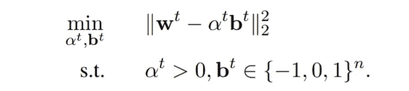
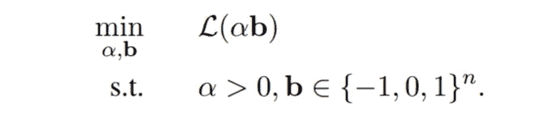
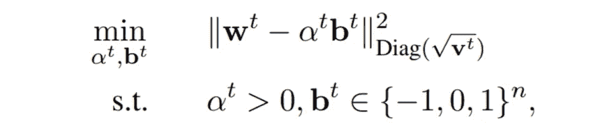
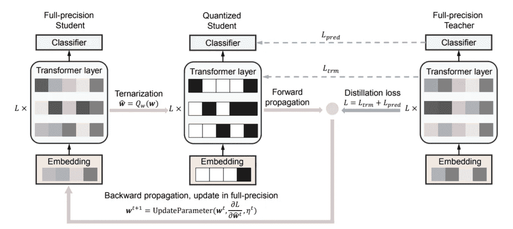

# 特里纳尔伯特:量子化与蒸馏相遇

> 原文：<https://towardsdatascience.com/ternarybert-quantization-meets-distillation-1b902ac31bd6?source=collection_archive---------32----------------------->

## 华为对 BERTology 的贡献

建造像伯特和 GPT-3 这样越来越大的模型的趋势一直伴随着一种互补的努力，即以很少或没有精度成本来减小它们的尺寸。有效的模型要么通过蒸馏([预训练蒸馏](https://arxiv.org/abs/1908.08962)、[蒸馏伯特](https://arxiv.org/pdf/1910.01108.pdf)、[移动伯特](https://arxiv.org/abs/2004.02984)、 [TinyBERT](https://arxiv.org/abs/1909.10351) )、量化( [Q-BERT](https://arxiv.org/pdf/1909.05840.pdf) 、 [Q8BERT](https://arxiv.org/pdf/1910.06188.pdf) )或者参数修剪来建立。

9 月 27 日，华为推出了 [TernaryBERT](https://arxiv.org/pdf/2009.12812.pdf) ，这是一种利用蒸馏和量化来实现与原始 BERT 模型相当的精度的模型**，尺寸缩小了约 15 倍**。TernaryBERT 真正值得注意的是，它的权重是*三进制的*，即具有三个值之一:-1、0 或 1(因此只能存储在两位中)。

TernaryBERT 巧妙地将现有的量化和提炼技术结合在一起。这篇论文大量引用了以前的工作，因此相当密集。本文的目标是提供一个自包含的演练，并在需要时提供额外的上下文。

马库斯·斯皮斯克在 [Unsplash](https://unsplash.com?utm_source=medium&utm_medium=referral) 上拍摄的照片

# 量化

> **量化**是减少用于表示单个标量参数的位数的过程。

当成功时，量化相对容易，因为它允许模型设计者保持原始模型的体系结构和配置不变:通过从 32 位切换到 8 位参数表示，可以实现 4 倍的大小缩减，而不必重新访问像层数或隐藏大小这样的设置。量化一般把*实数值*映射到*整数值*，可以有效得多的相加相乘。

## 量化方案

*量化方案*是确定一个实值 *r* 如何映射到一个可以由目标比特数(对于 8 比特:-128 到 127 包括在内，或者 0 到 255 不包括在内)表示的整数(或量子) *q* 的算法。最常见的是，量化方案是线性的。 *r* 和 *q* 之间的关系可以用比例因子 *S* 和零点 *Z* 来表示:

线性量化:用比例因子 **S** 和零点 **Z** 表示的真实值 **r** 与其量化值 **q** 之间的线性关系。方程式(1)来自 Jacob 等人[Q1]

在实值模型参数均匀分布在区间[-1，1]且量程从-127 到 127(暂时忽略-128 桶)的最简单情况下， *r = 1/127 * q.* 换句话说，比例因子 *S* 为 *1/127* ，零点 *Z* 为 *0* 。当 *r* 不均匀分布时(假设其值主要为负值)，零点会相应移动。例如，当 *Z=10* 时，我们将 10 个量子重新分配给负值，从而提高大多数 *r* 值所在区域的精度。

TernaryBERT 对其权重和激活都应用了线性量化(下面将详细介绍)。但就上下文而言，你应该知道还有其他方案。例如，在神经网络[Q2]的上下文中介绍了*三值化*(即量化为-1，0 和 1)的论文提出了一种随机算法，用于将实数 *r* ∈ [-1，1]转换为量化值 *q* ∈ {-1，0，1}:

*   如果 *r* ∈ (0，1)*q =*1 以概率 *r* 和 *q* =0 以概率 *1-r.*
*   如果 *r* ∈ [-1，0]， *q* =-1 以概率 *-r* ， *q* =0 以概率 *1+r.*

## 量子化应该在什么时候发生？

应用量化的最方便的时间是**后训练**:在用 32 位实值参数训练模型之后，应用标准量化方案之一，然后使用量化的模型进行有效的推断。然而，在实践中，这种天真的方法往往会导致精度大幅下降，尤其是针对超低精度(2 或 4 位)时。即使我们在这种训练后量化之后执行额外的微调步骤，结果仍然不能令人满意；量化降低了模型参数及其梯度的分辨率(即可以表示多少不同的值)，从而阻碍了学习过程。

为了解决这个问题，Jacob 等人【Q1】提出了用**模拟量子化**进行训练:在正向传递过程中，模型的行为就好像它已经被量子化了一样。因此，损失和梯度是相对于这种位约束模型来计算的，但是反向传递照常在全精度权重上发生。这鼓励模型在量化正向传递期间表现良好(这是在推断时发生的)，同时继续利用较长位参数和梯度的更好的表示能力。Q8BERT [Q3]使用这种技术(也称为**量化感知训练**)将原始的 BERT 模型从 32 位减少到 8 位整数表示。TernaryBERT 采用了类似的策略。

## 三元伯特中的权重三元化

TernaryBERT 通过如上所述的线性量化方案将其 32 位实值权重转换成具有来自集合{-1，0，1}的值的 2 位三进制表示。当零点固定为 *Z=0* 时，比例因子 *S > 0* (从这里开始用 *α* 表示)与模型参数一起被学习。

由 [Florencia Viadana](https://unsplash.com/@florenciaviadana?utm_source=medium&utm_medium=referral) 在 [Unsplash](https://unsplash.com?utm_source=medium&utm_medium=referral) 上拍摄的照片

不用说，将参数从 32 位降级到 2 位会带来精度的巨大损失。为了恢复模型的一些失去的表达能力，通常的做法是使用多个比例因子 *αᵢ* (而不是用于整个网络的单个 *α* )，一个用于参数(矩阵、向量、核、层等)的每个自然分组 *i* 。).例如，Rastegari 等人[Q4]在其卷积神经网络的每一层上为每个滤波器使用了单独的比例因子。类似地，TernaryBERT 为 BERT 的每个变换层添加一个 *αᵢ* ，并为令牌嵌入矩阵添加单独的每行缩放因子。

那么这些比例因子是如何习得的呢？如上所述，比例因子 *αᵢ、*全精度权重 ***w*** 和量化权重 ***b*** 都是在训练过程中学习的。TernaryBERT 比较了两种用于近似这些参数的现有方法:[三元权重网络](https://arxiv.org/pdf/1605.04711.pdf)(TWN)【Q5】和[损失感知三元化](https://arxiv.org/pdf/1802.08635.pdf)(LAT)【Q6】。虽然这两者具有看似不同的公式，但它们都归结为最小化量化前向传递的预测损失，并具有附加约束，其中在每个训练步骤期间，鼓励量化权重*α****b****保持接近全精度权重 **w** 。*

*如果你时间不够，你可以直接跳到“激活量化”部分，确信 TWN 和拉特在 [GLUE 基准](https://gluebenchmark.com/)(主要包含分类任务)和 [SQuAD](https://rajpurkar.github.io/SQuAD-explorer/) (一个流行的问题回答数据集)上得分相当。*

## *选项 1: TWN(三元加权网络)*

*[三进制权重网络](https://arxiv.org/pdf/1605.04711.pdf) (TWN)将问题公式化为*最小化全精度和量化参数*之间的距离:*

**

*“基于近似的量子化”。在训练步骤 **t** 期间，选择量化参数 **b** 和比例因子 **α** ，使得它们最小化到全精度权重 **w** 的距离。这是来自[三元伯特](https://arxiv.org/pdf/2009.12812.pdf)的方程式(5)。*

*因为这种最小化是在每个训练步骤上执行的，所以有效的实现是至关重要的。幸运的是，有一个近似的解析解，所以计算 ***b*** 和 *α* 就像应用一个依赖于 ***w*** 的公式一样简单(为简单起见，本文不包括)。*

## *选项#2: LAT(损失感知三值化)*

*另一种方法，[损失感知三值化](https://arxiv.org/pdf/1802.08635.pdf) (LAT)，是*直接最小化相对于量化权重*计算的损失；这个表达式完全避开了全精度参数(注意下面没有 ***w*** ):*

**

*“有损量化”。在整个训练过程中，选择量化参数 **b** 和比例因子 **α** ，使得它们最小化训练数据上的损失 **L** (关于 **L** 的定义，参见蒸馏部分)。来自[三元贝](https://arxiv.org/pdf/2009.12812.pdf)的方程式(6)。*

*首先，上面的表达式应该看起来有些可疑:我们已经确定，以低位表示训练模型会受到精度损失的阻碍。当然，全精度权重 ***w*** 需要以某种方式参与进来。事实证明，该表达式可以根据每次迭代最小化子问题来重新表述，其中量化权重再次被鼓励接近全精度权重，但是以还考虑当前时间步长的损失的方式:*

**

*每迭代损失感知量化。在训练步骤 **t** 期间，选择量化参数 **b** 和比例因子 **α** ，使得它们最小化到全精度权重 **w** 的特定距离。这是来自[三元伯特](https://arxiv.org/pdf/2009.12812.pdf)的方程式(7)。注意与等式(5)的相似性。这里的距离是以 **v** 表示的，即等式(6)中损耗 **L** 的对角近似值。*

*该表达式与等式(5)非常相似，不同之处在于它包括 ***v*** ，这是等式(6)中的损失的统计。与等式(5)类似，它有一个近似的解析解，是 ***w*** 的函数，可以有效地计算(同样，为了简单起见，不包括在本文中)。*

## *激活量子化*

*在*权重*量化之后，该模型可以被描述为被分组为逻辑单元(例如矩阵)的一组三元权重，它们中的每一个都具有其自己的实值缩放因子 *αᵢ* 。因此，流经网络的值(层的输入和输出)，也称为*激活、*是实值。为了加速矩阵乘法，激活也可以被量化。然而，正如在以前的工作[Q7]中提到的，激活对量子化更敏感；这很可能是为什么 TernaryBERT 决定将激活量化到 8 位而不是 2 位的原因。*

**

*西蒙·哈默在 [Unsplash](https://unsplash.com?utm_source=medium&utm_medium=referral) 上拍摄的照片*

*基于对变压器激活倾向于负向多于正向的观察，TernaryBERT 的作者选择了一种*非对称*量化算法，或者，根据高于*r = S(q-Z)*的线性量化表达式，零点 *Z* 不固定为 0，而是 *r 的最小和最大可能值的中点**

# *蒸馏*

*从最初天真的提议到执行训练后量化，我们已经走了很长的路。我们确定量化需要成为训练的一部分，需要多个比例因子来衰减由从 32 位降级到 2 位引起的精度损失，并探索了使量化权重接近全精度权重的两种不同方法。但是 TernaryBERT 告诉我们，通过利用机器学习工具箱中的另一种技术，我们可以做得更好。*

> ***提炼**(或称知识提炼)是一个大而精确的模型(老师)将其知识转移到一个代表性力量较小的模型(学生)的过程。*

*换句话说，蒸馏是一个两步走的过程:1)训练一个大的老师使用金标签，2)训练一个小的学生使用老师制作的标签，也称为*软标签*。辛顿等人[D1]解释说，蒸馏优于标准训练，因为软标签携带额外的信息，或*暗知识*。例如，在句子“我喜欢散步”中，考虑用单词“散步”的正确词性来标记它。形式为 *p(名词)=0.9* 的软标签比形式为 *p(名词)=1.0* 的硬标签更能提供信息，硬标签未能捕捉到“walk”在其他上下文中可能是动词的事实。TernaryBERT 在微调过程中使用相同的技术，从一个大得多的教师产生的软分布中学习:*

**

*蒸馏损失第 1 部分:学生和教师预测之间的软交叉熵。来源:[特里纳尔伯特](https://arxiv.org/pdf/2009.12812.pdf)。*

*诸如 FitNets [D2]等更精细的提炼公式鼓励教师和学生的内部表征之间的直接一致。TernaryBERT 也这样做，将完全精确的学生的隐藏层拉近教师的隐藏层，并鼓励两个转换网络的注意力分数相似:*

**

*蒸馏损失第 2 部分:学生/教师隐藏权重和注意力分数之间的均方误差。来源:[三月伯特](https://arxiv.org/pdf/2009.12812.pdf)。*

# *端到端:蒸馏感知三值化*

**

*蒸馏感知三值化。图 2 来自[三月伯特](https://arxiv.org/pdf/2009.12812.pdf)。*

*TernaryBERT 将来自量化和提炼的既定技术放在一个单一的端到端配方下，用于训练三值化模型。在每个训练步骤中:*

1.  *完全精确的学生是三位一体的。实际上，这相当于模拟量化，Jacob 等人[Q1]介绍的方法:正向传递在低表示中执行，以*模拟*在推断期间将真正发生的事情。使用前面描述的两种方法之一(TWN 或 LAT)来执行三值化。*
2.  *蒸馏损失( *L_pred + L_trm* 根据量化模型所做的预测进行计算，但是梯度更新(即反向传递)应用于全精度参数。*

*在训练结束时，量化模型已准备好进行推断，无需进一步调整。*

# *量化参考*

*   *[Q1]雅各布等人，[用于高效整数算术推理的神经网络的量化和训练](https://arxiv.org/pdf/1712.05877.pdf) (2017)*
*   *[Q2]林等，[少乘法神经网络](https://arxiv.org/pdf/1510.03009.pdf) (2016)*
*   *[Q3] Zafrir 等人， [Q8BERT:量化的 8 位 BERT](https://arxiv.org/pdf/1910.06188.pdf) (2019)*
*   *[Q4] [拉斯特加里等人，XNOR 网络:使用二进制卷积神经网络的图像网络分类](https://arxiv.org/pdf/1603.05279.pdf) (2016)*
*   *李等，[三元权重网络](https://arxiv.org/pdf/1605.04711.pdf) (2016)*
*   *[Q6]侯，郭，[深度网络的损失感知权重量化](https://arxiv.org/pdf/1802.08635.pdf) (2018)*
*   *[Q7]周等，DoReFa-NET:用低位宽梯度训练低位宽卷积神经网络(2018)*

# *蒸馏参考*

*   *[D1]辛顿等，[在神经网络中提取知识](https://arxiv.org/abs/1503.02531) (2015)*
*   *[D2]罗梅罗等人， [FitNets:提示薄深网](https://arxiv.org/abs/1412.6550) (2014)*