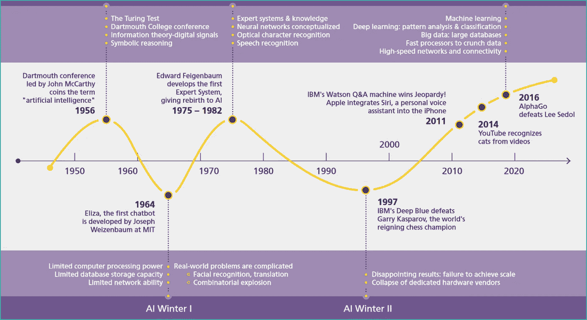
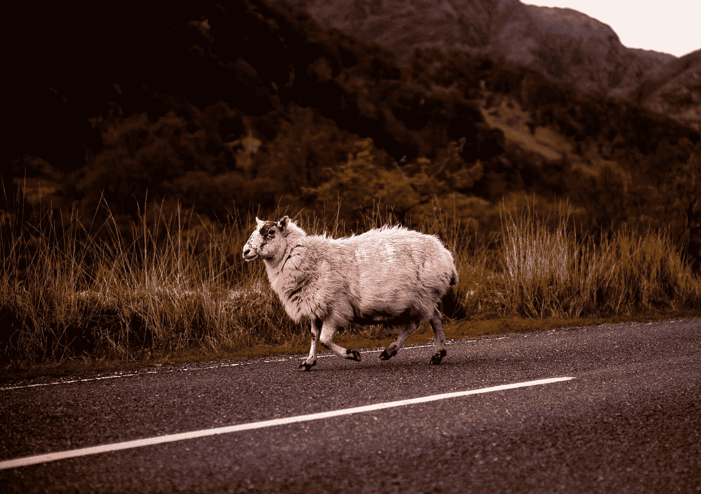

# 机器人可能会接管你的公司，但还不是时候

> 原文：<https://towardsdatascience.com/terrifying-robots-may-take-over-your-company-just-not-yet-7b6e8b13e06e?source=collection_archive---------62----------------------->

## 意见

## 利用最新的科学来辨别炒作和真相

摄影爱好在 [Unsplash](https://unsplash.com?utm_source=medium&utm_medium=referral) 上

这里有很多关于奇点事件和人工智能接管世界的讨论。他们自己的电脑会很快取代杰夫·贝索斯或马克·扎克伯格吗？

由于我是一名为经理开发卫星导航工具的首席执行官，并且卫星导航是走向无人驾驶汽车的第一步，这些天我经常被问及*天网*问题——科学家会让公司由机器人管理吗？

答案是绝对没有。原因如下。

# 奇点事件:炒作

当然，人工智能在过去的 30 年里突飞猛进。然而，我们甚至还没有接近机器可以复制或超越人类推理的奇点事件。

从本质上来说，这个新的数据科学术语是一个对大量数据处理活动的高贵称呼，这些活动大多是很久以前 ***发明的*** 。他们最近获得了新的生命，因为应用了大大增强的技术设备:更多的数据，更强的处理能力，更合理的结果，更便宜的价格。

[人工智能的三波](https://en.wikipedia.org/wiki/Artificial_intelligence)根据 [Evo](https://evopricing.com/) ，基于 DHL 研究

随着存储和处理数据的成本下降，收集的数据量上升:非常简单的供求定律，或者你可以称之为数据的[价格弹性](https://en.wikipedia.org/wiki/Price_elasticity_of_demand)。价格下降，交易量上升。这意味着 ***新数据的*** 值比旧数据小。纯经济学。然后，有人将不得不对所有这些东西做些什么。进入数据科学。

**数据科学大多是老科学**；有人记得专家系统吗？尽管大肆宣传，这项科学即使在今天也有严重的技术局限性:

*   **仅自下而上，从数据向上**。例如，图像被扫描成数百万或数十亿像素的集合，这些像素是数字的向量。低效:今天对某些问题有效，因为它很便宜，然而，它在学习上仍然慢得多，并且比使用人脑做任何其他事情都更昂贵。一个 3 岁的孩子能说出什么是*香蕉*当连续看到两张时，一个昂贵的系统需要 100 万张图像来训练自己，有 95%的信心，并且仍然会每 20 张图像犯一次错误。
*   **只有电，缺少大脑的化学部分**。神经网络是机器学习的核心，它们在复制大脑的电气部分方面有些成功:神经元和穿过它们的路径中交换的信号。尽管如此，对大脑中可能负责整体思维、情感和自上而下推理的化学部分的研究仍然很少:想想直觉。

最好的卫星导航系统甚至能驾驶你的车，但不能告诉你去哪里。

这是机器在结构上遗漏的大量功能。这正是人工智能与人类辩论的要点——机器做它们被编程做的事情，而人可以发挥创造力。

问正确的问题是人类的终极能力，只是遗憾的是，今天的学校正在教授如何回答问题，这正成为一种越来越不相关的技能。

这就是我们不必要地惊慌失措的原因吗？

# 优步、谷歌和特斯拉正在争论这个问题

目前，关于人工智能的辩论正在由自动驾驶汽车形成。随着优步、谷歌和特斯拉竞相推出市场上的第一辆无人驾驶汽车，人们认为这只是一个开端，并将很快导致机器运营一家公司，甚至是这个星球。

事情是这样的。

管理一家公司需要复杂的技能来驾驭模糊性和理解人类情感——这通常是“混乱的”和不可量化的。定义一个目标最终会改变市场，需要定义一个新的目标，一个叫做[反身性](https://en.wikipedia.org/wiki/Reflexivity_(social_theory))的属性。

反身性指的是[原因和](https://en.wikipedia.org/wiki/Cause_and_effect)结果之间的循环关系，尤其是在人类的信仰结构中。自反关系是双向的，在这种关系中，原因和结果都相互影响，但都不能被指定为原因或结果。

自动驾驶汽车只需要使用位置和速度等可测量的数据来读取物理事物——路况、其他汽车、行人。即使这样，也可能有程序员没有考虑到的“黑天鹅事件”，然而这些事件的数量是有限的，最终它们会被映射出来。

从结构上来说，一旦一辆车能开了，就完了；而管理行为将导致市场范式的转变，整个循环需要机器再次从头开始。

# 有趣的例子:认知失调

2012 年，在澳大利亚墨尔本，一辆运羊的卡车撞上了一座立交桥，导致[数百只羊从](https://www.news.com.au/national/sheep-fall-on-cars-after-truck-rolls/news-story/77f9a842e79556f99bd01dadc2b592fe)下方的高速公路上倾泻而下。

照片由[杰米街](https://unsplash.com/@jamie452?utm_source=medium&utm_medium=referral)在 [Unsplash](https://unsplash.com?utm_source=medium&utm_medium=referral) 拍摄

虽然人类可以克服飞羊的认知失调，但你可以想象一个困惑的优步机器人说出那句古老的科幻栗子:*不会计算！*

这是一个意外事件的极端例子。笑一笑，解释一下为什么机器不会很快接管公司，可能会有所帮助。在管理的竞争游戏中，有许多绵羊在飞来飞去。

# 机器人企业:真相

当然，就像工业革命时期很多体力劳动岗位被机器取代一样，很多行政职能也可以转移到机器上。然而，更具创造性和高层次思维的角色将留在人类手中并得到加强。

> 使用的数据越多，就越需要领导力来指引方向。

这种人工智能/人类的相互作用一直是汽车制造商大众汽车公司近年来大量研究的主题。首席信息官马丁·霍夫曼(Martin Hoffman)解释了该公司如何将自动驾驶汽车的清单应用于“机器人企业”领域——在企业职能和流程中使用自适应算法[。](https://www.zdnet.com/article/future-enterprise-companies-will-be-ran-by-robots/)

# 一个例子

用一个实际的例子来总结:想象一下仓库重新订货过程的自动化，这是我个人非常熟悉的一个过程。今天，我们拥有可以让供应链自动运行的系统，除了策略仍然需要由人类来设定:

*   选择更多库存和更高成本的更好客户服务之间的权衡，还是选择投资更少但有缺货风险的更低库存？目标是未来几周的报道？
*   不存在*最优*水平，因为最佳答案是*这取决于*，决策的坐标要求将战略前景的变化转化为日常调整
*   机器决定了*有效边界*对于权衡来说，对于任何给定的目标覆盖周数，都只有一个最佳的仓储水平；人类必须选择周数。

大众汽车已经确定了 5 个人工智能控制级别，从人类做出所有商业决策的第 1 级(人工)，到完全没有人类输入的第 5 级(全自动)。

**一般来说，机器在大众汽车级别的 2 级(辅助)表现出色**:机器提供建议，但人类做出最终决定。机器不会取代人类的判断，只会增强人类的判断，就像我们今天的手机每天都在增强我们的大脑一样。

快乐管理！

*PS 我定期写关于* [*商业科学*](https://medium.com/tag/business-science) *。*