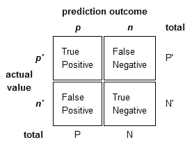
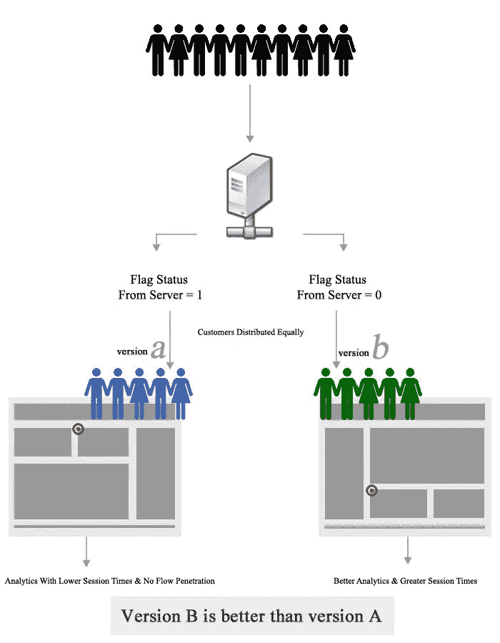
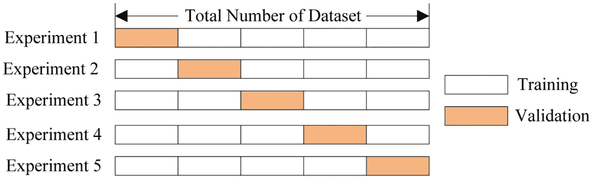
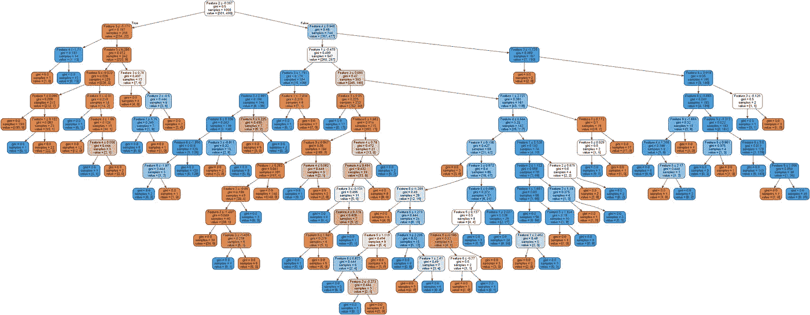
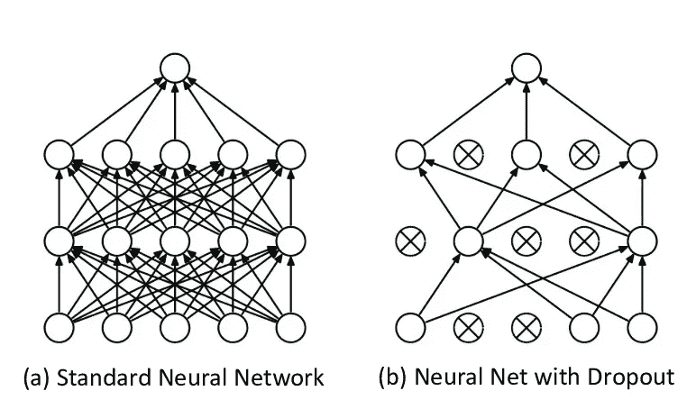
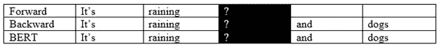

# 测试你的技能:26 个(更多)数据科学面试问题和答案

> 原文：<https://towardsdatascience.com/test-your-skills-26-more-data-science-interview-questions-answers-9e7dfad33353?source=collection_archive---------19----------------------->

来源: [Pixabay](https://pixabay.com/illustrations/career-hiring-job-search-boss-3536331/)

## 你能全部回答吗？

下面再来 26 个数据科学面试问答(以下是[前 26 个](/test-your-skills-26-data-science-interview-questions-answers-69cb2b223e57))。这些问题按照数学和统计学到算法到深度学习到 NLP 的一般流程进行组织，其中穿插了数据组织问题。我建议在继续验证你的答案之前，先看看问题，花点时间想想答案。

无论你是大学生还是有经验的专业人士，每个人都可以花一些时间来测试(或更新)他们的技能！

你能全部回答吗？

来源:[吉菲](https://gph.is/2QncdwP)

**1 |您可能会在数据中遇到哪些形式的选择偏差？**

抽样偏差是一种系统误差，由于人口的非随机抽样，导致人口中的一些成员比其他成员少，例如低收入家庭被排除在在线民意调查之外。

时间间隔偏倚是指试验可能在一个极值提前终止(通常出于伦理原因)，但该极值很可能由方差最大的变量达到，即使所有变量都具有相似的均值。

数据偏差是指选择特定的数据子集来支持一个结论，或者根据任意的理由拒绝不良数据，而不是根据先前陈述的或普遍同意的标准。

最后，流失偏倚是选择偏倚的一种形式，由参与者的损失引起，不考虑没有完成的试验对象。

**2 |定义:错误率、准确度、灵敏度/召回率、特异性、精确度和 F 值。**

其中 T 为真，F 为假，P 为正，N 为负，分别表示混淆矩阵中满足以下条件的项目数:

[来源](https://i.stack.imgur.com/ysM0Z.png)。图像免费共享和商业使用。

*   错误率:(FP + FN) / (P + N)
*   准确度:(TP + TN) / (P + N)
*   敏感度/召回率:TP / P
*   特异性:总氮/氮
*   精度:TP / (TP + FP)
*   F-Score:精确度和召回率的调和平均值。

**3 |相关性和协方差有什么区别？**

相关性被认为是衡量和估计两个变量之间数量关系的最佳技术，它衡量两个变量的相关程度。

协方差衡量两个随机变量在周期中变化的程度。换句话说，它解释了一对随机变量之间的系统关系，其中一个变量的变化与另一个变量的相应变化相反。

**4 |为什么 A/B 测试有效？**

A/B 测试是对两个变量 A 和 B 的随机实验的假设测试。它的目标是识别例如网页中的任何变化，其中 A 组的客户被问候为“下午好”,而 B 组的客户被问候为“欢迎”,以查看哪一个可以促进销售。A/B 测试是有效的，因为它最大限度地减少了有意识的偏见——A 组的人不知道他们在 A 组，甚至不知道有 B 组，反之亦然。这是获取真实变量数据的好方法。然而，除了互联网业务，A/B 测试很难在任何环境下进行。

[来源](https://i.stack.imgur.com/bUyDa.jpg)。图像免费共享和商业使用。

**5 |你如何用一个骰子产生一个介于 1 和 7 之间的随机数？**

一种解决方法是滚动骰子两次。这意味着有 6 x 6 = 36 种可能的结果。排除一种组合(比如 6 和 6)，就有 35 种可能的结果。这意味着，如果我们指定五种掷骰子的组合(顺序很重要！)到一个数，我们可以生成一个 1 到 7 之间的随机数。

例如，假设我们掷出一个(1，2)。因为我们已经(假设地)将掷骰组合(1，1)、(1，2)、(1，3)、(1，4)和(1，5)定义为数字 1，所以随机生成的数字将是 1。

**6 |区分单变量、双变量和多变量分析。**

单变量分析是只对一个变量进行的统计分析技术。这可能包括饼图、分布图和箱线图。

双变量分析试图理解两个变量之间的关系。这可以包括散点图或等高线图，以及时间序列预测。

多变量分析处理两个以上的变量，以了解这些变量对目标变量的影响。这可以包括为预测或 SHAP 值/排列重要性训练神经网络，以找到最重要的特征。它还可以包括具有第三特征(如颜色或大小)的散点图。

**7 |什么是交叉验证？它试图解决什么问题？为什么有效？**

交叉验证是一种评估模型如何推广到整个数据集的方法。在传统的训练-测试-分割方法中，随机选择一部分数据作为训练数据，另一部分数据作为测试数据，这可能意味着模型在某些随机选择的测试数据部分表现良好，而在其他随机选择的测试数据部分表现不佳。换句话说，性能并不完全代表模型的性能，因为它代表了测试数据的随机性。

[来源](https://i.stack.imgur.com/1fXzJ.png)。图像免费共享和商业使用。

交叉验证将数据分成 *n* 段。该模型在数据的 *n-* 1 段上被训练，并在数据的剩余段上被测试。然后，在不同的一组 *n* -1 段数据上刷新和训练模型。重复此操作，直到模型获得整个数据的预测值(对结果进行平均)。交叉验证很有帮助，因为它提供了模型在整个数据集上的性能的更完整视图。

**8 | naive Bayes 中的 Naive 是什么意思？**

朴素贝叶斯算法基于贝叶斯定理，贝叶斯定理描述了基于可能与通风口相关的条件的先验知识的事件概率。该算法被认为是“幼稚”的，因为它做出了各种可能正确也可能不正确的假设。这就是为什么正确使用时它会非常强大——它可以绕过其他模型必须找到的知识，因为它假设这些知识是真实的。

9 | SVM 有哪些不同的果仁？

SVM 有四种核仁:

*   线性核
*   多项式核
*   径向基核
*   Sigmoid 内核

**10 |决策树过拟合的解决方案是什么？**

决策树通常有很高的倾向性，因为算法的本质涉及到在数据中寻找非常合适的模式，并创建一个特定的节点来解决这个问题。如果放任不管，决策树将创建如此多的节点，以至于它将在训练数据上完美地执行，但在测试数据上失败。一种解决决策树过度拟合的方法叫做修剪。

过度适应数据的决策树。[来源](https://i.stack.imgur.com/8TsTi.jpg)。图像免费共享和商业使用。

修剪是一种减少决策树大小的方法，它通过删除树中几乎没有分类能力的部分来实现。这有助于一般化决策树，并迫使它只创建数据结构所必需的节点，而不仅仅是噪声。

解释并给出协同过滤、内容过滤和混合过滤的例子。

协同过滤是推荐系统的一种形式，它仅仅依靠用户评级来确定新用户下一步可能喜欢什么。所有产品属性要么通过用户交互学习，要么被丢弃。协同过滤的一个例子是矩阵分解。

内容过滤是另一种形式的推荐系统，它只依赖于产品和客户的内在属性，如产品价格、客户年龄等。，提出建议。实现内容过滤的一种方式是找到简档向量和项目向量之间的相似性，例如余弦相似性。

混合过滤取二者之长，将内容过滤推荐和协同过滤推荐结合起来，实现更好的推荐。然而，使用哪种过滤器取决于现实环境，混合过滤可能并不总是确定的答案。

**12 |在合奏中，装袋和助推有什么区别？**

Bagging 是一种集成方法，其中通过从主数据集中随机选择数据来准备几个数据集(在几个子数据集中会有重叠)。然后，在几个子数据集中的一个上训练几个模型，并且通过一些函数聚集它们的最终决策。

提升是一种迭代技术，它调整最后一个分类的观测值的权重。如果一个观察被正确地分类，它试图增加观察的权重，反之亦然。提升降低了偏差误差，并建立了强大的预测模型。

**13 |合奏中的硬投票和软投票有什么区别？**

硬投票是当每个模型的最终分类(例如，0 或 1)被聚集时，可能通过平均值或模式。

软投票是将每个模型的最终概率(例如，分类 1 的 85%把握)汇总，最有可能是通过平均值。

软投票在某些情况下可能是有利的，但可能导致过度拟合和缺乏普遍性。

来源:[吉菲](https://gph.is/2jRhDAV)。

**14 |您的机器有 5GB 内存，需要在 10 GB 数据集上训练您的模型。你如何解决这个问题？**

对 SVM 来说，部分适合就可以了。数据集可以分成几个较小的数据集。因为 SVM 是一个低计算成本的算法，它可能是这种情况下最好的情况。

在数据不适合 SVM 的情况下，可以在压缩的 NumPy 阵列上训练具有足够小批量的神经网络。NumPy 有几个压缩大型数据集的工具，它们被集成到常见的神经网络包中，如 Keras/TensorFlow 和 PyTorch。

深度学习理论已经存在了很长一段时间，但直到最近才变得流行起来。为什么你认为深度学习在最近几年激增了这么多？

深度学习的发展正在加快步伐，因为直到最近它才成为必要。最近从物理体验到在线体验的转变意味着可以收集更多的数据。由于转向线上，深度学习有更多的机会来提高利润和增加客户保留率，这在实体杂货店中是不可能的。值得注意的是，Python 中两个最大的机器学习模型(TensorFlow & PyTorch)是由大型公司谷歌和脸书创建的。此外，GPU 的发展意味着可以更快地训练模型。

*(尽管这个问题严格来说与理论无关，但能够回答这个问题意味着你也着眼于你的分析如何在企业层面得到应用。)*

**16 |你如何初始化神经网络中的权重？**

最传统的初始化权重的方式是随机的，将它们初始化为接近 0。然后，一个正确选择的优化器可以把权重放在正确的方向上。如果误差空间太陡，优化器可能难以摆脱局部最小值。在这种情况下，初始化几个神经网络可能是一个好主意，每个神经网络位于误差空间的不同位置，从而增加找到全局最小值的机会。

**17 |没有设定准确的学习率会有什么后果？**

如果学习率太低，模型的训练将进展非常缓慢，因为权重的更新很少。然而，如果学习率设置得太高，这可能导致损失函数由于权重的剧烈更新而不稳定地跳跃。该模型也可能不能收敛到一个误差，或者在数据太混乱而不能训练网络的情况下甚至可能发散。

**18 |解释一个时期、一批和一次迭代之间的区别。**

*   Epoch:表示对整个数据集的一次运行(所有内容都放入训练模型中)。
*   批处理:因为一次性将整个数据集传递到神经网络的计算开销很大，所以数据集被分成几批。
*   迭代:一个批次在每个时期运行的次数。如果我们有 50，000 个数据行，批量大小为 1，000，那么每个时期将运行 50 次迭代。

**19 |什么是三个主要的卷积神经网络层？它们通常是如何组合在一起的？**

在卷积神经网络中通常有四个不同的层:

*   卷积层:执行卷积操作的层，创建几个图片窗口，概括图像。

卷积层。来源: [Giphy](https://gph.is/1Hc5NVr) 。

*   激活层(通常是 ReLU):给网络带来非线性，将所有负像素转换为零。输出变成校正的特征图。
*   池层:降低特征图维度的下采样操作。

通常，卷积层由卷积层、激活层和池层的多次迭代组成。然后，可能会跟随一个或两个额外的密集或下降图层以进一步概化，并以完全连接的图层结束。

**20 |什么是辍学层，它如何帮助神经网络？**

脱落层通过防止训练数据中复杂的共适应来减少神经网络中的过拟合。脱落层作为一个掩膜，随机阻止与某些节点的连接。换句话说，在训练期间，脱落层中大约一半的神经元将被停用，迫使每个节点携带更多被停用的神经元遗漏的信息。在最大池层之后，有时会使用退出。

应用辍学之前/之后的神经网络。[来源](https://www.researchgate.net/profile/Giorgio_Roffo/publication/317277576/figure/fig23/AS:500357438869504@1496305917227/9-An-illustration-of-the-dropout-mechanism-within-the-proposed-CNN-a-Shows-a.png)。图片免费使用，有信用。

**21 |在简化和基本的尺度上，是什么使新开发的 BERT 模型优于传统的 NLP 模型？**

传统的 NLP 模型，为了熟悉文本，被赋予预测句子中下一个单词的任务，例如:“It's raining cats and”中的“dog”。其他模型可以另外训练它们的模型来预测句子中的前一个单词，给定该单词之后的上下文。BERT 随机屏蔽句子中的一个单词，并迫使模型预测该单词及其前后的上下文，例如:“It's _____ cats and dogs”中的“raining”

这意味着伯特能够理解语言的更复杂的方面，而这些方面不能简单地通过以前的上下文来预测。BERT 还有许多其他的特性，比如各种层次的嵌入，但是从根本上来说，它的成功来自于它阅读文本的方式。

**22 |什么是命名实体识别？**

NER，也称为实体识别、实体分块或实体提取，是信息提取的一个子任务，它试图定位非结构化文本中提到的命名实体并将其分类为诸如名称、组织、位置、货币值、时间等类别。NER 试图分离拼写相同但意思不同的单词，并正确识别名称中可能有子实体的实体，如“美国银行”中的“美国”。

给你一大堆推文，你的任务是预测它们是积极的还是消极的情绪。解释如何预处理数据。

由于推文充满了可能有价值的信息的标签，第一步将是提取标签，并可能创建一个一次性编码的特征集，其中如果有标签，推文的值为“1 ”,如果没有标签，则为“0”。对@ characters 也可以这样做(无论 tweet 指向哪个帐户都可能很重要)。推文也是被压缩的文字(因为有字符限制)，所以可能会有很多故意的拼写错误需要纠正。也许推文中拼写错误的数量也会有所帮助——也许愤怒的推文中有更多拼写错误的单词。

删除标点符号虽然在 NLP 预处理中是标准的，但在这种情况下可能会被跳过，因为感叹号、问号、句点等的使用。与其他数据结合使用时可能很有价值。可能有三列或更多列，其中每行的值是感叹号、问号等的数量。但是，在将数据输入模型时，应该去掉标点符号。

然后，数据将被词条化和标记化，不仅有原始文本要输入模型，还有关于标签、@s、拼写错误和标点符号的知识，所有这些都可能有助于提高准确性。

**24 |你如何找到两段文字之间的相似之处？**

第一步是将段落转换成数字形式，使用一些选择的矢量器，如单词袋或 TD-IDF。在这种情况下，单词包可能更好，因为语料库(文本集合)不是很大(2)。此外，它可能更符合文本，因为 TD-IDF 主要是针对型号的。然后，可以使用余弦相似度或欧几里德距离来计算两个向量之间的相似度。

**25 |在 N 个文档的语料库中，一个随机选择的文档包含总共 T 个术语。术语“hello”在该文档中出现了 K 次。如果单词“hello”在全部文档中出现了大约三分之一，那么 TF(单词频率)和 IDF(逆文档频率)的乘积的正确值是多少？**

术语频率的公式是 K/T，IDF 的公式是总文档数对包含该术语的文档数的对数，或者是 1/1/3 的对数，或者是 3 的对数。因此,' hello '的 TF-IDF 值是 K * log(3)/T。

有没有一套通用的停用词？你什么时候会提高停用词的“严格性”,什么时候会对停用词更宽容？(对停用词宽容意味着减少从文本中删除的停用词的数量)。

Python 中的 NLTK 库中存储了普遍接受的停用词，但是在某些上下文中，它们应该被加长或缩短。例如，如果给定一个 tweet 数据集，停用词应该更宽松，因为每个 tweet 一开始就没有太多内容。因此，更多的信息将被压缩到简短的字符中，这意味着丢弃我们认为是无用的词可能是不负责任的。然而，如果给定，比如说，一千篇短篇小说，我们可能希望对停用词更严格一些，这样不仅可以节省计算时间，而且可以更容易地区分每篇小说，因为每篇小说都可能多次使用停用词。

## 感谢阅读！

来源: [Giphy](https://gph.is/g/Z8nlW50)

你答对了几个？这些问题针对统计、算法、深度学习、NLP 以及数据组织和理解，这应该是衡量您对数据科学概念熟悉程度的一个很好的标准。

如果你还没有，请点击这里查看另外 26 个数据科学面试问题和答案[。](/test-your-skills-26-data-science-interview-questions-answers-69cb2b223e57)