# 用数据科学的魅力测试基于 Python 的 API 调用

> 原文：<https://towardsdatascience.com/testing-a-python-based-api-call-with-a-data-science-charm-8aeee0d63432?source=collection_archive---------36----------------------->


尤利娅·卢卡希娜

## 使用 Python [asyncio](https://docs.python.org/3/library/asyncio.html?highlight=asyncio%23module-asyncio) 和 [concurrent.futures](https://docs.python.org/3/library/concurrent.futures.html) 包测试 ThreadPoolExecutor 函数中的线程数量(max_workers 参数)的实验。

# 软件测试一瞥

随着计算机应用程序趋向于被授予更多的人类决策权，软件工程行业已经认识到测试是开发过程的一个基本部分。

软件测试的方法多种多样。应用程序作为一个整体，或者作为集成系统，甚至是一个单元一个单元地被测试。我们有测试工程师、测试经理和测试人员。有提供外包手工测试的平台，也有自动化测试:从字面上看，应用程序操作其他应用程序，甚至经常模仿一个活生生的用户。

# 为什么要测试 API？

案例研究是关于测试 API 调用性能的。Python asyncio 和 concurrent.futures 包用于运行多个 API 调用。他们将循环运行分成池，并以并行方式通过几个池，从而同时执行多个调用。这减少了总的执行时间。

最佳线程数的问题出现在以下方面。让我们想象一下，有一个移动应用程序访问一个提供 API 的开源数据库。我需要编写一个 API 调用来成功检索数据，并将其集成到应用程序中。这种集成应该包括接收数据的第一次处理。

正如我将在下一节中展示的，在最初处理数据的过程中，我遇到了一些问题。数据只能以小块的形式下载，因此，迫使我提出多个请求。这可能会降低应用程序的性能，破坏用户体验。

这个事实让我更加关注 API 调用本身，尽管最初，我的主要任务是在应用程序内部构建一个数据管道。

因此，我开始尝试 API 调用。

这个实验的目的是**找出一个最佳的线程数量**，或者并行调用的最大数量。这个数字有其限制，取决于不同的因素。

在我经历了一些痛苦的错误之后，我设法坚持了一个特别的系统化的方法，我将会公开这个方法。这篇文章展示了完成测试代码的步骤，附在文章的最后。

# 对数据的第一次了解

我用一个电影数据库中的数据来说明本文，该数据库包含关于电影的信息，比如标题、发行日期、类型、演员和工作人员等等。API 调用应该获取特定电影类型的所有电影的数据。

我使用了一个通用的 Python 请求包来发出一个简单的请求，并检查这个请求是否有意义。我获取了一个 JSON 并将其打印到控制台。第一眼看上去不错。但后来似乎有一些人为强加的限制。我只能读到 500 页，收集 10，000 部电影。

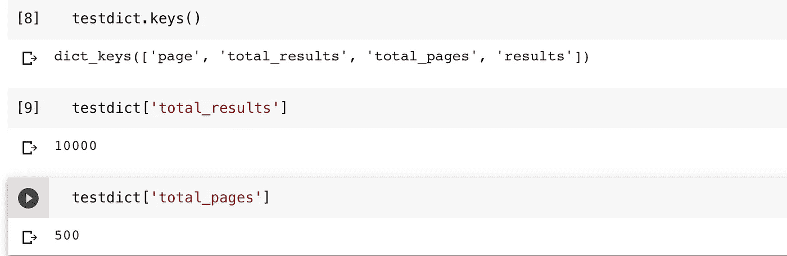

发现页面限制

我查了一下电影的实际数量，结果是 20 部。

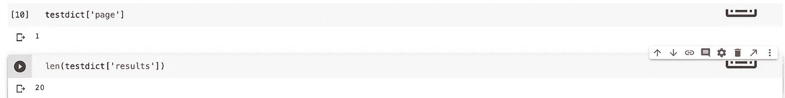

每页/API 请求的结果

我发出了第二个请求，表明我希望通过添加“&page=2”来提取第 2 页。结果是相似的，只是我得到了另外 20 部电影。

似乎我必须快速翻阅一大堆页面才能找到所有的电影。我添加了一个遍历 500 页的 for 循环。我抓取了 asyncio 和 concurrent.futures 包，通过使用多线程(我设置为 100)来加速 for 循环的执行。

这一过程在几秒钟内完成，并成功收集了 10，000 部电影。

```
import asyncioimport nest_asyncioimport concurrent.futuresimport requestsnest_asyncio.apply()movies = []async def main(url, m_workers):with concurrent.futures.ThreadPoolExecutor(max_workers=m_workers) as executor:loop = asyncio.get_event_loop()futures = [loop.run_in_executor(executor,requests.get,url + '&page=' + str(i),)for i in range(1, 501)]for response in await asyncio.gather(*futures):try:dict = response.json()for item in dict['results']:movies.append(item)except:passloop = asyncio.get_event_loop()loop.run_until_complete(main(my_url, 100))
```

但我必须记住，这个请求是为移动应用程序考虑的。到目前为止，我构建了请求代码，并使用运行在云中的 Google Colaboratory 检查了数据。

# API 性能因素

正如一位 StackOverflow 开发者指出的那样，API 调用的速度取决于以下因素:

*   网络速度和延迟
*   服务器可用性和负载
*   数据有效负载的大小
*   客户端设备资源
*   客户代码
*   在所有这些因素中，我只能控制网络、设备和客户端代码。

## 网络


为了模拟移动网络速度，我将移动热点连接到笔记本电脑上。根据来自 [Computerbild.de](https://speedtest.computerbild.de) 的信息，我所在位置的 LTE 网络显示速度如下:

## 计算机网络服务器

我必须在测试中发现服务器的容量。我没有控制这个参数。

## 数据量

每个 API 调用发送同一个请求并下载相同数量的数据。这个实验不测试数据量的任何变化。

每个请求返回一个字典。它的结果部分—一个列表—包含多达 20 个条目。每个条目都是一个有 14 个键和值的字典。

使用另一个 JSON 解析器是可能的，但是我不认为标准解析器是个问题。

## 最终用户设备

由于数据将通过移动网络发送和接收，因此在实验中考虑了这一因素。

我在本地的一台 Mac 电脑上用一台 Jupyter 笔记本进行了 API 调用测试，这台电脑有两个内核，运行速度为 1.7 GHz。

网络连接，我用的是 iPhone 6。正如 Everymac.com 的[所说:](https://everymac.com/systems/apple/iphone/iphone-faq/iphone-processor-types.html)

> 它拥有双核，运行频率约为 1.4 GHz。

采用 A13 芯片的最新 iOS 设备拥有六个 CPU 核心，两个 Lightings 和四个 Thunders。第一批运行频率为 2.66 GHz。(信息来自[一篇连线文章](https://www.wired.com/story/apple-a13-bionic-chip-iphone/))。

来比较一下，最近一款典型的[三星智能手机](https://www.samsung.com/global/galaxy/what-is/octa-core-processor/)，[官网](https://www.samsung.com/global/galaxy/what-is/octa-core-processor/)上说，

> 在八核(2.3GHz 四核+ 1.6GHz 四核)或四核(2.15GHz + 1.6GHz 双核)处理器上运行，具体取决于国家或运营商。

在这方面，我的测试是一种最坏的情况。

## 客户代码

考虑到目前的限制，比如数据的规定结构，我只能在线程数量上做些调整。这基本上是客户端代码的主要变化。

# 在线程数上循环

所以，让我们回到主测试。

我从云转移到本地运行时，并做了一些网络和硬件降级。

在这个新环境中，我提出了几乎相同的要求。两次运行 100 个线程都抛出了类似的错误:

```
HTTPSConnectionPool(host=’api.host.org’, port=443): Max retries exceeded with url: apiurlwithapikey (Caused by NewConnectionError(‘<urllib3.connection.VerifiedHTTPSConnection object at 0x10e44f2d0>: Failed to establish a new connection: [Errno 8] nodename nor servname provided, or not known’))
```

这意味着我用尽了网络或服务器，或者两者都用尽了。我把它减速到 50 个线程，让它运行两次，但还是出现了同样的错误。仅用 10 个线程，我就安全下载了所有 10，000 部电影。

由于我仍然认为 10 个线程对于确保移动应用程序中令人满意的用户体验来说太少了，所以我引入了一个 for 循环，该循环多次运行 main()函数，以等于 10 的步长将最大活动线程数从 10 改为 100。

我添加了一个简单的跟踪方法，保存异步循环的持续时间、返回的电影数量、检查的页面数量和线程数量。持续时间是通过两个时间戳之间的差来测量的:一个在循环开始之前，一个在循环完成之后。

我把列表转换成字典，然后字典变成了熊猫的数据框。

为了防止服务器耗尽，我使用了时间包中的睡眠功能来安排通话中断。

```
import asyncioimport nest_asyncioimport concurrent.futuresimport requestsfrom datetime import datetimeimport timeimport pandasasync def main(url, m_workers):with concurrent.futures.ThreadPoolExecutor(max_workers=m_workers) as executor:try:loop = asyncio.get_event_loop()except:passtry:futures = [loop.run_in_executor(executor,requests.get,url + '&page=' + str(i),)for i in range(1, 501)]except requests.exceptions.ConnectionError:print("Connection refused")passfor response in await asyncio.gather(*futures):try:dict = response.json()for item in dict['results']:movies.append(item)except:passnummoviesList = []pagescheckedList = []itlastedList = []maxworkersList = []for threads in range(10,101,10):try:movies = []executorList = []n = datetime.now()loop = asyncio.get_event_loop()try:loop.run_until_complete(main(genre_18_url, threads))except:passnummoviesList.append(len(movies))pagescheckedList.append(len(movies) / 20)nn = datetime.now()diff = nn - nitlastedList.append(diff)maxworkersList.append(threads)except:print("interrupted at ", threads)time.sleep(10)resultsdict = {'threads': maxworkersList, 'movies': nummoviesList, 'pages': pagescheckedList, 'duration': itlastedList}testresults = pandas.DataFrame(resultsdict)
```

我确实得到了大部分空的响应，但是有几个返回了正常的结果:

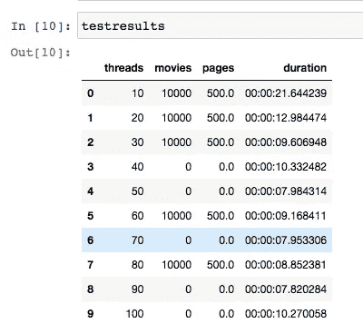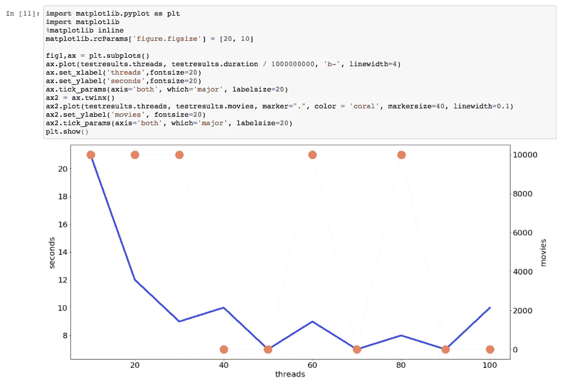

测试结果运行 1

这种趋势并不十分明显:当线程数量增加时，API 调用会变得更快，在 10 到 30 个线程之间，速度会大大加快。但是持续时间(显示为完成一个请求的秒数)变得不稳定，并且又增加了 100 个线程。

所有红点表示没有获取任何数据的运行。乍一看，持续时间/速度、线程数量和检索到的数据之间没有联系。我再次运行包装循环，结果明显不同:

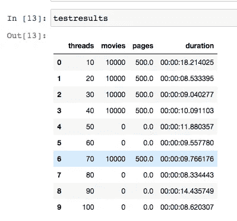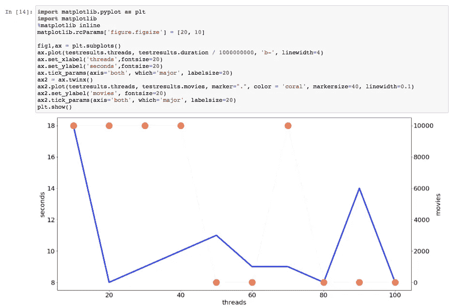

测试结果运行 2

趋势几乎是一样的:越匆忙——我使用的线程越多——得不到数据的可能性就越大。

另一件重要的事情，也是我继续测试的原因。从移动应用发出的每个 API 请求至少需要 8 分钟，这是一场灾难。没有用户会等这么久！

# 在下一个循环中包装代码

我本可以再按几次“运行”来重复循环，但是我决定添加另一个循环——我通常喜欢循环——并且我以代码结束:

```
import asyncioimport nest_asyncioimport concurrent.futuresimport requestsfrom datetime import datetimeimport timeimport pandasasync def main(url, max_workers):with concurrent.futures.ThreadPoolExecutor(max_workers=max_workers) as executor:try:loop = asyncio.get_event_loop()except:passtry:futures = [loop.run_in_executor(executor,requests.get,url + '&page=' + str(i),)for i in range(1, 501)]except:passfor response in await asyncio.gather(*futures):try:dict = response.json()for item in dict['results']:movies.append(item)except:passgrandresult = pandas.DataFrame(columns = ['threads', 'movies', 'pages', 'duration', 'run'])for x in range (1,11):nummoviesList = []pagescheckedList = []itlastedList = []maxworkersList = []for max_workers in range(10,101,10):movies = []try:executorList = []n = datetime.now()loop = asyncio.get_event_loop()try:loop.run_until_complete(main(my_url, max_workers))except:passnummoviesList.append(len(movies))pagescheckedList.append(len(movies) / 20)nn = datetime.now()diff = nn - nitlastedList.append(diff)maxworkersList.append(max_workers)except:print("interrupted at ", max_workers)time.sleep(10)resultsdict = {'threads': maxworkersList, 'movies': nummoviesList, 'pages': pagescheckedList, 'duration': itlastedList}testresults = pandas.DataFrame(resultsdict)testresults['run'] = xgrandresult = grandresult.append(testresults)print('end run ' + str(x))time.sleep(60)
```

正如你所看到的，有一个新的列:“运行。”它显示了运行的顺序。

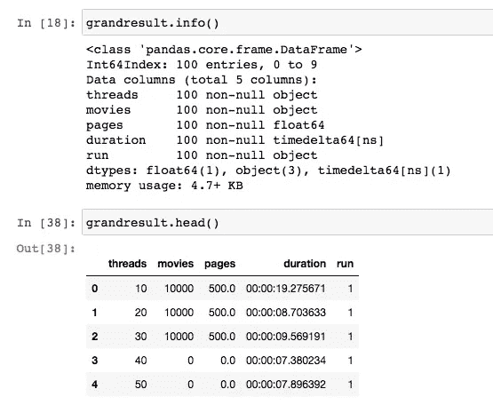

我复制了一份，以防万一。然后我查看了每个线程数的平均性能。

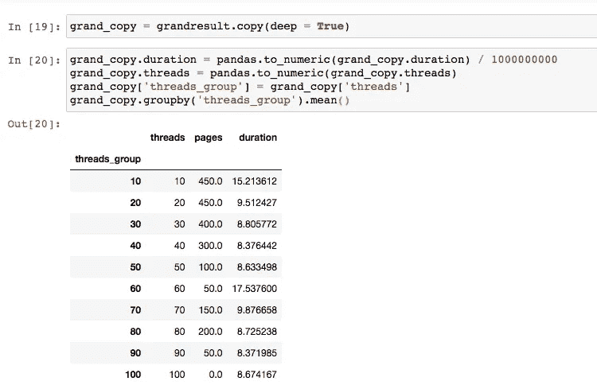

我只跑了 9 次，所以电影栏变得有点混乱。如果平均值低于 450，则每次并未获取所有电影。但是我们仍然可以看到成功的运行是最慢的。最快的只是不完整。

让我们把它全部放在一张图表上。

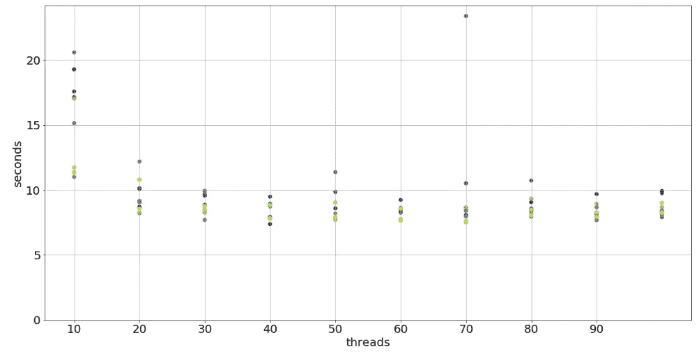

API 调用持续时间与线程数量:按运行分组

对于这个可视化，我删除了三个或四个异常值。圆点的颜色表示外部 for 循环中的不同运行。没有任何颜色聚类表示单次运行在性能上没有区别。只有一些线程起作用。

然后，我根据是否获取了任何数据来给这些点着色(深紫色或 0 表示没有数据，黄色或 1 表示下载了所有电影)。

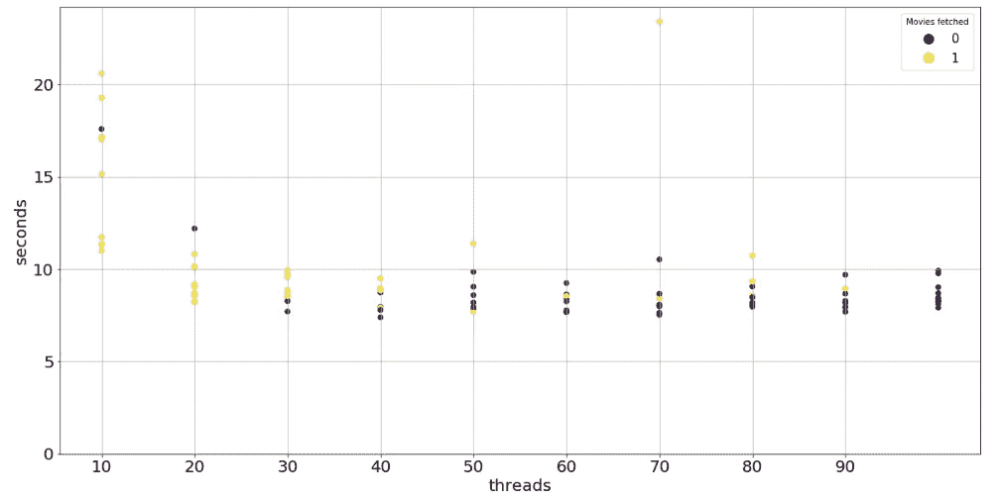

API 调用持续时间与线程数量:按成功或失败分组(0 =失败，1-成功)

最后一个可视化结果表明，坚持 10 到 30 个线程的范围是有意义的。但即使是这些也大多不可靠。

# 测试较窄的范围

在陷入沮丧之前，我想做最后一次尝试，开始另一个实验，在 1 到 30 的范围内测试线程数，并制作一个 1 的小缺口。

下一张图表显示，几乎没有避免空白回答的选项。然而，一个接一个地发送请求持续的时间太长了:175 秒。


API 调用持续时间与线程数量:按成功或失败分组(0 =失败，1-成功)

我可以选择过滤掉最长的持续时间，但是这些都是可靠的配置。最后我把 25 秒以上的都去掉了。在图表的网格布局上，可以看到这是一个大部分点所在的范围，还有很多黄色的点。

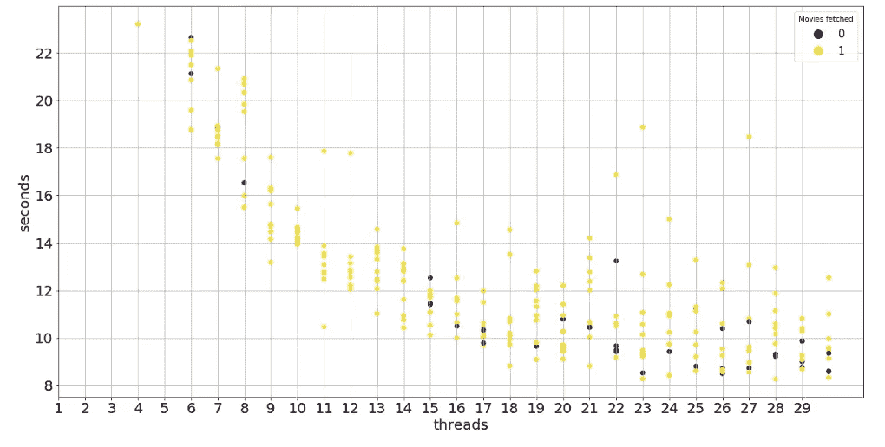

API 调用的持续时间与线程数量:按成功或失败分组(0 =失败，1-成功)。持续时间范围:从 1 到 25。

没有一个群集具有可接受的持续时间和可靠的结果。在从 9 到 14 个线程的范围内，所有的点都是黄色的，因此，这些线程数确实下载了电影数据。

在这里，最终的选择变得棘手。

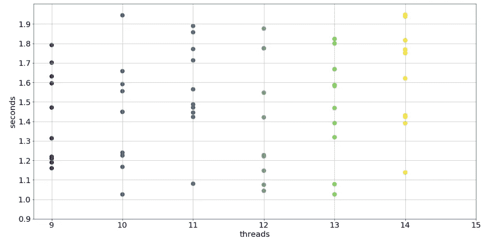

9 到 13 个线程缩放

10 线程和 13 线程点簇的持续时间最短。13 线程点簇比其他簇有更多的低持续时间。9 线程集群似乎是最稳定的:所有的点都挤在一起。

是时候做一些描述性统计了。我计算了平均值、中间值、偏差等。并按从低到高的顺序排列，最低的得到最高的等级。

不太科学，但最终有可能确定最佳结果。

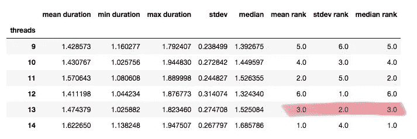

根据基于中值、平均值和标准偏差值的排名的最佳线程数量

**这是给定条件下的最佳线程数。**

尽管如此，移动应用程序会让用户再等 13 秒来完成基于 API 调用的操作。这是采取下一步性能优化措施的好理由，比如减少要检索的数据量，或者考虑其他来源。这也是重新思考移动应用背后的商业决策的一个很好的理由。

# 为什么都用 Python？

至少有三个原因可能会导致您更喜欢使用 Python 作为编写软件测试的语言:

*   你一般爱 Python！
*   你想要一个持续的检查，在你的服务器上永久运行。
*   您希望将结果传输到一个 AI 中，该 AI 会自动纠正被测试的主软件中的线程数量(或任何其他参数)。

# 一些要带走的东西

当然，我用一段清晰的代码说明了这篇文章，这段代码实际上是从一片混乱中诞生的。因此，关于如何不搞砸你的测试的一些学习。

*   了解你的数据。我进行了第一个实验，循环浏览 1000 页。然后我发现只有 500 个可用的键，当我最终想要访问返回的字典中的所有键时。
*   追踪你的测试。运行一次尝试后，不要在 Jupyter 或 Colab 的同一个单元格中编辑代码:而是复制粘贴！以前的版本反而可以变成更好的。
*   花时间构建有意义的数据可视化。在我构建了包含成功和失败运行的图表后，我可以缩小范围并消除第 10 个缺口。
*   检查隐藏的依赖性和系统模式:使用你的数据 vizzes。
*   一步一步地发展你的最终代码。更容易还原自己的逻辑来报告测试结果。
*   小步前进。匆忙最终会耗费更多的时间。
*   从一个描述性的和更一般的方法开始，定位你的挑战，然后缩小你的焦点。我从一个单一的 API 请求开始，并把它发展成一个由三个循环相互包裹的代码。
*   要系统！

特别是关于 API 测试，我也想分享一些技巧:

*   在代码中放入大量的“try-except”对，后跟“pass”语句。这有助于您在不中断循环的情况下进入下一次运行。运行可能会由于与测试无关的临时网络问题而终止。
*   放一个具体的例外，比如:

```
except requests.exceptions.ConnectionError:print(“Connection refused”)pass
```

它会给你一个提示，为什么会出现这个问题。您还可以获取本机错误消息，我在“循环遍历数字…”一节中展示了这一点

*   在多线程请求之间放置一个“睡眠”中断。不要让服务器生气！
*   当尝试不同数量的线程时:从一个间隙开始，跟踪一个成功的范围；消除间隙并测试增益。
*   尝试不同的网络容量和硬件。
*   **模仿最终用户设置。**

在这里，您可以找到本文的所有代码片段，包括最终的代码和数据可视化片段:

[](https://colab.research.google.com/drive/1TX98-OpRYkdGEA5Onu81EDfv5GOOKHH2) [## 谷歌联合实验室

测试 API 调用中的线程数:asyncio 和 concurrent.futures 包(Python)colab.research.google.com](https://colab.research.google.com/drive/1TX98-OpRYkdGEA5Onu81EDfv5GOOKHH2) 

测试愉快！