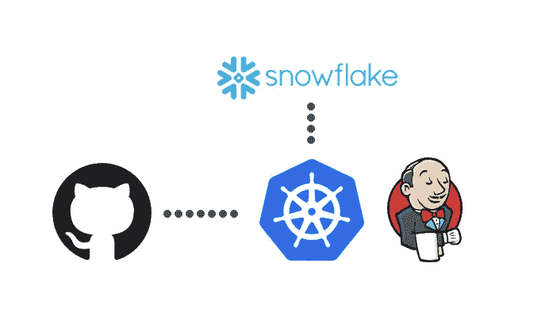

# 使用 pytest 在 Google Cloud Composer 上测试气流作业

> 原文：<https://towardsdatascience.com/testing-airflow-jobs-on-google-cloud-composer-using-pytest-9e0a1198b4cd?source=collection_archive---------33----------------------->

## 无需重新发明轮子的可靠 CI/CD

马克·克林在 [Unsplash](https://unsplash.com/?utm_source=unsplash&utm_medium=referral&utm_content=creditCopyText) 上的照片

[Airflow](https://airflow.apache.org/) 是一个开源的工作流管理平台，由 Airbnb 开发，现在由 Apache 维护。它基本上是类固醇上的 cron[1]，具有无限扩展的理论能力，将这一特性的复杂性完全抽象给最终用户。你只需要写代码，决定它什么时候运行，剩下的就交给 Airflow 了。部署气流并不容易，需要深厚的运营知识和工具，如 Kubernetes 和芹菜。出于这个原因，许多云提供商提供托管气流部署，比如[天文学家. io](https://www.astronomer.io/) 或[谷歌云合成器](https://cloud.google.com/composer)，这里仅举最著名的例子。设置一个运行 Airflow 的集群只需点击几下，从那时起，几乎所有的东西都可以使用 Airflow Web UI 进行配置。

在 [HousingAnywhere](http://housinganywhere.com/) 我们几乎在所有事情上都使用谷歌云平台，决定在 Cloud Composer 上部署 Airflow 是一个自然的结果。生成的环境开箱即用，带有 CeleryExecutor，dags 文件夹存储在 Google 云存储中。你需要在气流上运行的任何东西都必须首先被推到那个桶中，并且作业产生的任何东西都将被存储在同一个桶上的特定文件夹中。

[Airflow 完全用 Python 编写](https://github.com/apache/airflow)，所有工作流程都是通过 Python 脚本创建的。实际上，这不是一个限制，因为任务本身(组成 DAG 的原子工作单元，一组相互依赖的任务)可以用任何语言编写，并通过 bash 或 Docker 运行。在 HousingAnywhere，我们将 Airflow 用于大量不同的用例，从移动数据到网络抓取，当然，我们在 Github 上发布所有内容。在试验的最初几天，我们手动将主分支上刚刚合并的所有新工作推到桶中:这是可行的，但在规模上是不可持续的，存在拥有不同真实来源的巨大风险，一个在 Github 上，一个在 GCS 上。

使用 Google Cloud Build，我们设计了一个自动化流程，由我们的气流存储库的主分支上的任何相关更改触发。无论 master 上发生什么，都会自动与 GCS bucket 同步，不再需要任何人手动处理这个过程。基本上是一张关于气流的 CD。

Google Cloud Build 上触发的作业的历史记录

CloudBuild 语法和与 Google Cloud Composer API 的集成允许我们做更多的事情，序列化 Github 上的绝大多数气流环境:不仅仅是 dags 文件夹，还有任务所依赖的其他重要参数，如变量。这里的主要思想是，如果发生了不好的事情，我们可以几乎完全重建我们的环境，只需在新的 Airflow 集群上运行相同的 CloudBuild 作业，而无需任何努力或返工。

谷歌云构建步骤克隆气流变量

然而，这样的自动化流程需要仔细检查主分支上合并的内容，防止开发人员触发可能破坏环境的自动化任务。在制作 CD 时，我们开始设计一个自动化的 CI，能够可靠地测试我们的分支，如果有问题，可能会亮起红灯。

诚然，有意义的气流部署是复杂的，但建立一个能够顺序运行任务的快速环境并不复杂。创建一个本地气流部署实际上是三个命令的事情，底层的 Python 代码库使它非常轻量和灵活。

Bash 脚本需要启动一个简单的气流环境

使用 [pytest](https://docs.pytest.org/en/latest/) (在 HousingAnywhere，我们已经使用这个库在我们所有的配置项上测试 Python)很容易模拟出运行一个任务所需的所有对象，幸运的是，这项工作可以在我们希望测试的所有气流实例之间共享。每个开发人员只需负责导入那些资源，并负责自己的测试。使用 Airflow 的复杂性几乎完全消除了，针对代码特性编写有意义的测试实际上是几十年前的最佳实践。

感谢[巴斯·哈伦斯拉克](https://godatadriven.com/blog/testing-and-debugging-apache-airflow/)的灵感

我们已经为所有的操作符编写了测试，并对 dags 文件夹中的 DAGs 进行了一致性检查，以便不在那里合并一些中断的(或循环的)东西。

DAGs 文件夹上一致性检查的代码

总结一下，现在只需要为您最喜欢的 CI 工具定义测试管道(在 HousingAnywhere，我们使用 Jenkins，但是无论什么都可以)，然后运行 pytest 命令。如果分支是绿色的，则合并是安全的。包含测试的文件夹不需要被推到 GCS 上的桶中，并且可以被保留在设计的 CD 之外。

CI/CD 的简化架构

## **一个例子，使用雪花测试 DAGs】**

在这里展示一个例子，展示我们如何处理在我们的云数据仓库雪花上运行的测试气流任务，可能会很有趣。如果使用 pytest 很容易[模拟出 Postgres 实例，那么雪花的唯一解决方案就是在云上创建一个测试环境，尽可能与生产环境相似，并对其运行所有测试，注意用有意义的数据和资源填充它。](https://pypi.org/project/testing.postgresql/)

为此，通过雪花查询引擎提供的 GET_DDL 函数非常有用，它输出重新创建作为参数传递的表所需的 SQL DDL 查询。在测试时创建测试环境实际上就是执行几个 sql 查询。从监控的角度来看，将测试数据库连接到一个单独的仓库是明智的，这样可以控制成本并避免与预测资源的冲突。

雪花是直接从詹金斯启动的吊舱进入的

必须将生产数据的子集转储并复制到测试环境中，可能会在测试会话结束时擦除它们。但是这主要是基于特定的需求和要测试的任务的功能。Python 的[雪花连接器在这个方向上提供了很大的自由度，但是对于一些非常特殊的用例，我们也将 SQLAlchemy 与 Pandas 结合使用。](https://docs.snowflake.com/en/user-guide/python-connector.html)

在 Airflow 方面，所有到数据库或外部资源的连接都应该通过钩子来处理。SnowflakeHook 可以从默认的 Airflow 安装中获得，使用它的工作量非常有限，只需通过 pip 导入正确的资源即可。

可以使用 pytest mocker 库向任务公开测试凭证。每次函数调用 get_connection 时，解释器都会返回这些凭证，而实际上不会向 Airflow 请求任何东西。

测试的实际内容是特定于任务的，在这个例子中，我们希望为在雪花表格中推送新广告的工作编写测试。我们想强调我们没有使用任何不包含在任务结果中的广告客户(可能由另一个广告客户生成，之前执行过)。

测试操作员时执行的一些检查

前置集和后置集是直接针对雪花表运行查询来填充的。

[1]这个惊人的定义不是我的。马克·纳格尔伯格的功劳