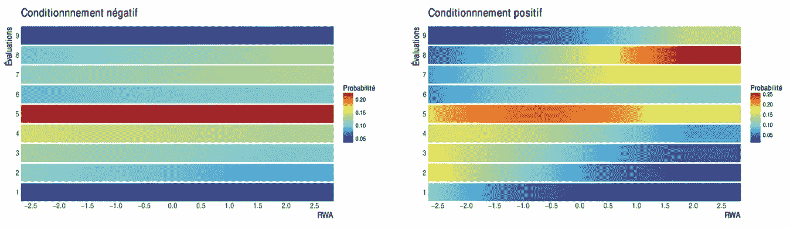
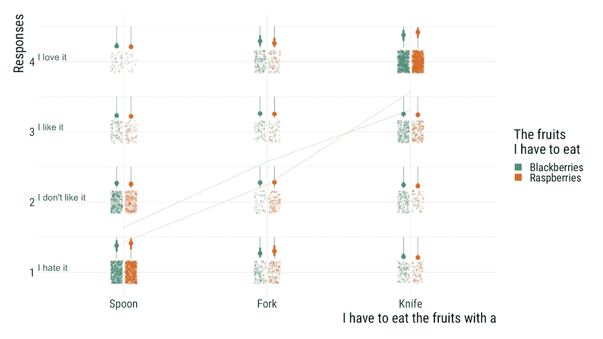

# 在 R 中测试有序数据和回归的另一种可视化

> 原文：<https://towardsdatascience.com/testing-an-alternative-visualisation-of-ordinal-data-and-regression-in-r-1dc838fcaa2d?source=collection_archive---------42----------------------->

## Dataviz

## 使用 brms 和 ggplot2 仅在一个图上显示您的交互

有序数据无处不在(好吧，也许不是无处不在，但仍然很常见)。例如，在心理学(我的科学领域)中，人们经常使用有序数据，例如在使用李克特量表时。然而，可视化有序数据和用于分析有序数据的回归并不容易。当然，你可以用经典的 t 检验分析你的数据，并绘制柱状图，但这并不推荐( [Liddell & Kruschke，2018](https://papers.ssrn.com/sol3/papers.cfm?abstract_id=2692323) )。谢天谢地，你可以通过神奇的 brms R 软件包学习如何更好地打点( [Bürkner & Vuorre，2018](https://psyarxiv.com/x8swp/) )。这篇文章不是关于如何分析有序数据，而是关于如何可视化它。如果你想学习分析，你可以阅读上面引用的文章或者看[本章](https://bookdown.org/content/3686/ordinal-predicted-variable.html)出自[所罗门·库尔茨](https://twitter.com/SolomonKurz)。

# “困难”(？)

有几个选项可以显示有序回归的结果。brms R 包( [Bürkner，2018](https://cran.r-project.org/web/packages/brms/index.html) )提供了一种很好的方式，用 [conditional_effects](http://paul-buerkner.github.io/brms/reference/conditional_effects.html) 命令从序数模型中提取条件效果。在之前的研究中，我们已经将此方法与 [Amélie Beffara Bret](https://twitter.com/amebret) 一起使用，您可以在下面找到一个(定制)输出示例:



使用 brms 的有序回归可视化示例

我们可以看到，我们有两个预测值，称为“RWA”(连续，在 *x 轴*上)和“Conditioning”(两个值显示在不同的图中)。在 *y 轴*上，我们有顺序结果(“评估”)，图例显示了概率等级。当然，这不是绘制这种数据和回归的唯一方法。结果可能是图例和概率在 *y 轴*(例如，见[马修·凯](https://twitter.com/mjskay)的[这篇博文](https://cran.r-project.org/web/packages/tidybayes/vignettes/tidy-brms.html))。然而，在这两种情况下，重要的一点是每个响应的概率在图上占一个维度，或者在图例中，或者在 y 轴上。因此，这个维度不能用于预测。这非常重要，因为这意味着当你对交互感兴趣时，你需要几个图(或 3D 图)。这不一定是一个大问题，但我想测试一个新的(至少对我来说)可视化选项。

# 种“解”(？)

下面是我最近测试的一个例子:



那么我们这里有什么？我们有两个预测值，即“*我必须吃的水果*”和“*我必须吃带…* 的水果”。这是两个分类预测值，一个在 x 轴上，另一个在图例上。在 *y 轴*上，我们可以找到具有 4 个可能值的有序结果。抖动的点是所有参与者的真实反应。我发现绘制原始数据非常重要。但是如果我们只画这些点，我们就没有模型的估计。正如我上面提到的，为有序模型绘制条件效应通常需要为每个响应的概率使用一个维度。在这里，我选择在抖动点上方的另一个小轴上绘制这个概率(以及它的可信区间 CI)。这允许我们在一个图上显示相互作用，因为我们有另一个第二预测值的自由维度。虚线简单地连接了每种情况下的一种“总体”响应估计(根据 brms 模型计算)。尽管这种方法远非完美，但它允许我们(imho)绕过一些通常在顺序模型可视化中遇到的限制。那么，我们该怎么做呢？如果你已经熟悉 brms 和 ggplot2，这并不复杂。让我们来看看。

# 乱码

在这里你可以下载重现例子所需的一切。

首先，我们需要一个数据框。我使用了一个从我正在做的项目修改而来的数据框架(这让我想到了我在这里展示的 dataviz)。我们有两个独立变量:水果(*黑莓*对*树莓*)和我们如何吃它(*勺子*对*叉子*对*刀子*)。我们的因变量是 4 个有序水平的被试的反应:“*我讨厌它*”、“*我不喜欢它*”、“*我喜欢它*”、“*我喜欢它*”，分别编码为 1、2、3、4。在这个实验中，我们有几个参与者和几个实验者。都有一个随机 ID。

```
library(tidyverse)
library(brms)
library(extrafont)
library(hrbrthemes)##### Import df #####
fruit_df <- read_csv("fruit_df.csv")
```

然后我们运行我们的(当然是顺序的)模型。我们想要估计水果的恒定效果，我们如何吃水果，以及这两个变量之间对反应的相互作用(即参与者如何喜欢它)。我们也包括由参与者和由实验者改变截距。

```
##### Run model #####
fit_fruit <- brm (
  formula = resp ~ fruit * cutlery + (1 | ppt) + (1 | exp),
  data = fruit_df,
  warmup = 1000,
  iter = 2000,
  chains = 4,
  cores = parallel::detectCores(),
  control = list(adapt_delta = 0.8, max_treedepth = 10),
  family = cumulative (link = "probit", threshold = "flexible")
)summary(fit_fruit)
```

我们不会在这里谈论模型的质量(或者如何检查它)，这超出了范围。我们就当模型还可以吧。现在我们需要从模型中获得估计值，因为我们希望能够绘制它。更准确地说，我们想知道两个预测值的每个组合中每个响应的概率(以及与每个估计值相关的可信区间)。

```
##### Get estimates from the model ###### set conditions for the "fruit" predictor
cond_Blackberries <- data.frame(fruit = "Blackberries",
                                cond__ = "Blackberries")cond_Raspberries <- data.frame(fruit = "Raspberries",
                               cond__ = "Raspberries")# get estimates of the probability of each response in each combination of the two predictorsconditional_Blackberries <- conditional_effects(
  effects = "cutlery",
  conditions = cond_Blackberries,
  fit_fruit,
  re_formula = NULL,
  robust = TRUE,
  categorical = TRUE,
  probs = c(0.025, 0.975),
  plot = FALSE
)[[1]]conditional_Raspberries <- conditional_effects(
  effects = "cutlery",
  conditions = cond_Raspberries,
  fit_fruit,
  re_formula = NULL,
  robust = TRUE,
  categorical = TRUE,
  probs = c(0.025, 0.975),
  plot = FALSE
)[[1]]conditional_merged <-
  rbind(conditional_Blackberries, conditional_Raspberries)
```

为了画出虚线，我们还需要对两个预测因子的每个组合的反应进行“总体估计”。这一部分不是最相关的，但它可以(可能)帮助想象兴趣的影响。“总体估计”给出了根据每个响应水平的中值概率计算的每个条件下的中值响应的概念。

```
# Compute overall response estimates (for the dashed lines on the plot)overall_list <- conditional_merged %>%
  mutate(overall_resp = as.numeric(effect2__) * estimate__)overall_sum <-
  aggregate(data = overall_list, overall_resp ~ fruit * cutlery, sum)
```

现在我们可以开始策划了。首先，我们通过显示每个响应来绘制原始数据(一个响应=一个点)。

```
#### Starting plot ##### Get font
hrbrthemes::import_roboto_condensed()
loadfonts()# Order levels
level_order <- c('Spoon', 'Fork', 'Knife')#### Plot raw data ####
plot_fruit <-
  ggplot(fruit_df, aes(
    x = factor(cutlery, level = level_order),
    y = resp,
    fill = fruit
  )) +
  geom_point(
    data = fruit_df,
    aes(
      x = factor(cutlery, level = level_order),
      y = resp,
      colour = fruit,
      fill = fruit
    ),
    position = position_jitterdodge(
      jitter.width = .08,
      jitter.height = 0.16,
      dodge.width = .2
    ),
    size = 2,
    alpha = .2,
    shape = 20,
    inherit.aes = FALSE
  )
```

然后，我们绘制“第二轴”。图中的灰色小竖线。我们将在这些“轴”上绘制我们的概率估计及其 CI。这是代码中最糟糕的部分，因为我没有比手动设置坐标更好的解决方案。 *geom_segment* 否则表现不佳。

```
#### Prepare secondary axes ####
plot_fruit <- plot_fruit + geom_segment(
  data = conditional_merged,
  aes(
    x = cutlery,
    xend = c(
      1.95,
      2.95,
      0.95,
      1.95,
      2.95,
      0.95,
      1.95,
      2.95,
      0.95,
      1.95,
      2.95,
      0.95,
      2.05,
      3.05,
      1.05,
      2.05,
      3.05,
      1.05,
      2.05,
      3.05,
      1.05,
      2.05,
      3.05,
      1.05
    ),
    y = as.numeric(effect2__) + 0.2,
    yend = as.numeric(effect2__) + 0.5,
    linetype = "1"
  ),
  color = "gray20",
  size = 0.3,
  position = position_dodge(width = .2),
  lineend = "round",
  show.legend = FALSE
)
```

现在我们应用同样的方法，但是这次是针对概率估计和它们的 CI。

```
#### Plot estimates and CI ####
plot_fruit <- plot_fruit + geom_segment(
  data = conditional_merged,
  aes(
    x = cutlery,
    xend = c(
      1.95,
      2.95,
      0.95,
      1.95,
      2.95,
      0.95,
      1.95,
      2.95,
      0.95,
      1.95,
      2.95,
      0.95,
      2.05,
      3.05,
      1.05,
      2.05,
      3.05,
      1.05,
      2.05,
      3.05,
      1.05,
      2.05,
      3.05,
      1.05
    ),
    colour = fruit,
    y = as.numeric(effect2__) + 0.2 + lower__ * 0.3,
    yend = as.numeric(effect2__) + 0.2 + upper__ * 0.3,
    linetype = "1"
  ),
  size = 2,
  position = position_dodge(width = .2),
  lineend = "round",
  show.legend = FALSE
) + geom_point(
  data = conditional_merged,
  aes(
    x = cutlery,
    y =  as.numeric(effect2__) + 0.2 + estimate__ * 0.3,
    colour = fruit,
  ),
  size = 4,
  position = position_dodge(width = .2),
  show.legend = FALSE
)
```

我们画虚线。它们将我所说的“总体估计”联系起来。

```
#### Dashed lines ####
plot_fruit <- plot_fruit + geom_line(
  data = overall_sum,
  aes(
    x = factor(cutlery, level = level_order),
    y = overall_resp,
    group = fruit,
    colour = fruit
  ),
  linetype = 3,
  size = 0.5
)
```

我们添加文本来说明每个响应级别的含义。

```
#### Labels ####
plot_fruit <- plot_fruit + annotate(
  "text",
  x = 0.4,
  y = 1.07,
  hjust = 0,
  color = "gray40",
  label = "I hate it",
  size = 7
) +
  annotate(
    "text",
    x = 0.4,
    y = 2.07,
    hjust = 0,
    color = "gray40",
    label = "I don't like it",
    size = 7
  ) +
  annotate(
    "text",
    x = 0.4,
    y = 3.07,
    hjust = 0,
    color = "gray40",
    label = "I like it",
    size = 7
  ) +
  annotate(
    "text",
    x = 0.4,
    y = 4.07,
    hjust = 0,
    color = "gray40",
    label = "I love it",
    size = 7
  )
```

最终定制，我们可以绘图！

```
#### Custom ####
plot_fruit <- plot_fruit +
  scale_colour_brewer(palette = "Dark2",
                      name = "The fruits \nI have to eat") +
  scale_fill_brewer(palette = "Dark2",
                    name = "The fruits \nI have to eat") +
  theme_minimal() +
  scale_x_discrete(name = "I have to eat the fruits with a") +
  scale_y_continuous(name = "Responses",) +
  theme_ipsum_rc(
    base_size = 25,
    subtitle_size = 25,
    axis_title_size = 30
  ) +
  guides(alpha = FALSE,
         colour = guide_legend(override.aes = list(shape = 15, size = 7))) +
  scale_alpha_continuous(range = c(0.2, 1)) +
  theme(text = element_text(size = 30))plot_fruit
```

不滚动了，这里又是剧情。


就是这样。没什么特别的，但这是(可能是？)一个选项。当然，如果在论文中使用，这种情节需要有充分的解释。但那是后话了。如果您对可能的改进有任何意见或建议，请告诉我。感谢阅读！

***感谢***

非常感谢[拉迪斯拉斯·纳尔博奇克](https://twitter.com/lnalborczyk)、[伊索尔特·赫贾-布里沙德](https://twitter.com/Izzie_Hb)、[贝特朗·贝法拉](https://twitter.com/BertrandBeffara)和[艾米里·贝法拉·布雷特](https://twitter.com/amebret)对本文早期版本的评论和帮助。

***脚注***

*你可以在这里找到(凌乱++的)代码*[](https://github.com/bricebeffara/rwa_attitude_change)**，在这里找到预印本*[](https://psyarxiv.com/3mfa8/)**，在这里找到论文(法文)里面的情节*[](https://thesiscommons.org/9tkp4/)*。***

****你可以在这里* *找到(凌乱++的)代码* [*，在这里*](https://osf.io/zsh3b/) *找到预印本* [*。*](https://psyarxiv.com/8cznm/)***