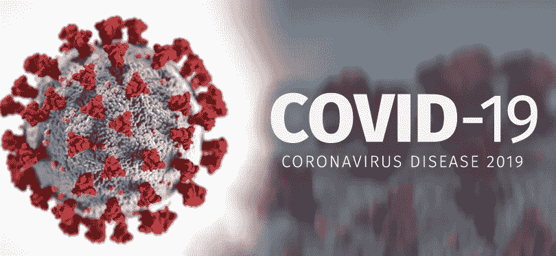
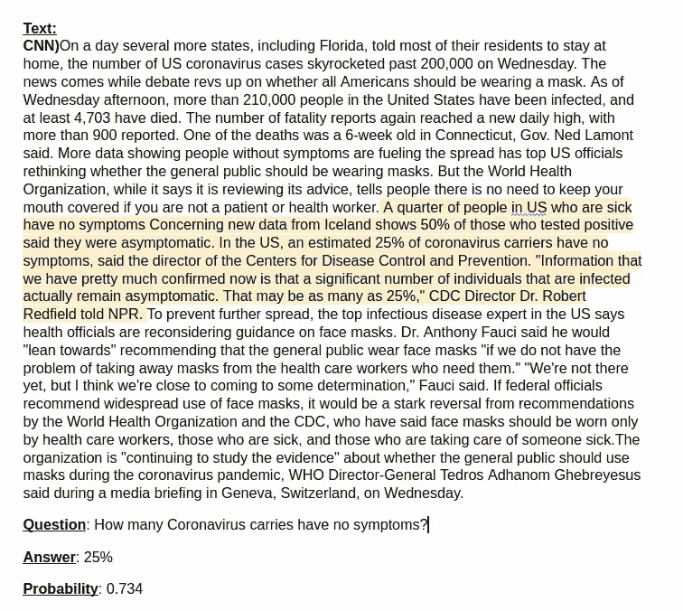
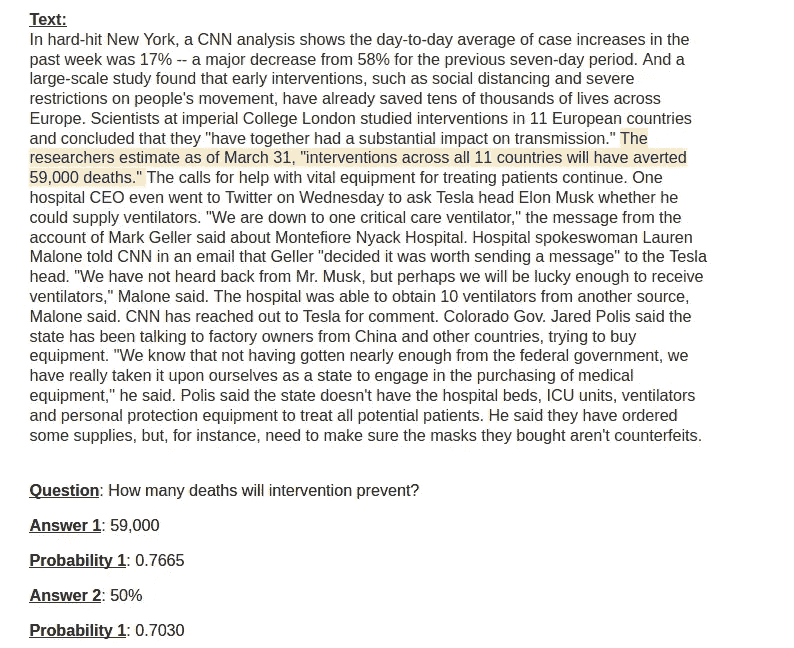
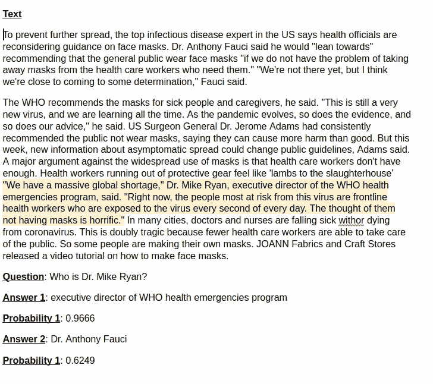

# 在冠状病毒文章上测试基于 BERT 的问答

> 原文：<https://towardsdatascience.com/testing-bert-based-question-answering-on-coronavirus-articles-13623637a4ff?source=collection_archive---------30----------------------->



COVID19 图像

# **简介**

目前世界大部分地区都受到了 T2 新冠肺炎疫情 T3 的影响。对我们许多人来说，这意味着在家隔离，社会距离，工作环境的破坏。我非常热衷于使用数据科学和机器学习来解决问题。如果你是一家医疗服务公司，正在寻找数据科学帮助来应对这场危机，请通过这里的[联系我](https://deeplearninganalytics.org/contact-us/)。

世界各地的媒体不断报道疫情——最新的统计数据、政府的指导方针、保护自己安全的提示等等。整理所有的信息会很快让人不知所措。

在这篇博客中，我想分享你如何使用基于 BERT 的问答来从关于病毒的新闻文章中提取信息。我提供了关于如何自己设置它的代码提示，并分享了这种方法在哪里有效以及何时会失败。我的代码也上传到了 [Github](https://github.com/priya-dwivedi/Deep-Learning/tree/master/Question_Answering_coronavirus) 。请注意，我不是健康专家，本文的观点不应被解释为专业建议。

# **什么是问答？**

问题回答是自然语言处理中计算机科学的一个领域，它包括建立能够从给定的文本中回答问题的系统。在过去的 2-3 年里，这是一个非常活跃的研究领域。最初的问题回答系统主要是基于规则的，并且只限于特定的领域，但是现在，随着更好的计算资源和深度学习架构的可用性，我们正在获得具有通用问题回答能力的模型。

现在大多数表现最好的问答模型都是基于变形金刚架构的。为了更多地了解变形金刚，我推荐了这个 [youtube 视频](https://www.youtube.com/watch?v=AFkGPmU16QA)。转换器是基于编码器-解码器的架构，其将问答问题视为文本生成问题；它将上下文和问题作为触发器，并试图从段落中生成答案。BERT、ALBERT、XLNET、Roberta 都是常用的问答模型。

## **小队— v1 和 v2 数据集**

[斯坦福问答数据集(SQuAD](https://rajpurkar.github.io/SQuAD-explorer/) )是用于训练和评估问答任务的数据集。小队现在发布了两个版本——[v1](http://arxiv.org/abs/1606.05250)和 [v2](http://arxiv.org/abs/1806.03822) 。这两个数据集之间的主要区别在于，SQuAD v2 还考虑了问题在给定段落中没有答案的样本。当一个模型在小队 v1 上训练时，即使没有答案，模型也会返回一个答案。在某种程度上，你可以使用答案的概率来过滤掉不太可能的答案，但这并不总是有效。另一方面，在 SQuAD v2 数据集上进行训练是一项具有挑战性的任务，需要仔细监控精度和超参数调整。

# **构建和测试班伯特模型**

随着这种病毒在世界范围内的爆发，有大量的新闻文章提供了关于这种病毒的事实、事件和其他消息。我们在模型从未见过的文章上测试问答如何工作。

为了展示这种能力，我们从 CNN 选择了一些信息丰富的文章:

来自 [huggingface](https://github.com/huggingface/transformers) 的 transformers 是一个令人惊叹的 github repo，其中他们编译了多个基于 transformer 的训练和推理管道。对于这个问答任务，我们将从 https://huggingface.co/models[下载一个预先训练好的小队模型。本文中我们将使用的模型是](https://huggingface.co/models)[Bert-large-uncased-whole-word-masking-fine tuned-squad](https://huggingface.co/bert-large-uncased-whole-word-masking-finetuned-squad)。从模型名称可以明显看出，该模型是在大型 bert 模型上训练的，该模型具有不区分大小写的词汇并屏蔽了整个单词。使用该模型我们需要三个主要文件:

1.  Bert-large-un cased-whole-word-masking-fine tuned-squad-config . JSON:这个文件是一个配置文件，其中包含代码将用来进行推理的参数。
2.  Bert-large-un cased-whole-word-masking-fine tuned-squad-py torch _ model . bin:这个文件是实际的模型文件，它包含了模型的所有权重。
3.  Bert-large-un cased-whole-word-masking-fine tuned-squad-TF _ model . H5:该文件具有用于训练该文件的词汇模型。

我们可以使用以下命令加载我们已经下载的模型:

```
tokenizer = AutoTokenizer.from_pretrained(‘bert-large-uncased-whole-word-masking-finetuned-squad’, do_lower_case=True)model = AutoModelForQuestionAnswering.from_pretrained(“bert-large-uncased-whole-word-masking-finetuned-squad”)
```

总的来说，我们将代码组织在两个文件中。请在我的 [Github](https://github.com/priya-dwivedi/Deep-Learning/tree/master/Question_Answering_coronavirus) 上找到以下内容:

1.  问题 _ 回答 _ 推理. py
2.  问题 _ 回答 _ 主页. py

question _ answering _ inference . py 文件是一个包装文件，它具有处理输入和输出的支持函数。在这个文件中，我们从文件路径中加载文本，清理文本(将所有单词转换为小写后删除停用单词)，将文本转换为段落，然后将其传递给 question_answering_main.py 中的 answer_prediction 函数。answer_prediction 函数返回答案及其概率。然后，我们根据概率阈值过滤答案，然后显示答案及其概率。

question_answering_main.py 文件是一个主文件，它具有使用预训练模型和标记器来预测给定段落和问题的答案所需的所有功能。

此文件中的主要驱动程序函数是 answer_prediction 函数，它加载模型和记号化器文件，调用函数将段落转换为文本，将文本分段，将特征转换为相关对象，将对象转换为批次，然后用概率预测答案。

为了运行脚本，请运行以下命令:

```
python question_answering_inference.py — ques ‘How many confirmed cases are in Mexico?’ — source ‘sample2.txt’
```

该程序采用以下参数:

*   ques:问题参数，要求用单引号(或双引号)将问题括起来。
*   source:该参数具有包含文本/文章的文本文件的源路径

# 模型输出

我们在冠状病毒的几篇文章上测试了这个模型。：

[](https://edition.cnn.com/2020/03/08/health/coronavirus-touching-your-face-trnd/index.html) [## 冠状病毒的一大挑战是如何停止触摸你的脸

### 冠状病毒的爆发提醒我们，我们触摸自己的脸次数太多了。减少这种意愿…

edition.cnn.com](https://edition.cnn.com/2020/03/08/health/coronavirus-touching-your-face-trnd/index.html) [](https://edition.cnn.com/2020/04/01/health/us-coronavirus-updates-wednesday/index.html) [## 美国冠状病毒病例超过 20 万。更多的州说呆在家里

### 越来越多的数据显示，没有症状的人正在加剧冠状病毒的传播，这让高层官员重新思考是否…

edition.cnn.com](https://edition.cnn.com/2020/04/01/health/us-coronavirus-updates-wednesday/index.html) 

在下面的例子中，我们有传递给模型的文本和问题，以及返回的答案及其概率。


问答示例 1

以上回答正确。该模型能够以很高的置信度选择正确的答案。



问答示例 2

这是一个更棘手的问题，因为文章中有几个共享的统计数据。冰岛的一项研究显示，大约 50%的携带者没有症状，而疾病控制中心估计有 25%。看到这个模型能够选择并返回正确的答案真是令人惊讶。

同一篇文章后来谈到了干预的效果以及它可以避免多少死亡。相关文本复制如下。然而，当运行代码时，我们传递的是整篇文章，而不是下面的子集。由于 SQUAD 模型对可以处理多少文本有限制，所以我们在多个循环中传递完整的文本。如下所示，这意味着模型会返回几个答案。这里概率最高的第一个答案是正确的。



问答示例 3 —返回多个答案

下面分享了另一个发生这种情况的例子。正确答案是迈克·瑞安是世卫组织突发卫生事件项目的负责人。该模型能够以 96%的概率发现这一点。然而，它返回福奇博士作为一个低概率的答案。在这里，我们也可以使用概率分数来得到正确的答案。



问答示例 4 —多个答案

上面的例子显示了从很长的新闻文本中获取答案的能力有多强。另一个惊人的发现是在小队训练的模型有多强大。他们能够很好地概括以前从未见过的文本。

所有人都说，这种方法在所有情况下都完美地工作仍然有一些挑战。

# **挑战**

使用第一小队回答问题的几个挑战是:

1)很多时候，即使答案不存在于文本中，模型也会提供足够高概率的答案，导致误报。

2)虽然在许多情况下，答案可以通过概率正确排序，但这并不总是防弹的。我们观察过错误答案与正确答案的概率相似或更高的情况。

3)该模型似乎对输入文本中的标点符号敏感。在向模型输入内容时，文本必须是干净的(没有垃圾单词、符号等)，否则可能会导致错误的结果。

使用 v2 小队模型代替 v1 小队可以在一定程度上解决前两个挑战。SQuAD v2 数据集在训练集中有样本，其中没有所提问题的答案。这允许模型更好地判断何时不应该返回答案。我们有使用 v2 小队模型的经验。如果您有兴趣将此应用到您的用例中，请[通过我的网站联系我](https://deeplearninganalytics.org/contact-us/)。

# **结论**

在本文中，我们看到了如何轻松实现问题回答来构建能够从长篇新闻文章中查找信息的系统。我鼓励你自己尝试一下，在隔离期间学习一些新的东西。

总的来说，我对 NLP、变形金刚和深度学习非常感兴趣。我有自己的深度学习咨询公司，喜欢研究有趣的问题。我已经帮助许多初创公司部署了基于人工智能的创新解决方案。请到 http://deeplearninganalytics.org/.[的](http://deeplearninganalytics.org/)来看看我们吧

# 参考

*   变压器模型纸:【https://arxiv.org/abs/1706.03762 
*   BERT 模型解释:[https://towards data science . com/BERT-Explained-state-of-art-language-Model-for-NLP-F8 b 21 a9b 6270](/bert-explained-state-of-the-art-language-model-for-nlp-f8b21a9b6270)
*   [抱紧脸](https://github.com/huggingface)