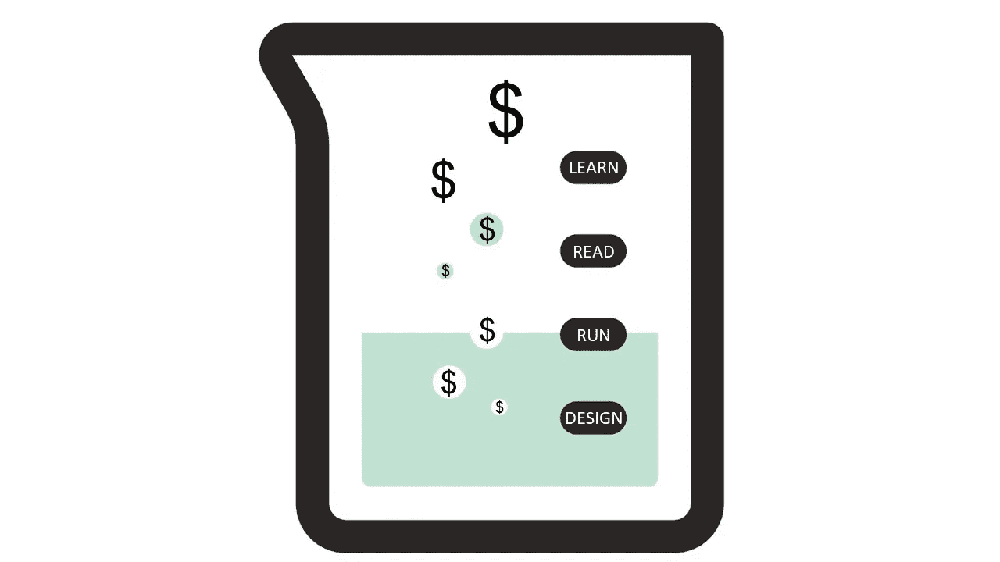

# 测试是不确定性的疫苗

> 原文：<https://towardsdatascience.com/testing-is-the-vaccine-for-uncertainty-341195fc270c?source=collection_archive---------94----------------------->

为什么测试和实验是成功商业成果的关键

*[*合著*](https://medium.com/swlh/the-modern-approach-to-uncertainty-2836945bba52) *与* [*尼克卡拉斯*](https://medium.com/u/9b22d21bb0aa?source=post_page-----341195fc270c--------------------------------)*

****

**商业实验是避免代价高昂的错误和做出有利可图的决策的关键。从[数据库时钟](https://commons.wikimedia.org/wiki/File:202002_Laboratory_instrument_beaker.svg)修改的图像。**

> **生命中只有三件事是确定的——死亡、税收和不确定性。**

**现实生活是不确定的。这是概率性的。如果你是执行决策者，你可能已经知道了。举个例子，让我们来比较一下重塑了美国和世界零售业的两个最具代表性的零售商:亚马逊和 JCPenney。当亚马逊每个季度都达到不可思议的高度时，JCPenney 却在破产的边缘苦苦挣扎。怎么会变成这样？早在 1994 年，JCPenney 不就是走在时代前列，成为第一批上线的零售商之一吗？然而，一旦灾难降临，他们就再也没有恢复过来。**

**这场“灾难”始于 2010 年至 2013 年间的一系列失误，当时 JCPenney 发起了一场大规模的品牌重塑活动[，同时改变了营销和折扣策略](https://www.businessinsider.com/jcpenney-dramatic-decline-history-photos-2019-5#johnson-got-to-work-radically-altering-the-business-in-a-series-of-moves-that-ultimately-and-irrevocably-alienated-jcpenneys-core-customer-base-11)。为赢得更多消费者而付出的努力最终却疏远了他们。你可以把责任归咎于很多决策，但在 10，000 英尺高空的情况更清楚:JCPenney 实施了巨大的变革，而且是一次实施很多变革，[没有在消费者身上进行测试](https://observer.com/2019/06/ron-johnscon-jc-penney-retail-guru/)。**

> **在没有任何测试或实验的情况下实施变革，就像拿你的企业玩俄罗斯轮盘赌。**

**像 JCPenney 这样的伟大王朝不是因为决策失误而灭亡的:他们是因为直到为时已晚才知道自己错了。在花大价钱彻底改变你的商业策略之前，为什么不验证一下你提议的改变在小范围内是否有效呢？给自己一个失败的机会。亚马逊的巨大成功不是因为他们从来没有错，而是因为他们建立了一种文化，这种文化促进了创新，并为失败提供了安全的空间。他们是怎么做到的？**

**关键在于测试和实验，这是世界上最成功的公司，如脸书、谷歌、亚马逊和微软已经根植于他们的文化中的东西。他们向一小部分用户展示他们的最新想法。这就是“测试”组。与此同时，他们保留了一组“控制”或“安慰剂”用户，他们还没有经历任何变化。这组人可能不会改变他们的行为，但如果他们这样做了，你可以肯定这不是因为测试。它们提供了一个“基线”,根据这个基线可以衡量“测试”组中任何行为变化的增量效果。**

**一次又一次，这些公司成功了，因为他们很快失败了，并转向了新的东西。如果你的“测试”组对任何变化都没有反应，并且继续表现出与“控制”组一致的行为，那么你失败的程度要小得多。然而，你可能在一个无论如何都不会起作用的改变上节省了数百万美元。**

> **“有对失败的恐惧，就会有失败。”乔治·S·巴顿将军**

**测试和实验一点都不新鲜。我们已经做了很多年了。一个很好的例子是进行临床试验，测试一种新药是否有效。直到最近，FAANG 公司才把这变成了一种商业哲学。为什么不呢？我们都知道他们是多么的成功。所以，我们不都应该开始做实验吗？什么会出错？**

**一个设计糟糕的测试会像不测试一样有效地毁掉你的生意。这是因为设计不良的测试会给出有偏见和不可靠的结果，提供误导性的信息，让你误以为是有用的见解。那我们如何拯救我们自己呢？正如任何批判性思考者会说的——提出问题！**

*   ****为什么**你要进行这个测试？变革的预期效果是什么？**
*   ****什么样的**指标能正确衡量变革的效果？**
*   **谁应该是你测试的一部分？**
*   **您的测试应该运行多长时间？**

# **为什么？**

**变革的**预期效果**是什么？你想获得更高的广告收入吗？或者，你只是想维持用户参与度？这不是一个数据科学或分析问题:这是商业战略。与您的首席执行官和关键决策者谈论他们关心的指标是什么，以及测试有一个目标。**

> **“如果你不知道要去哪里，你必须非常小心，因为你可能到不了那里。”—约吉·贝拉**

**你的“为什么”不需要总是关于未来。有时，您需要衡量刚刚发生的变化的效果。新冠肺炎一夜之间彻底改变了人们的消费习惯。从连锁杂货店、餐馆老板到服装零售商，每个人都只能眼睁睁地看着自己的企业要么被压垮，要么被摧毁。你无法挽回已经发生的事。然而，在新的现实中两个月后，你仍然可以从过去的事件中形成假设，用你所拥有的数据来测试它们，并利用你的发现来为未来做出明智的决定。**

# **什么？**

**什么应该是可测量的效果:一个你想要跟踪的**度量**。您可以收集许多参与度指标，但并非所有指标都与您的变更相关。如果你想测量用户保持率，那么你需要测量你的[日活跃、周活跃或月活跃](https://blog.popcornmetrics.com/5-user-engagement-metrics-for-growth/)指标。如果你想从广告中赚更多的钱，你最好测量一下你应用程序上广告印象的[点击率](https://support.google.com/google-ads/answer/2615875?hl=en)。**

**有一个清晰定义的“什么”也将帮助你磨练测试中重要的部分，并使它在决策中分析和使用更清晰。你没有做广告测试来发现你的客户是否在不同的时间登录你的网站。但是，不要过犹不及，目光短浅。您可能希望在进一步开展计划之前，看到测试对您的一些 KPI 的影响。**

# **谁啊。**

**最终，你对谁进行测试将对测试是否有用有很大的影响。需要记住业务和技术两方面的考虑，它们分为三类:**

*   **你的测试目标是什么类型的客户？**
*   **需要多大的样本量？**
*   **我应该如何划分测试和控制？**

**当你在考虑你的消费者时，你的目标应该是决定测试的范围，这样你可以得到更清晰和更有力的见解。您可以根据静态或行为属性对您的消费者进行细分。一个更小的有针对性的测试将证明比全面测试更可靠，即使是在你从未打算推出产品的领域。**

**心中有一个目标不仅对细分消费者很重要，对理解预期效果大小也很重要。一个更大的测试会给你更多的[统计能力](https://explorable.com/statistical-power-analysis)，让你可靠地测量一个更小的效果大小。请记住，您的测试越大，执行它的成本就越高。因此，您的样本大小应该由最小影响大小来决定，这个最小影响大小刚好足以让您可靠地测量变更的增量影响。**

**在某一点之后，真正重要的不是测试样本有多大，而是它对你的目标人群有多大的代表性。测试的黄金标准一直是[随机化](https://www.youtube.com/watch?time_continue=7&v=NElad0B7Iuk&feature=emb_logo)，但也有[更微妙的策略](https://www.ncbi.nlm.nih.gov/pmc/articles/PMC3136079/)可用。**

# **多久了？**

**我们都喜欢快速反馈。你的实验设计也应该如此。当您考虑您的测试应该运行多长时间时，您的目标应该是尽可能快地获得洞察力。你的实验进行得越久，代价就越大，要么是在一次糟糕的测试中推出更多的客户，要么是更快推出一个好主意的机会成本。幸运的是，我们有统计技术来帮助优化实验的长度。例如，您可以使用一种带有反馈循环的[多臂强盗](https://www.optimizely.com/optimization-glossary/multi-armed-bandit/)方法，该方法经常呈现有效的测试版本，并避免那些无效的版本。一旦你开始得到非常令人信服的结果，表明测试正在工作，你可以应用[有效停止](https://www.invespcro.com/blog/calculating-sample-size-for-an-ab-test/)测试。**

# **最后，我们学到了什么？**

> **"一个白痴讲的故事，充满了喧嚣和愤怒，却毫无意义！"——威廉·莎士比亚**

**用不朽的莎士比亚的话来说，有效的测试和实验都是关于“明天、明天、明天”的思考。你需要为你的公司想要做的事情建立一个长期的愿景，从而计划你的测试来开辟这条道路。为你的长期测试策略做计划，不仅包括基本的想法，还包括度量标准、样本大小和防止测试重叠。太多的公司要么不理解测试的价值，根本不做测试，要么他们疯狂地进行设计糟糕的测试，最终只是声音和愤怒，没有任何意义。确保你的测试意味着什么，并告诉你一个可操作的故事，你可以用它来指导业务。**