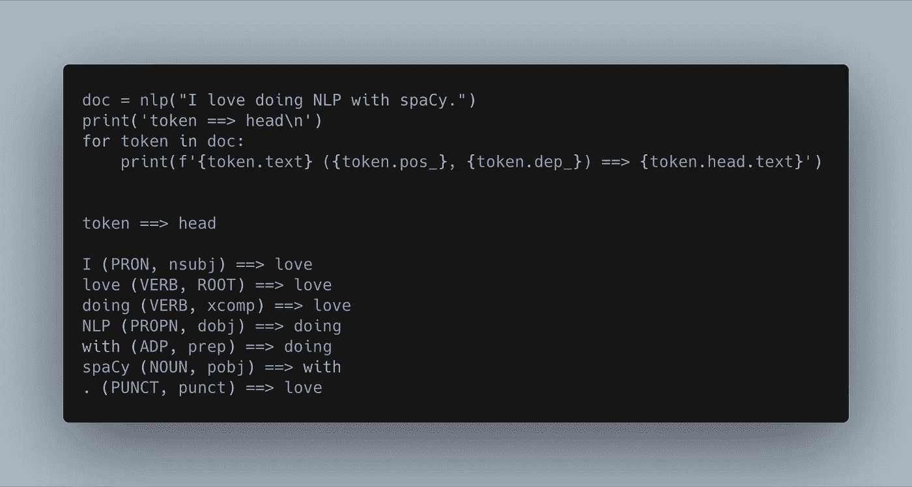
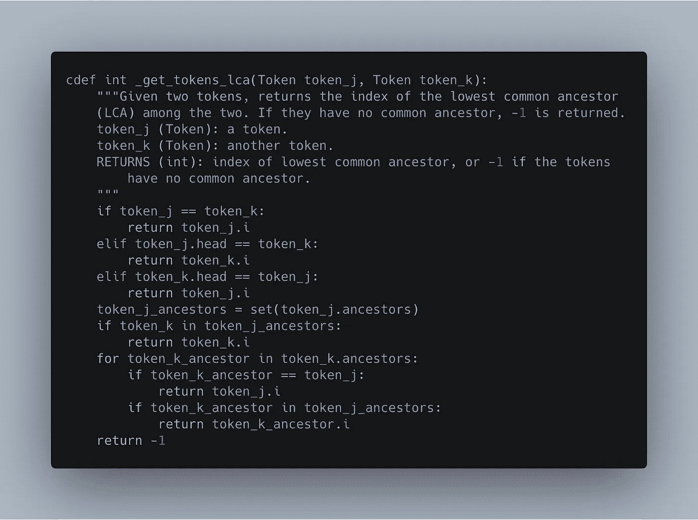

# 使用 Pytest、Cython 和 spaCy 测试、分析和优化 NLP 模型

> 原文：<https://towardsdatascience.com/testing-profiling-and-optimizing-nlp-models-with-pytest-cython-and-spacy-a78a8397f9f3?source=collection_archive---------17----------------------->

## 单元测试你的机器学习模型，剖析你的代码，充分利用 c 的自然语言处理速度。

## 目录:

*   [为什么您应该关注分析 NLP 模型](/testing-profiling-and-optimizing-nlp-models-with-pytest-cython-and-spacy-a78a8397f9f3#921a)
*   [为什么 spaCy 比 NLTK 快](/testing-profiling-and-optimizing-nlp-models-with-pytest-cython-and-spacy-a78a8397f9f3#6609)
*   [当你调用 nlp(doc)时，到底发生了什么？](/testing-profiling-and-optimizing-nlp-models-with-pytest-cython-and-spacy-a78a8397f9f3#4ce4)
*   [设置模型测试](/testing-profiling-and-optimizing-nlp-models-with-pytest-cython-and-spacy-a78a8397f9f3#1892)
*   [**判决结果:哪一方因速度而胜**](/testing-profiling-and-optimizing-nlp-models-with-pytest-cython-and-spacy-a78a8397f9f3#38bb)
*   [编写文本处理管道的最佳实践](/testing-profiling-and-optimizing-nlp-models-with-pytest-cython-and-spacy-a78a8397f9f3#8b36)
*   [NLP 优化的建议工作流程](/testing-profiling-and-optimizing-nlp-models-with-pytest-cython-and-spacy-a78a8397f9f3#647d)
*   [资源和代码库](/testing-profiling-and-optimizing-nlp-models-with-pytest-cython-and-spacy-a78a8397f9f3#373e)

我读了一篇博文[声称已经为自然语言数据预处理分析了 spaCy 和 NLTK，并且发现 NLTK 要快得多。](https://tahirnaeem.net/performance-comparison-of-nlp-libraries-in-text-tokenization)

嗯(通过 [giphy](https://giphy.com/gifs/latelateshow-what-confused-5t9wJjyHAOxvnxcPNk) ，@ TheLateShow)

什么？

NLTK 是自然语言处理工具包中的吉普大切诺基:它很大，已经存在很长时间了，它有很大的动力，但它很慢，很费油。

SpaCy 是兰博基尼 Aventador。它可能不是一个有着所有花里胡哨的坦克，但它很光滑，只剩下裸露的金属。它做什么，它就做*快*。它的高马力也带来了风险(和乐趣),即在蜿蜒的道路上加速转弯时转弯过猛，偏离道路。

这个，但是用向量(via [giphy](https://giphy.com/gifs/3ohc1eTesPXxSRVwNq/html5) ，@ thegrandtour)

所以，这个说法让我觉得很奇怪:

> Spacy 比 NLTK 慢多了。NLTK 只用了 2 秒钟就标记了 7 MB 的文本样本，而 Spacy 用了 3 分钟！

如果您正确地编写了管道，并且您的硬件有足够的内存，这是不可能发生的。

# **我为什么要关心？**

我主要从事研究工程——我的工作是制作模型，而不是构建软件架构。那么，如果你只想构建聊天机器人和搜索引擎，为什么要关心你的代码性能呢？

如果你对构建数据的最佳模型感兴趣，你不能脱离代码质量来考虑机器学习模型。

*   大规模的 NLP 语料库意味着，除非你尝试在空间和时间上优化你的代码，否则你将在算法和工具上受到限制。
*   不写测试意味着你不知道什么变化导致了什么错误——或者更糟，在你的实体模型中可能有你甚至没有意识到的问题，并且永远不会发现。(你是否曾经编写了一个 ML 函数或类，却发现它从未被调用过？)
*   理解您正在使用的库不仅对代码性能至关重要，而且对深入理解您正在构建的模型的实质也很重要。你将加速你的知识从简单的导入 scikit-learn 和装配一个估计器到真正的搜索支持 NLP 的算法。
*   良好的测试和深思熟虑的代码对于可重复的研究至关重要。
*   如果你是为了生产而写代码，而不仅仅是为了学术目的，你绝对需要考虑它在现实世界中如何运行。

# 为什么 spaCy 这么快？

SpaCy 的喷漆工作是 Python，但引擎是 Cython。 [Cython](https://cython.org) 就像一种克里奥尔语言——一部分是 Python，一部分是 c。它是 Python 的超集(所有有效的 Python 都是有效的 Cython)，但它包含了来自 c 的更快、更复杂的特性

对于某些用例，Cython 是一个很好的速度提升工具——例如，计算大量数字结果，其结果取决于一系列 if 语句。通常你会使用 numpy 来加速计算，但是 numpy 擅长于*矢量化*代码——对每个元素做同样的事情。当我们想要对每个元素做不同的事情时，Cython 允许我们使用相同的 c 优化，但是增加了逻辑复杂性。

SpaCy 广泛使用了开箱即用的 cythonization，与许多其他 Python 库相比，它是一个非常快速的 NLP 框架。

# 不理解你的算法的陷阱

让我们回到那个认为 spaCy 比 NLTK 慢的博客。

当我使用 line_profiler 在相同的文档上运行我的 NLTK 和 spaCy 文本清理器版本时，采用了苹果对苹果的比较， **NLTK 花了 spaCy 5.5 倍的时间来做基本上相似的工作。**

> TL；DR: NLTK 在相同数据上的可比 NLP 管道中使用时比 spaCy 慢 5.5 倍。

我的代码有什么不同？首先，我从里到外研究了这些系统的架构，包括:

*   他们在做什么工作，什么时候做
*   他们期望并返回什么数据类型
*   功能的控制流

为了进行有意义的比较，您需要知道 spaCy 在被引用的代码中比 NLTK 做了更多的 *lot* 。默认情况下，spaCy 管道包括标记化、词汇化、词性标注、依存解析和命名实体识别。每次您调用`nlp(doc)`时，它都会完成所有这些(甚至更多)。

spaCy 的词性标注和依存解析功能示例

相比之下，NLTK(在引用的代码中)只是*标记和小写的语料库。*

将这两条管道进行对比是荒谬的。

我们需要一个更好的框架:

*   我暂时禁用了 spaCy 管道中的依赖解析和命名实体识别，因为 NLTK 不做这些事情。
*   我让 NLTK 做了词性标注和词汇化，让它更接近 spaCy 的性能。

这仍然不是完美的一对一比较，但已经非常接近了。

## 两个麻雀的故事

我写了两个版本的 spaCy pipeline，来反映我是如何看到人们在野外使用`nlp.pipe`的。第一个是`list(nlp.pipe(docs))`。第二种更有效的方法是使用`nlp.pipe(docs)`作为生成器对象。

 [## lorarjohns/nlp_profiling

### 用于相互比较管道的脚本。

github.com](https://github.com/lorarjohns/nlp_profiling/blob/master/scripts/profiling_spacy.py) 

这种区别很重要，因为与 Python 列表不同，[生成器对象](https://realpython.com/introduction-to-python-generators/)不会同时在内存中保存整个语料库。这意味着您可以迭代地修改、提取或写入数据库的内容。在 NLP 中，这种情况经常出现，因为语料库通常非常大——大到无法一次保存在内存中。

## 结论是什么？

cProfile(戏剧化)(通过 [giphy](https://giphy.com/gifs/iJDLBX5GY8niCpZYkR/html5) ，@ f1)

在同一个 Reddit 语料库(n=15000)上测试我的三个管道(使用 NLTK、spaCy-as-list 和 spaCy-as-generator)，下面是 line_profiler 的结果:

*   列表空间:总时间= 64.260 秒
*   发电机空间:总时间= 60.356 秒
*   NLTK:总时间= 334.677 秒

 [## lorarjohns/nlp_profiling

分析的结果可以在这里以*_reddit_2.txt 的形式找到](https://github.com/lorarjohns/nlp_profiling/tree/master/profiling) 

> 使用 spaCy，甚至不用编写自己的 Cython，就可以将代码速度提高 5 倍以上。

这是有道理的——NLTK 没有用 Cython 进行优化，当它标记和 lemmatizes 令牌时，它使用了比 spaCy 更耗时的操作。

# 编写文本预处理管道的最好方法是什么？

与任何代码一样，如果你不理解 spaCy *的数据结构以及如何负责任地使用它们，spaCy*将会变得很慢。**

*阅读源代码。* SpaCy 依靠两个主要的东西来快速运行:Cython 的 c 内核和 Python 生成器。因此，它使用复杂的类和数据管道，这意味着它的对象的类型和方法并不总是显而易见的。

例如，当您在文本上调用`nlp`来获取[一个 Doc 对象](https://github.com/explosion/spaCy/blob/master/spacy/tokens/doc.pyx)时，spaCy 会生成 c 代码来处理您的数据。虽然您可以使用括号符号等普通命令进行索引以与结果文档进行交互，但它们的工作方式与基本 Python 不同。更确切地说，Doc 类重载了 Python 操作符，让您可以像与 Python 对象一样与结构进行交互。

Doc 类中的一个 c 函数

真正了解这一点的唯一方法是阅读源代码。文档不会为你解释清楚。除了通过 Spacy 教程学习 [*高级 NLP 之外，没有其他方法可以真正掌握诀窍。*](https://course.spacy.io/)

轻松阅读源代码将极大地提高您的编程素养和数据管道。

*有计划。在开始编写之前，确保你已经用涂鸦和伪代码概述了管道的步骤。有一个深思熟虑的计划将帮助你思考如何最好地将不同的功能联系在一起。您将看到数据的效率，将函数和变量组合在一起以加快速度的方法，以及如何转换数据以方便流动。*

# 自然语言处理优化的工作流程

1.  **解决问题不考虑最优性。让它工作起来。**
2.  在你开始改变你的代码之前，准备好工作测试。拥有测试意味着你可以改变架构的重要部分，而不用担心引入新的神秘错误。测试并不是很多数据科学家预先考虑的事情，而且考虑如何为 NLP 机器学习模型编写测试并不总是容易的。但是至少在数据预处理方面，它们可以帮助您避免预处理不好的文本的“垃圾输入，垃圾输出”现象。一些例子包括:

*   *为你的正则表达式*(例如，你用来标记句子的表达式)编写单元测试，确保它们只匹配你想要的
*   检查你的函数是否返回正确的数据类型。返回值应该是数字数组、字典、字符串、列表还是列表列表？测试一下。
*   *检查你所有的类和函数是否真的按照你想要的方式被调用。*发现重要的嵌入模型或特征工程组件得到了错误的输入(或者更糟，根本没有被调用)一点都不好玩。

但是，在开始 cythonizing 之前，请确保您已经剖析了代码并清理了 Python。甚至像 gensim 这样的纯 Python 库也可以非常快，而且内存效率高，因为它们严格地收紧了数据结构和管道。

1.  **持续地、可重复地测量代码的速度和性能。你需要一个基线来知道你是否在改善(或者让事情变得更糟)。[行分析器](https://github.com/rkern/line_profiler)、 [cProfile](https://docs.python.org/2/library/profile.html) 和 [py-spy](https://github.com/benfred/py-spy) 都会生成记录脚本性能的文件，您可以阅读、引用和比较这些文件。**
2.  确保你使用了正确的数据结构和函数调用。在你确定你的 Python 已经尽可能快之前，不要为 Cython 费心。有时候，Cython 并不是合适的工具，对 Python 代码的微小修改会比 cythonization 产生更大的改进。正如我们所见，用列表替换生成器是一个简单的瓶颈修复方法。
3.  **检查你的函数的控制流。**逐行分析器在这里真的很有帮助。在编写比较时，我注意到 line_profiler 说我的 spaCy 函数在文本清理函数的 NLTK 部分花费了时间。我已经编写了代码，以便在我检查`spacy=True`参数是真还是假之前定义只与 NLTK 相关的内部函数。将该代码移动到 if-else 语句的 NLTK 部分中，可以阻止我的 spacy 模型每次都运行该(不相关的)代码块。
4.  编写好的测试。考虑你的函数需要产生什么样的输出来通过你的测试，几乎会迫使你自动去做 1-3。

 [## lorarjohns/nlp_profiling

### 使用 pytest 对管道进行的一些测试

github.com](https://github.com/lorarjohns/nlp_profiling/blob/master/scripts/test_profiling_spacy.py) 

# 更好的代码，更好的科学

以这种方式思考需要对您的模型进行更多的架构设计，但是为了避免等待半个小时来处理您的文档，这是值得的。花时间仔细考虑模型的逻辑结构，编写测试，并思考分析器的输出，以避免以即时满足的名义进行草率的科学研究。任何人都可以制造一袋单词；NLP 的精妙之处在于细节工作。

# **资源:**

*   [我对这篇博文](https://github.com/lorarjohns/nlp_profiling)的完整回购，附带理解 spaCy 内部结构和编写自己的 Cython 的额外代码

 [## lorarjohns/nlp_profiling

github.com](https://github.com/lorarjohns/nlp_profiling) 

*   [*带空间的高级 NLP*](https://course.spacy.io/)，官方空间教程
*   [NLTK](http://nltk.org)
*   [空间](https://spacy.io) ( [源代码](https://github.com/explosion/spaCy/blob/master/spacy))
*   [pytest](https://docs.pytest.org/en/latest/getting-started.html)
*   [线路剖析器](https://github.com/rkern/line_profiler)、 [cProfile](https://docs.python.org/2/library/profile.html) 和 [py-spy](https://github.com/benfred/py-spy)
*   Python [生成器对象](https://realpython.com/introduction-to-python-generators/)教程
*   [Cython](https://cython.org)