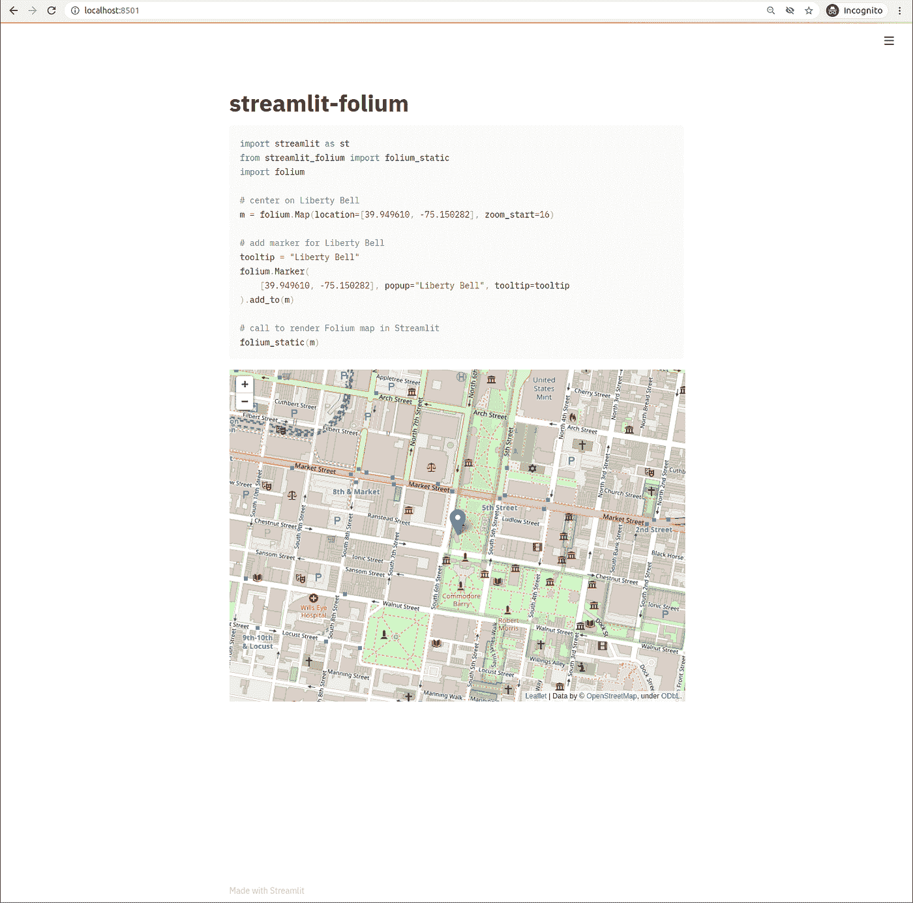
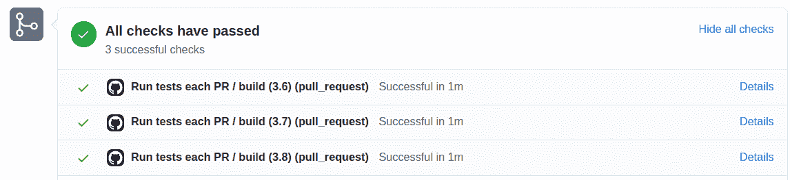

# 使用 SeleniumBase 测试简化应用

> 原文：<https://towardsdatascience.com/testing-streamlit-apps-using-seleniumbase-f5b34c0d1423?source=collection_archive---------46----------------------->

在我为 Streamlit 工作的这段时间里，我见过数百款令人印象深刻的数据应用，从计算机视觉应用到公共卫生[新冠肺炎](https://discuss.streamlit.io/t/data-apps-regarding-covid-19/2203)的追踪，甚至是简单的[儿童游戏](https://joelgrus.com/2020/10/02/creating-games-in-streamlit/)。我相信 Streamlit 越来越受欢迎的原因是通过 [Streamlit“魔法”](https://docs.streamlit.io/en/stable/api.html?highlight=magic#magic-commands)功能和保存 Python 脚本时自动重新加载前端的快速迭代工作流。编写一些代码，在编辑器中点击“保存”，然后直观地检查每个代码更改的正确性。随着用于简化部署 Streamlit 应用程序的 [Streamlit sharing](https://www.streamlit.io/sharing) 的推出，您可以在几分钟内从构思到编码再到部署您的应用程序！

一旦您创建了一个 Streamlit 应用程序，您就可以使用自动化测试来保证它不会出现倒退。在这篇文章中，我将展示如何使用 Python 包 [SeleniumBase](https://seleniumbase.io/) 以编程方式验证 Streamlit 应用程序在视觉上没有改变。

# 案例研究:细流叶

streamlit-flour 测试应用程序的基准图像(作者提供的图像/截图)

为了演示如何创建自动化的可视化测试，我将使用[streamlit-leave GitHub repo](https://github.com/randyzwitch/streamlit-folium)，这是我为 leave . js 的[leave Python 库创建的 Streamlit 组件。](https://python-visualization.github.io/folium/)[视觉回归测试](https://baseweb.design/blog/visual-regression-testing/)有助于检测应用的布局或内容何时发生变化，而不需要开发人员在其 Python 库中每次代码行发生变化时手动视觉检查输出。视觉回归测试还有助于提高您的 Streamlit 应用程序的跨浏览器兼容性，并提供有关影响应用程序显示方式的新浏览器版本的高级警告。

# 设置测试工具

streamlit-follow 测试工具有三个文件:

*   `[tests/requirements.txt](https://github.com/randyzwitch/streamlit-folium/blob/master/tests/requirements.txt)`:测试只需要 Python 包
*   `[tests/app_to_test.py](https://github.com/randyzwitch/streamlit-folium/blob/master/tests/app_to_test.py)`:参考要测试的 Streamlit 应用
*   `[tests/test_package.py](https://github.com/randyzwitch/streamlit-folium/blob/master/tests/test_package.py)`:演示包按预期工作的测试

第一步是使用要测试的包创建一个 Streamlit 应用程序，并使用它来设置基线。然后，我们可以使用 SeleniumBase 来验证应用程序的结构和视觉外观相对于基线保持不变。

这篇文章的重点是描述`test_package.py`,因为它是涵盖如何使用 SeleniumBase 和 OpenCV 进行 Streamlit 测试的文件。

# 定义测试成功

从测试的角度来看，有几种方法可以思考什么构成了看起来相同的。我选择了以下三个原则来测试我的 streamlit-leav 包:

1.  页面的[文档对象模型(DOM)结构](https://developer.mozilla.org/en-US/docs/Web/API/Document_Object_Model/Introduction)(但不一定是值)应该保持不变
2.  对于标题等值，测试这些值是否完全相等
3.  视觉上，应用程序应该看起来一样

我决定采用这些不太严格的“未更改”定义来测试 streamlit-follow，因为 follow 包本身的内部似乎是不确定的。这意味着，相同的 Python 代码将创建相同的*外观的*图像，但是生成的 HTML 将会不同。

# 使用硒基测试

SeleniumBase 是用 Python 编写的一体化框架，它包装了用于浏览器自动化的 [Selenium WebDriver](https://www.selenium.dev/) 项目。SeleniumBase 有两个函数可以用于上面列出的第一个和第二个测试原则: [check_window](https://seleniumbase.io/examples/visual_testing/ReadMe/#automated-visual-regression-testing) ，它测试 DOM 结构和 [assert_text](https://seleniumbase.io/help_docs/method_summary/) ，以确保页面上显示特定的一段文本。

为了检查 DOM 结构，我们首先需要一个基线，我们可以使用`check_window`函数生成这个基线。根据所需的`name`参数，`check_window`有两种行为:

*   如果在`visual_baseline/<Python file>.<test function name>`路径中不存在文件夹<**名称>** 的话，这个文件夹将由所有的基线文件创建
*   如果文件夹*确实存在*，那么 SeleniumBase 将按照指定的精度级别将当前页面与基线进行比较

您可以在 streamlit-leav repo 中看到一个调用 [check_window](https://github.com/randyzwitch/streamlit-folium/blob/master/tests/test_package.py#L19) 和结果[基线文件](https://github.com/randyzwitch/streamlit-folium/tree/master/tests/visual_baseline/test_package.test_basic/first_test)的示例。为了在两次运行之间保持基线不变，我将这些文件提交给了 repo 如果我要对我正在测试的应用程序(`app_to_test.py`)进行任何实质性的更改，我需要记住设置新的基线，否则测试将会失败。

基线文件夹现在已经存在，运行 check_window 将运行比较测试。我选择在**级别 2** 运行测试，级别定义如下:

*   **级别 1(最不严格)** : HTML 标签与 [tags_level1.txt](https://github.com/randyzwitch/streamlit-folium/blob/master/tests/visual_baseline/test_package.test_basic/first_test/tags_level_1.txt) 进行比较
*   **级别 2** : HTML 标签和属性名与[标签 _ 级别 2.txt](https://github.com/randyzwitch/streamlit-folium/blob/master/tests/visual_baseline/test_package.test_basic/first_test/tags_level_2.txt) 进行比较
*   **第三级(最严格)** : HTML 标签、属性名和属性值与 [tags_level3.txt](https://github.com/randyzwitch/streamlit-folium/blob/master/tests/visual_baseline/test_package.test_basic/first_test/tags_level_3.txt) 进行比较

正如在“定义测试成功”一节中提到的，我在第 2 级运行了`check_window`函数，因为 follow 库向 HTML 中的属性值添加了一个类似 GUID 的 ID 值，所以测试永远不会在第 3 级通过，因为属性值在运行之间总是不同的。

对于第二个测试原则(“检查某些值是否相等”)，使用`assert_text`方法非常容易:

`self.assert_text("streamlit-folium")`

该函数检查应用程序中是否存在准确的文本“streamlit-follow ”,测试通过，因为在本例中这是 H1 标题的值。

# 使用 OpenCV 进行测试

虽然检查 DOM 结构和一段文本的存在提供了一些有用的信息，但我真正的接受标准是应用程序的视觉外观不会从基线改变。为了测试应用的视觉效果是否与像素相同，我们可以使用 SeleniumBase 的`save_screenshot`方法来捕捉应用的当前视觉状态，并使用 OpenCV 包与基线进行比较:

使用 OpenCV，第一步是读入基线图像和当前快照，然后比较图片的大小是否相同(`shape`比较检查像素的 NumPy ndarrays 是否具有相同的尺寸)。假设图片大小相同，我们可以使用 OpenCV 中的`subtract`函数来计算每个通道(蓝色、绿色和红色)像素之间的差异。如果所有三个通道没有差异，那么我们知道 Streamlit 应用程序的视觉表示在运行之间是相同的。

# 使用 GitHub 动作自动化测试

随着我们的 SeleniumBase 和 OpenCV 代码的设置，我们现在可以自由地对我们的 Streamlit 组件(或其他 Streamlit 应用程序)进行更改，而不用担心意外中断。在我的单贡献者项目中，很容易在本地强制运行测试，但是有了开源项目免费提供的工具，如[GitHub Actions](https://github.blog/2019-08-08-github-actions-now-supports-ci-cd/)，建立一个[持续集成管道](https://www.infoworld.com/article/3271126/what-is-cicd-continuous-integration-and-continuous-delivery-explained.html)保证了每次提交都运行测试。

streamlit-leav 定义了一个工作流程`[run_tests_each_PR.yml](https://github.com/randyzwitch/streamlit-folium/blob/master/.github/workflows/run_tests_each_PR.yml)`,执行以下操作:

*   为 Python 3.6、3.7、3.8 建立一个[测试矩阵](https://github.com/randyzwitch/streamlit-folium/blob/master/.github/workflows/run_tests_each_PR.yml#L18)
*   安装[包依赖关系](https://github.com/randyzwitch/streamlit-folium/blob/master/.github/workflows/run_tests_each_PR.yml#L30)和[测试依赖关系](https://github.com/randyzwitch/streamlit-folium/blob/master/.github/workflows/run_tests_each_PR.yml#L31)
*   将代码用薄片 8 标记
*   [用硒鼓安装铬合金](https://github.com/randyzwitch/streamlit-folium/blob/master/.github/workflows/run_tests_each_PR.yml#L40)
*   [运行 Streamlit app](https://github.com/randyzwitch/streamlit-folium/blob/master/.github/workflows/run_tests_each_PR.yml#L43) 进行后台测试
*   在 Python 中运行 [SeleniumBase 和 OpenCV 测试](https://github.com/randyzwitch/streamlit-folium/blob/master/.github/workflows/run_tests_each_PR.yml#L46)

通过在 repo 中定义这个工作流，并在 GitHub 上启用[所需的状态检查，现在每个 pull 请求都会在底部附加以下状态检查，让您知道您的更改的状态:](https://docs.github.com/en/github/administering-a-repository/enabling-required-status-checks)

合并前 GitHub 运行的检查(图片/作者截图)

# 从长远来看，编写测试可以节省工作

在代码库中进行测试有很多好处。如上所述，自动化视觉回归测试允许你维护一个应用程序，而不需要一个人在循环中寻找变化。编写测试对潜在用户来说也是一个很好的信号，表明你关心项目的稳定性和长期可维护性。为 Streamlit 应用程序编写测试并让它们在每次 GitHub 提交时自动运行不仅容易，而且从长远来看，向 Streamlit 项目添加测试的额外工作将节省您的时间。

*对本文或 Streamlit 有任何疑问吗？驻足于* [*Streamlit 社区论坛*](https://discuss.streamlit.io/) *，展开讨论，结识其他 Streamlit 爱好者，在* [*Streamlit 组件跟踪器*](https://discuss.streamlit.io/t/streamlit-components-community-tracker/4634) *或* [*中找到合作者，分享你的 Streamlit 项目*](https://discuss.streamlit.io/c/streamlit-examples/9) *！有很多方法可以加入 Streamlit 社区，我们期待着您的到来🎈*

*原载于 2020 年 11 月 13 日*[*https://blog . streamlit . io*](https://blog.streamlit.io/testing-streamlit-apps-using-seleniumbase/)*。*