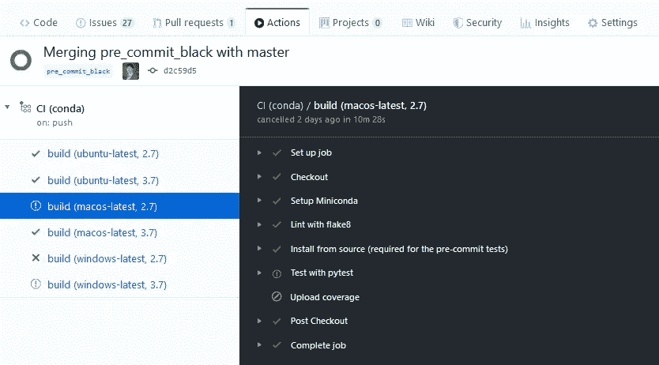

# 用 GitHub 动作测试您的 Python 项目

> 原文：<https://towardsdatascience.com/testing-your-python-project-with-github-actions-ec9bf82b20dc?source=collection_archive---------56----------------------->

几天前，我第一次在我的一个项目中使用 GitHub Actions。总的来说，结果是非常积极的，但也有一些工作要做。希望这篇文章能帮助你以更低的成本做到这一点！

# 激活 GitHub 动作

在项目的根目录下创建一个`.github/workflows`目录:

```
mkdir -p .github/workflows
```

在该目录中，用您选择名称创建一个或多个 YAML 文件。

在我的例子中，我创建了两个文件:

*   `[continuous-integration-pip.yml](https://github.com/mwouts/jupytext/blob/master/.github/workflows/continuous-integration-pip.yml)`，以及
*   `[continuous-integration-conda.yml](https://github.com/mwouts/jupytext/blob/master/.github/workflows/continuous-integration-conda.yml)`。

# 命名您的行动

在 YAML 文件的顶部，我们有这个字段:`name: CI (pip)`。虽然 YAML 文件的名称似乎没有任何影响，但文件顶部的`name`字段是出现在您的[操作选项卡](https://github.com/mwouts/jupytext/actions)中的字段，也是您将在工卡上看到的名称:


使用`on`字段，您可以选择哪些事件应该触发一个动作。我最初尝试了`on: [push, pull_request]`，但是我很快就感觉触发了太多的构建。现在我使用`on: [push]`，这似乎就足够了。这样，当贡献者的一个提交破坏了配置项时，他们会收到一封电子邮件，因此他们可以在打开拉请求之前修复问题。使用`on: [push]`,您已经在 pull 请求中获得了状态更新:


几分钟后:


# 测试 Python 的多个变体

Python 代码是可移植的，但实际上，我更喜欢在各种平台上测试我的代码。

在我的项目中，我想测试

*   Python 环境使用`pip`和`conda`构建
*   Python 版本 2.7、3.5、3.6、3.7 和 3.8
*   Linux、Mac OS 或 Windows 上的 Python。

注意，我不需要测试完整的矩阵(30 个作业)。如果我在所有可能的操作系统(11 个作业)上测试了 pip 和 Linux 的所有 Python 版本，以及 conda 的 Python 2.7 和 3.7，那么我已经可以确信我的程序将在几乎所有地方工作。

先说`pip`，超级容易设置。这里是我的`[continuous-integration-pip.yml](https://github.com/mwouts/jupytext/blob/master/.github/workflows/continuous-integration-pip.yml)`文件的摘录，显示:

*   如何使用`actions/checkout@v2`查看 GitHub 库
*   如何在`python-version: ${{ matrix.python-version }}`参数化的版本中用`actions/setup-python@v1`安装 Python
*   如何从项目的`requirements.txt`和`requirements-dev.txt`文件安装包
*   如何安装可选依赖项

```
name: CI (pip)
on: [push]

jobs:
  build:
    strategy:
      matrix:
        python-version: [2.7, 3.5, 3.6, 3.7, 3.8]
    runs-on: ubuntu-latest
    steps:
      - name: Checkout
        uses: actions/checkout@v2
      - name: Set up Python ${{ matrix.python-version }}
        uses: actions/setup-python@v1
        with:
          python-version: ${{ matrix.python-version }}
      - name: Install dependencies
        run: |
          python -m pip install --upgrade pip
          pip install -r requirements.txt
          pip install -r requirements-dev.txt
          # install black if available (Python 3.6 and above)
          pip install black || true
```

现在我们前往`conda`。我的`[continuous-integration-conda.yml](https://github.com/mwouts/jupytext/blob/master/.github/workflows/continuous-integration-conda.yml)`文件摘录显示:

*   如何用`actions/checkout@v2`检查你的 GitHub 库
*   如何在 Ubuntu (Linux)、Mac OS、Windows 中选择操作系统
*   如何用`goanpeca/setup-miniconda@v1`安装 Miniconda，用`python-version: ${{ matrix.python-version }}`参数化的 Python 版本
*   如何从`[environment.yml](https://github.com/mwouts/jupytext/blob/master/environment.yml)` [文件](https://github.com/mwouts/jupytext/blob/master/environment.yml)创建 conda 环境
*   以及如何激活相应的环境

```
name: CI (conda)
on: [push]

jobs:
  build:
    strategy:
      matrix:
        os: ['ubuntu-latest', 'macos-latest', 'windows-latest']
        python-version: [2.7, 3.7]
    runs-on: ${{ matrix.os }}
    steps:
      - name: Checkout
        uses: actions/checkout@v2
      - name: Setup Miniconda
        uses: goanpeca/setup-miniconda@v1
        with:
          auto-update-conda: true
          auto-activate-base: false
          miniconda-version: 'latest'
          python-version: ${{ matrix.python-version }}
          environment-file: environment.yml
          activate-environment: jupytext-dev
```

# 代码质量

在运行任何测试之前，确保所有代码都是有效的是一个好主意，我用`flake8`做到了这一点。

我的`[continuous-integration-pip.yml](https://github.com/mwouts/jupytext/blob/master/.github/workflows/continuous-integration-pip.yml)`文件中对应的步骤是

```
 - name: Lint with flake8
        run: |
          # stop the build if there are Python syntax errors or undefined names
          flake8 . --count --select=E9,F63,F7,F82 --show-source --statistics
          # all Python files should follow PEP8 (except some notebooks, see setup.cfg)
          flake8 jupytext tests
          # exit-zero treats all errors as warnings.  The GitHub editor is 127 chars wide
          flake8 . --count --exit-zero --max-complexity=10 --statistics
```

在`[continuous-integration-conda.yml](https://github.com/mwouts/jupytext/blob/master/.github/workflows/continuous-integration-conda.yml)`中，需要一个额外的`shell`参数。我第一次尝试`shell: pwsh` (PowerShell)，效果不错，所以我现在在用

```
 - name: Lint with flake8
        shell: pwsh
        run: |
          # stop the build if there are Python syntax errors or undefined names
          flake8 . --count --select=E9,F63,F7,F82 --show-source --statistics
          # all Python files should follow PEP8 (except some notebooks, see setup.cfg)
          flake8 jupytext tests
          # exit-zero treats all errors as warnings.  The GitHub editor is 127 chars wide
          flake8 . --count --exit-zero --max-complexity=10 --statistics
```

# 了解 CI 错误

我最初对`flake8`步骤有疑问。错误是:

```
Lint with flake8
4s
##[error]Process completed with exit code 2.
Run # stop the build if there are Python syntax errors or undefined names
  # stop the build if there are Python syntax errors or undefined names
  flake8 . --count --select=E9,F63,F7,F82 --show-source --statistics
  all Python files should follow PEP8 (except some notebooks, see setup.cfg)
  flake8 jupytext tests
  # exit-zero treats all errors as warnings.  The GitHub editor is 127 chars wide
  flake8 . --count --exit-zero --max-complexity=10 --statistics
  shell: /bin/bash -e {0}
  env:
    pythonLocation: /opt/hostedtoolcache/Python/3.6.10/x64
0
/home/runner/work/_temp/98d1db20-f0af-4eba-af95-cb39421c77b0.sh: line 3: syntax error near unexpected token `('
##[error]Process completed with exit code 2.
```

我的理解是，`/home/runner/work/_temp/98d1db20-f0af-4eba-af95-cb39421c77b0.sh`是一个临时脚本，包含该步骤的命令。所以当我们被告知脚本抛出这个错误:*第 3 行:意外标记`(*)附近的语法错误时，我们应该看看那个步骤的`run`属性的第三行。在我的命令中，那是*所有的 Python 文件都应该遵循 PEP8(除了一些笔记本，见 setup.cfg)* ，而且确实是少了一个注释 char！

# 运行 Pytest

一旦我们确信代码在语法上是正确的，我们就想知道是否所有的单元测试都通过了。相应的步骤是:

```
 - name: Test with pytest
        run: coverage run --source=. -m py.test
```

注意，我使用`coverage run --source=. -m py.test`而不仅仅是`pytest`，因为我也想知道代码覆盖率。还有，对于 conda 文件，我们需要添加一个`shell: pwsh`属性，否则找不到`coverage`或者`pytest`命令。

# 上传覆盖范围

在配置项中计算覆盖率是很好的，但是在拉请求中更新覆盖率，并在自述文件中显示覆盖率标记就更好了。为此，我使用 [codecov](https://codecov.io/) 。我更喜欢只上传 conda CI 的覆盖率，因为它让我可以测试更多的可选功能。覆盖率上传步骤是`[continuous-integration-conda.yml](https://github.com/mwouts/jupytext/blob/master/.github/workflows/continuous-integration-conda.yml)`中的最后一步:

```
 - name: Upload coverage
        shell: pwsh
        run: coverage report -m
```

有了这个，我就有了保险徽章

我可以添加到我的[自述文件](https://github.com/mwouts/jupytext/blob/master/README.md)中，详细的覆盖率统计数据和图表在 [codecov.io](https://codecov.io/gh/mwouts/jupytext/branch/master) 中，以及拉请求中的覆盖率报告:


# 自动化作业取消

一开始让我感到惊讶，但很有意义的一个特性是自动作业取消。当 CI 中的一个作业失败时，所有其他仍在运行或挂起的作业都会被取消。

下面是我的项目中的一个例子——Windows 版本出现了一个问题，导致剩余的 Windows 和 Mac OS 作业被取消:



# 与 Travis-CI 的差异

在发现 GitHub 动作之前，我使用的是 [Travis-CI](https://travis-ci.com) 。我喜欢它！我在许多项目中使用过 Travis-CI，包括这个[奇特的项目](https://github.com/CFMTech/jupytext_papermill_post)，在那里我们[测试…自述文件本身](https://github.com/CFMTech/jupytext_papermill_post/blob/master/.travis.yml)！

现在，我将以两者之间的简单比较来结束我的发言。

*   特拉维斯. CI 在那里的时间要长得多。我可能担心 GitHub 操作的文档会更难找到，但事实并非如此。有用的参考有:[使用 Python 和 GitHub 动作](https://help.github.com/en/actions/language-and-framework-guides/using-python-with-github-actions)和[设置 Miniconda](https://github.com/marketplace/actions/setup-miniconda) 。
*   就像 Travis-CI 一样，Github Actions 可以免费用于公共项目。
*   GitHub 集成对于 Travis-CI 和 GitHub 操作来说都非常出色，尽管这些操作在项目页面上有一个专用的选项卡，这使得访问 CI 更加容易。
*   用 Github 动作配置 conda 比用 Travis-CI 更简单，为此我使用了[这个 hack](https://github.com/mwouts/jupytext/blob/509e09ab6e0b72afe56f2cf4cbe0526e3ab981c4/.travis.yml#L17-L36) 。
*   我发现这个矩阵(比如 Python 版本乘以 OS，比如这里的)在 Github 动作上使用起来更简单。
*   我没有注意到工作持续时间的显著差异。在我的示例 PR 中，Travis-CI 上的六个作业(pip 和 conda，仅 Linux)在 [8m 33s](https://travis-ci.com/github/mwouts/jupytext/builds/160045470) 中运行，而在 GitHub Actions 上，第一系列的五个 pip 作业(仅 Linux)在 [4m 57s](https://github.com/mwouts/jupytext/actions/runs/77140156) 中运行，而其他系列的六个 conda 作业(Linux、Mac OS、Windows)在 [12m 48s](https://github.com/mwouts/jupytext/actions/runs/77140151) 中并行运行——因此，在该示例中，GitHub Actions 花费了 50%的时间，但也覆盖了更多的数量

感谢你阅读这篇文章！如果你想了解更多，可以看看我在 [Medium](https://medium.com/@marc.wouts) 上的其他帖子，在 [GitHub](https://github.com/mwouts/) 上我的开源项目，或者在 [Twitter](https://twitter.com/marcwouts) 上关注我。此外，如果您有在其他环境中使用 GitHub 操作的经验，例如，如果您知道如何在线发布文档，请在此处发表评论让我们知道，或者随时就此[回购](https://github.com/mwouts/github_actions_python)提出问题或请求！