# 德州扑克模拟器

> 原文：<https://towardsdatascience.com/texas-holdem-simulator-e2b83537b133?source=collection_archive---------30----------------------->

德州扑克是当今最流行的扑克游戏。随着社交距离协议调整了生活方式，许多人开始与朋友玩休闲游戏。失败一点也不好玩，有时这个游戏看起来像是对你不利。在本文中，我将讨论与玩不同牌局相关的概率，以及一个交互式应用程序，您可以使用它来模拟数千手扑克，以确定概率并提高您的技能。如果您对 Dash 应用感兴趣，请点击[此处](https://texasholdemdashapp.herokuapp.com/)。

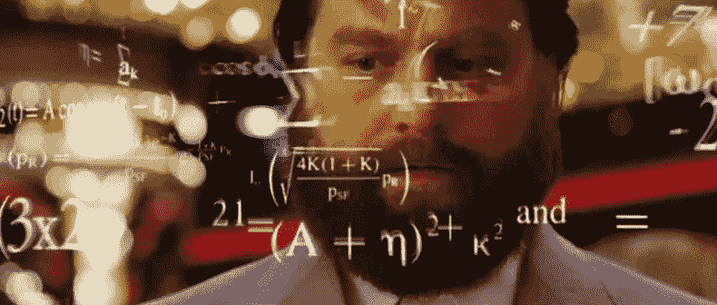

随着社交距离协议的继续，德州扑克的在线人数大幅增加。下图显示了随着冠状病毒开始影响美国，德州扑克应用程序 Poker Face 的增长情况。

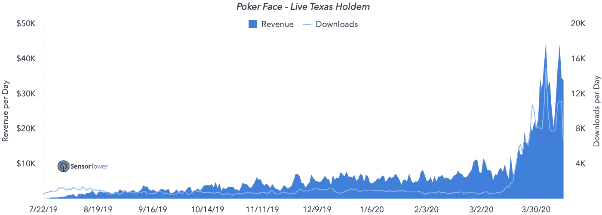

我发现德州扑克中的一些数字知道起来很有用，也很容易计算。假设你坐在牌桌上，拿着一张红桃 j 和一张红桃 4，翻牌圈又出现了两张红桃。你现在在等一个有九张听牌的同花听牌。

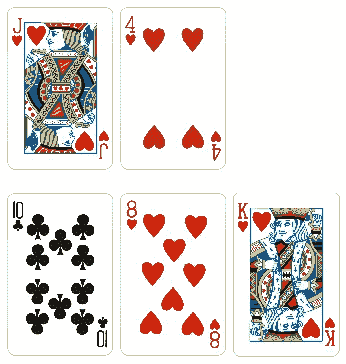

在一副牌中，十三张有红心的牌，其中四张放在桌子上。剩下的 47 张牌中有 9 张可以提供最后一张红心给你同花。在还剩两张牌的情况下，凑成同花的概率约为 35%。

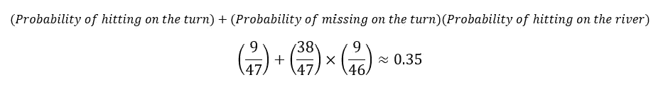

这是了解你的风险和决定你愿意赌多少来看下一张牌的有用信息，但它留下了许多未知数。在上面的场景中，玩家有一张高同花，尤其是因为牌桌上有红心王。别人有红桃皇后或 a 和另一张红桃牌的概率是多少？或者，他们只能有红心皇后或 a，并希望有两个以上的心显示。这取决于手中剩下的玩家数量，从而变得更加复杂。如果你要单挑，你可以相当有信心拿到高同花顺听牌，但如果你和其他几个玩家在一张牌桌上，你就没那么有信心了。也就是说，你仍有 65%的机会没有拿到同花。如果你打了一个 q，a，或者 q，9 或者 7，9(所有这些都可以按任意顺序打)。这里打顺子的概率是 4.4%。

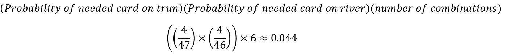

计算特定场景的概率并不太难，但是对每一种可能的纸牌组合进行计算就变得非常复杂了。

这就是可以实现编程能力的地方。使用 python，您可以模拟数百万手牌，记录任何牌和牌桌组合的每次同花、顺子等等。这使得用户能够完全控制卡片，而不必进行任何计算。下面是之前讨论的 100 万手模拟牌的输出。

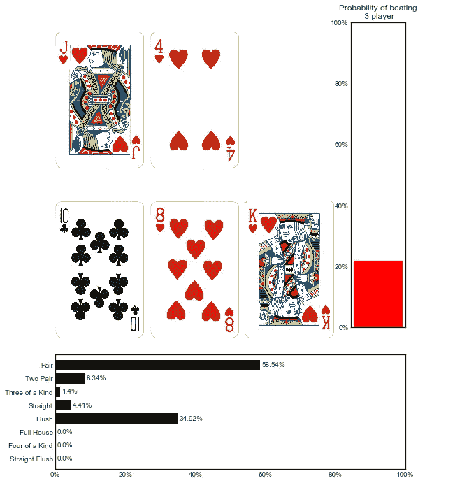

代码创建手牌，然后洗牌。首先，它将牌分发给一些选定的玩家。然后，它将剩余的 X 张牌放在桌上，并记录每手牌是否被击中。然后将该手牌与其他玩家的手牌进行比较，以确定该手牌是否是获胜的手牌，并记录该信息。这个过程重复 n 次模拟。随着模拟牌局数量的增加，所列概率的准确性也会增加。如前所述，我创建了一个 Dash 应用程序，你可以在这里亲自尝试一下。下面是应用程序的截图。

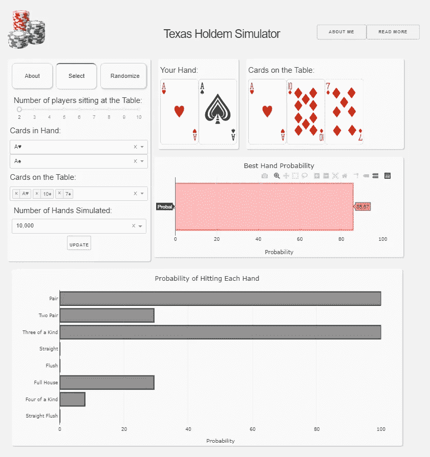

有了模拟手的能力，我们可以很容易地分析许多不同的情况。下图显示了每对口袋对子的获胜概率。有些差异是必需的，因为数十亿手牌的组合是可能的，而模拟只有数百万次。然而，你可以看到一个明显的趋势，毫不奇怪地表明，口袋二的远不如口袋火箭。

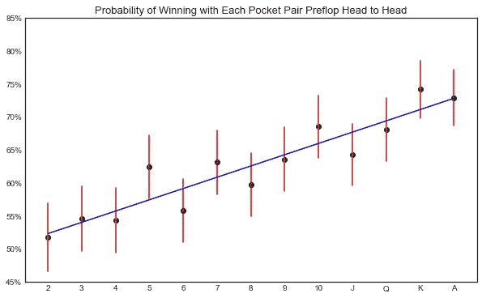

1.口袋 a 有多好？

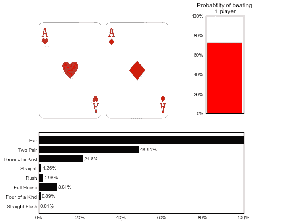

2.7 2 异花到底有多烂？

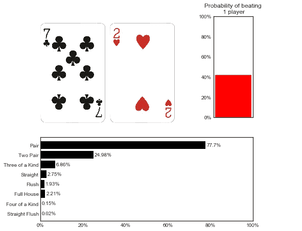

3.你拿到同花 8-9 的顺子、同花或同花的可能性有多大？

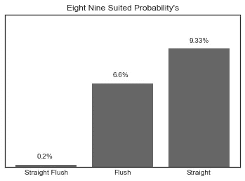

与这个项目相关的所有代码都可以在我的 [Github](https://github.com/MichaelEmmert/Texas_Holdem) 上找到。如果你对这个项目有任何疑问，请随时联系我们。感谢您的阅读，希望您喜欢！