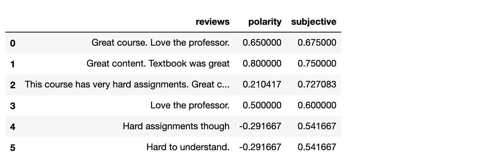
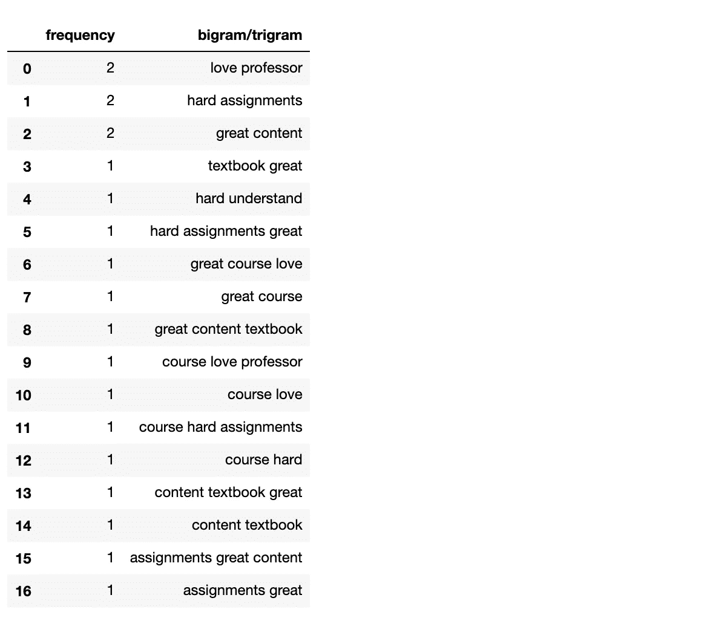
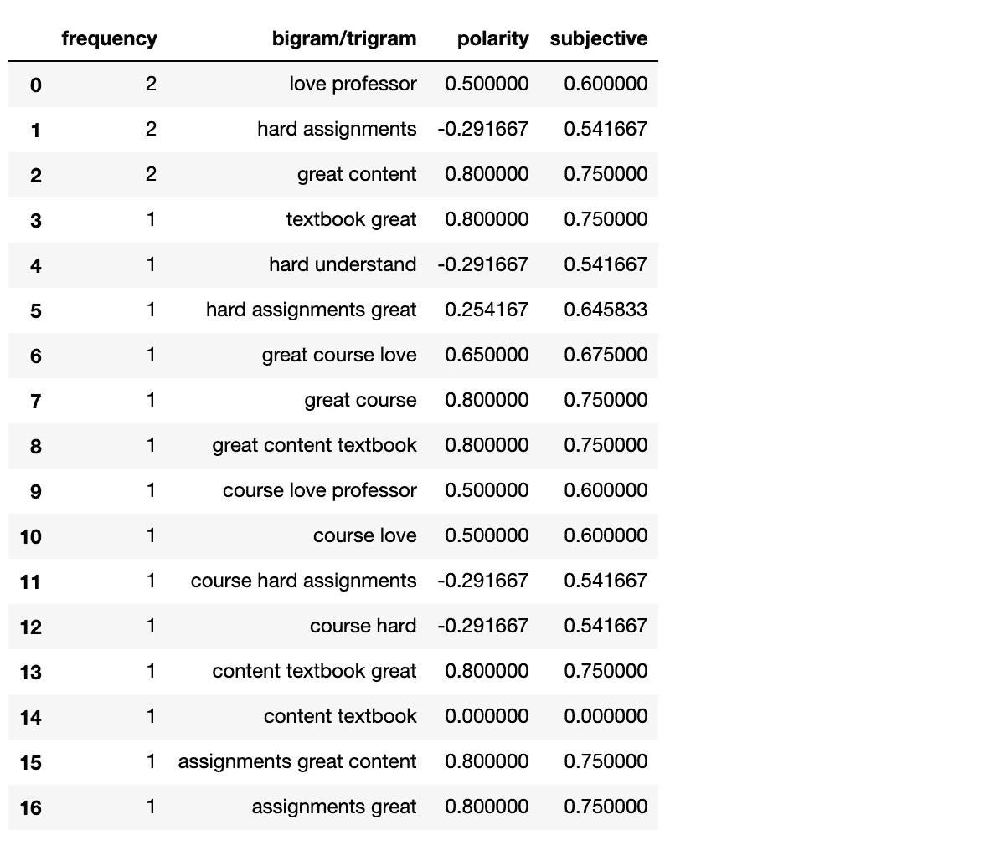
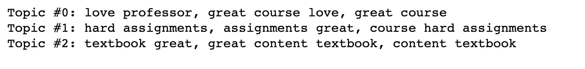
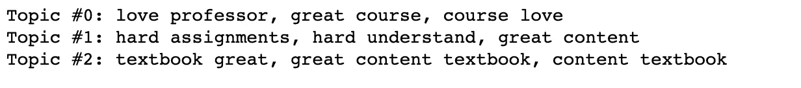

# Python 中的文本分析基础

> 原文：<https://towardsdatascience.com/text-analysis-basics-in-python-443282942ec5?source=collection_archive---------2----------------------->

## [入门](https://towardsdatascience.com/tagged/getting-started)

## 二元/三元模型、情感分析和主题建模


来源:[https://unsplash.com/photos/uGP_6CAD-14](https://unsplash.com/photos/uGP_6CAD-14)

本文讨论 Python 中最基本的文本分析工具。我们不打算进入花哨的 NLP 模型。只是最基本的。有时候你需要的只是基础:)

我们先来获取一些文本数据。这里有一份我写的课程评论清单。我们可以用这些数据做什么？想到的第一个问题是，我们能分辨哪些评论是正面的，哪些是负面的吗？我们可以对这些评论做一些情感分析吗？

```
corpus = [
'Great course. Love the professor.',
'Great content. Textbook was great',
'This course has very hard assignments. Great content.',
'Love the professor.',
'Hard assignments though',
'Hard to understand.'
]
```

# 情感分析

太好了，我们来看看整体的情绪分析。我喜欢使用熊猫数据框。因此，让我们从列表中创建一个熊猫数据框。

```
import pandas as pd
df = pd.DataFrame(corpus)
df.columns = ['reviews']
```

接下来，让我们安装库 *textblob* ( `conda install textblob -c conda-forge`)并导入库。

```
from textblob import TextBlob
df['polarity'] = df['reviews'].apply(lambda x: TextBlob(x).polarity)
df['subjective'] = df['reviews'].apply(lambda x: TextBlob(x).subjectivity)
```

然后，我们可以通过`polarity`函数计算情感。`polarity`范围从-1 到 1，其中-1 为负，1 为正。TextBlob 还可以使用`subjectivity`函数来计算`subjectivity`，范围从 0 到 1，0 表示客观，1 表示主观。



# 二元/三元模型的情感分析

接下来，我们可以探讨一些单词联想。n 元语法分析通常用于查看哪些单词经常一起出现。我经常喜欢研究两个词或三个词的组合，即二元模型/三元模型。

> 一个 ***n* -gram** 是来自给定文本或语音样本的 *n* 项的连续序列。

在文本分析中，过滤掉一些停用词通常是一种好的做法，这些停用词是最常见的词，但在句子中没有重要的上下文意义(例如，“a”、“the”、“and”、“but”等)。nltk 为我们提供了一个停用词的列表。我们还可以在列表中添加定制的停用词。比如这里我们加了“虽然”这个词。

```
from nltk.corpus import stopwords
stoplist = stopwords.words('english') + ['though']
```

现在，我们可以删除停用词，使用一些二元/三元模型。函数`CountVectorizer`“将文本文档的集合转换成令牌计数的矩阵”。`stop_words`参数有一个内置选项“英语”。但是我们也可以使用用户定义的停用词，就像我在这里展示的。`ngram_range`参数定义了我们对哪些 n 元语法感兴趣——2 表示二元语法，3 表示三元语法。另一个值得一提的参数是`lowercase`，它有一个默认值 *True* ，为我们自动将所有字符转换成小写。现在用下面的代码，我们可以得到所有的二元/三元模型，并按频率排序。

```
from sklearn.feature_extraction.text import CountVectorizer
c_vec = CountVectorizer(stop_words=stoplist, ngram_range=(2,3))
# matrix of ngrams
ngrams = c_vec.fit_transform(df['reviews'])
# count frequency of ngrams
count_values = ngrams.toarray().sum(axis=0)
# list of ngrams
vocab = c_vec.vocabulary_df_ngram = pd.DataFrame(sorted([(count_values[i],k) for k,i in vocab.items()], reverse=True)
            ).rename(columns={0: 'frequency', 1:'bigram/trigram'})
```



类似于之前的情感分析，我们可以计算每个二元/三元模型的极性和主观性。

```
df_ngram['polarity'] = df_ngram['bigram/trigram'].apply(lambda x: TextBlob(x).polarity)
df_ngram['subjective'] = df_ngram['bigram/trigram'].apply(lambda x: TextBlob(x).subjectivity)
```



# 主题建模

我们也可以用文本数据做一些主题建模。有两种方法可以做到这一点:NMF 模型和 LDA 模型。接下来我们将展示使用这两种方法的例子。

## NMF 模型

非负矩阵分解(NMF)是一种矩阵分解方法，将一个矩阵分解为非负元素 W 和 H 的乘积。默认方法优化原始矩阵和 WH 之间的距离，即 Frobenius 范数。下面是一个例子，我们使用 NMF 产生 3 个主题，我们在每个主题中显示了 3 个二元模型/三元模型。

```
Source: [https://scikit-learn.org/stable/auto_examples/applications/plot_topics_extraction_with_nmf_lda.html](https://scikit-learn.org/stable/auto_examples/applications/plot_topics_extraction_with_nmf_lda.html)from sklearn.feature_extraction.text import TfidfVectorizer
from sklearn.decomposition import NMF
from sklearn.pipeline import make_pipelinetfidf_vectorizer = TfidfVectorizer(stop_words=stoplist, ngram_range=(2,3))
nmf = NMF(n_components=3)
pipe = make_pipeline(tfidf_vectorizer, nmf)
pipe.fit(df['reviews'])def print_top_words(model, feature_names, n_top_words):
    for topic_idx, topic in enumerate(model.components_):
        message = "Topic #%d: " % topic_idx
        message += ", ".join([feature_names[i]
                             for i in topic.argsort()[:-n_top_words - 1:-1]])
        print(message)
    print()print_top_words(nmf, tfidf_vectorizer.get_feature_names(), n_top_words=3)
```

这是结果。看起来主题 0 是关于教授和课程的；题目 1 是关于作业，题目 3 是关于课本。请注意，我们不知道这里的最佳主题数量是多少。我们用 3 只是因为我们的样本量很小。在实践中，您可能需要进行网格搜索来找到最佳的主题数量。



## LDA 模型

> 潜在狄利克雷分配是用于诸如文本语料库的离散数据集集合的生成概率模型。它也是一个主题模型，用于从文档集合中发现抽象主题。

在我们的例子中，我们使用函数`***LatentDirichletAllocation***`，它“实现了在线变分贝叶斯算法，并支持在线和批量更新方法”。这里我们展示了一个学习方法被设置为默认值“在线”的例子。

```
Source: [https://scikit-learn.org/stable/auto_examples/applications/plot_topics_extraction_with_nmf_lda.html](https://scikit-learn.org/stable/auto_examples/applications/plot_topics_extraction_with_nmf_lda.html)from sklearn.decomposition import LatentDirichletAllocation
tfidf_vectorizer = TfidfVectorizer(stop_words=stoplist, ngram_range=(2,3))
lda = LatentDirichletAllocation(n_components=3)
pipe = make_pipeline(tfidf_vectorizer, lda)
pipe.fit(df['reviews'])def print_top_words(model, feature_names, n_top_words):
    for topic_idx, topic in enumerate(model.components_):
        message = "Topic #%d: " % topic_idx
        message += ", ".join([feature_names[i]
                             for i in topic.argsort()[:-n_top_words - 1:-1]])
        print(message)
    print()print_top_words(lda, tfidf_vectorizer.get_feature_names(), n_top_words=3)
```



现在你知道如何用 Python 做一些基本的文本分析了。出于演示目的，我们的示例具有非常有限的数据大小。现实世界中的文本分析将更具挑战性和趣味性。希望你喜欢这篇文章。谢谢！

# 参考

[https://sci kit-learn . org/stable/auto _ examples/applications/plot _ topics _ extraction _ with _ NMF _ LDA . html](https://scikit-learn.org/stable/auto_examples/applications/plot_topics_extraction_with_nmf_lda.html)

[https://sci kit-learn . org/stable/modules/generated/sk learn . feature _ extraction . text . count vectorizer . html](https://scikit-learn.org/stable/modules/generated/sklearn.feature_extraction.text.CountVectorizer.html)

[https://stack overflow . com/questions/11763613/python-list-of-ngrams-with-frequency/11834518](https://stackoverflow.com/questions/11763613/python-list-of-ngrams-with-frequencies/11834518)