# 使用自然语言处理的文本分析和特征工程

> 原文：<https://towardsdatascience.com/text-analysis-feature-engineering-with-nlp-502d6ea9225d?source=collection_archive---------3----------------------->


## 语言检测、文本清理、长度测量、情感分析、命名实体识别、N 元语法频率、词向量、主题建模

## 摘要

在本文中，我将使用 NLP 和 Python 来解释如何为您的机器学习模型分析文本数据和提取特征。

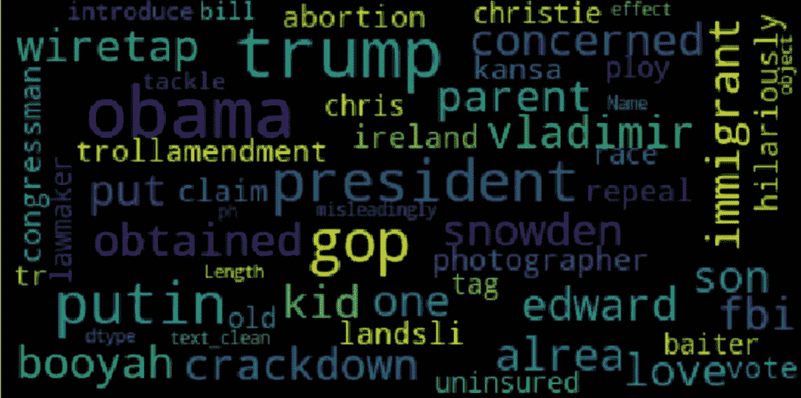

[**【NLP(自然语言处理)**](https://en.wikipedia.org/wiki/Natural_language_processing) 是人工智能的一个领域，研究计算机和人类语言之间的交互，特别是如何给计算机编程，以处理和分析大量的自然语言数据。NLP 通常用于文本数据的分类。**文本分类**就是根据文本数据的内容给文本数据分配类别的问题。文本分类最重要的部分是**特征工程**:从原始文本数据中为机器学习模型创建特征的过程。

在本文中，我将解释不同的方法来分析文本并提取可用于构建分类模型的特征。我将展示一些有用的 Python 代码，这些代码可以很容易地应用于其他类似的情况(只需复制、粘贴、运行)，并通过注释遍历每一行代码，以便您可以复制这个示例(下面是完整代码的链接)。

[](https://github.com/mdipietro09/DataScience_ArtificialIntelligence_Utils/blob/master/natural_language_processing/example_text_classification.ipynb) [## mdipietro 09/data science _ 人工智能 _ 实用工具

### permalink dissolve GitHub 是超过 5000 万开发人员的家园，他们一起工作来托管和审查代码，管理…

github.com](https://github.com/mdipietro09/DataScience_ArtificialIntelligence_Utils/blob/master/natural_language_processing/example_text_classification.ipynb) 

我将使用“**新闻类别数据集**”(下面的链接)，其中为您提供了从*赫芬顿邮报*获得的 2012 年至 2018 年的新闻标题，并要求您将它们归类到正确的类别中。

[](https://www.kaggle.com/rmisra/news-category-dataset) [## 新闻类别数据集

### 根据标题和简短描述识别新闻的类型

www.kaggle.com](https://www.kaggle.com/rmisra/news-category-dataset) 

特别是，我将经历:

*   环境设置:导入包并读取数据。
*   语言检测:了解哪些自然语言数据在。
*   文本预处理:文本清洗和转换。
*   长度分析:用不同的度量标准测量。
*   情感分析:确定文本是正面的还是负面的。
*   命名实体识别:用预定义的类别(如人名、组织、位置)标记文本。
*   词频:找到最重要的*n*-克。
*   单词向量:将单词转换成数字。
*   主题建模:从语料库中提取主要主题。

## 设置

首先，我需要导入以下库。

```
**## for data**
import **pandas** as pd
import **collections** import **json****## for plotting**
import **matplotlib**.pyplot as plt
import **seaborn** as sns
import **wordcloud****## for text processing** import **re**
import **nltk****## for language detection**
import **langdetect** **## for sentiment**
from **textblob** import TextBlob**## for ner**
import **spacy****## for vectorizer** from **sklearn** import feature_extraction, manifold**## for word embedding** import **gensim**.downloader as gensim_api**## for topic modeling**
import **gensim**
```

数据集包含在一个 json 文件中，所以我首先用 *json* 包将它读入一个字典列表，然后将其转换成一个 *pandas* Dataframe。

```
lst_dics = []
with **open**('data.json', mode='r', errors='ignore') as json_file:
    for dic in json_file:
        lst_dics.append( json.loads(dic) )**## print the first one**      
lst_dics[0]
```

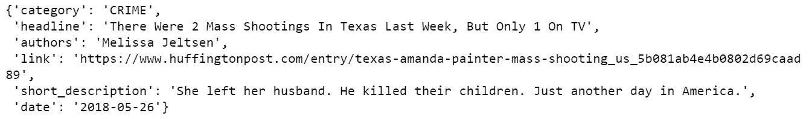

原始数据集包含超过 30 个类别，但是出于本教程的目的，我将使用 3 个类别的子集:娱乐、政治和技术。

```
**## create dtf**
dtf = pd.DataFrame(lst_dics)**## filter categories**
dtf = dtf[ dtf["category"].isin(['**ENTERTAINMENT**','**POLITICS**','**TECH**']) ][["category","headline"]]**## rename columns**
dtf = dtf.rename(columns={"category":"**y**", "headline":"**text**"})**## print 5 random rows**
dtf.sample(5)
```

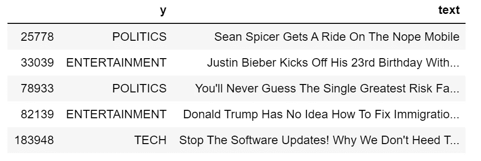

为了理解数据集的组成，我将通过用条形图显示标签频率来研究单变量分布(只有一个变量的概率分布)。

```
**x = "y"**fig, ax = plt.subplots()
fig.suptitle(x, fontsize=12)
dtf[x].reset_index().groupby(x).count().sort_values(by= 
       "index").plot(kind="barh", legend=False, 
        ax=ax).grid(axis='x')
plt.show()
```

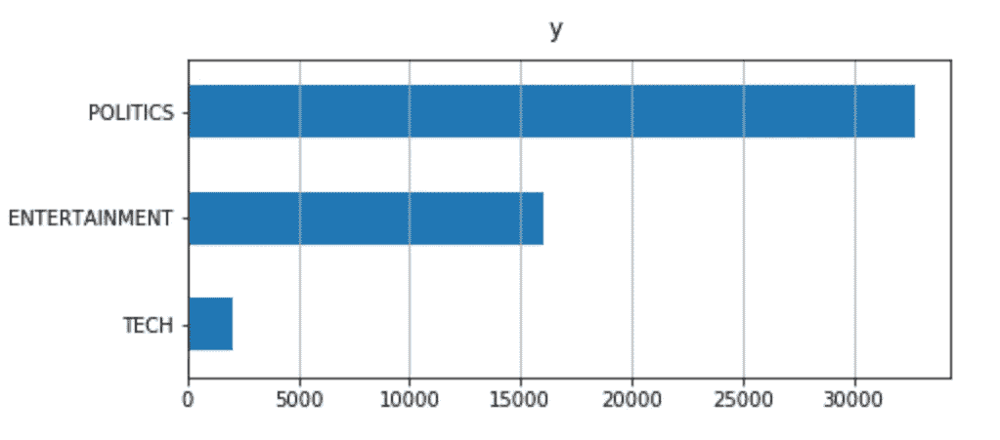

数据集是不平衡的:与其他的相比，科技新闻的比例真的很小。这可能是建模过程中的一个问题，数据集的重新采样可能会有所帮助。

现在一切都设置好了，我将从清理数据开始，然后我将从原始文本中提取不同的见解，并将它们作为 dataframe 的新列添加。这个新信息可以用作分类模型的潜在特征。

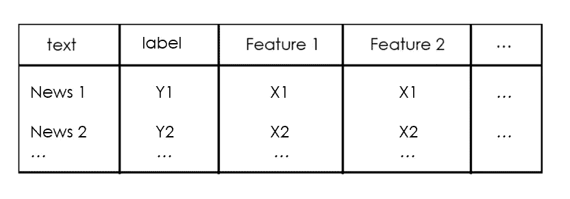

我们开始吧，好吗？

## 语言检测

首先，我想确保我处理的是同一种语言，并且使用了 *langdetect* 包，这真的很简单。为了举例说明，我将在数据集的第一个新闻标题上使用它:

```
txt = dtf["text"].iloc[0]print(txt, " --> ", **langdetect**.detect(txt))
```

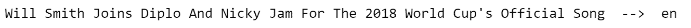

让我们为整个数据集添加一个包含语言信息的列:

```
dtf['**lang**'] = dtf[**"text"**].apply(lambda x: **langdetect**.detect(x) if 
                                 x.strip() != "" else "")dtf.head()
```

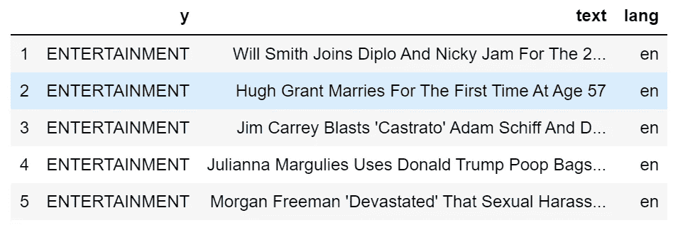

dataframe 现在有一个新列。使用之前的相同代码，我可以看到有多少种不同的语言:

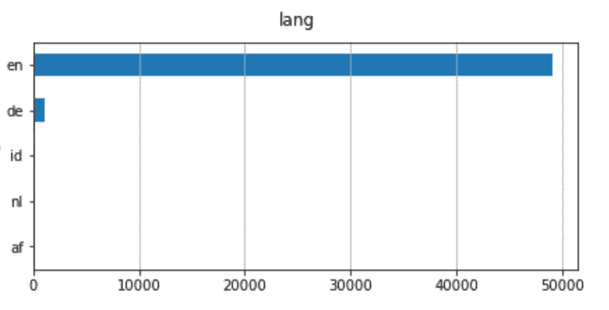

即使有不同的语言，也是以英语为主。因此，我将过滤英语新闻。

```
dtf = dtf[dtf["**lang**"]=="**en**"]
```

## 文本预处理

数据预处理是准备原始数据以使其适合机器学习模型的阶段。对于自然语言处理，这包括文本清理，停用词删除，词干和词汇化。

**文本清理**步骤根据数据类型和所需任务而有所不同。通常，在文本被标记化之前，字符串被转换成小写，标点符号被删除。**记号化**是将一个字符串拆分成一系列字符串(或“记号”)的过程。

让我们再次以第一个新闻标题为例:

```
**print("--- original ---")**
print(txt)**print("--- cleaning ---")**
txt = re.sub(r'[^\w\s]', '', str(txt).lower().strip())
print(txt)**print("--- tokenization ---")**
txt = txt.split()
print(txt)
```

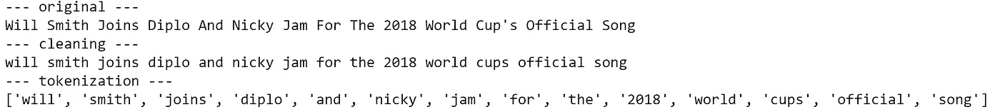

我们要保留列表中的所有令牌吗？我们没有。事实上，我们希望删除所有不能提供额外信息的单词。在这个例子中，最重要的词是“ *song* ”，因为它可以将任何分类模型指向正确的方向。相比之下，像“*和*”、“*代表*”、“*代表*”这样的词就没什么用了，因为它们可能出现在数据集中的几乎每个观察值中。这些是**停用词**的例子。这种表达通常指的是一种语言中最常见的单词，但没有一个通用的停用词列表。

我们可以用*NLTK(*[自然语言工具包](https://www.nltk.org/))为英语词汇创建一个通用停用词列表，NLTK 是一套用于符号和统计自然语言处理的库和程序。

```
lst_stopwords = **nltk**.corpus.stopwords.words("**english**")
lst_stopwords
```

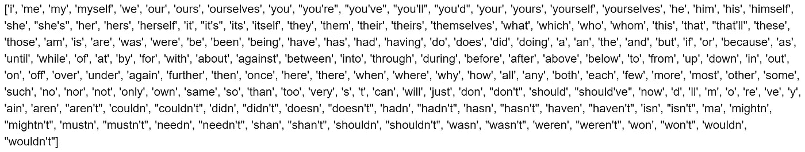

让我们从第一个新闻标题中去掉这些停用词:

```
**print("--- remove stopwords ---")**
txt = [word for word in txt if word not in lst_stopwords]
print(txt)
```

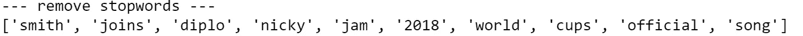

我们需要非常小心停用词，因为如果您删除了错误的令牌，您可能会丢失重要信息。例如，单词“ *will* ”被删除，我们丢失了这个人是威尔·史密斯的信息。考虑到这一点，在删除停用词之前对原始文本进行一些手动修改会很有用(例如，用“*威尔·史密斯*”替换“*威尔·史密斯*”)。

现在我们有了所有有用的标记，我们可以应用单词转换了。**词干**和**词条化**都生成单词的词根形式。区别在于词干可能不是一个实际的单词，而 lemma 是一个实际的语言单词(而且词干通常更快)。那些算法都是由 NLTK 提供的。

继续这个例子:

```
**print("--- stemming ---")**
ps = **nltk**.stem.porter.**PorterStemmer**()
print([ps.stem(word) for word in txt])**print("--- lemmatisation ---")**
lem = **nltk**.stem.wordnet.**WordNetLemmatizer**()
print([lem.lemmatize(word) for word in txt])
```

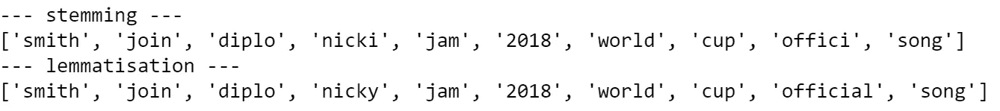

正如你所看到的，一些单词发生了变化:“joins”变成了它的词根形式“join”，就像“cups”一样。另一方面，“官方”只是在词干上有所变化，变成了词干“offici”，它不是一个单词，是通过去掉后缀“-al”创建的。

我将把所有这些预处理步骤放在一个函数中，并将其应用于整个数据集。

```
**'''
Preprocess a string.
:parameter
    :param text: string - name of column containing text
    :param lst_stopwords: list - list of stopwords to remove
    :param flg_stemm: bool - whether stemming is to be applied
    :param flg_lemm: bool - whether lemmitisation is to be applied
:return
    cleaned text
'''**
def **utils_preprocess_text**(text, flg_stemm=False, flg_lemm=True, lst_stopwords=None):
    **## clean (convert to lowercase and remove punctuations and characters and then strip)**
    text = re.sub(r'[^\w\s]', '', str(text).lower().strip())

    **## Tokenize (convert from string to list)**
    lst_text = text.split() **## remove Stopwords**
    if lst_stopwords is not None:
        lst_text = [word for word in lst_text if word not in 
                    lst_stopwords]

    **## Stemming (remove -ing, -ly, ...)**
    if flg_stemm == True:
        ps = nltk.stem.porter.PorterStemmer()
        lst_text = [ps.stem(word) for word in lst_text]

    **## Lemmatisation (convert the word into root word)**
    if flg_lemm == True:
        lem = nltk.stem.wordnet.WordNetLemmatizer()
        lst_text = [lem.lemmatize(word) for word in lst_text]

    **## back to string from list**
    text = " ".join(lst_text)
    return text
```

请注意，您不应该同时应用词干化和词汇化。这里我将使用后者。

```
dtf["text_clean"] = dtf["text"].apply(lambda x: **utils_preprocess_text**(x, flg_stemm=False, **flg_lemm=True**, lst_stopwords))
```

和以前一样，我创建了一个新的专栏:

```
dtf.head()
```

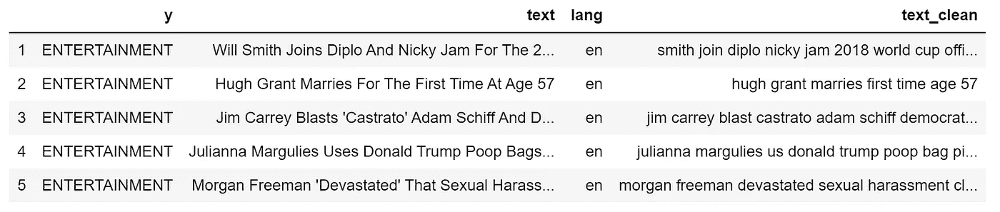

```
print(dtf["**text**"].iloc[0], " --> ", dtf["**text_clean**"].iloc[0])
```

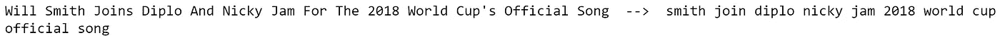

## 长度分析

看一看文本的长度是很重要的，因为这是一个简单的计算，可以给出很多见解。例如，也许我们足够幸运地发现一个类别比另一个类别系统地更长，并且长度仅仅是构建模型所需的唯一特征。不幸的是，情况并非如此，因为新闻标题有相似的长度，但值得一试。

文本数据有几种长度度量。我将举一些例子:

*   **字数统计**:统计文本中的记号数(用空格隔开)
*   **字符数**:合计每个令牌的字符数
*   **句子计数**:计算句子的数量(用句号分隔)
*   **平均字数**:字数除以字数(字数/字数)
*   **平均句子长度**:句子长度之和除以句子数量(字数/句子数)

```
dtf['word_count'] = dtf["text"].apply(lambda x: len(str(x).split(" ")))dtf['char_count'] = dtf["text"].apply(lambda x: sum(len(word) for word in str(x).split(" ")))dtf['sentence_count'] = dtf["text"].apply(lambda x: len(str(x).split(".")))dtf['avg_word_length'] = dtf['char_count'] / dtf['word_count']dtf['avg_sentence_lenght'] = dtf['word_count'] / dtf['sentence_count']dtf.head()
```

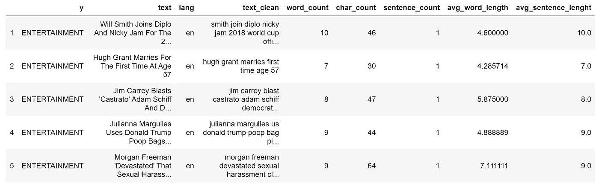

让我们看看我们通常的例子:


这些新变量相对于目标的分布是怎样的？为了回答这个问题，我将看看二元分布(两个变量如何一起移动)。首先，我将把整个观察集分成 3 个样本(政治、娱乐、科技)，然后比较样本的直方图和密度。如果分布不同，那么变量是可预测的，因为 3 组具有不同的模式。

例如，让我们看看字符数是否与目标变量相关:

```
**x, y = "char_count", "y"**fig, ax = plt.subplots(nrows=1, ncols=2)
fig.suptitle(x, fontsize=12)
for i in dtf[y].unique():
    sns.distplot(dtf[dtf[y]==i][x], hist=True, kde=False, 
                 bins=10, hist_kws={"alpha":0.8}, 
                 axlabel="histogram", ax=ax[0])
    sns.distplot(dtf[dtf[y]==i][x], hist=False, kde=True, 
                 kde_kws={"shade":True}, axlabel="density",   
                 ax=ax[1])
ax[0].grid(True)
ax[0].legend(dtf[y].unique())
ax[1].grid(True)
plt.show()
```


这三个类别具有相似的长度分布。这里，密度图非常有用，因为样本大小不同。

## 情感分析

情感分析是将文本数据的主观情感通过数字或类别表示出来。计算情感是自然语言处理中最困难的任务之一，因为自然语言充满了歧义。例如，短语“*这是如此糟糕，以至于它是好的*”有不止一种解释。一个模型可以给单词“*好的*”分配一个积极的信号，给单词“*坏的*”分配一个消极的信号，产生一个中性的情绪。发生这种情况是因为背景未知。

最好的方法是训练你自己的情绪模型，使之与你的数据完全吻合。当没有足够的时间或数据时，可以使用预先训练的模型，如 *Textblob* 和 *Vader* 。[*text blob*](https://textblob.readthedocs.io/en/dev/index.html)*，*建立在 *NLTK 之上，*是最受欢迎的一个，它可以给单词分配极性，并把整篇文本的情感估计为平均值。另一方面， [*【维达】*](https://github.com/cjhutto/vaderSentiment) (价觉词典和情感推理机)是一个基于规则的模型，在社交媒体数据上工作得特别好。

我将使用 *Textblob* 添加一个情感特征:

```
dtf["sentiment"] = dtf[column].apply(lambda x: 
                   **TextBlob**(x).sentiment.polarity)
dtf.head()
```

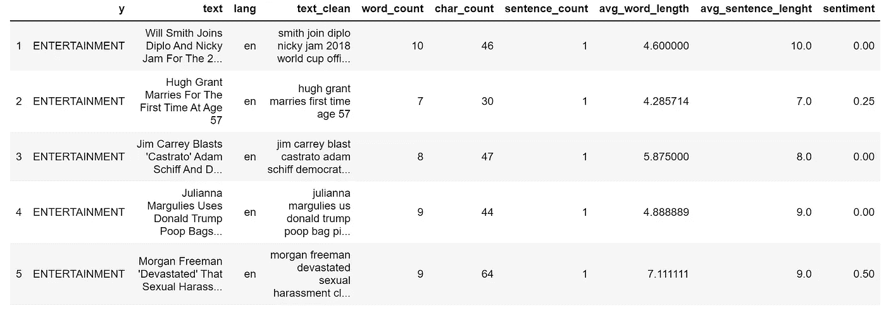

```
print(dtf["text"].iloc[0], " --> ", dtf["sentiment"].iloc[0])
```

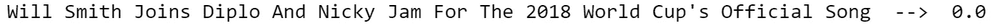

品类和情绪之间有模式吗？

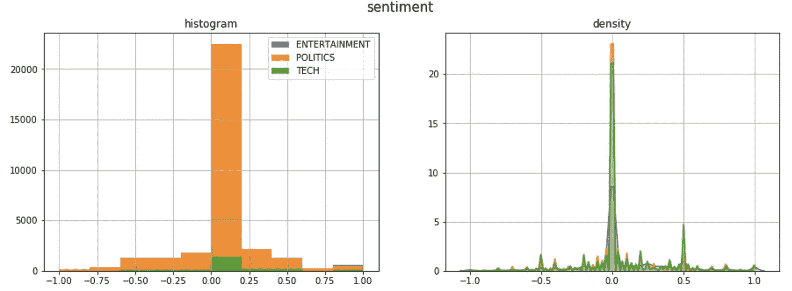

大多数标题都有一种中性的情绪，除了政治新闻倾向于负面，科技新闻倾向于正面。

## 命名实体识别

NER ( [命名实体识别](https://en.wikipedia.org/wiki/Named-entity_recognition))是用预定义的类别(如人名、组织、位置、时间表达式、数量等)标记非结构化文本中提到的命名实体的过程。

训练 NER 模型非常耗时，因为它需要非常丰富的数据集。幸运的是，有人已经为我们做了这项工作。最好的开源 NER 工具之一是 [*SpaCy*](https://spacy.io/) 。它提供了不同的 NLP 模型，能够识别几类实体。

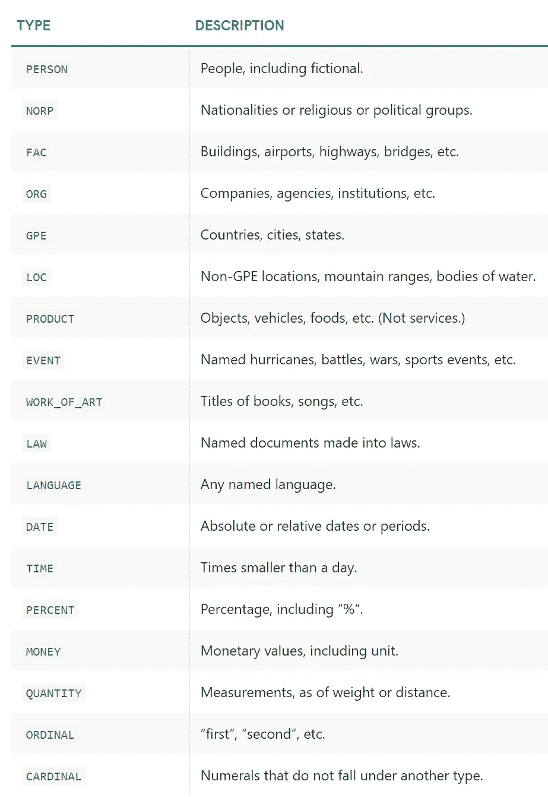

来源:[空间](https://spacy.io/api/annotation#section-named-entities)

我将在我们通常的标题(原始文本，未经预处理)上使用*SpaCy*model*en _ core _ web _ LG*(基于 web 数据训练的英语大模型)来举例说明:

```
**## call model**
ner = **spacy**.load("**en_core_web_lg**")**## tag text**
txt = dtf["text"].iloc[0]
doc = **ner**(txt)**## display result**
spacy.**displacy**.render(doc, style="ent")
```

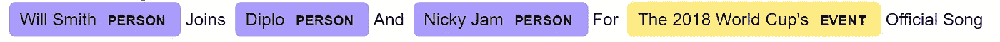

这很酷，但是我们如何把它变成一个有用的特性呢？这是我要做的:

*   对数据集中的每个文本观察值运行 NER 模型，就像我在前面的例子中所做的那样。
*   对于每个新闻标题，我将把所有已识别的实体放入一个新的列(名为“tags”)中，同时列出该实体在文本中出现的次数。在本例中，应该是

> {('威尔·史密斯'，'人'):1，
> ('迪普'，'人'):1，
> ('尼基·贾姆'，'人'):1，
> (“2018 世界杯的'，'事件'):1 }

*   然后，我将为每个标签类别(Person、Org、Event 等)创建一个新列，并计算每个类别中找到的实体的数量。在上面的例子中，这些特性是

> tags_PERSON = 3
> 
> tags_EVENT = 1

```
**## tag text and exctract tags into a list**
dtf["tags"] = dtf["text"].apply(lambda x: [(tag.text, tag.label_) 
                                for tag in ner(x).ents] )**## utils function to count the element of a list** def **utils_lst_count**(lst):
    dic_counter = collections.Counter()
    for x in lst:
        dic_counter[x] += 1
    dic_counter = collections.OrderedDict( 
                     sorted(dic_counter.items(), 
                     key=lambda x: x[1], reverse=True))
    lst_count = [ {key:value} for key,value in dic_counter.items() ]
    return lst_count **## count tags**
dtf["tags"] = dtf["tags"].apply(lambda x: **utils_lst_count**(x)) **## utils function create new column for each tag category** def **utils_ner_features**(lst_dics_tuples, tag):
    if len(lst_dics_tuples) > 0:
        tag_type = []
        for dic_tuples in lst_dics_tuples:
            for tuple in dic_tuples:
                type, n = tuple[1], dic_tuples[tuple]
                tag_type = tag_type + [type]*n
                dic_counter = collections.Counter()
                for x in tag_type:
                    dic_counter[x] += 1
        return dic_counter[tag]
    else:
        return 0 **## extract features**
tags_set = []
for lst in dtf["tags"].tolist():
     for dic in lst:
          for k in dic.keys():
              tags_set.append(k[1])
tags_set = list(set(tags_set))
for feature in tags_set:
     dtf["tags_"+feature] = dtf["tags"].apply(lambda x: 
                             **utils_ner_features**(x, feature)) **## print result**
dtf.head()
```

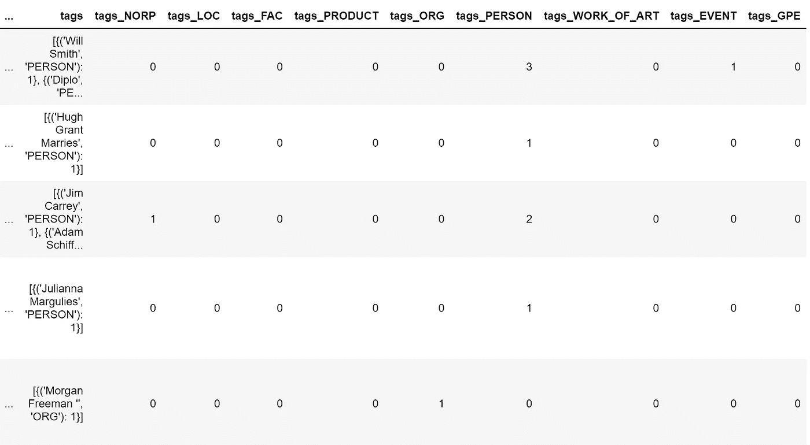

现在我们可以对标签类型分布有一个宏观的看法。让我们以 ORG 标签(公司和组织)为例:

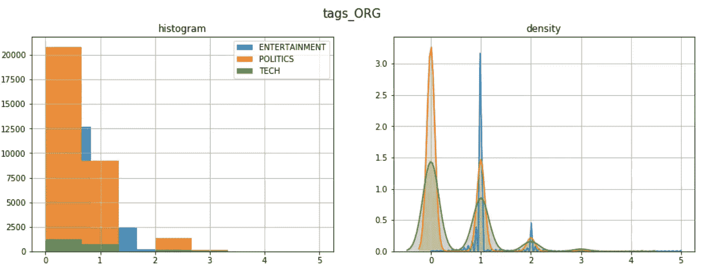

为了更深入地分析，我们需要解包我们在前面的代码中创建的列“tags”。让我们为其中一个标题类别画出最常见的标签:

```
y = "**ENTERTAINMENT**"

tags_list = dtf[dtf["y"]==y]["tags"].sum()
map_lst = list(map(lambda x: list(x.keys())[0], tags_list))
dtf_tags = pd.DataFrame(map_lst, columns=['tag','type'])
dtf_tags["count"] = 1
dtf_tags = dtf_tags.groupby(['type',  
                'tag']).count().reset_index().sort_values("count", 
                 ascending=False)
fig, ax = plt.subplots()
fig.suptitle("Top frequent tags", fontsize=12)
sns.barplot(x="count", y="tag", hue="type", 
            data=dtf_tags.iloc[:top,:], dodge=False, ax=ax)
ax.grid(axis="x")
plt.show()
```

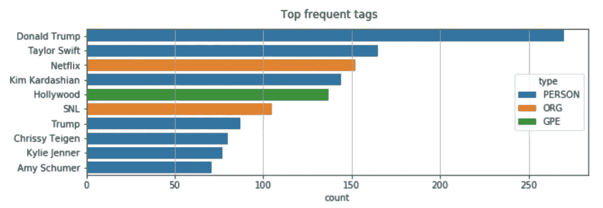

继续 NER 的另一个有用的应用:你还记得当我们从"*"的名字中去掉单词"*"的时候吗？这个问题的一个有趣的解决方案是用“ *Will_Smith* ”替换“*威尔·史密斯*”，这样它就不会受到停用词删除的影响。因为遍历数据集中的所有文本来更改名称是不可能的，所以让我们使用 *SpaCy* 来实现。我们知道， *SpaCy* 可以识别人名，因此我们可以用它来进行**姓名检测**然后修改字符串。**

```
****## predict wit NER** txt = dtf["text"].iloc[0]
entities = ner(txt).ents**## tag text**
tagged_txt = txt
for tag in entities:
    tagged_txt = re.sub(tag.text, "_".join(tag.text.split()), 
                        tagged_txt) **## show result**
print(tagged_txt)**
```

**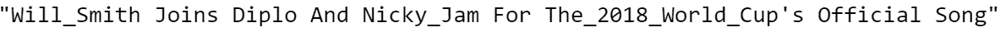**

## **字频率**

**到目前为止，我们已经看到了如何通过分析和处理整个文本来进行特征工程。现在我们将通过计算单词的出现频率来了解单词的重要性。一个 ***n* -gram** 是来自给定文本样本的 *n* 项的连续序列。当 *n* -gram 的大小为 1 时，称为一元 gram(大小为 2 的是二元 gram)。**

**例如，短语“*我喜欢这篇文章*”可以分解为:**

*   **4 unigrams:“*I*”、 *like* 、 *this* 、 *article* ”**
*   **3 个大人物:“*我喜欢*”、“*喜欢这个*”、“*这篇文章*”**

**我将以政治新闻为例，展示如何计算单词和双词的频率。**

```
**y = "**POLITICS**"
corpus = dtf[dtf["y"]==y]["text_clean"]lst_tokens = **nltk**.tokenize.word_tokenize(corpus.str.cat(sep=" "))
fig, ax = plt.subplots(nrows=1, ncols=2)
fig.suptitle("Most frequent words", fontsize=15)

**## unigrams**
dic_words_freq = nltk.FreqDist(lst_tokens)
dtf_uni = pd.DataFrame(dic_words_freq.most_common(), 
                       columns=["Word","Freq"])
dtf_uni.set_index("Word").iloc[:top,:].sort_values(by="Freq").plot(
                  kind="barh", title="Unigrams", ax=ax[0], 
                  legend=False).grid(axis='x')
ax[0].set(ylabel=None)

**## bigrams**
dic_words_freq = nltk.FreqDist(nltk.ngrams(lst_tokens, 2))
dtf_bi = pd.DataFrame(dic_words_freq.most_common(), 
                      columns=["Word","Freq"])
dtf_bi["Word"] = dtf_bi["Word"].apply(lambda x: " ".join(
                   string for string in x) )
dtf_bi.set_index("Word").iloc[:top,:].sort_values(by="Freq").plot(
                  kind="barh", title="Bigrams", ax=ax[1],
                  legend=False).grid(axis='x')
ax[1].set(ylabel=None)
plt.show()**
```

**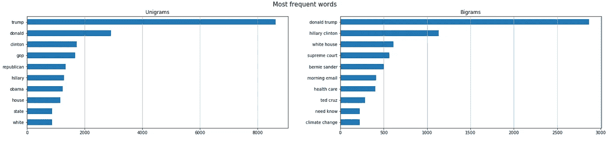**

**如果有只出现在一个类别中的 *n* -grams(例如政治新闻中的“共和党”)，这些可以成为新的特征。一种更费力的方法是将整个语料库矢量化，并将所有单词用作特征(单词袋方法)。**

**现在，我将向您展示如何在您的数据框架中添加词频作为一项功能。我们只需要来自 *Scikit-learn 的*计数矢量器*，*Python 中最流行的机器学习库之一。矢量器将文本文档的集合转换成令牌计数的矩阵。我用 3 个 n-grams 举个例子:“*票房*(娱乐圈频繁)、*共和党*(政界频繁)、“苹果”(科技界频繁)。**

```
*lst_words = ["**box office**", "**republican**", "**apple**"]***## count*** lst_grams = [len(word.split(" ")) for word in lst_words]
vectorizer = feature_extraction.text.**CountVectorizer**(
                 vocabulary=lst_words, 
                 ngram_range=(min(lst_grams),max(lst_grams)))dtf_X = pd.DataFrame(vectorizer.fit_transform(dtf["text_clean"]).todense(), columns=lst_words)***## add the new features as columns*** dtf = pd.concat([dtf, dtf_X.set_index(dtf.index)], axis=1)
dtf.head()*
```

*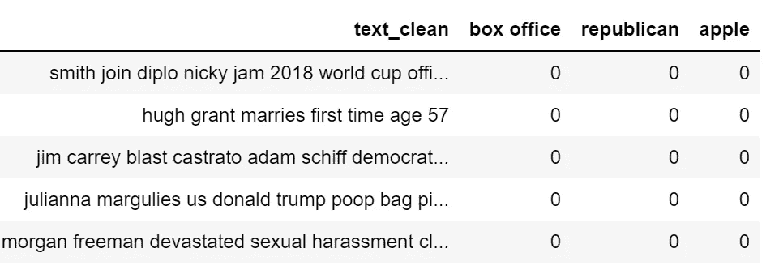*

*可视化相同信息的一个好方法是使用**单词云**，其中每个标签的频率用字体大小和颜色显示。*

```
*wc = **wordcloud**.WordCloud(background_color='black', max_words=100, 
                         max_font_size=35)
wc = wc.generate(str(corpus))
fig = plt.figure(num=1)
plt.axis('off')
plt.imshow(wc, cmap=None)
plt.show()*
```

**

## *词向量*

*最近，NLP 领域开发了新的语言模型，该模型依赖于神经网络架构，而不是更传统的 n-gram 模型。这些新技术是一套语言建模和特征学习技术，其中单词被转换成实数向量，因此它们被称为**单词嵌入**。*

*单词嵌入模型通过构建在所选单词之前和之后会出现什么标记的概率分布，将特定单词映射到向量。这些模型很快变得流行起来，因为一旦有了实数而不是字符串，就可以进行计算了。例如，为了找到相同上下文的单词，可以简单地计算向量距离。*

*有几个 Python 库可以处理这种模型。 *SpaCy* 是一个，不过既然我们已经用过了，我就说说另一个著名的包: [*Gensim*](https://radimrehurek.com/gensim/) *。*一个使用现代统计机器学习的无监督主题建模和自然语言处理的开源库。使用 *Gensim* ，我将加载一个预先训练好的*手套*模型。 [*GloVe* (全局向量)](https://nlp.stanford.edu/projects/glove/)是一种无监督学习算法，用于获得大小为 300 的单词的向量表示。*

```
*nlp = **gensim_api**.load("**glove-wiki-gigaword-300**")*
```

*我们可以使用这个对象将单词映射到向量:*

```
***word = "love"**nlp[word]*
```

*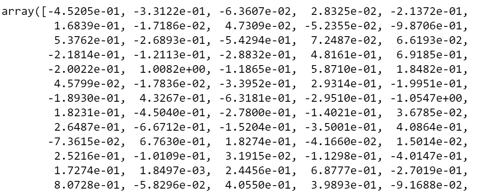*

```
*nlp[word].shape*
```

*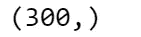*

*现在让我们看看什么是最接近的词向量，或者换句话说，最常出现在相似上下文中的词。为了在二维空间中绘制向量，我需要将维度从 300 减少到 2。我将用来自 *Scikit-learn 的*t-分布式随机邻居嵌入*来做这件事。* t-SNE 是一种可视化高维数据的工具，它将数据点之间的相似性转换为联合概率。*

```
***## find closest vectors**
labels, X, x, y = [], [], [], []
for t in nlp.**most_similar**(word, topn=20):
    X.append(nlp[t[0]])
    labels.append(t[0])**## reduce dimensions**
pca = manifold.**TSNE**(perplexity=40, n_components=2, init='pca')
new_values = pca.fit_transform(X)
for value in new_values:
    x.append(value[0])
    y.append(value[1])**## plot**
fig = plt.figure()
for i in range(len(x)):
    plt.scatter(x[i], y[i], c="black")
    plt.annotate(labels[i], xy=(x[i],y[i]), xytext=(5,2), 
               textcoords='offset points', ha='right', va='bottom')**## add center**
plt.scatter(x=0, y=0, c="red")
plt.annotate(word, xy=(0,0), xytext=(5,2), textcoords='offset 
             points', ha='right', va='bottom')*
```

*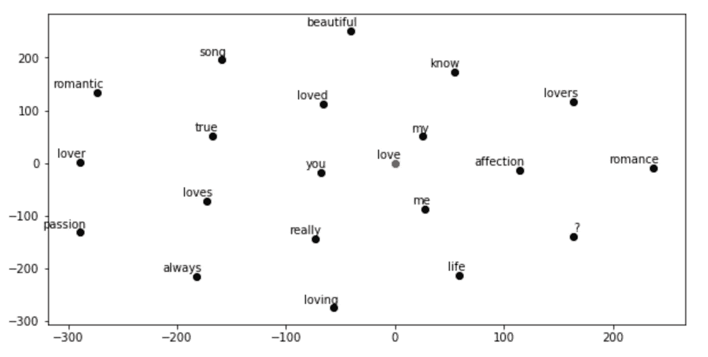*

## *主题建模*

*Genism 包专门用于主题建模。主题模型是一种用于发现出现在文档集合中的抽象“主题”的统计模型。*

*我将展示如何使用 *LDA* (潜在的狄利克雷分配)提取主题:一种生成统计模型，它允许通过未观察到的组来解释观察集，从而解释为什么数据的某些部分是相似的。基本上，文档被表示为潜在主题的随机混合，其中每个主题由单词的分布来表征。*

*让我们看看我们能从科技新闻中提取出什么话题。我需要指定模型必须聚类的主题数量，我将尝试使用 3:*

```
*y = "**TECH**"
corpus = dtf[dtf["y"]==y]["text_clean"] **## pre-process corpus**
lst_corpus = []
for string in corpus:
    lst_words = string.split()
    lst_grams = [" ".join(lst_words[i:i + 2]) for i in range(0, 
                     len(lst_words), 2)]
    lst_corpus.append(lst_grams)**## map words to an id**
id2word = gensim.corpora.Dictionary(lst_corpus)**## create dictionary word:freq**
dic_corpus = [id2word.doc2bow(word) for word in lst_corpus] **## train LDA**
lda_model = gensim.models.ldamodel.**LdaModel**(corpus=dic_corpus, id2word=id2word, **num_topics=3**, random_state=123, update_every=1, chunksize=100, passes=10, alpha='auto', per_word_topics=True)

**## output**
lst_dics = []
for i in range(0,**3**):
    lst_tuples = lda_model.get_topic_terms(i)
    for tupla in lst_tuples:
        lst_dics.append({"topic":i, "id":tupla[0], 
                         "word":id2word[tupla[0]], 
                         "weight":tupla[1]})
dtf_topics = pd.DataFrame(lst_dics, 
                         columns=['topic','id','word','weight'])

**## plot**
fig, ax = plt.subplots()
sns.barplot(y="word", x="weight", hue="topic", data=dtf_topics, dodge=False, ax=ax).set_title('Main Topics')
ax.set(ylabel="", xlabel="Word Importance")
plt.show()*
```

*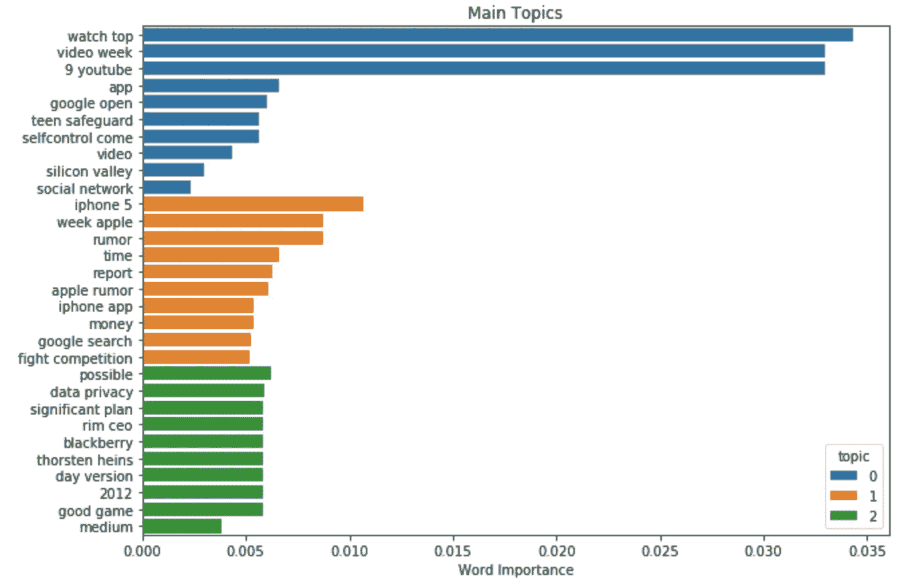*

*试图只在 3 个主题中捕捉 6 年的内容可能有点困难，但正如我们所见，关于苹果公司的一切都以同一个主题结束。*

## *结论*

*这篇文章是一个教程，演示了**如何用 NLP 分析文本数据，并为机器学习模型**提取特征。*

*我展示了如何检测数据使用的语言，以及如何预处理和清理文本。然后我解释了不同的长度度量，用 *Textblob* 做了情感分析，我们使用 *SpaCy* 进行命名实体识别。最后，我解释了使用 *Scikit-learn* 的传统词频方法和使用 *Gensim* 的现代语言模型之间的区别。现在，您已经基本了解了 NLP 的所有基础知识，可以开始处理文本数据了。*

*我希望你喜欢它！如有问题和反馈，或者只是分享您感兴趣的项目，请随时联系我。*

> *👉[我们来连线](https://linktr.ee/maurodp)👈*

> *本文是系列文章 **NLP 与 Python** 的一部分，参见:*

*[](/text-summarization-with-nlp-textrank-vs-seq2seq-vs-bart-474943efeb09) [## 使用 NLP 的文本摘要:TextRank vs Seq2Seq vs BART

### 使用 Python、Gensim、Tensorflow、Transformers 进行自然语言处理

towardsdatascience.com](/text-summarization-with-nlp-textrank-vs-seq2seq-vs-bart-474943efeb09) [](/text-classification-with-nlp-tf-idf-vs-word2vec-vs-bert-41ff868d1794) [## 基于自然语言处理的文本分类:Tf-Idf vs Word2Vec vs BERT

### 预处理、模型设计、评估、词袋的可解释性、词嵌入、语言模型

towardsdatascience.com](/text-classification-with-nlp-tf-idf-vs-word2vec-vs-bert-41ff868d1794) [](/text-classification-with-no-model-training-935fe0e42180) [## 用于无模型训练的文本分类的 BERT

### 如果没有带标签的训练集，请使用 BERT、单词嵌入和向量相似度

towardsdatascience.com](/text-classification-with-no-model-training-935fe0e42180) [](/ai-chatbot-with-nlp-speech-recognition-transformers-583716a299e9) [## 带 NLP 的 AI 聊天机器人:语音识别+变形金刚

### 用 Python 构建一个会说话的聊天机器人，与你的人工智能进行对话

towardsdatascience.com](/ai-chatbot-with-nlp-speech-recognition-transformers-583716a299e9)*