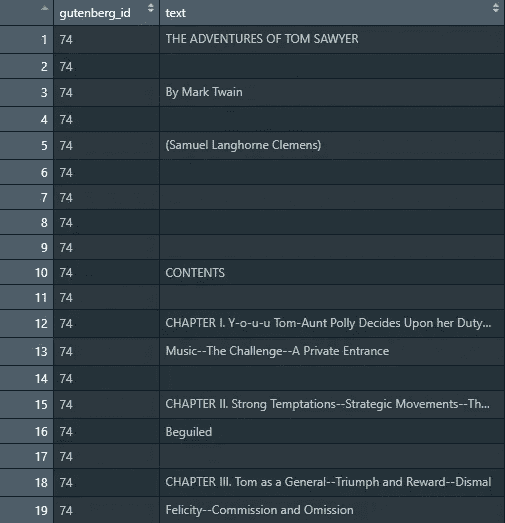
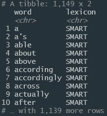
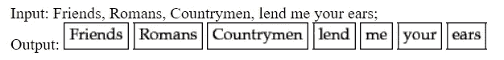
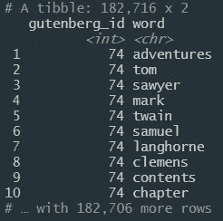
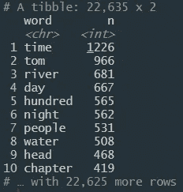

# R 中的文本分析

> 原文：<https://towardsdatascience.com/text-analytics-in-r-ae23df8ee928?source=collection_archive---------20----------------------->

## 马克·吐温著作中的文本标记介绍。


帕特里克·托马索在 [Unsplash](https://unsplash.com?utm_source=medium&utm_medium=referral) 上的照片

> "经典——一本人们称赞却不去读的书."
> 
> [人名]马克·吐温(美国幽默大师、小说家、作家、演说家)

希望你已经证明了马克·吐温是错的，并且已经沉迷于他的一部经典作品。如果不是，也许这是一个通过**文本分析**了解他的书的很好的入门。

# 什么是文本分析？

文本分析是检查文本形式的非结构化数据的过程，以收集关于感兴趣的模式和主题的一些见解。

# 为什么重要？

文本分析之所以重要有很多原因，其中一个主要原因是理解我们每天使用的应用程序和服务中使用的情绪和情感。使用文本分析，我们可以从推文、电子邮件、短信、广告、地图等等中提取有意义的信息。

如果你想更深入地研究这个主题，这里有一本很好的书——《R 中的文本挖掘》

在本教程中，我将向您展示如何开始使用 r 中必要的文本分析功能。

> R 是一种用于统计计算和图形的语言和环境。

# 入门指南

我们将不得不安装 [**gutenbergr**](https://cran.r-project.org/web/packages/gutenbergr/vignettes/intro.html) 库，这将使我们能够访问他们的可用书籍/出版物库。

*gutenbergr 包帮助你从* [*项目 Gutenberg*](http://www.gutenberg.org/) *集合中下载并处理公有领域作品。这包括用于下载书籍的工具(和剥离页眉/页脚信息)，以及可用于查找感兴趣的单词的完整的古腾堡项目元数据数据集。*

让我们在 [R Studio](https://rstudio.com/) 中安装并加载这个库

```
install.packages("gutenbergr")library(gutenbergr)
```

# 马克·吐温的书

现在，我们将从古腾堡图书馆调出几本马克·吐温写的书。

*   《哈克贝利·费恩历险记》
*   汤姆·索耶历险记
*   [国外的无辜者](https://www.amazon.com/Innocents-Abroad-Mark-Twain/dp/1710688718/ref=sr_1_2_sspa?keywords=The+Innocents+Abroad&qid=1579914224&s=books&sr=1-2-spons&psc=1&spLa=ZW5jcnlwdGVkUXVhbGlmaWVyPUEzRkdWMFcxTDAxMzlXJmVuY3J5cHRlZElkPUEwNjUzMzUyQk1ZVEFLNlgxSVVOJmVuY3J5cHRlZEFkSWQ9QTAxODA1NTZTRVo2NFpPQjUyNksmd2lkZ2V0TmFtZT1zcF9hdGYmYWN0aW9uPWNsaWNrUmVkaXJlY3QmZG9Ob3RMb2dDbGljaz10cnVl) — gutenbergr ID: 3176
*   [密西西比河上的生活](https://www.amazon.com/Life-Mississippi-Signet-Classics-Twain/dp/0451531205/ref=sr_1_3?keywords=Life+on+the+Mississippi&qid=1579914243&s=books&sr=1-3) —古滕贝格 ID: 245

在古腾堡图书馆，每本书都有一个 ID 号，我们需要用它来识别它们的位置。

```
mark_twain <- gutenberg_download(c(**76**, **74**, **3176**, **245**))
```

我们使用 gutenberg_download 函数提取图书，并将其保存到 mark_twain 数据框中。



mark_twin 数据帧的快照

通过使用 R，书籍被放入特定的行，并被标记到与书籍 ID 号相对应的列。很明显，这些数据是杂乱的，目前对分析没有太大用处。

# 识别停用词

当您分析任何文本时，总是会有冗余的单词，这些单词会根据您试图识别的模式或趋势而扭曲结果。这些被称为[停止字](https://whatis.techtarget.com/definition/stop-word)。

您可以决定是否要删除停用字词，但在本例中，我们将继续删除它们。

首先，我们需要加载库 *tidytext。*

```
library(tidytext)
```

接下来，我们将查看整个 R 数据库中的 stop_words(不在马克·吐温的书中)

```
data(stop_words)
```



stop_words 函数的前几行视图

**注意我们有 1，139 行。**

# 标记和删除停用词

现在，我们将使用 *dplyr* 库中的管道方法来删除停用词并标记我们的文本。

> [标记化](https://nlp.stanford.edu/IR-book/html/htmledition/tokenization-1.html)的任务是把它分割成小块

把标记化想象成逐字分解一个句子。这使得文本分析软件能够为分析提供更多的结构。



来源:斯坦福大学自然语言处理——标记化示例

我们将通过管道将几个步骤连接在一起，在对 *mark_twain* 数据帧进行令牌化的同时移除停止字。

```
library(dplyr)tidy_mark_twain <- mark_twain %>%
  unnest_tokens(word, text) %>% #**tokenize** 
  anti_join(stop_words) #**remove stop words**print(tidy_mark_twain)
```

步骤:

1.  使用 u [nnest_tokens()](https://www.rdocumentation.org/packages/tidytext/versions/0.2.2/topics/unnest_tokens) 公式并在输入中传递来指定我们想要标记的内容以及从哪里访问文本。
2.  使用 [anti_join()](http://zevross.com/blog/2014/08/05/using-the-r-function-anti_join-to-find-unmatched-records/) ，我们基本上排除了在停用字词数据库中找到的所有字词。
3.  我们将所有的工作保存在一个新的变量中。
4.  如果你看看



我们可以看到单词没有被单独分开，并且图书 ID 被标记在上面

您是否注意到，由于每个对象都被标记化了，我们现在有 **182，706** 行！与**相比，我们更早得到了 1139 行**。这是因为每个单词都有自己的一行。

# 词的频率分布

我们的目标是找到数据中的模式，所以一个很好的方法来查看哪些词是排序和找到最常用的词。

```
tidy_mark_twain %>%
  count(word, sort=TRUE)
```



最流行的词是**时间。**

如果你读过马克·吐温的任何一本书，毫无疑问汤姆是第二个最受欢迎的单词，但有趣的是看到单词*是最频繁使用的单词——1226！*

# *可视化数据*

*使用 ggplot2 库，我们可以添加一些可视上下文来查看哪些单词是最常用的。*

```
*library(ggplot2)freq_hist <-tidy_mark_twain %>%
  count(word, sort=TRUE) %>%
  filter(n > 400) %>%
  mutate(word = reorder(word,n )) %>%
  ggplot(aes(word, n))+
  geom_col(fill= 'lightgreen')+
  xlab(NULL)+
  coord_flip()print(freq_hist)*
```

*完成了一些关键步骤来提供清晰的图表:*

1.  ***filter()** —确保我们不会查看所有单词的总字数，因为那样会太多。这里我们设置了一个超过 400 个计数的单词边界。*
2.  ***mutate()** —提供更好的单词组织顺序。*
3.  ***coord_flip()** —旋转图形，使其看起来更美观。*

*如果剩下的代码面生，可以查看我的 [**ggplot 教程**](/introduction-to-ggplot2-in-r-4db4f720f505) 了解更多。*

**

# *概观*

*文本无处不在，这意味着有无限的机会来分析和理解非结构化数据。现在你有了一个基础，应该可以帮助你开始你的文本分析之旅。*

*请继续关注——我将分享更多关于使用 Twitter 的 API 提取和抓取推文的教程。*