# 文本分析:关于你的个性，你的 LinkedIn 个人资料摘要说明了什么？

> 原文：<https://towardsdatascience.com/text-analytics-what-does-your-linkedin-profile-summary-say-about-your-personality-f80df46875d1?source=collection_archive---------8----------------------->

## 使用自然语言处理技术来预测你的性格。

我的团队使用一个人写的文本来尝试解开他们的个性。这对人力资源行业来说意义重大，他们可以取消在线测试，使用更非正式的方法来确定合适的候选人。我们的想法是分解项目，交流我们的思考过程和背后的动机。

Shamak Tiwatane 拍摄的照片(个人收藏)

想想你上一次申请工作的时候。如果你有一份还算过得去的简历，并且符合公司对该职位的最低标准，你就会收到一封来自人力资源部门的标准化电子邮件，要求你完成在线评估。如果这个角色是技术性的，你会有一些与你所受教育相关的具体问题。然而，在大多数情况下，这是公司用来评估你的性格类型的正式测试。此信息用于确定候选人是否适合该职位和组织。

我记得在我本科学位的最后一年，我几乎申请了任何一家提供研究生课程的公司。我通常填写所需的申请，回答那些一般性的问题，并附上我的简历。然后就在第二天，有两件事情发生了。要么我会收到一封断然拒绝的电子邮件，公司会感谢我的兴趣，并告诉我经过仔细考虑后，他们无法继续我的申请。或者另一个结果是他们很高兴邀请我完成一个交互式的研究生评估。就互动而言，他们通常指的是带有复选框的在线表格，如果你强烈同意或不同意某个标准陈述，你可以在其中打勾。

四大事务所之一邀请我进行类似的评估。关于心理测试的陈述是“*我发现很难接近他人”*，我应该勾选:

*   S *强烈同意*
*   *同意*
*   *既不同意也不反对*
*   *不同意*
*   *强烈反对*

事实上，我确实发现很难接近别人。因此，理想情况下，我应该选择*‘同意’*这种说法，但当你正在完成对世界上最大的专业服务公司之一的评估时，你会选择*‘强烈不同意’*，甚至连眼睛都不眨一下！

准确的性格评估是很难的，在某种程度上可能会被候选人篡改，就像我一样。鉴于就业往往与巨大的经济和社会利益相关，求职者受到激励，以最能反映“理想”候选人特征的方式描绘自己。这可能导致候选人掩盖他们的真实个性，导致不准确的测试评估，特别是在正式环境下进行的测试。相比之下，在轻松或非正式的环境中对个性的评估可能会导致对个人个性的更具代表性的估计。

为此，我们创建了一个人格特质估计器，它以非正式的书面文本作为输入，并基于 16 个迈尔斯-布里格斯人格类型指标维度给出人格估计。基本上是根据你写的东西来预测你的性格。

迈尔斯-布里格斯人格类型指标(MBTI)是一个人格类型系统，它从四个方面评估个人的性格特征:

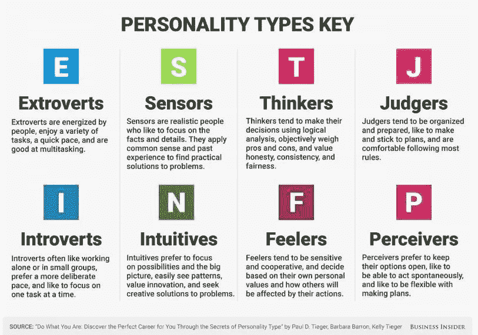

[*图片:*](https://www.weforum.org/agenda/2016/10/the-best-jobs-for-your-personality-type/) *斯凯古尔德商业内幕*

最初的测试包括一份自我报告的问卷，旨在将受访者分为 16 种性格类型(上述维度的可能组合)，通常用于衡量一个人对自我表达、信息处理、规划和决策的偏好。

我们已经将人格特质检测作为监督学习问题来处理。我们的过程是训练四个分类器来预测四种 MBTI 类型的二元结果。因此，从本质上来说，对于一段文字摘录，每个分类器都会预测 MBTI 人格类型的四个维度中的一个。

# 数据集和预处理

在我们的分类器开发中使用了两个训练语料库，而第三个数据集用于这项工作的公司概况映射部分。

1.  *训练集:*由 8600 个带标签的条目和帖子组成的 Kaggle 数据集，以半随意的语气编写
2.  *训练集:*由 9300 篇帖子组成的 Reddit 数据集，以非正式的语气编写
3.  *测试集:*从 10 家公司的 12000 名员工中收集的 LinkedIn 数据集，以随意到专业的语气编写

# 考虑用于文本丰富的特征(特征工程)

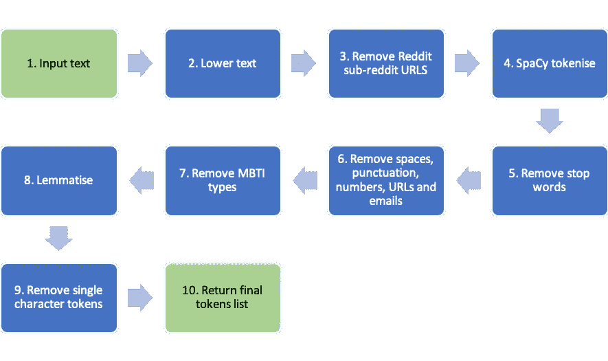

接下来是标记化过程。按作者列出的流程

上面的过程总结了生成用于创建术语-文档矩阵的最终标记列表所采取的步骤。该矩阵包含在语料库中出现的单词的频率，它广泛用于文本分析领域，以执行诸如文档相似性或情感分析之类的任务。

虽然许多步骤遵循标准惯例，但源文本的性质意味着我们也删除了 URL 和电子邮件，以及对 MBTI 类型和 Reddit subreddit URLs 的引用。为了减少特征稀疏性，采用了一个引理满足过程来将单词简化为它们的基本形式，并且选择了引理满足而不是词干来尽可能多地保留基本单词中的含义。最初也考虑了标点和大写，但是，在初步调查后，我们无法在它们中找到任何有意义的预测能力，因此在标记化过程中也进行了标点删除和大小写降低。

我们遵循一种与文献中发现的方法一致的方法，并使用单词-单字将文本表示为加权的术语-文档矩阵。初步实验发现,(单词)二元语法和三元语法表示降低了预测性能，并在术语-文档矩阵中引入了稀疏性。类似地，字符 n-grams 产生不利的结果，因此不用于术语加权过程。最后，使用 tf-idf(术语频率-逆文档频率)加权过程将术语-文档矩阵转换为分类器使用的文本的归一化特征表示。我们使用正则表达式、SpaCy 和 scikit-learn 方法的组合来实现这些转换。初步实验确定，只需要前 2000 个最频繁出现的单字就可以获得足够的分类性能。除了 tf-idf 矩阵之外，还添加了其他几个功能来尝试捕捉文本中情感表达和个性的细微差别，如下所述。

**语言特征** 研究由 *(Mairesse et al .，2006；梅尔等人，2006)* 注意，外向性格的特点是更多地使用动词、副词和代词。外向类型的句子往往更简单，用词更少，词汇多样性更低，否定也更少。相反，内向的人一般会用更多的否定词，使用更广泛的词汇。为了识别这些差异，为每个用户帖子计算了一个*形式分数(Heylighen 和 Dewaele，1999)* :

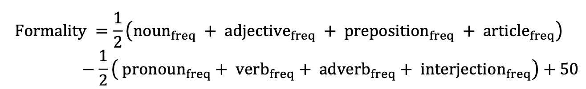

其中频率是作为句子中所写单词总数的一部分来测量的词类。较高的正式程度表明文本中的表达语气较弱。计算每个用户帖子的形式分数，并记录为平均形式分数。空间位置(词类)标记用于标识等式中所需的词类。

此外，还计算了每个帖子的其他几个特征，以捕捉词汇多样性和单词用法:

1.  类型与标记比率:唯一单词的数量除以单词总数。
2.  每句话的平均字数:句子复杂性的一个代表
3.  平均单词长度:词汇使用的代表

**心理语言学特征** NRC(国家研究委员会)情感词典 *(Mohammad and Turney，2013)* 被用来识别沿着八个基本极点的单词:

*   欢乐-悲伤
*   愤怒-恐惧
*   信任-厌恶
*   期待-惊喜

该词典还用于确定大约 20，000 个单词的效价、唤醒和支配维度上的单词强度以及两个额外的情绪得分(积极和消极)。这样每个单词总共有 13 分。13 个 NRC 维度中的每一个都被转换为特征，方法是根据每个用户帖子中的频率对各个 NRC 单词值进行加权，并将每个特征表示为每个帖子中所写单词总数的一部分。这为每个帖子产生了 13 个 NRC 特征向量，这些向量被连接到 tf-idf 矩阵上用于分类器训练。

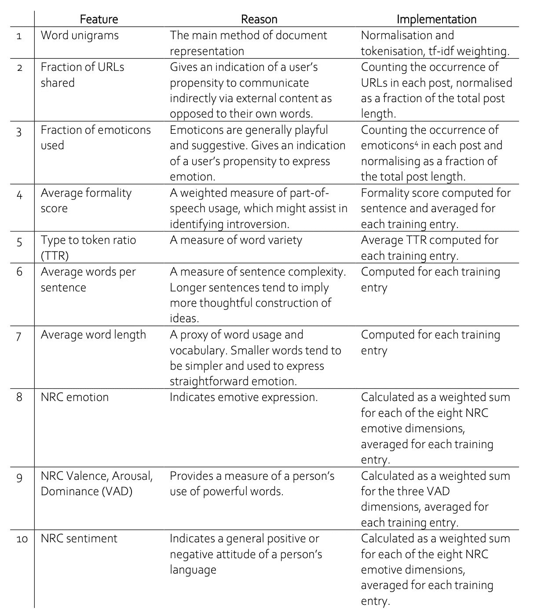

用于分类器训练的特征总结

# 分类器和参数说明

这项工作中的人格特质评估包括预测四个 MBTI 维度作为四个独立的二元结果。所以基本上给定一篇文章，我们会试着从中预测 4 种不同的结果，即

1.  内向或外向，**即**
2.  直观还是感应， **N-S**
3.  思维或感觉， **T-F**
4.  判断或感知， **J-P**

构建了五个分类器，用于确定四个人格维度中的每一个:

1.  随机森林
2.  支持向量机(SVM)
3.  逻辑回归
4.  伯努利朴素贝叶斯
5.  多数类分类器

之所以选择随机森林分类器，是因为树的结构允许理解用于得出预测的决策逻辑。SVM 和 LR 分类器在文献中经常被报道为从文本进行个性预测的流行选择。使用(伯努利)Naïve 贝叶斯分类器作为对照来测试特征(或记号)之间的独立性假设。由于情感通常不仅来源于单词，还来源于单词与句子中其他单词的关系，因此人们会认为 Naïve 贝叶斯分类器在文本分类中表现不佳。最后，多数类分类器被用作基线分类器来与其他四个分类器进行性能比较。

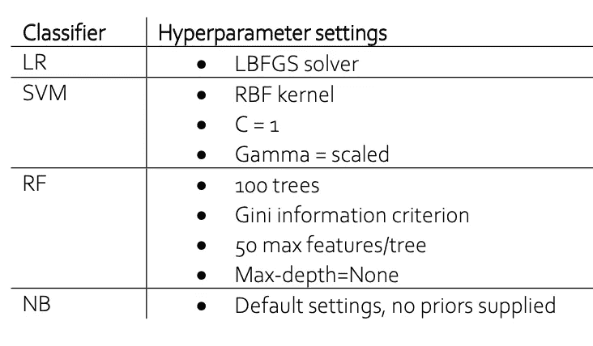

分类器超参数规格

# 结果和讨论

在构建我们的个性分类器时，我们使用的最终特征是:单词单字、分享网址的比例、使用表情符号的比例；平均形式分数；类型与标记的比率；平均每句话字数；平均单词长度；以及 NRC 情绪、效价、唤醒、支配和情绪。我们认为这些特征中的每一个都在一定程度上反映了个人的个性模式，这些特征也在文学中使用。

## 样品内测试

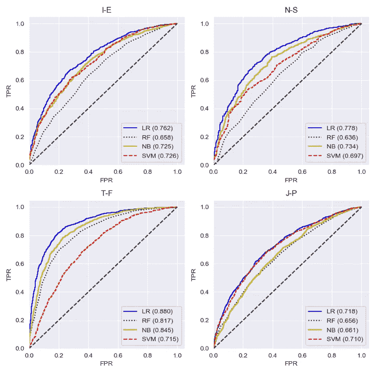

四个 MBTI 维度上的分类器性能(所有特征)。按作者分类的图表

上图总结了使用 ROC 曲线的分类器性能，以及使用 30%保留进行测试的相关 AUC 分数。LR 分类器比 MBTI 分类器具有更高的精确度。除 SVM 分类器外，所有分类器在判断/感知和直觉/感觉维度上的准确率都较低，而思维/感觉维度的准确率最高。

所有分类器通常在这项工作的样本内测试部分表现良好，所达到的精度可与文献中从文本中发现的性格预测的类似工作相媲美(Gjurkovic 和 Šnajder，2018；Mairesse 等人，2007 年；Tchokni 等人，2014 年)。

## 重要词汇

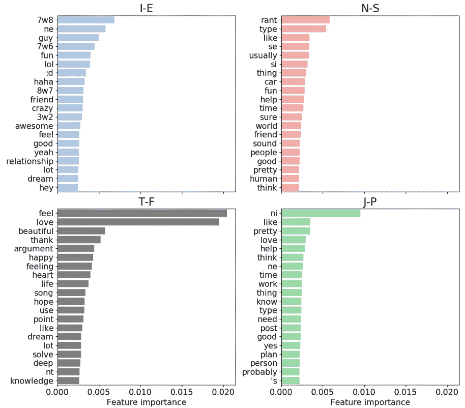

随机森林分类器的前 20 个重要特征。按作者分类的图表

虽然与其他分类器相比，RF 分类器实现了较低的预测精度，但是可以对其进行检查以理解文本分类的决策过程。为了深入了解哪些词可能对某些 MBTI 类型有重要意义，上图显示了来自训练过的 RF 分类器的每个维度的 20 个最相关的特征。

I-E 维度中的数字-字母-数字记号( *7w8* 、 *7w6* 、 *8w7* )对应于记号化过程中未知的来自九型图系统的个性描述。I-E 维度也以使用互联网文化元素为标志，如表情符号( *:D* )和俚语( *lol* )。T- F 维度的特征对积极情感和情绪的词汇反应强烈(如*感受*、*爱*、*美丽*)，而判断和感知维度似乎是由与合理化和分析相关的术语发出的信号(*工作*、*时间*、*思考*、*需要*、*计划*)。直觉和感知特征通常不对应任何具体的主题——而其他类型至少由一个强特征触发，N-S 维度没有这样的特征。这种缺乏区分可能是 RF 分类器准确预测 N-S 维度普遍困难的原因。

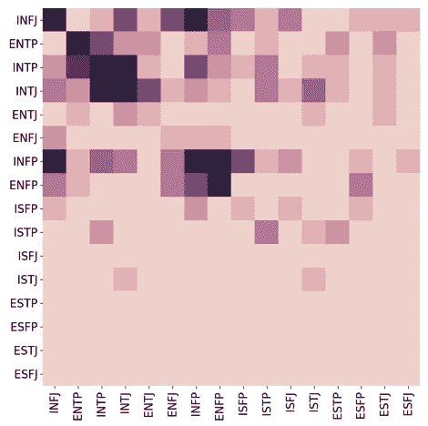

逻辑回归分类器的混淆矩阵。按作者分类的图表

LR 分类器的 16 路混淆矩阵如上图所示。分类器倾向于实现预测内向直觉类型的最大准确度，而预测外向感知类型的较低准确度。这可能反映了训练数据中的类别不平衡，因为在训练集中这些类型的组合相对较少。鉴于这些类型在日常生活中很少见，并且 N-S 和 J-P 维度通常更难通过文本来表达，分类器倾向于更具体的类型是意料之中的。

尽管如此，请注意，正确预测的密度往往是围绕具有相似维度的相似人格类型进行分组的，例如 INTP 和 INTJ。这反映了观察到的这些类型之间的内在相似性，人类可能也很难区分。因此，分类器已经设法识别这种细微差别。

## 同行测试

在前面的章节中，我们描述了几种个性分类器的发展以及它们在样本内测试中的准确性。在本节中，我们通过分析最佳分类器(LR)在对等体上的样本外性能来记录我们对它的分析。

使用 LR 分类器开发了一个两部分的问卷来识别回答者的个性。首先要求用户完成 Myers-Briggs 问卷，然后对以下问题提供书面回答:

1.  说说你自己吧？
2.  你擅长什么？
3.  你喜欢你工作的什么？

然后，这些回答被用来通过分类器评估他们的个性。

**对样本响应的评估** 以下摘录由一位受访者撰写:

*“一个充满激情和热情的人，他相信生活应该是充实的。绝对热爱表演艺术和时尚。我擅长与周围的人产生共鸣，并且非常坚持不懈地实现我的目标。我喜欢能够影响各种各样的人做出直接影响他们生活的决定。能够在公司愿景和公司最大的资产——员工及其需求——之间找到平衡点。”*

他们的 MBTI 人格类型(由调查问卷确定)为 ENF **J.**

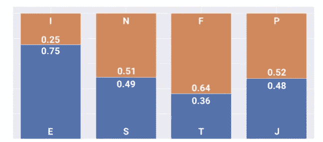

LR 分类器对被调查者 1 的人格类型预测。按作者分类的图表

而分类器预测这个人的性格类型为 ENF **P** (上图)，因此成功地将 MBTI 四个维度中的三个分类。错误分类维度(J-P)估计应答者为 48% J 和 52% P，表明分类器对 J-P 维度的低置信度。我们认为，分类器已经成功识别了样本反应的表达语气，预测了 75%的外向性和 64%的情感。

结果的接近强化了这样一个观念，即人格是不稳定的，取决于许多因素。从这个意义上来说，用可能性的尺度来描述个性可能比用绝对数来描述更合适。来自这种表示的附加细节可能对招聘人员有帮助。

**同伴测试实验的整体准确性** 作为实验的一部分，我们能够收集 15 个不同个体的数据。将来自 MBTI 问卷调查的结果与来自分类器的结果进行比较，结果总结在下表中。

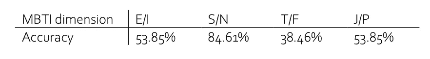

样本外同行分析分类器的准确性

实验的样本量相对较小，因此这些结果仅作为理解分类器效用的基线。预测结果不同于 MBTI 评分的预测结果，并且明显低于样本内的准确性。这一结果强调了这样一个事实，即性格预测是具有挑战性的，尤其是当只使用书面文本来形成预测时。

**比较“相似”的 MBTI 类型**

性格是由许多因素组成的马赛克，两个拥有相同 MBTI 类型的人的性格仍然可能彼此不同。我们通过比较具有相同的基于问卷的 MBTI 类型 ISFJ 的两个应答者的分类器结果来研究这个想法。

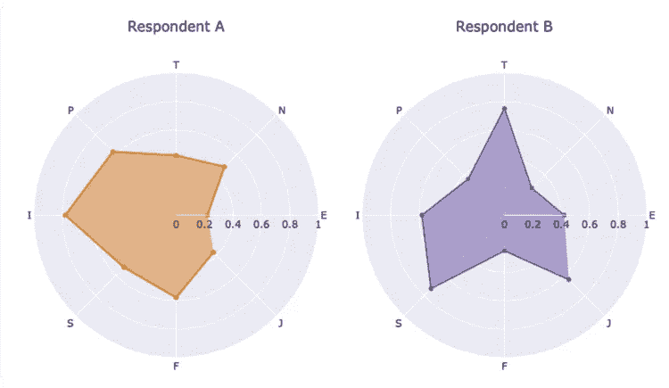

两个具有相同自报 MBTI 类型(ISFJ)的受访者的分类器预测。按作者分类的图表

分类器预测如上图所示，响应者 A 和 B 分别被预测为 ISFP 和 ISTJ。尽管两个候选人都是自我认定的内向敏感型，自由文本显示，回应者 A(78%)比回应者 B (58%)更内向，同样，回应者 B(73%)比回应者 A (52%)更倾向于敏感。

能够根据对一个维度的亲和力来估计个性揭示了更详细的个性景观。因此，通过评估自然语言，组织可以更好地快速识别个性差异，即使他们是相同的基本类型。

# LinkedIn:公司简介映射

现在我们来看这个项目有趣的部分，你一直读到现在的原因。目标很简单，就是确定我们的分类器是否可以用于通过员工档案总结获得关于不同公司及其文化的见解。

我们决定尝试一个非常普遍的假设:
*“咨询公司倾向于偏爱外向的人而不是内向的人”*

收集了“四大”咨询公司(德勤、安永、毕马威和普华永道)雇员的个人资料摘要，然后通过性格分类器。在收集过程中施加了几个条件:

1.  员工应该已经在公司工作了 3 年以上，这样他们的个性才是公司“成功”员工的真实反映。
2.  员工应该在他们的个人资料中列出地区和行业，以过滤掉虚假账户。
3.  简档摘要必须包含至少 50 个单词，以确保分类器有足够的数据用于预测。

满足这些条件的大约 2，500 个轮廓被收集，然后被处理。下图显示了样本中四大性格外向者的平均百分比。据估计，这四家公司都有超过 50%的外向者，这符合我们最初的假设。

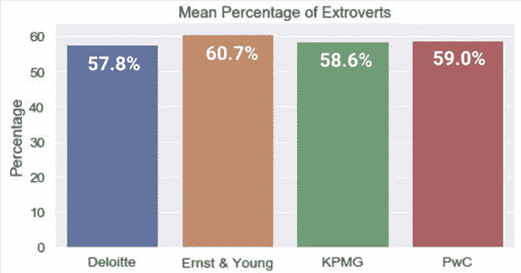

四大咨询公司 LinkedIn 档案中的外向成分。按作者分类的图表

然而，基于 2，500 个样本规模，四家公司之间的差异很小(德勤为 57.8%，安永为 60.7%)。

为了了解外向者在每家公司的分布情况，所有外向者的资料从外向得分最高到最低排列。然后收集每家公司中排名最高的 100 名外向者(得分为 85%及以上)，如下图所示。

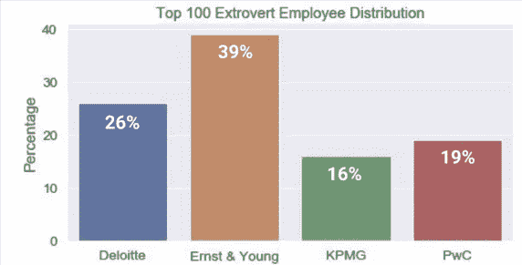

大四中极端外向预测的构成。按作者分类的图表

从这个角度来看，与其他三家咨询公司相比，安永包含了更多极度外向的员工(近 40%)。这可能表明，安永在工作和员工构成方面更为传统，而毕马威似乎更为平衡。

一种推测可能是，随着咨询公司承担更多以技术为导向的工作，这些公司需要通过技术专业化部门来扩展其能力(例如德勤的德勤数字和毕马威的 Solution 49x)。这些部门倾向于雇佣更多的技术型(内向型)员工，这平衡了这些公司的内向-外向分布。

虽然上述结果取决于许多因素(分类器准确性可能是最重要的)，但该分析强调了使用来自自由文本的个性估计作为帮助理解抽象主题(如公司文化和适合度)的手段的潜在好处。

# 结论

我们构建的最终特征反映了文学中使用的内容；以及我们认为是个人性格模式的副产品。使用 RF 分类器，我们发现积极的情感和情绪词汇(如感觉、爱和美丽)强烈反映了 T-F 维度。相比之下，判断和感知维度似乎与理性化和分析相关(如工作、时间、思考、需求和计划)。

我们还发现，与 MBTI 类型相比，逻辑回归实现了最高的样本内准确性；能够成功识别相似维度之间的细微差别。这种性能与文献中发现的性能相当。除了单词 n-grams 之外，还考虑了九个特征，但是它们没有为这项任务提供太多的预测能力。

在评估四大咨询公司对外向个人的偏好时，我们发现安永有明显更高的偏好，这是基于从他们的 LinkedIn 档案中分类的“极度外向”的员工。

经过思考，分类器似乎可以从文本中识别与个性相关的一些细微差别，但是，它的性能还可以改进，我们注意到大部分预测能力仅来自单词单字。如果也使用文本以外的信息，可能会得到更好的估计。对于公司简介映射的应用，可以使用与 LinkedIn 上使用的语言和功能更接近的数据集。因此，一般来说，个人资料的元特征，如联系数量、发帖频率、教育程度和性别，可能是更好的个性鉴别器(在专业背景下)。

一个交互式 Jupyter 笔记本，使用了文章中提到的 LR 分类器，供您参考。它从文本输入中估计 MBTI 类型，请随意下载代码并亲自尝试一下！

**Github 链接:**[https://Github . com/wiredtoserve/data science/tree/master/personality detection](https://github.com/wiredtoserve/datascience/tree/master/PersonalityDetection)

# 参考

[1]于尔科维奇，m，Šnajder，j，2018。Reddit:个性预测的金矿，收录于:第二届社交媒体中人们观点、个性和情绪的计算建模研讨会会议录。第 87-97 页。

[2]f .海利根，j . m .德瓦勒，1999 年。定义、测量和行为决定因素。Brüssel.自由大学“利奥·使徒”中心实习生

[3]f .迈尔塞、m .沃克等人，2006 年。单词标志着书呆子:通过语言进行人格识别的计算模型，收录于:认知科学学会年会论文集。

[4]f .迈尔塞，沃克，M.A .，梅尔，M.R .，摩尔，R.K .，2007 年。使用语言线索自动识别对话和文本中的个性。人工智能研究杂志 30，457–500。

[5] Mehl，M.R .，Gosling，S.D .，Pennebaker，J.W .，2006 年。自然环境中的人格:日常生活中人格的表现和隐含的民间理论。人格与社会心理学杂志 90，862。

[6]穆罕默德，S.M .，特尼，博士，2013 年。Nrc 情感词典。加拿大国家研究委员会。2014 年，凯西亚特区，D.O .的 Tchokni，Sé aghdha。表情符号和短语:社会媒体中的地位象征，载于:第八届网络日志和社会媒体国际 AAAI 会议。