# 基于 Bert 和通用语句编码器的 Spark NLP 文本分类

> 原文：<https://towardsdatascience.com/text-classification-in-spark-nlp-with-bert-and-universal-sentence-encoders-e644d618ca32?source=collection_archive---------3----------------------->

## 在 Spark NLP 中使用 Bert 和通用句子编码器训练 SOTA 多类文本分类器，只需不到 10 分钟的几行代码。


由 [Unsplash](https://unsplash.com?utm_source=medium&utm_medium=referral) 上的[absolute vision](https://unsplash.com/@freegraphictoday?utm_source=medium&utm_medium=referral)拍摄

自然语言处理(NLP)是许多数据科学系统中的关键组件，必须理解或推理文本。常见的用例包括文本分类、问题回答、解释或总结、情感分析、自然语言 BI、语言建模和消歧。

NLP 在越来越多的人工智能应用中是必不可少的。如果你正在构建聊天机器人，搜索专利数据库，将患者与临床试验相匹配，给客户服务或销售电话评分，从财务报告中提取事实或解决这些[17 个行业的 44 个用例中的任何一个](https://www.tractica.com/newsroom/press-releases/natural-language-processing-is-a-key-engine-of-ai-market-growth-enabling-44-discrete-use-cases-across-17-industries/)，从自由文本中提取准确的信息是必不可少的。

**文本分类**是现代自然语言处理中的[主要任务之一，它的任务是给一个句子或文档分配一个合适的类别。类别取决于所选的数据集，范围可以是主题。](http://nlpprogress.com/)

每个文本分类问题都遵循相似的步骤，并且用不同的算法来解决。更不用说像随机森林或逻辑回归这样经典和流行的机器学习分类器了，针对各种文本分类问题提出的深度学习框架[超过 150 个。](https://arxiv.org/pdf/2004.03705.pdf)

文本分类问题中使用了几个基准数据集，最新的基准可以在[nlpprogress.com](http://nlpprogress.com/english/text_classification.html)上追踪。这是关于这些数据集的基本统计数据。

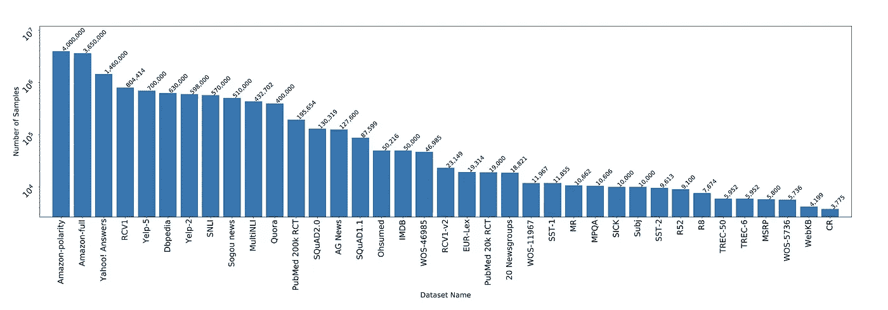

文本分类基准数据集

简单的文本分类应用程序通常遵循以下步骤:

*   文本预处理和清理
*   特征工程(从文本创建手工特征)
*   特征矢量化(TfIDF、计数矢量化器、编码)或嵌入(word2vec、doc2vec、Bert、Elmo、句子嵌入等。)
*   用 ML 和 DL 算法训练模型。

# Spark 自然语言处理中的文本分类

在本文中，我们将使用通用句子嵌入在 [Spark NLP](https://nlp.johnsnowlabs.com/) 中构建一个文本分类模型。然后我们将它与其他 ML 和 DL 方法以及文本矢量化方法进行比较。

Spark NLP 中有几个文本分类选项:

*   Spark NLP 中的文本预处理和使用来自 [Spark ML](https://spark.apache.org/docs/latest/ml-guide.html) 的 ML 算法
*   Spark ML 的 Spark NLP 和 ML 算法中的文本预处理和单词嵌入(Glove、Bert、Elmo)
*   Spark ML 的 Spark NLP 和 ML 算法中的文本预处理和句子嵌入(通用句子编码器)
*   Spark 自然语言处理中的文本预处理和分类器

正如我们在关于 Spark NLP 的[开创性文章中彻底讨论的那样，`ClassifierDL`之前的所有这些文本处理步骤都可以在一个指定为一系列阶段的流水线中实现，每个阶段要么是转换器，要么是估计器。这些阶段按顺序运行，输入数据帧在通过每个阶段时会发生转换。也就是说，数据按顺序通过拟合的管道。每个阶段的 *transform()* 方法更新数据集并将其传递给下一个阶段。在管道的帮助下，我们可以确保训练和测试数据经过相同的特征处理步骤。](/introduction-to-spark-nlp-foundations-and-basic-components-part-i-c83b7629ed59)

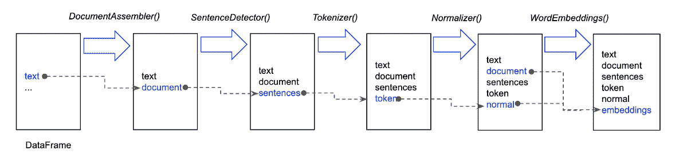

应用的每个注释器都会向数据框添加一个新列，该数据框将被输入到管道中

以下是 Saprk NLP 中可用的单词/句子嵌入和语言模型。

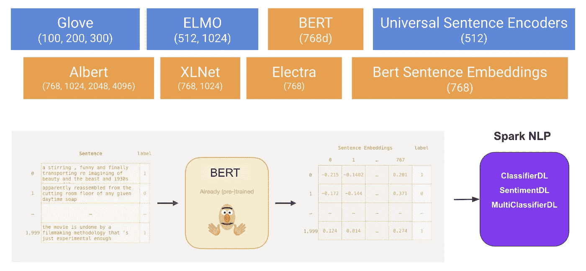

Spark NLP 有 3 个接受句子嵌入的文本分类器

# 通用句子编码器(使用)

在自然语言处理(NLP)中建立任何深度学习模型之前，文本嵌入起着主要作用。文本嵌入将文本(单词或句子)转换成数字向量。

> 基本上，文本嵌入方法将**单词**和**句子**编码在固定长度的密集向量中，以显著改善文本数据的处理。这个想法很简单:出现在相同上下文中的单词往往有相似的意思。

像 Word2vec 和 Glove 这样的技术是通过将单词转换成矢量来实现的。因此“猫”的对应向量将比“鹰”更接近“狗”。但是在嵌入一个句子时，需要在这个向量中捕获整个句子的上下文以及单词。[这就是“通用句子编码器”出现的地方](/use-cases-of-googles-universal-sentence-encoder-in-production-dd5aaab4fc15)。

通用语句编码器将文本编码成高维向量，这些向量可用于文本分类、语义相似性、聚类和其他自然语言任务。预训练的通用句子编码器在 [Tensorflow-hub](https://tfhub.dev/) 中公开提供。它有两种变化，即一种用**变压器编码器**训练，另一种用**深度平均网络(DAN)** 训练。

Spark NLP 还使用了 [Tensorflow-hub](https://tfhub.dev/) 版本的 use，它被封装在一种方式中，让它在 Spark 环境中运行。也就是说，您可以在 Spark NLP 中即插即用，以分布式方式训练模型。

使用为句子生成嵌入，而无需进一步计算，而不是对句子中每个单词的单词嵌入进行平均来获得句子嵌入。

# 基于 ClassifierDL 的文本分类及其在 Spark NLP 中的应用

在本文中，我们将使用文本分类任务中的基准数据集之一的 [AGNews 数据集](http://groups.di.unipi.it/~gulli/AG_corpus_of_news_articles.html)，使用版本 2.4.4 中添加到 [Spark NLP 的最新分类模块 **ClassifierDL** annotator，在 Spark NLP 中构建一个文本分类器。](https://github.com/JohnSnowLabs/spark-nlp/releases/tag/2.4.4)

是 Spark NLP 中第一个多类文本分类器，它使用各种文本嵌入作为文本分类的输入。`ClassifierDL`注释器使用深度学习模型(DNNs ),该模型内置于 TensorFlow 中，支持多达 50 个类。

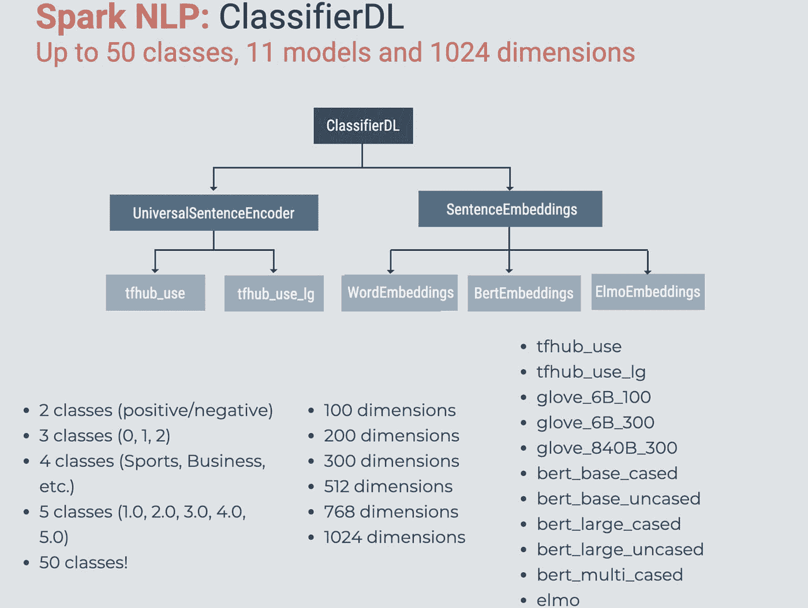

也就是你可以用这个`ClassiferDL`在 Spark NLP 中构建一个`Bert`、`Elmo`、`Glove`、`Universal Sentence Encoders`的文本分类器。

让我们开始编码吧！

开始加载必要的包并启动 Spark 会话。

```
import sparknlpspark = sparknlp.start() 
# sparknlp.start(gpu=True) >> for training on GPUfrom sparknlp.base import *
from sparknlp.annotator import *
from pyspark.ml import Pipeline
import pandas as pdprint("Spark NLP version", sparknlp.version())print("Apache Spark version:", spark.version)>> Spark NLP version 2.4.5
>> Apache Spark version: 2.4.4
```

然后我们可以从 [Github repo](https://github.com/JohnSnowLabs/spark-nlp-workshop/tree/master/tutorials/Certification_Trainings/Public) 下载`[AGNews data set](http://groups.di.unipi.it/~gulli/AG_corpus_of_news_articles.html)`。

```
! wget [https://raw.githubusercontent.com/JohnSnowLabs/spark-nlp-workshop/master/tutorials/Certification_Trainings/Public/data/news_category_train.csv](https://raw.githubusercontent.com/JohnSnowLabs/spark-nlp-workshop/master/tutorials/Certification_Trainings/Public/data/news_category_test.csv)! wget [https://raw.githubusercontent.com/JohnSnowLabs/spark-nlp-workshop/master/tutorials/Certification_Trainings/Public/data/news_category_test.csv](https://raw.githubusercontent.com/JohnSnowLabs/spark-nlp-workshop/master/tutorials/Certification_Trainings/Public/data/news_category_test.csv)trainDataset = spark.read \
      .option("header", True) \
      .csv("news_category_train.csv")trainDataset.show(10, truncate=50)>> 
+--------+--------------------------------------------------+
|category|                                       description|
+--------+--------------------------------------------------+
|Business| Short sellers, Wall Street's dwindling band of...|
|Business| Private investment firm Carlyle Group, which h...|
|Business| Soaring crude prices plus worries about the ec...|
|Business| Authorities have halted oil export flows from ...|
|Business| Tearaway world oil prices, toppling records an...|
|Business| Stocks ended slightly higher on Friday but sta...|
|Business| Assets of the nation's retail money market mut...|
|Business| Retail sales bounced back a bit in July, and n...|
|Business|" After earning a PH.D. in Sociology, Danny Baz...|
|Business| Short sellers, Wall Street's dwindling  band o...|
+--------+--------------------------------------------------+
only showing top 10 rows
```

`AGNews`数据集有 4 个类:`World, Sci/Tech, Sports, Business`

```
from pyspark.sql.functions import coltrainDataset.groupBy("category") \
    .count() \
    .orderBy(col("count").desc()) \
    .show()
>>
+--------+-----+
|category|count|
+--------+-----+
|   World|30000|
|Sci/Tech|30000|
|  Sports|30000|
|Business|30000|
+--------+-----+testDataset = spark.read \
      .option("header", True) \
      .csv("news_category_test.csv")testDataset.groupBy("category") \
    .count() \
    .orderBy(col("count").desc()) \
    .show()>>
+--------+-----+
|category|count|
+--------+-----+
|Sci/Tech| 1900|
|  Sports| 1900|
|   World| 1900|
|Business| 1900|
+--------+-----+
```

现在我们可以将这个数据帧提供给 Spark NLP[document assembler](https://medium.com/spark-nlp/spark-nlp-101-document-assembler-500018f5f6b5)，它是任何 Spark 数据报的 Spark NLP 的入口点。

```
# actual content is inside description columndocument = DocumentAssembler()\
    .setInputCol("description")\
    .setOutputCol("document")

# we can also use sentence detector here 
# if we want to train on and get predictions for each sentence# downloading pretrained embeddings
use = UniversalSentenceEncoder.pretrained()\
 .setInputCols(["document"])\
 .setOutputCol("sentence_embeddings")# the classes/labels/categories are in category columnclasssifierdl = ClassifierDLApproach()\
  .setInputCols(["sentence_embeddings"])\
  .setOutputCol("class")\
  .setLabelColumn("category")\
  .setMaxEpochs(5)\
  .setEnableOutputLogs(True)use_clf_pipeline = Pipeline(
    stages = [
        document,
        use,
        classsifierdl
    ])
```

仅此而已。我们获取数据集，输入，然后从`USE`获取句子嵌入，然后在`ClassifierDL`中训练。零文本预处理或清洗！

现在我们开始训练(试衣)。我们将使用`ClassiferDL`中的`.setMaxEpochs()`参数训练 5 个时期。在`Colab`环境中，大约需要 10 分钟才能完成。

```
use_pipelineModel = use_clf_pipeline.fit(trainDataset)
```

当您运行这个时，Spark NLP 会将训练日志写到您主目录中的`annotator_logs`文件夹。以下是您阅读日志的方法。

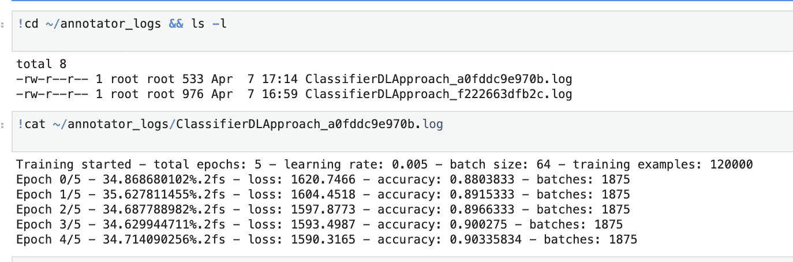

正如你所看到的，我们在不到 10 分钟的时间内达到了 90%以上的验证准确率，没有进行文本预处理，这通常是任何 NLP 建模中最耗时和费力的步骤。

现在让我们看看`test set`上的预测。我们将使用上面下载的测试集。

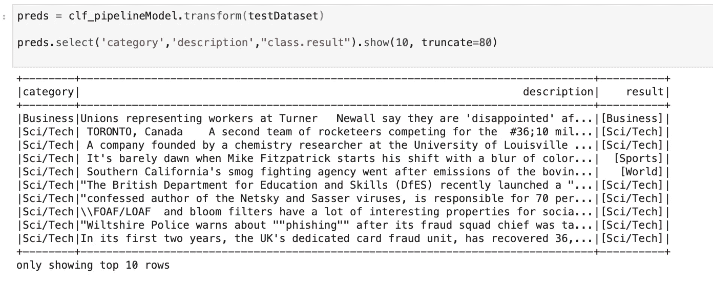

下面是我们如何通过`sklearn`库中的`classification_report`获得测试指标。

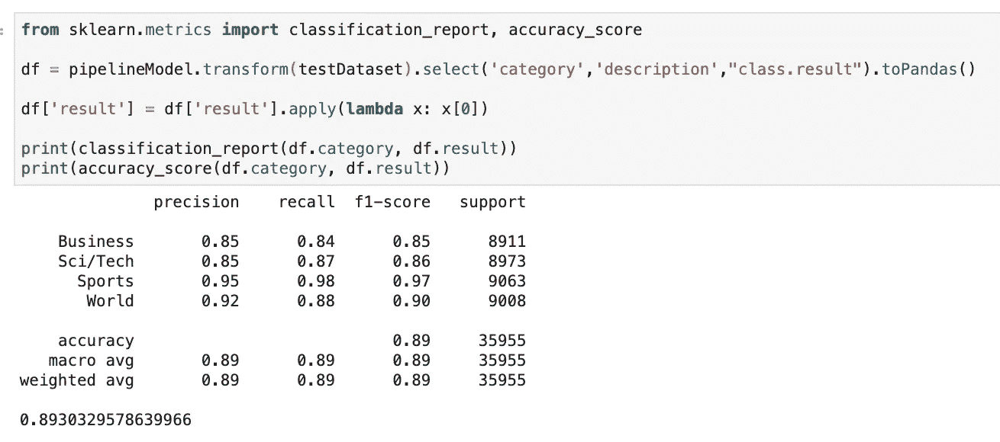

我们达到了 89.3%的测试集准确率！看起来不错！

# Spark 自然语言处理中嵌入 Bert 句子的文本分类

*(在 2.6.0 版本之后，Spark NLP 引入了* `*BertSentenceEmbeddings*` *注释器和 30 多个针对伊莱克特和伯特的预训练句子嵌入模型，大小不一。)*

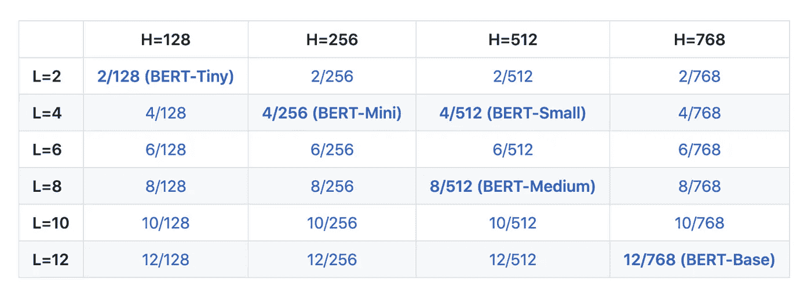

Spark NLP Bert 模型中的命名约定。l 表示在产生嵌入时使用哪个池层，H 表示返回的嵌入的维度。点击查看完整列表[。](https://github.com/JohnSnowLabs/spark-nlp-models)

现在让我们使用`BertSentenceEmbeddings`在同一个数据集上训练一个模型。

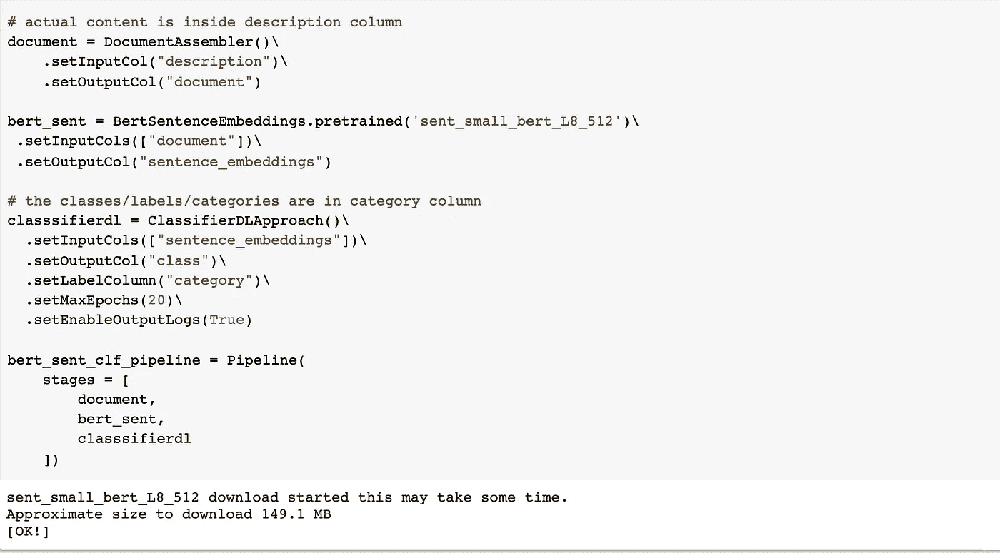

用一个小伯特句子嵌入代替使用

我们只是加载了一个小的具有`L8`和`512`维度的 Bert 句子嵌入，并使用它来代替`USE.`，正如你所看到的，它的大小几乎是`USE`的八分之一，具有 Bert 的强大功能。这是我们在训练后得到的。

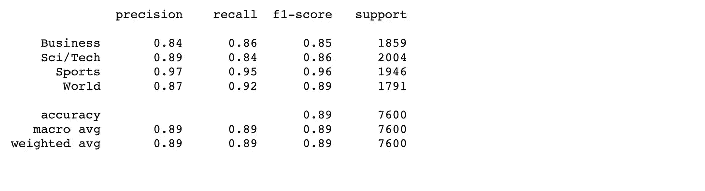

几乎与我们从`USE`获得的指标相同。就像 AutoML on scale 一样，只需要几行代码！

# Spark 自然语言处理中文本预处理的文本分类

正如在任何文本分类问题中的情况一样，有许多有用的文本预处理技术，包括词汇化、词干化、拼写检查和停用词移除，Python 中几乎所有的 NLP 库都有应用这些技术的工具 ***，除了拼写检查*** 。*目前，Spark NLP 库是唯一一个现成的具有拼写检查功能的 NLP 库。*

让我们在 Spark NLP 管道中应用这些步骤，然后用 Glove 单词嵌入训练一个文本分类器。我们将首先应用几个文本预处理步骤(通过仅保留字母、移除停用词、然后移除引理来标准化)，然后获得每个令牌的单词嵌入(令牌的引理)，然后对每个句子中的单词嵌入进行平均，以获得每行的句子嵌入。

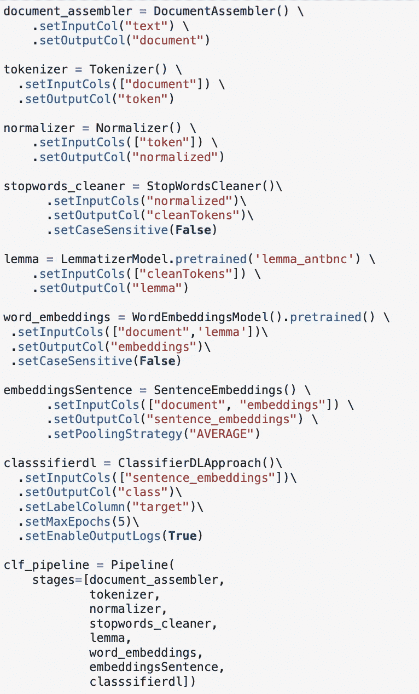

关于 Spark NLP 中的所有这些文本预处理工具，您可以在这个 [Colab 笔记本中找到详细的说明和代码示例。](https://github.com/JohnSnowLabs/spark-nlp-workshop/blob/master/tutorials/Certification_Trainings/Public/2.Text_Preprocessing_with_SparkNLP_Annotators_Transformers.ipynb)

然后我们就能坐上火车了。

```
clf_pipelineModel = clf_pipeline.fit(trainDataset)
```

并获得测试指标。

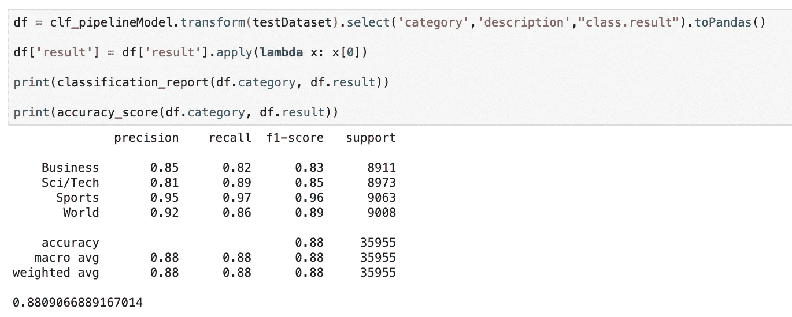

现在我们已经有 88%的测试集准确率了！即使在所有这些文本清理步骤之后，我们也无法击败`Universal Sentence Embeddings + ClassifierDL` :-)，这主要是因为与清理后的版本相比，`USE`通常在原始文本上表现更好，因为它已经在原始句子上进行了训练，当我们应用文本预处理时，我们引入了一些在`USE`被训练时没有看到的`noise`，并且句子一致性在清理时受到了损害。

为了用`BERT`训练同一个分类器，我们可以在上面建立的同一个流水线中用`bert_embeddings`级代替`glove_embeddings`级。你可以在[这个链接](/named-entity-recognition-ner-with-bert-in-spark-nlp-874df20d1d77)找到更多关于我们如何在 Spark NLP 中实现和利用`Bert`的信息。

```
word_embeddings = BertEmbeddings\
    .pretrained('bert_base_cased', 'en') \
    .setInputCols(["document",'lemma'])\
    .setOutputCol("embeddings")\# we can also use Elmo embeddings instead.word_embeddings = ElmoEmbeddings\
      .pretrained('elmo', 'en')\
      .setInputCols(["document",'lemma'])\
      .setOutputCol("embeddings")
```

# 使用 LightPipeline 进行更快速的推断

正如我们之前的一篇文章[中彻底讨论的那样，`LightPipelines`是 Spark NLP 专用管道，相当于 Spark ML 管道，但意味着处理更少量的数据。它们在处理小型数据集、调试结果，或者从服务于一次性请求的 API 运行训练或预测时非常有用。](https://medium.com/spark-nlp/spark-nlp-101-lightpipeline-a544e93f20f1)

【Spark ML 管道是否转换为单机但多线程的任务，对于较小的数据量，速度提高了 10 倍以上(小是相对的，但 50k 句子大约是一个很好的最大值)。要使用它们，我们只需插入一个经过训练的(合适的)管道，然后注释一个纯文本。我们甚至不需要将输入文本转换成数据帧，就可以将它输入到接受数据帧作为输入的管道中。当从一个训练好的 ML 模型中获得几行文本的预测时，这个特性将非常有用。

光管道很容易创建，也让你不用处理 Spark 数据集。它们的速度也非常快，并且只在驱动节点上工作时，它们执行并行计算。让我们看看它是如何应用到我们上面描述的例子中的:

```
light_model = LightPipeline(clf_pipelineModel)text="Euro 2020 and the Copa America have both been moved to the summer of 2021 due to the coronavirus outbreak."light_model.annotate(text)['class'][0]>> "Sports"
```

您还可以将这个训练好的模型保存到您的磁盘上，然后在另一个带有`ClassifierDLModel.load()`的 Spark 管道中使用。

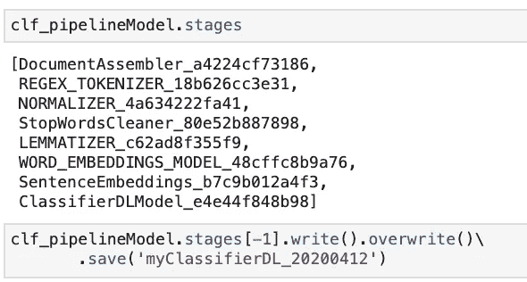

# 结论

在本文中，我们使用流行的单词嵌入和通用句子编码器在 Spark NLP 中训练了一个多类文本分类模型，然后在不到 10 分钟的训练时间内获得了不错的模型精度。完整的代码可以在这个 [Github repo (Colab 兼容)](https://github.com/JohnSnowLabs/spark-nlp-workshop/blob/master/tutorials/Certification_Trainings/Public/5.Text_Classification_with_ClassifierDL.ipynb)找到。我们还准备了[另一个笔记本](https://github.com/JohnSnowLabs/spark-nlp-workshop/blob/master/tutorials/Certification_Trainings/Public/5.1_Text_classification_examples_in_SparkML_SparkNLP.ipynb)来涵盖 Spark NLP 和 Spark ML 中几乎所有可能的文本分类组合(CV、TfIdf、Glove、Bert、Elmo、USE、LR、RF、ClassiferDL、DocClassifier)。

我们还开始为公共和企业(医疗保健)版本提供在线 Spark NLP 培训。这里是所有公开的 Colab 笔记本的链接，它将带你在几个小时内一步一步地从零到英雄。

[John Snow Labs](https://www.johnsnowlabs.com/) 将组织虚拟 Spark NLP 培训，以下是下一次培训的链接:

【https://events.johnsnowlabs.com/online-training-spark-nlp 号

我们希望您已经阅读了我们[官方媒体页面](https://medium.com/spark-nlp)上的前几篇文章，加入了我们的 [slack 频道](http://spark-nlp.slack.com)，并开始玩 Spark NLP。以下是其他文章的链接。别忘了关注我们的页面，敬请期待！

[Spark NLP 简介:基础和基本组件(第一部分)](https://medium.com/spark-nlp/introduction-to-spark-nlp-foundations-and-basic-components-part-i-c83b7629ed59)

[Spark NLP 简介:安装和入门(第二部分)](https://medium.com/spark-nlp/introduction-to-spark-nlp-installation-and-getting-started-part-ii-d009f7a177f3?source=collection_home---6------0-----------------------)

[Spark NLP 101:文档汇编器](https://medium.com/spark-nlp/spark-nlp-101-document-assembler-500018f5f6b5)

[Spark NLP 101:光管道](https://medium.com/spark-nlp/spark-nlp-101-lightpipeline-a544e93f20f1)

[Spark NLP 中带 BERT 的命名实体识别(NER)](/named-entity-recognition-ner-with-bert-in-spark-nlp-874df20d1d77)

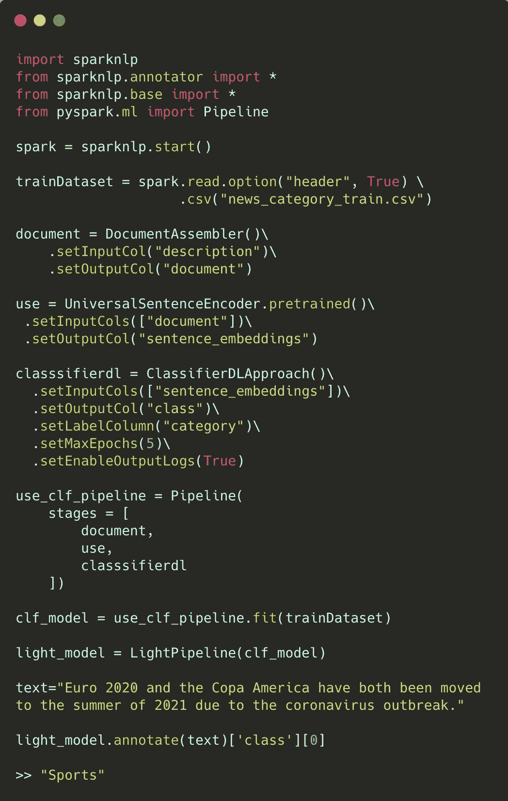

Spark NLP 中使用的文本分类的整个管道