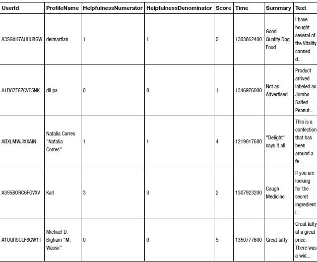

# 亚马逊美食评论的分类

> 原文：<https://towardsdatascience.com/text-classification-of-amazon-fine-food-reviews-ed27948fc1a2?source=collection_archive---------55----------------------->

## 我们如何对客户的反馈进行分类？


照片由克里斯蒂安·威迪格在 Unsplash 上拍摄

这里的目标是根据顾客的文本对食品评论进行分类。所以第一步是下载数据集。对于供应商来说，利用客户的评论来为他们提供更好的服务是非常有趣的。评论包括几个功能，如“产品 Id”、“用户 Id”、“分数”和“文本”。

但是我们如何分析这类问题呢？

# **数据**

让我们看看数据集中包含的要素:

```
print(“There are **{}** observations and **{}** features in this dataset. “\ .format(reviews.shape[0],reviews.shape[1]))There are 568454 observations and 10 features in this dataset.
```

如图所示，该数据集由 568454 篇评论组成，时间跨度超过十年。在这个数据集中有十种不同的特征，但是我们只分别将“文本”和“分数”列作为输入/输出。

我们将根据客户的短信预测分数。这叫做情感分析。其他特征不影响目标和特征之间的关系。

现在，让我们看看数据集中包含的要素:

```
reviews.head()
```



# **数据探索**

为了更好地理解目标(分数)分布，我们使用。seaborn 图书馆的 countplot。通过应用这个导入的函数，我们可以看到分数的分布。

```
**import** **seaborn** **as** **sns** 
**import** **matplotlib.pyplot** **as** **plt** 
sns.countplot(reviews[‘Score’]) 
plt.show()
```


它表明分数五在其余的分数之间有最大的数。基于分数分布，在我们的例子中，我们将它作为我们的目标，它显示分布是偏斜的，我们还可以考虑应用对数使它看起来更像高斯分布。当输入和输出具有高斯分布时，机器学习工作得更好。

让我们看看熊猫的每个特征的类型。info()函数，它也可以让您对特性有一个大致的了解。了解每一列是否有任何缺失值会很有帮助，这样您就能够以有效的方式处理它。

```
reviews.info()
```


由于我们只处理两列，并且没有缺失值，我们不需要删除任何观察值或使用插补转换器来完成缺失值。

# 文本表示

多项式朴素贝叶斯分类器适用于文本分类。基于数据集的大小和创建离散特征，我认为使用运行速度快的机器学习算法是可行的。否则，需要一段时间才能得到满意的输出。

我们的目标是找到输入和输出之间的关系。我使用“文本”作为输入，使用“分数”作为输出。所以我的第一步是把文本转换成向量。我们必须这样做，因为我们对多项式模型使用朴素贝叶斯分类器，而且这种方法也接受数字输入。这与应用任何机器学习算法的技术相同。

```
**from** **sklearn.feature_extraction.text** **import** TfidfTransformer 
**from** **sklearn.naive_bayes** **import** MultinomialNB 
**from** **sklearn.pipeline** **import** Pipeline
```

我们需要将反馈(文本)转换为令牌计数矩阵，以便从文本内容中提取数字特征。这样，计数的稀疏表示就产生了。这是非常有益的，因为你可以想象独特的映射词到向量创建一个矩阵的巨大规模。CountVectorizer 用于此目的，它可以按如下方式导入。

```
**from** **sklearn.feature_extraction.text** **import** CountVectorizer
```

有许多像“the”、“them”、“are”这样的词对上下文的意思没有任何影响，这些词被称为停用词。它们不提供信息，可以通过选择 step_words='english '作为 CountVectorizer 函数中的超参数来删除。

下一步是使用 tf-idf 表示来规范化计数矩阵。标准化频率而不是使用原始频率的主要原因是为了减少在文本中出现几次的标记的影响，并且没有出现几次的标记信息量大。例如，单词“document”在给定的语料库中出现一千次，而“awesome”出现两次。tf-idf 在这种情况下工作，就像预处理数据，将原始特征向量变成更适合机器学习算法的表示。

```
**from** **sklearn.feature_extraction.text** **import** TfidfTransformer
```

# **管道**

我使用管道功能来完成所有步骤。顺序应用变换列表和最终估计器。因此，它开始应用 CountVectorizer、Tfidf，然后是 MultinomialNB。您可以拥有管道工作所需的任意数量的变压器。

```
twitter_sentiment = Pipeline([('CVec', CountVectorizer(stop_words='english')),
                     ('Tfidf', TfidfTransformer()),
                     ('MNB', MultinomialNB())])
```

# **交叉验证**

最后，cross_validate 与 roc_auc 指标一起使用。应用 k-fold 交叉验证，并且以循环中值的平均值来计算性能度量。在我们的例子中，k 被指定为 5。5 和 10 是在 k 倍交叉验证中选择的常见值。下面是这段代码。

```
**from** **sklearn.model_selection** **import** cross_validatecv_pred = cross_validate(twitter_sentiment,
                             reviews['Text'], 
                             reviews['Score'], 
                             cv=5,
                             scoring=('roc_auc_ovr'), n_jobs=-1, verbose =10)
```

# **ROC-AUC**

这是一个分类问题，所以我们用受试者工作特征曲线下的完全面积(ROC-AUC)来衡量预测得分。因为我们有一个多类的问题，我们要去' roc_auc_ovr '。对于这种情况，可以使用其他选项。我们使用 ROC_AUC 测量的结果如下。

```
cv_pred['test_score']array([0.80588185, 0.81448439, 0.8088359 , 0.81728556, 0.81103624])
```

# **结论**

每折一次，分数都在 80%以上。有可用的算法，如随机森林，梯度推进也可以在这里使用。但这取决于你在解决每一个案件中寻找什么。你在寻找一个快速的答案和更好的准确性吗？这两个选项之间总是有一个权衡，您需要为每个数据集选择最佳选项。

完整的代码可以通过这个[链接](https://github.com/shosseini811/Amazon-Fine-Food-Reviews-text-classification-/blob/master/amn-fine-food-reviews.ipynb)访问。