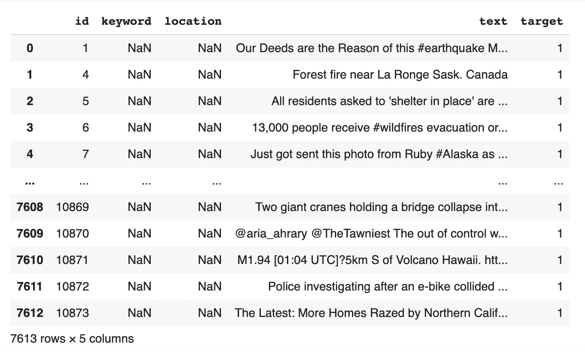
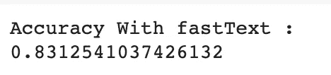
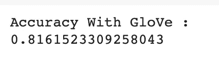
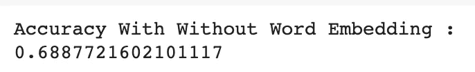

# 基于 LSTM 和单词嵌入的灾难微博文本分类

> 原文：<https://towardsdatascience.com/text-classification-on-disaster-tweets-with-lstm-and-word-embedding-df35f039c1db?source=collection_archive---------15----------------------->

## 单词嵌入对文本分类准确率的影响


[https://www . istock photo . com/photo/disaster-area-with tornado-GM 172448852-23567577](https://www.istockphoto.com/photo/disaster-area-with-tornado-gm172448852-23567577)

这是我的第一个 Kaggle 笔记本，我想为什么不把它也写在介质上呢？

我的 [Github](https://github.com/emmanuellaanggi/disaster_tweet_sentiment) 上的全部代码。

在这篇文章中，我将详细说明如何使用 fastText 和 GloVe 作为文本分类的 LSTM 模型上的单词嵌入。我在做关于自然语言生成的论文时对单词嵌入产生了兴趣。结果表明，嵌入层权重的嵌入矩阵提高了模型的性能。但由于是在 NLG，这种衡量是主观的。我也只用了快速文本。所以在这篇文章中，我想看看每种方法(有快速文本和手套以及没有)对预测的影响。在我的 Github 代码上，我也将结果与 CNN 进行了比较。我在这里使用的数据集来自 Kaggle 上的一个比赛，由推文组成，并标有推文是否使用灾难性的词语来通知真实的灾难，或者只是隐喻性地使用它。老实说，在第一次看到这个数据集时，我立即想到了 BERT 及其理解能力，这比我在本文中提出的要好得多。

但是无论如何，在这篇文章中，我将集中讨论 fastText 和 GloVe。

走吧。

# **数据+预处理**

这些数据由 7613 条带有标签(专栏目标)的推文(专栏文本)组成，无论它们是否在谈论一场真正的灾难。其中 3271 行通知真实灾难，4342 行通知非真实灾难。kaggle 竞赛上分享的数据，如果你想了解更多的数据，你可以在这里阅读。



课文中真实灾难词的例子:

> “拉朗格萨斯克附近的森林**失火**。加拿大"

使用灾难词但不谈论灾难的例子:

> “这些箱子准备**爆炸**！**爆炸**小猫终于来了！小猫游戏#探索小猫"

数据将被分为训练(6090 行)和测试(1523 行)，然后进行预处理。我们将只使用文本和目标列。

```
from sklearn.model_selection import train_test_splitdata = pd.read_csv('train.csv', sep=',', header=0)train_df, test_df = train_test_split(data, test_size=0.2, random_state=42, shuffle=True)
```

此处使用的预处理步骤:

1.  案例折叠
2.  清洗停止字
3.  符号化

```
from sklearn.utils import shuffleraw_docs_train = train_df['text'].tolist()
raw_docs_test = test_df['text'].tolist()
num_classes = len(label_names)processed_docs_train = []for doc in tqdm(raw_docs_train):
  tokens = word_tokenize(doc)
  filtered = [word for word in tokens if word not in stop_words]
  processed_docs_train.append(" ".join(filtered))processed_docs_test = []for doc in tqdm(raw_docs_test):
  tokens = word_tokenize(doc)
  filtered = [word for word in tokens if word not in stop_words]
  processed_docs_test.append(" ".join(filtered))tokenizer = Tokenizer(num_words=MAX_NB_WORDS, lower=True, char_level=False)
tokenizer.fit_on_texts(processed_docs_train + processed_docs_test) word_seq_train = tokenizer.texts_to_sequences(processed_docs_train)
word_seq_test = tokenizer.texts_to_sequences(processed_docs_test)
word_index = tokenizer.word_indexword_seq_train = sequence.pad_sequences(word_seq_train, maxlen=max_seq_len)word_seq_test = sequence.pad_sequences(word_seq_test, maxlen=max_seq_len)
```

# **文字嵌入**

**步骤一。下载预先训练好的模型**

使用[快速文本](https://fasttext.cc/docs/en/english-vectors.html)和[手套](https://nlp.stanford.edu/projects/glove/)的第一步是下载每个预先训练好的模型。我用 Google Colab 防止笔记本电脑使用大内存，所以用*请求*库下载，直接在笔记本上解压。

我使用了两个单词嵌入中最大的预训练模型。fastText 模型给出了 200 万个单词向量(600B 个标记)，GloVe 给出了 220 万个单词向量(840B 个标记)，两者都是在普通爬行上训练的。

**fastText 预培训下载**

```
import requests, zipfile, iozip_file_url = “https://dl.fbaipublicfiles.com/fasttext/vectors-english/wiki-news-300d-1M.vec.zip"r = requests.get(zip_file_url)z = zipfile.ZipFile(io.BytesIO(r.content))z.extractall()
```

**手套预培训下载**

```
import requests, zipfile, iozip_file_url = “http://nlp.stanford.edu/data/glove.840B.300d.zip"r = requests.get(zip_file_url)z = zipfile.ZipFile(io.BytesIO(r.content))z.extractall()
```

**第二步。将预训练模型加载到单词向量中**

FastText 给出了加载单词向量的格式，所以我用它来加载两个模型。

```
embeddings_index = {}f = codecs.open(‘crawl-300d-2M.vec’, encoding=’utf-8')
# for Glove
# f = codecs.open(‘glove.840B.300d.txt’, encoding=’utf-8')for line in tqdm(f):values = line.rstrip().rsplit(‘ ‘)word = values[0]coefs = np.asarray(values[1:], dtype=’float32')embeddings_index[word] = coefsf.close()
```

**第三步。嵌入矩阵**

对于训练数据中每个单词的权重，将在嵌入层使用嵌入矩阵。它是通过枚举训练数据集中存在于标记化单词索引中的每个唯一单词，并使用来自 fastText orGloVe 的权重来定位嵌入权重([更多关于嵌入矩阵](https://machinelearningmastery.com/use-word-embedding-layers-deep-learning-keras/)))。

但是有一种可能性是，有些词不在向量中，比如错别字、缩写或用户名。这些单词将被存储在一个列表中，我们可以比较 fastText 和 GloVe 处理单词的性能

```
words_not_found = []nb_words = min(MAX_NB_WORDS, len(word_index)+1)
embedding_matrix = np.zeros((nb_words, embed_dim))for word, i in word_index.items():
  if i >= nb_words:
     continue
  embedding_vector = embeddings_index.get(word)

  if (embedding_vector is not None) and len(embedding_vector) > 0:
     embedding_matrix[i] = embedding_vector
  else:
     words_not_found.append(word)print('number of null word embeddings: %d' % np.sum(np.sum(embedding_matrix, axis=1) == 0))
```

fastText 上的空词嵌入数是 9175，GloVe 上是 9186。可以假设 fastText 处理更多的单词，即使预训练是在较少的单词上训练的。

# **长短期记忆(LSTM)**

你可以对超参数或架构进行微调，但我将使用非常简单的一个嵌入层，LSTM 层，密集层和辍学层。

```
from keras.layers import BatchNormalization
import tensorflow as tfmodel = tf.keras.Sequential()model.add(Embedding(nb_words, embed_dim, input_length=max_seq_len, weights=[embedding_matrix],trainable=False))model.add(Bidirectional(LSTM(32, return_sequences= True)))
model.add(Dense(32,activation=’relu’))model.add(Dropout(0.3))
model.add(Dense(1,activation=’sigmoid’))model.summary()
```


```
from keras.optimizers import RMSprop
from keras.callbacks import ModelCheckpoint
from tensorflow.keras.callbacks import EarlyStoppingmodel.compile(loss='binary_crossentropy', optimizer='adam', metrics=['accuracy'])es_callback = EarlyStopping(monitor='val_loss', patience=3)history = model.fit(word_seq_train, y_train, batch_size=256, epochs=30, validation_split=0.3, callbacks=[es_callback], shuffle=False)
```

# 结果

fastText 以大约 83%的准确度给出了最好的性能，而 GloVe 给出了 81%的准确度。性能上的差异并不显著，但是与没有单词嵌入的模型的性能(68%)相比，我们可以看到单词嵌入在嵌入层权重上的显著使用。



fastText 单词嵌入的准确性



手套单词嵌入的准确性



无单词嵌入的准确性

关于训练性能的更多信息，详细代码，如果你想在不同的数据集上应用它，你可以在我的 [GitHub](https://github.com/emmanuellaanggi) 上看到完整代码。

感谢您的阅读！