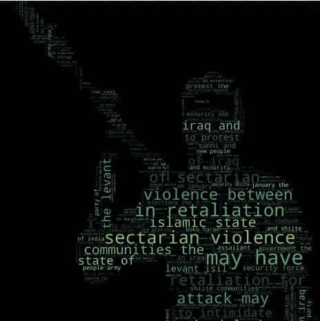
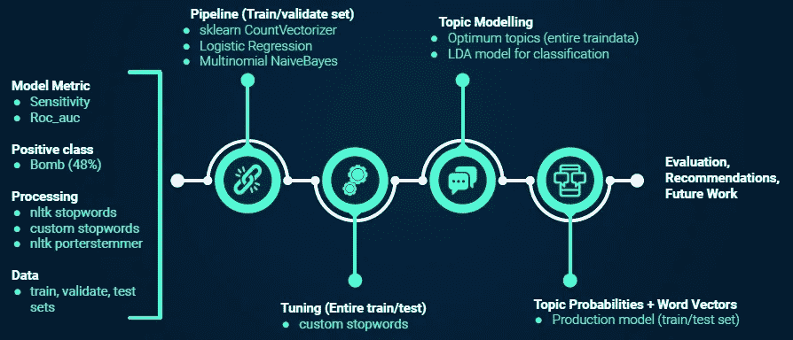
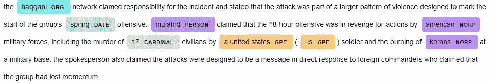
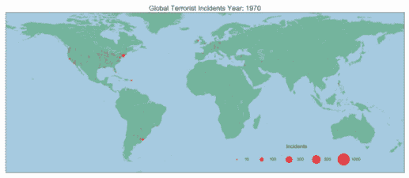
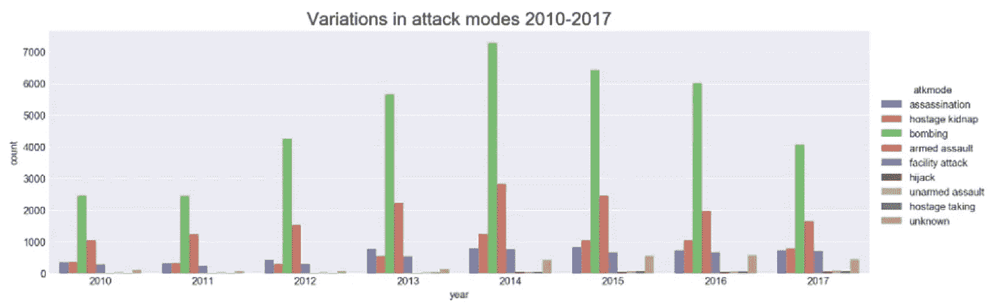
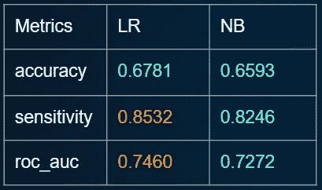
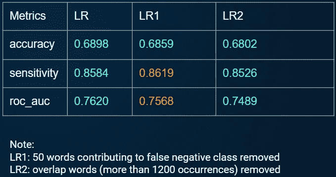
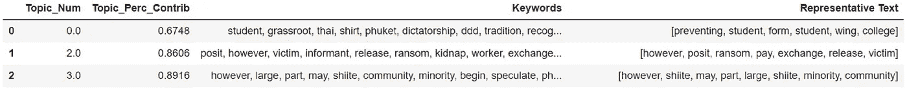
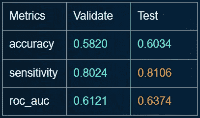
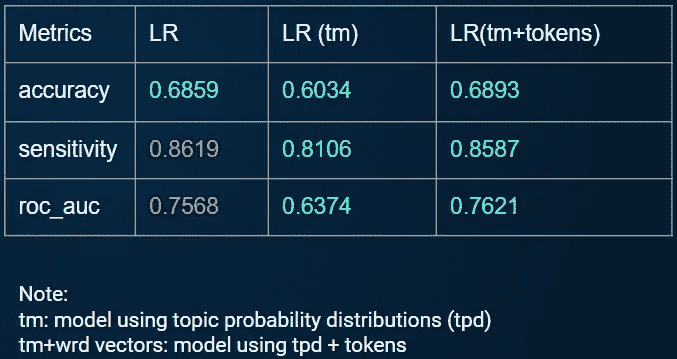

# 文本分类:监督和非监督学习方法

> 原文：<https://towardsdatascience.com/text-classification-supervised-unsupervised-learning-approaches-9fd5e01a036?source=collection_archive---------21----------------------->

## 使用文本特征和主题建模的文本分类探索，从概念到部署



来自动机文本的单词特征。(图片由作者提供)

一年半以前，在参加一个数据黑客马拉松时，我偶然发现 Python 和 Anaconda 是数据科学(DS)的工具。无数的 Python 库强调了 Python 作为数据科学工具包的多功能性。遗憾的是，当时我不具备使用 Python 的必要技能。此后，我参加了 Python 和 SQL 的在线课程，并逐渐对 DS 领域产生了兴趣。为了加快向 DS 的过渡，我参加了大会的数据科学沉浸式(DSI)计划。DSI 是一个为期 3 个月的强化训练营，旨在通过一系列项目的体验式学习，让学生掌握基本的数据科学知识和技能。在这篇文章中，我希望通过我的关于通过动机(intel)文本对恐怖爆炸袭击进行分类的 capstone 项目，分享几个作为 DS 初学者的学习点。

*   **规划很重要，但灵活性也很重要—** 对于 capstone，我们可以自由选择主题。然而，当我们提出我们最初选择的主题和问题陈述时，可能不会立即显而易见的是*作为 DS 项目的主题*需要由数据的**可用性来支持。我最初选择的数据集一周后才可用(Kaggle 竞赛)。听从导师的指导，在决定 Kaggle 上的[**【GTD】**](https://www.kaggle.com/START-UMD/gtd)全球恐怖主义数据集之前，我研究了 [**UCI**](https://archive.ics.uci.edu/ml/datasets.php) 和 Kaggle 数据仓库。我选择这个主题是因为 1)我想在做一些稍微不同的事情时重温 NLP 技术，2)探索 ***潜在狄利克雷分配(LDA)的潜力；一个无监督的 NLP 主题建模，作为分类的监督学习输入*** 。**
*   **尝试维护建模工作流程的概述—** 可视化建模工作流程有助于项目组织，并确保项目交付的一致性。在其他任务中，当试图在完成顶点工作的同时平衡高级主题时，更是如此。它还帮助节省了宝贵的时间，将一个人在机器学习方法上的思维过程转化为一种可以与导师和同学轻松交流的格式。节省下来的时间用于模型部署，这也带来了许多惊喜和学习机会。建模工作流也有助于分配时间来重温以前的技术和尝试新事物(例如，动画，图像遮罩，主题模型，模型部署)。让我们深入研究一下技术细节！



模型工作流程(图片由作者提供)

## 数据集和探索性数据分析(EDA)

Kaggle 上有几个关于全球恐怖主义的数据集。对于 capstone，我使用了从 1970 年到 2017 年的数据集。由于数据集的大小，我使用了 [**Git 大文件存储**](https://git-lfs.github.com/) 来管理文件到 Github 的推送。数据集以 ISO-8859–1 格式编码，读取文件时需要指定该格式。谢天谢地，这是 Kaggle 上讨论的少数几个话题之一。但是，如果遇到另一种格式但不确定其编码，该怎么办呢？Agnese Poikane-Puchok 的这个 [**方法**](https://gist.github.com/puchokagnese/c8c4d5434508bd7704d3cfddb1049dd4) 应该会派上用场。该数据集包含 181，691 个条目和 135 个变量，描述了特定恐怖事件的细节。作为一个 NLP 项目，感兴趣的主要特征是描述任何恐怖事件的背景、犯罪者、目标和信息来源的动机文本。我使用[***spaCy***](https://spacy.io/)*来可视化动机文本中的识别实体和短语结构。措辞的一致性有助于建立将其用作文本分类输入的信心。它还展示了良好数据质量的重要性。然而，由于动机文本是 1997 年后引入的一个特征，在数据清理后，只有 32，521 个条目具有足够的文本数据用于文本分类。*

**

*动态文本空间实体识别实例(作者图片)*

*EDA 中使用的其他变量有助于了解全球恐怖主义趋势，从最活跃的团体到最受欢迎的袭击形式以及恐怖团体的潜在动机。其他可视化和 EDA 变量选择的基本原理可以在这里访问[(**自述:p03_dataclean_ed，Jupyter 笔记本:P5.0 数据清理，EDA，Feature engineering.ipynb** )。这里提取了一些与文本分类的特征工程直接相关的视觉效果进行说明。](https://github.com/AngShengJun/dsicapstone/tree/master/p03_dataclean_eda)*

**

*1970 年至 2017 年全球恐怖事件(图片由作者提供)*

*受 [**【汉斯·罗斯林】**](https://www.ted.com/talks/hans_rosling_the_best_stats_you_ve_ever_seen) 作品的启发，我探索用动画作为一种手段，从空间和时间的角度来可视化恐怖事件。我最初使用 [ImageMagick](https://www.imagemagick.org/script/index.php) 用于。但无法解决技术问题(生成的。gif 文件自删除),因此，可以依靠第三方软件来实现。gif 文件。直观地看一下这些年来各种攻击方式的比例，轰炸仍然是最受欢迎的攻击方式，占所有攻击方式的 50%。*

**

*2010-2017 年恐怖袭击模式分布(图片由作者提供)*

## *数据准备和文本分类器模型评估(第 1 部分)*

*我将构建一个分类器模型，将动机文本作为输入，输出一个二元分类(炸弹或非炸弹攻击)。我把工程爆炸袭击列为正面类，其他袭击列为负面类。这个职业相对平衡，炸弹攻击占 48%。数据被 80-20 分成训练/测试数据。然后，将训练数据进一步分成 80–20 个训练和验证子集。对于分类器模型，我探索了逻辑回归和朴素贝叶斯模型。结果(基于验证(保持)数据集)总结如下。逻辑回归模型是基于敏感性(目的是减少假阴性，当它们是实际爆炸时预测非爆炸袭击)和 ROC AUC 的更好的执行模型。*

**

*基于验证(保留)数据集的模型指标(图片由作者提供)*

*选择逻辑回归模型作为生产模型，我探索了模型调优，比如检查和删除导致假阴性分类的单词，以及删除重叠的单词。结果总结如下。*

**

*基于测试数据集的生产模型性能(图片由作者提供)*

## *主题建模*

*企业通常使用主题建模和主题分类来从非结构化数据中获取见解(例如，客户情感)。这两者之间的区别:*

*   *主题建模是一种无监督的机器学习方法，它分析文本数据并为一组文档确定聚类词。*
*   *主题分类是一种有监督的机器学习方法。文本数据被预先标记，以便主题分类器可以基于从标记数据中学习到的模式进行分类。*

*LDA 是一种主题建模方法。虽然它在从文档中发现单词簇(主题)方面很有用，但它没有与文本分类器模型集成。由于数据集的原因，用于主题分类的数据的审查和手动标记是站不住脚的。此外，我不具备必要的主题专业知识，无法根据动机文本确定特定恐怖事件可能属于的潜在主题。*

## *LDA 输出作为分类问题的输入*

*Marc Kelechava 的关于使用 LDA 主题模型作为分类模型输入的文章起到了启发作用，并就如何将主题模型集成到文本分类器模型中提供了有价值的见解。在一个主题的每个单词簇的后面，是来自每个动机文本条目的主题的概率分布。如果在主题分布上训练的模型可以在看不见的数据上概括，我们可以推断该模型已经识别了仍然适用于新的看不见的数据的主题群(在这个上下文中的潜在动机)。*

**

*(图片由作者提供)*

*这些是我的步骤:*

1.  *使用训练数据集的主题建模。*
2.  *根据连贯性得分找到最佳的主题数量。*
3.  *根据训练数据训练 LDA 模型。主题概率分布(TPD)随后被用作逻辑回归模型中的特征向量，用于对验证(拒绝)数据集进行二元分类(炸弹攻击与非炸弹攻击)。*
4.  *使用训练好的 LDA 模型从测试数据中导出 TPD。*
5.  *在 TPD 上运行逻辑回归模型，查看模型是否具有普遍性。*

*其中一个关键步骤是提取主题的特征向量。在我的例子中，主题的最佳数量是 41。*

```
*# Make train Vectors
train_vecs = []
for i in range(len(X_train)):
    top_topics = lda_train.get_document_topics(traincorpus[i], minimum_probability=0.0)
    topic_vec = [top_topics[i][1] for i in range(41)]
    train_vecs.append(topic_vec)*
```

*该模型在测试数据集上具有更高的灵敏度和 ROC AUC！下一个问题自然是“如果将来自 CountVectorizer 的记号和来自 LDA 的 TPD 结合起来，模型性能会如何？”*

**

*评估生产模型(图片由作者提供)*

## *文本分类器模型评估(下)*

*由于 CountVectorizer 的输出是令牌计数的稀疏矩阵，因此需要进行一些转换来连接 LDA 输出。有许多方法可以做到这一点。我是这样做的:*

```
*# Convert sparse matrix to dense
X_tr_dense = X_train_cleancv.toarray()
X_ts_dense = X_test_cleancv.toarray()# add numpy array (train and test topic model vectors to dense matrix)
X_tr_dense_tm = np.concatenate((X_tr_dense,X_tr_vec),axis=1)
X_ts_dense_tm = np.concatenate((X_ts_dense,X_ts_vec),axis=1)from scipy.sparse import csr_matrix
# Convert back to sparse matrix for modeling
X_tr_sparse = csr_matrix(X_tr_dense_tm)
X_ts_sparse = csr_matrix(X_ts_dense_tm)*
```

*在此之后，模型预测相对简单。各种方法的比较总结如下。虽然使用组合 TPD 和令牌的模型不如使用计数矢量器的模型执行得好，但它有潜力。*

**

*模型指标摘要(图片由作者提供)*

## *模型部署*

*听从指导员的鼓励，尝试模型部署，我跳进它的权利。模型部署可以是一个令人兴奋的冒险，同时也是一件令人毛骨悚然的事情，尤其是对于像我这样的初学者来说。对于模型部署，我使用 Heroku。它是一个平台即服务(PaaS ),使开发人员能够在云中构建、运行和操作应用程序。下面的逐步演练概述了我在学习过程中的一些发现。希望对于那些寻求部署他们的模型的人来说，它能派上用场。遵循并修改代码以适应您自己的项目需求。*

## *前期需要什么*

1.  *安装 [Git](https://gitforwindows.org/) (如果你还没有；您现在可能已经安装了它)*
2.  *安装 [Heroku 命令行界面](https://devcenter.heroku.com/articles/heroku-cli#download-and-install)*
3.  *建立一个 Heroku 帐户*
4.  *你的模型的 html 页面(设计可能会花费大量的时间，所以你可能想先做这件事。)注:我给它取名为【index.html】*

**考虑您希望部署的模型如何操作。对于我的顶点，分类器模型接受一个清除了自定义停用词的文本列表。在讲师的指导下，我编写了 CountVectorizer、自定义停用词和生产模型。在 Jupyter:**

```
**import pickle
# save model to disk 
filename1 = 'finalized_model.sav'
pickle.dump(model_lr2, open(filename1, 'wb'))
filename2 = 'finalized_cv.sav'
pickle.dump(cv2, open(filename2, 'wb'))
filename3 = 'finalized_stopwords.sav'
pickle.dump(s_words2, open(filename3, 'wb'))**
```

## **设置虚拟环境**

**为了托管您的应用程序(您想要部署的模型)，您还需要 [flask](https://flask.palletsprojects.com/en/1.1.x/) 和 virtualenv。使用 Anaconda Navigator 或 Anaconda 提示符安装它们。然后首先在本地设置一个项目目录空间来托管项目。在我的例子中，我已经有了保存各种项目的主目录，所以代码略有不同。为了我的项目需要，我创建了虚拟环境并命名为 ***顶点*** 。在 Anaconda 提示符下:**

```
**cd virtualenvs
virtualenv capstone
# activate env from Scripts folder
cd Scripts
activate.bat
# to deactivate
deactivate.bat**
```

**安装 [gunicorn](https://gunicorn.org/) (对于 Heroku)，为您的环境冻结 python 模块，如下所示:**

```
**pip install gunicorn
pip freeze >> requirements.txt**
```

**根据自己的项目需求，可以考虑配置需求列表。因为我没有使用大部分模块，所以我手工削减了包(以减少下游的部署时间)。详情请参考 [Github](https://github.com/AngShengJun/dsicapstone/tree/master/p05_deployment) 上的 requirements.txt 文件。**

**在根文件夹中创建一个 ***nltk.txt 文件*** ，用所使用的 nltk 模块填充它。这是供 Heroku-python nltk 使用的。**

## **烧瓶脚本**

**创建一个名为 ***templates*** 的文件夹来存放 html 表单。**

```
**mkdir templates**
```

**将***index.html***移动到该文件夹中。将 pickle 文件复制到项目 virtualenv 文件夹的根目录下(即 ***顶点*** )，以下简称根目录。**

## **Python 脚本**

**在根目录中创建 python 脚本。这些脚本依赖于一个人的模型和功能流。更多详情请参考 Github 上的***required fn . py***和 ***service.py*** (其中我持有应用模型)。**

## **本地原型**

**要运行该服务，请在 Anaconda 提示符下依次输入以下内容。URL 应该显示用户可以访问网页的位置，并根据需要实时调整网页。**

```
**SET FLASK_APP=service.py
SET FLASK_DEBUG=1
flask run**
```

## **赫罗库**

**在根目录下创建一个 ***Procfile*** (没有扩展名！). ***Procfile*** 只需要一行。 ***文件名*** **是包含 flask 应用程序的 python 脚本的名称，flask 名称为 app** 。**

```
**# Within Procfile
web: gunicorn <filename>:<main method name>
# filename refers to the python script containing flask application with flask name app
# app = Flask(__name__)
# In this instance the line is
web: gunicorn service:app**
```

**登录到`Heroku`，使用 Anaconda 提示符创建应用程序并部署**

```
**heroku login
heroku create
# two url returned will be returned, the latter is the Heroku git remote repo where the application lives # on Heroku. The former is the web url where the application will be once deployed.
git add .
git commit -m"message"
git push heroku master
# Ensure at least one instance of application is running
heroku ps:scale web=1
# Say hello to your application!
heroku open**
```

## **警告**

**当前部署的模型过于简单，因为它只接受单个输入(动机文本)。在实际操作中，不期望智能的分类正好落在模型上。对于部署模型的输入，我使用了与爆炸和非爆炸攻击相关的动机文本的相等混合。请前往这个[站点](https://enigmatic-reef-60524.herokuapp.com/)进行测试。有些人可能想知道为什么不为用户输入创建一个输入空间？两个考虑因素:1)当前的模型设置允许将条目链接到地面真相，2)考虑到主题的敏感性，我希望避免游戏化。**

## **总结和未来工作**

**我希望这是一个信息丰富的阅读，并对您的项目需求有用。我打算很快扩展以下领域的顶点:**

*   **探索附加特征对模型性能的影响(特征工程空间和时间方面，如按区域攻击、按十年攻击)。**
*   **探索 tfidf 矢量器和 spaCy 的使用。与 CountVectorizer 类似，TFIDFVectorizer 计算词频，但与语料库(文档集合)中的词频成反比。**
*   **扩展到多类分类。**

**从顶点主题选择到顶点代码和模型部署材料的思考过程在我的 GitHub [这里](https://github.com/AngShengJun/dsicapstone)托管。**

**感谢阅读！**

***后记(2020 年 7 月 5 日):我确实认识到生成的。gif 有点小，很难阅读，我试图找出一种方法来保持生成的分辨率大小。gif(世界地图动画)。如果你有这样做的想法，如果你能提出这样做的方法，我将不胜感激。谢了。***