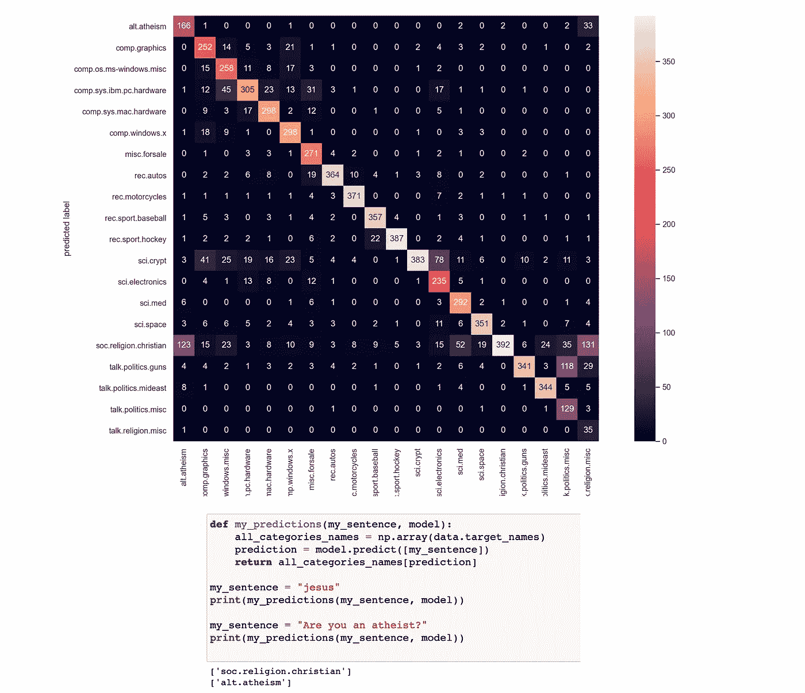
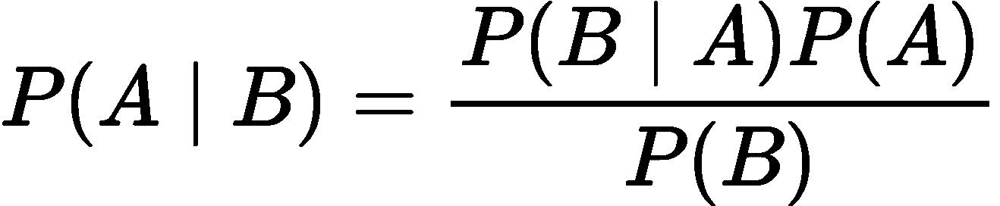
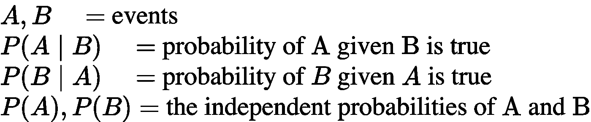
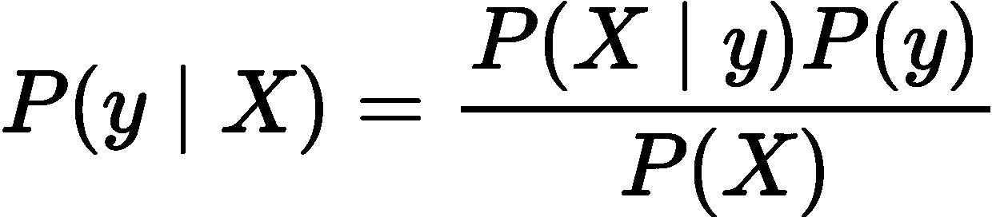
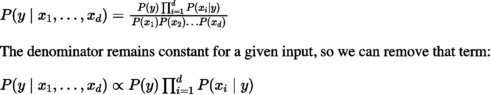
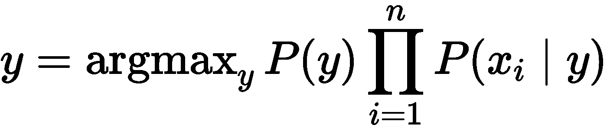
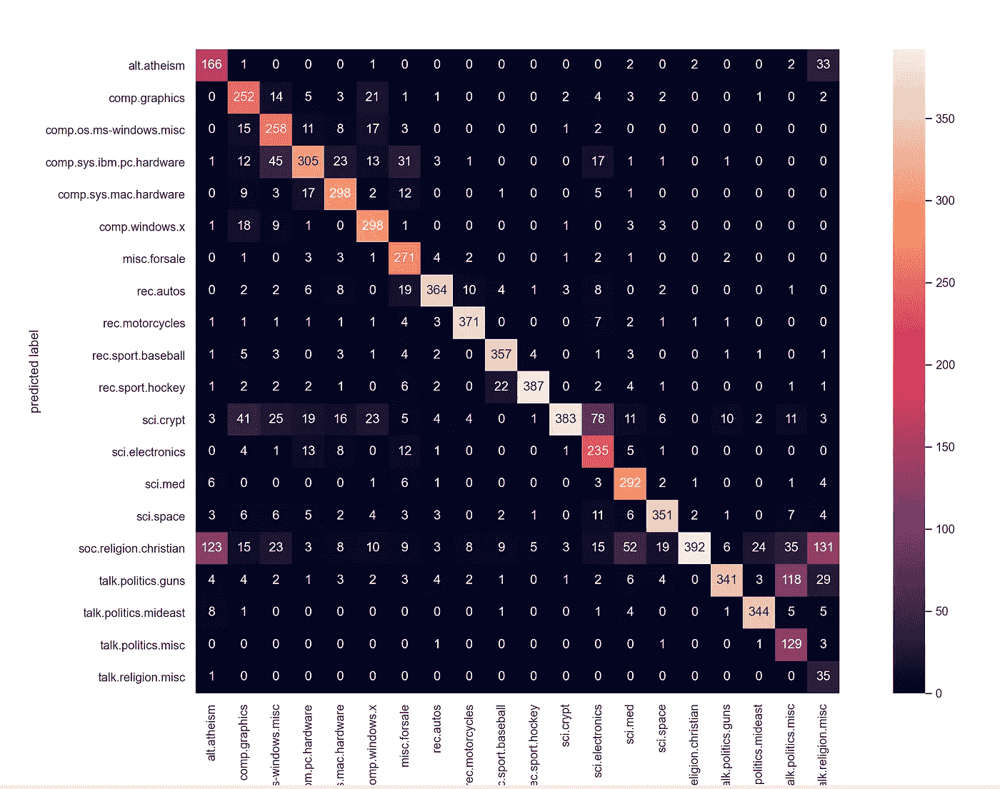

# 基于朴素贝叶斯的文本分类:理论与实例

> 原文：<https://towardsdatascience.com/text-classification-using-naive-bayes-theory-a-working-example-2ef4b7eb7d5a?source=collection_archive---------1----------------------->

## [入门](https://towardsdatascience.com/tagged/getting-started)

## 在本文中，我解释了朴素贝叶斯的工作原理，并一步步用 Python 实现了一个多类文本分类问题。



作者创作的人物。

## 目录

1.  **简介**
2.  **朴素贝叶斯算法**
3.  **处理文本数据**
4.  **Python 中的工作示例(分步指南)**
5.  **奖励:与模特同乐**
6.  **结论**

# 1.介绍

**朴素贝叶斯**分类器是基于**贝叶斯定理**的分类算法集合。它不是一个单一的算法，而是一个算法家族，所有算法都有一个共同的原则，即每一对被分类的特征都是相互独立的。

**朴素贝叶斯**分类器被大量用于**文本分类**和**文本** **分析**机器学习**问题**。

**文本分析**是机器学习算法的主要应用领域。然而，原始数据、符号序列(即字符串)不能直接提供给算法本身，因为大多数算法期望具有固定大小的数字特征向量，而不是具有可变长度的原始文本文档。

在这篇文章中，我将解释 a)朴素贝叶斯如何工作，b)我们如何使用文本 T34，数据 T35，数据 T36，在将它们转换成更合适的形式后，将它们放入模型 T40。最后，我**用 Python** 一步步实现一个**多类文本分类问题。**

我们开始吧！！！

如果你想在交互式路线图和活跃的学习社区的支持下自学数据科学，看看这个资源:[https://aigents.co/learn](https://aigents.co/learn)

# 2.朴素贝叶斯算法

朴素贝叶斯分类器是基于**贝叶斯定理**的分类算法集合。它不是一个单一的算法，而是一个算法家族，所有算法都有一个共同的原则，即每一对被分类的特征都是相互独立的。

数据集分为两部分，即**特征矩阵**和**响应/目标向量**。

*   **特征** **矩阵** (X)包含数据集的所有向量(行)，其中每个向量由**相关特征**的值组成。特征数为 **d** 即 **X = (x1，x2，x2，xd)。**
*   **响应/目标** **向量** (y)包含特征矩阵**每行的**类/组变量**的值。**

## **2.1。朴素贝叶斯的两个主要假设**

朴素贝叶斯假设**同一类的每个特征/变量**构成一个:

*   **独立**
*   **等于**

**对结果的贡献。**

**旁注:**朴素贝叶斯所做的假设在现实世界的情况下一般不正确。事实上，独立性假设经常无法满足，这就是为什么它被称为“**幼稚**”的原因，也就是因为它假设了一些可能不真实的事情。

## 2.2.贝叶斯定理

贝叶斯定理是在已知一个事件发生的概率的情况下，求出另一个事件发生的概率。贝叶斯定理的数学表述如下:



作者创作的人物。

其中:

*   **A** 和 **B** 称为**事件。**
*   P(A | B)是事件 A 的概率，假设事件 B 为真(已经发生)。事件 B 也被称为**证据**。
*   P(A)是 A 的**先验**(先验独立概率，即事件在证据被看到之前的概率)。
*   P(B | A)是给定事件 A 的 B 的概率，即看到证据 A 后事件 B 的概率。

## 摘要



作者创作的人物。

## 2.3.朴素贝叶斯模型

给定一个数据矩阵 **X** 和一个目标向量 **y，**我们将我们的问题表述为:



作者创作的人物。

其中， **y** 为**类变量**， **X** 为维度为 d 的**依赖特征向量，即 X = (x1，x2，x2，xd)，**其中 **d** 为样本的变量/特征个数。

*   P(y|X)是给定样本 **X** 观察到类 **y** 的概率，其中 **X = (x1，x2，x2，xd)，**其中 **d** 是样本的变量/特征的数量。

现在“天真的”[条件独立性](https://en.wikipedia.org/wiki/Conditional_independence)假设开始发挥作用:假设 **X** 中的所有特性都是[相互独立](https://en.wikipedia.org/wiki/Mutually_independent)，以类别 **y** 为条件:



作者创作的人物。

最后，为了找到给定的**样本**对于类变量 ***y*** 的所有可能值的概率，我们只需要找到具有最大概率的输出:



作者创作的人物。

# 3.处理文本数据

此时出现的一个问题如下:

> 我们如何使用原始文本数据来训练模型？原始数据是字符串的集合！

文本分析是机器学习算法的一个主要应用领域。**然而，原始数据、符号序列(即字符串)不能直接提供给算法本身，因为大多数算法期望具有固定大小的数字特征向量，而不是具有可变长度的原始文本文档。**

为了解决这个问题，scikit-learn 提供了从文本内容中提取数字特征的最常见方法的实用程序，即:

*   **标记化**字符串并为每个可能的标记给出一个整数 id，例如通过使用空格和标点符号作为标记分隔符。
*   **统计每个文档中令牌的出现次数**。

在此方案中，特征和样本定义如下:

*   每个**单个令牌出现频率**被视为一个**特征**。
*   给定**文档**的所有令牌频率的向量被视为多元**样本**。

## “计数”示例(为了在我们继续之前真正理解这一点):

```
from sklearn.feature_extraction.text import CountVectorizer
corpus = [
    'This is the first document.',
    'This document is the second document.',
    'And this is the third one.',
    'Is this the first document?',
]vectorizer = CountVectorizer()
X = vectorizer.fit_transform(corpus)print(vectorizer.get_feature_names())
**[‘and’, ‘document’, ‘first’, ‘is’, ‘one’, ‘second’, ‘the’, ‘third’, ‘this’]**print(X.toarray())
[[0 1 1 1 0 0 1 0 1]
 [0 2 0 1 0 1 1 0 1]
 [1 0 0 1 1 0 1 1 1]
 [0 1 1 1 0 0 1 0 1]]
```

在上面的玩具示例中，我们将一组字符串存储在变量**语料库中。**使用**文本** **转换器**，我们可以看到我们的数据中有特定数量的唯一字符串(词汇)。

这可以通过打印**矢量器. get_feature_names()** 变量**来看出。我们观察到我们有 9 个独特的单词。**

接下来，我们打印转换后的数据( **X** )和**，我们观察到以下**:

*   我们在 X 中有 4 行作为我们的文本串的数量(**我们在转换后有相同数量的样本**)。
*   **我们在转换后的数据( **X** ) f **或所有样本(**转换前并非如此，即各个字符串具有不同的长度)中有相同数量的列**(特征/变量)。
*   值 0，1，2 对**出现在**初始文本数据**中的**字**的**频率**进行编码。**

**例如**。第一个转换行是**[0 1 1 1 0 1 0 1 0 1]**和****唯一词汇**是 **['and '，' document '，' first '，' is '，' one '，' second '，' The '，' this']，**因此这意味着单词“document”，“first”，“is”，“the”和“this”在初始文本串中各出现 1 次(即“这是第一个文档”).**

****边注:**这是计数法。[项-频率变换](https://scikit-learn.org/stable/modules/generated/sklearn.feature_extraction.text.TfidfTransformer.html#sklearn.feature_extraction.text.TfidfTransformer)无非是将计数矩阵变换成归一化的项-频率矩阵。**

**希望现在一切都清楚了。如果没有，根据需要多次阅读这一段，以便真正掌握思想和理解这一转变。这是最基本的一步。**

# **4.Python 中的工作示例**

**既然您已经理解了朴素贝叶斯和文本转换是如何工作的，那么是时候开始编码了！**

## **问题陈述**

**作为一个工作示例，我们将使用一些**文本** **数据**，我们将构建一个**朴素** **贝叶斯**模型来**预测**文本**的**类别**。这是一个**多类(20 类)文本分类问题**。****

**让我们开始吧(我会带你走一遍)。首先，我们将**加载所有必要的库**:**

```
import numpy as np, pandas as pd
import seaborn as sns
import matplotlib.pyplot as plt
from sklearn.datasets import fetch_20newsgroups
from sklearn.feature_extraction.text import TfidfVectorizer
from sklearn.naive_bayes import MultinomialNB
from sklearn.pipeline import make_pipeline
from sklearn.metrics import confusion_matrix, accuracy_scoresns.set() # use seaborn plotting style
```

**接下来，**让我们加载数据** ( **训练**和**测试**集合):**

```
# Load the dataset
data = fetch_20newsgroups()# Get the text categories
text_categories = data.target_names# define the training set
train_data = fetch_20newsgroups(subset="train", categories=text_categories)# define the test set
test_data = fetch_20newsgroups(subset="test", categories=text_categories)
```

**让我们找出**我们有多少类**和**样本**:**

```
print("We have {} unique classes".format(len(text_categories)))
print("We have {} training samples".format(len(train_data.data)))
print("We have {} test samples".format(len(test_data.data)))
```

**上面的版画:**

```
We have 20 unique classes
We have 11314 training samples
We have 7532 test samples
```

**所以，这是一个 **20 类文本分类问题**用 n_train = **11314** **训练** **样本**(文本句子)和 n _ test =****测试** **样本**(文本句子)。****

****让我们想象一下第五个训练样本:****

```
**# let’s have a look as some training data
print(test_data.data[5])**
```

****如前所述，我们的数据是**文本**(更具体地说，是**电子邮件**)，所以您应该会看到类似下面这样的输出:****

********

****作者创作的人物。****

****下一步包括建立**朴素贝叶斯分类器**，最后**训练**模型**。**在我们的例子中，我们将把文本文档的集合(训练和测试集)转换成一个令牌计数的矩阵(我在**第 3 节**中解释了这是如何工作的)。****

> ****为了实现文本转换，我们将使用 **make_pipeline** 函数。这将在内部转换文本数据，然后使用转换后的数据拟合模型**。******

```
**# Build the model
model = make_pipeline(TfidfVectorizer(), MultinomialNB())# Train the model using the training data
model.fit(train_data.data, train_data.target)# Predict the categories of the test data
predicted_categories = model.predict(test_data.data)**
```

****代码的最后一行**预测了测试集**的标签。****

****让我们看看预测的类别名称:****

```
**print(np.array(test_data.target_names)[predicted_categories])
array(['rec.autos', 'sci.crypt', 'alt.atheism', ..., 'rec.sport.baseball', 'comp.sys.ibm.pc.hardware', 'soc.religion.christian'], dtype='<U24')**
```

****最后，让我们构建 [**多类混淆矩阵**](/roc-curve-explained-using-a-covid-19-hypothetical-example-binary-multi-class-classification-bab188ea869c?source=friends_link&sk=08f3dba9c6415860f84f5195d9b0ff65) 来看看这个模型是好的还是这个模型只正确预测特定的文本类别。****

```
**# plot the confusion matrix
mat = confusion_matrix(test_data.target, predicted_categories)
sns.heatmap(mat.T, square = True, annot=True, fmt = "d", xticklabels=train_data.target_names,yticklabels=train_data.target_names)
plt.xlabel("true labels")
plt.ylabel("predicted label")
plt.show()print("The accuracy is {}".format(accuracy_score(test_data.target, predicted_categories)))The accuracy is 0.7738980350504514**
```

********

****作者创作的人物。****

# ****5.额外收获:和模特玩得开心****

****让我们用训练好的模型来找点乐子。让我们把我们喜欢的句子分类😄。****

```
**# custom function to have fun
def my_predictions(my_sentence, model):
    all_categories_names = np.array(data.target_names)
    prediction = model.predict([my_sentence])
    return all_categories_names[prediction] my_sentence = “jesus”
print(my_predictions(my_sentence, model))
['soc.religion.christian']my_sentence = "Are you an atheist?"
print(my_predictions(my_sentence, model))
['alt.atheism']**
```

****我们将字符串“jesus”插入到模型中，它预测了类别“' soc.religion.christian']”。****

****把“我的句子”换成其他字符串**玩模型**😃。****

# ****6.结论****

****我们看到**朴素贝叶斯对于**多类文本分类问题是一个非常强大的算法**。******

*****边注*** : *如果你想了解更多关于混淆矩阵(以及 ROC 曲线)的知识，请看这个:***

**[](/roc-curve-explained-using-a-covid-19-hypothetical-example-binary-multi-class-classification-bab188ea869c) [## 用新冠肺炎假设的例子解释 ROC 曲线:二分类和多分类…

### 在这篇文章中，我清楚地解释了什么是 ROC 曲线以及如何阅读它。我用一个新冠肺炎的例子来说明我的观点，我…

towardsdatascience.com](/roc-curve-explained-using-a-covid-19-hypothetical-example-binary-multi-class-classification-bab188ea869c) 

## 解读困惑矩阵

从上面的**混乱** **矩阵**可以验证模型真的很好。

*   它能够正确地预测所有 20 类文本数据(大多数值在对角线上，少数不在对角线上)。
*   我们还注意到最高的误分类(偏离对角线的值)是 **131** (从末尾起 5 行，右边最后一列)。值 131 意味着属于“**宗教杂项**”类别的 131 个文档被误分类为属于“**宗教基督教**”类别。

有趣的是，这两个类别非常相似，实际上人们可以将它们划分为一个更大的群体中的两个子群体，例如一般的“宗教”。

最后，**测试**集合上的**准确度**为 **0.7739** 对于一个 **20 级的文本分类问题**来说已经相当不错了🚀。

**那都是乡亲们！希望你喜欢这篇文章。**** 

**如果您喜欢这篇文章并觉得它有用，请关注👣我可以看到我所有的新帖子。**

**有问题吗？把它们作为评论贴出来，我会尽快回复。**

## **我的个人资料(看看我收集的文章):**

**[](https://towardsdatascience.com/@seralouk) [## Serafeim Loukas -走向数据科学

### 阅读 Serafeim Loukas 在《走向数据科学》中的文章。电气和计算机工程文凭(NTUA)。主人…

towardsdatascience.com](https://towardsdatascience.com/@seralouk)** 

# **和我联系**

*   ****领英**:[https://www.linkedin.com/in/serafeim-loukas/](https://www.linkedin.com/in/serafeim-loukas/)**

## **您可能还喜欢:**

**[](/support-vector-machines-svm-clearly-explained-a-python-tutorial-for-classification-problems-29c539f3ad8) [## 支持向量机(SVM)解释清楚:分类问题的 python 教程…

### 在这篇文章中，我解释了支持向量机的核心，为什么以及如何使用它们。此外，我还展示了如何绘制支持…

towardsdatascience.com](/support-vector-machines-svm-clearly-explained-a-python-tutorial-for-classification-problems-29c539f3ad8) [](/k-means-clustering-how-it-works-finding-the-optimum-number-of-clusters-in-the-data-13d18739255c) [## K-Means 聚类:工作原理&在数据中寻找最优的聚类数

### 数学公式，寻找最佳聚类数和 Python 中的工作示例。

towardsdatascience.com](/k-means-clustering-how-it-works-finding-the-optimum-number-of-clusters-in-the-data-13d18739255c) [](/lstm-time-series-forecasting-predicting-stock-prices-using-an-lstm-model-6223e9644a2f) [## LSTM 时间序列预测:使用 LSTM 模型预测股票价格

### 在这篇文章中，我将向你展示如何使用预测 LSTM 模型来预测股票价格

towardsdatascience.com](/lstm-time-series-forecasting-predicting-stock-prices-using-an-lstm-model-6223e9644a2f) [](/time-series-forecasting-predicting-stock-prices-using-an-arima-model-2e3b3080bd70) [## 时间序列预测:使用 ARIMA 模型预测股票价格

### 在这篇文章中，我将向你展示如何使用预测 ARIMA 模型来预测特斯拉的股票价格

towardsdatascience.com](/time-series-forecasting-predicting-stock-prices-using-an-arima-model-2e3b3080bd70) [](https://medium.com/@seralouk/the-best-free-data-science-resources-free-books-online-courses-9c4a2df194e5) [## 最佳免费数据科学资源:免费书籍和在线课程

### 最有用的免费书籍和在线课程，适合想了解更多数据科学知识的人。

medium.com](https://medium.com/@seralouk/the-best-free-data-science-resources-free-books-online-courses-9c4a2df194e5) [](/roc-curve-explained-using-a-covid-19-hypothetical-example-binary-multi-class-classification-bab188ea869c) [## 用新冠肺炎假设的例子解释 ROC 曲线:二分类和多分类…

### 在这篇文章中，我清楚地解释了什么是 ROC 曲线以及如何阅读它。我用一个新冠肺炎的例子来说明我的观点，我…

towardsdatascience.com](/roc-curve-explained-using-a-covid-19-hypothetical-example-binary-multi-class-classification-bab188ea869c) [](/support-vector-machines-svm-clearly-explained-a-python-tutorial-for-classification-problems-29c539f3ad8) [## 支持向量机(SVM)解释清楚:分类问题的 python 教程…

### 在这篇文章中，我解释了支持向量机的核心，为什么以及如何使用它们。此外，我还展示了如何绘制支持…

towardsdatascience.com](/support-vector-machines-svm-clearly-explained-a-python-tutorial-for-classification-problems-29c539f3ad8) [](/pca-clearly-explained-how-when-why-to-use-it-and-feature-importance-a-guide-in-python-7c274582c37e) [## PCA 清楚地解释了——如何、何时、为什么使用它以及特性的重要性:Python 指南

### 在这篇文章中，我解释了什么是 PCA，何时以及为什么使用它，以及如何使用 scikit-learn 在 Python 中实现它。还有…

towardsdatascience.com](/pca-clearly-explained-how-when-why-to-use-it-and-feature-importance-a-guide-in-python-7c274582c37e) [](/everything-you-need-to-know-about-min-max-normalization-in-python-b79592732b79) [## 关于 Python 中的最小-最大规范化，您需要知道的一切

### 在这篇文章中，我将解释什么是最小-最大缩放，什么时候使用它，以及如何使用 scikit 在 Python 中实现它

towardsdatascience.com](/everything-you-need-to-know-about-min-max-normalization-in-python-b79592732b79) [](/how-and-why-to-standardize-your-data-996926c2c832) [## Scikit-Learn 的标准定标器如何工作

### 在这篇文章中，我将解释为什么以及如何使用 scikit-learn 应用标准化

towardsdatascience.com](/how-and-why-to-standardize-your-data-996926c2c832)**