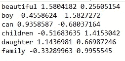
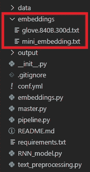
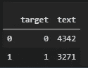
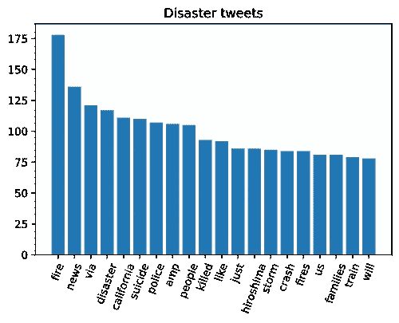
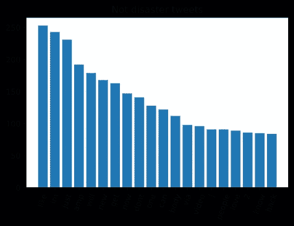
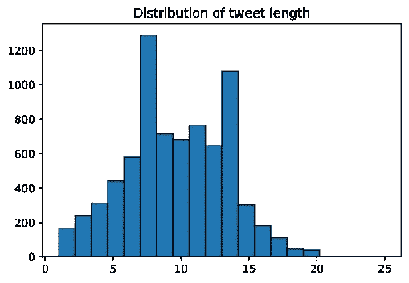
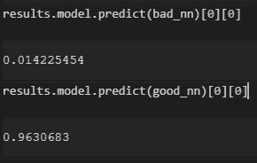

# 使用 Python 中的单词嵌入和深度学习进行文本分类——对来自 Twitter 的推文进行分类

> 原文：<https://towardsdatascience.com/text-classification-using-word-embeddings-and-deep-learning-in-python-classifying-tweets-from-6fe644fcfc81?source=collection_archive---------1----------------------->

## 文本分类代码，以及对使用 Python 和 Tensorflow 所发生的事情的深入解释


[수안 최](https://unsplash.com/@suanmoo?utm_source=medium&utm_medium=referral) 在 [Unsplash](https://unsplash.com?utm_source=medium&utm_medium=referral) 上拍照

本文的目的是帮助读者理解在创建文本分类器时如何利用单词嵌入和深度学习。

此外，文本建模中经常被忽略的部分，如什么是单词嵌入，什么是嵌入层或深度学习模型的输入，也将在这里讨论。

最后，所有概念的展示将在 Twitter 发布的数据集上付诸实践，该数据集关于一条推文是否是关于自然灾害的。

本文使用的主要技术是 **Python** 和 **Keras API。**

一个功能齐全的文本分类管道和来自 Twitter 的数据集可以在这里找到:[https://github.com/Eligijus112/twitter-genuine-tweets](https://github.com/Eligijus112/twitter-genuine-tweets)。

本文中用到的 Word 嵌入文件可以在这里找到:[https://nlp.stanford.edu/projects/glove/](https://nlp.stanford.edu/projects/glove/)。

使用标记文本创建深度学习模型的管道如下:

*   **将数据分为文本(X)和标签(Y)**
*   **预处理 X**
*   **从 X 创建一个单词嵌入矩阵**
*   **从 X 创建一个张量输入**
*   **使用张量输入和标签(Y)训练深度学习模型**
*   **对新数据进行预测**

在本文中，我将逐一介绍这些步骤。本文的第一部分将使用一个小的示例数据集来涵盖所有的概念。文章的第二部分将把所有的概念实现到一个真实的例子中，这个例子是关于一条推文是否是关于自然灾害的。

使用文本进行预测的深度学习模型的主要构建模块是单词嵌入。

来自维基:**单词嵌入**是一组[语言建模](https://en.wikipedia.org/wiki/Language_model)和[特征学习](https://en.wikipedia.org/wiki/Feature_learning)技术的统称，在[自然语言处理](https://en.wikipedia.org/wiki/Natural_language_processing) (NLP)中，来自词汇表的**单词或短语被映射到实数向量。**例如，

“爸爸”= [0.1548，0.4848，1.864]

"妈妈" = [0.8785，0.8974，2.794]

简而言之，**单词嵌入是表示字符串的数值向量。**

实际上，单词表示是 100、200 或 300 维向量，它们在非常大的文本上被训练。

单词嵌入的一个非常重要的特征是，语义上相似的单词之间的距离(欧几里德距离、余弦距离或其他距离)比没有语义关系的单词之间的距离要小。例如，像“妈妈”和“爸爸”这样的词在数学上应该比“妈妈”和“番茄酱”或“爸爸”和“黄油”更接近。

单词嵌入的第二个重要特征是，当创建模型的输入矩阵时，无论我们在文本语料库中有多少独特的单词，我们在输入矩阵中都将有相同数量的列。与一次性编码技术相比，这是一个巨大的胜利，在一次性编码技术中，列的数量通常等于文档中唯一单词的数量。这个数字可以是几十万，甚至上百万。处理非常宽的输入矩阵在计算上要求很高。

举个例子，

想象一句话:**克拉克喜欢在公园散步**。

这里有 7 个独特的词。使用一个热编码向量，我们将每个单词表示为:

```
Clark = [1, 0, 0, 0, 0, 0, 0]
likes = [0, 1, 0, 0, 0, 0, 0]
to = [0, 0, 1, 0, 0, 0, 0]
walk = [0, 0, 0, 1, 0, 0, 0]
in = [0, 0, 0, 0, 1, 0, 0]
the = [0, 0, 0, 0, 0, 1, 0]
park = [0, 0, 0, 0, 0, 0, 1]
```

而如果使用二维单词嵌入，我们将处理以下向量:

```
Clark = [0.13, 0.61]
likes = [0.23, 0.66]
to = [0.55, 0.11]
walk = [0.03, 0.01]
in = [0.15, 0.69]
the = [0.99, 0.00]
park = [0.98, 0.12]
```

现在想象有 n 个句子。在一位热码编码的情况下，向量将呈指数增长，而单词的嵌入表示向量的大小将保持不变。这就是为什么在处理大量文本时，单词嵌入被用来表示单词、句子或整个文档。

使用具有一个输入层、一个隐藏层和一个输出层的神经网络来创建单词嵌入。

有关创建单词嵌入的更多信息，请访问文章:

[](https://medium.com/analytics-vidhya/creating-word-embeddings-coding-the-word2vec-algorithm-in-python-using-deep-learning-b337d0ba17a8) [## 创建单词嵌入:使用深度学习在 Python 中编码 Word2Vec 算法

### 当我在写另一篇展示如何在文本分类目标中使用单词嵌入的文章时，我…

medium.com](https://medium.com/analytics-vidhya/creating-word-embeddings-coding-the-word2vec-algorithm-in-python-using-deep-learning-b337d0ba17a8) 

为了让计算机确定哪些文本是好的，哪些是坏的，我们需要对其进行标注。可以有任意数量的类，并且类本身可以表示非常多种多样的东西。让我们构建一些文本:

```
d = [
  ('This article is awesome', 1),
  ('There are just too much words here', 0), 
  ('The math is actually wrong here', 0),
  ('I really enjoy learning new stuff', 1),
  ('I am kinda lazy so I just skim these texts', 0),
  ('Who cares about AI?', 0),
  ('I will surely be a better person after reading this!', 1),
  ('The author is pretty cute :)', 1)
]
```

我们有 8 个元组，其中第一个坐标是文本，第二个坐标是标签。标签 0 表示负面情绪，标签 1 表示正面情绪。为了建立一个功能模型，我们需要更多的数据(在我的实践中，如果只有两个类并且类是平衡的，那么一千或更多的标记数据点将开始给出好的结果)。

让我们做一些经典的文本预处理:

文本预处理功能

```
X_train = [x[0] for x in d] # Text
Y_train = [y[1] for y in d] # LabelX_train = [clean_text(x) for x in X_train]
```

清理后的文本( **X_train** ):

```
'this article is awesome'
'there are just too much words here'
'the math is actually wrong here'
'i really enjoy learning new stuff'
'i am kinda lazy so i just skim these texts'
'who cares about ai'
'i will surely be a better person after reading this'
'the author is pretty cute'
```

标签( **Y_train** ):

```
[1, 0, 0, 1, 0, 0, 1, 1]
```

既然我们在 **X_train** 矩阵和类别矩阵 **Y_train 中有了预处理文本，我们需要为神经网络构建输入。**

具有嵌入层的深度学习模型的输入使用**嵌入矩阵**。嵌入矩阵是行大小等于文档中唯一单词数量的矩阵，并且具有嵌入向量维数的列大小。因此，为了构建嵌入矩阵，需要创建单词嵌入向量或者使用预先训练的单词嵌入。在这个例子中，我们将读取一个虚构的单词嵌入文件并构建矩阵。

存储单词嵌入的常用格式是在一个文本文档**中。**



小型嵌入示例

我们姑且称上面的嵌入文件**为 mini_embedding.txt** 。要快速复制粘贴，请使用:

```
beautiful 1.5804182 0.25605154
boy -0.4558624 -1.5827272
can 0.9358587 -0.68037164
children -0.51683635 1.4153042
daughter 1.1436981 0.66987246
family -0.33289963 0.9955545
```

在这个例子中，嵌入维度等于 2，但是在来自链接[https://nlp.stanford.edu/projects/glove/](https://nlp.stanford.edu/projects/glove/)的单词嵌入中，维度是 300。在这两种情况下，结构都是单词是第一个元素，后面是由空格分隔的系数。当行尾有新的行分隔符时，坐标结束。

为了阅读这样的文本文档，让我们创建一个类:

读取嵌入并创建嵌入矩阵的类

让我们假设您在**嵌入**文件夹中有嵌入文件。



文件结构

```
embedding = Embeddings(
  'embeddings/mini_embedding.txt', 
  vector_dimension=2
)
embedding_matrix = embedding.create_embedding_matrix()
```

我们尚未扫描任何文档，因此嵌入矩阵将返回 **mini_embeddings.txt** 文件中的所有单词:

```
array([[ 1.58041823,  0.25605154],
       [-0.4558624 , -1.58272719],
       [ 0.93585873, -0.68037164],
       [-0.51683635,  1.41530418],
       [ 1.1436981 ,  0.66987246],
       [-0.33289963,  0.99555451]])
```

**嵌入矩阵的列数将始终等于嵌入维度的数量，行数将等于文档中唯一单词的数量或用户定义的行数。**

除非您的机器中有大量的 RAM，否则通常建议您最大限度地使用用于构建嵌入矩阵的训练文档的所有唯一单词来创建嵌入矩阵。在手套嵌入文件中，有数百万个单词，其中大多数甚至在大多数文本文档中一次也没有出现。因此，不建议使用来自大型嵌入文件的所有唯一单词来创建嵌入矩阵。

深度学习模型中的预训练单词嵌入被放入矩阵中，并在输入层**中用作权重**。来自 Keras API 文档【https://keras.io/layers/embeddings/ :

```
keras.layers.Embedding(**input_dim**, **output_dim**,...)Turns positive integers (indexes) into dense vectors of fixed size. eg. [[4], [20]] -> [[0.25, 0.1], [0.6, -0.2]]**This layer can only be used as the first layer in a deep learning model.**
```

两个主要的输入参数是**输入 _ 尺寸**和**输出 _ 尺寸**。

**input_dim** 等于我们文本中唯一单词的总数(或者用户定义的特定数量的唯一单词)。

**输出尺寸**等于嵌入向量尺寸。

为了构建唯一的单词字典，我们将使用 Keras 库中的 **Tokenizer()** 方法。

```
from keras.preprocessing.text import Tokenizertokenizer = Tokenizer()
tokenizer.fit_on_texts(X_train)
```

提醒一下，我们预处理过的 **X_train** 是:

```
'this article is awesome'
'there are just too much words here'
'the math is actually wrong here'
'i really enjoy learning new stuff'
'i am kinda lazy so i just skim these texts'
'who cares about ai'
'i will surely be a better person after reading this'
'the author is pretty cute'
```

Tokenizer()方法创建唯一单词的内部字典，并为每个单词分配一个整数。 **tokenizer.word_index** 的输出:

```
{'i': 1,
 'is': 2,
 'this': 3,
 'just': 4,
 'here': 5,
 'the': 6,
 'article': 7,
 'awesome': 8,
 'there': 9,
 'are': 10,
 'too': 11,
 'much': 12,
 'words': 13,
 'math': 14,
 'actually': 15,
 'wrong': 16,
 'really': 17,
 'enjoy': 18,
 'learning': 19,
 'new': 20,
 'stuff': 21,
 'am': 22,
 'kinda': 23,
 'lazy': 24,
 'so': 25,
 'skim': 26,
 'these': 27,
 'texts': 28,
 'who': 29,
 'cares': 30,
 'about': 31,
 'ai': 32,
 'will': 33,
 'surely': 34,
 'be': 35,
 'a': 36,
 'better': 37,
 'person': 38,
 'after': 39,
 'reading': 40,
 'author': 41,
 'pretty': 42,
 'cute': 43}
```

在我们的 X_train 文本中有 43 个独特的单词。让我们将文本转换成索引列表:

```
tokenizer.texts_to_sequences(X_train)**[[3, 7, 2, 8],
 [9, 10, 4, 11, 12, 13, 5],
 [6, 14, 2, 15, 16, 5],
 [1, 17, 18, 19, 20, 21],
 [1, 22, 23, 24, 25, 1, 4, 26, 27, 28],
 [29, 30, 31, 32],
 [1, 33, 34, 35, 36, 37, 38, 39, 40, 3],
 [6, 41, 2, 42, 43]]**
```

我们 X_train 矩阵中的第一句话**‘这篇文章真棒’**转换成一个**【3，7，2，8】**的列表。这些索引表示 tokenizer 创建的字典中的键值:

```
{...
 **'is': 2,**
 **'this': 3,**
 ...
 **'article': 7,**
 **'awesome': 8,**
 ...}
```

方法给了我们一个列表列表，其中每个条目都有不同的维度，并且是无结构的。任何机器学习模型都需要知道特征维度的数量，并且对于新观察值的训练和预测，该数量必须相同。为了将序列转换成用于深度学习训练的结构良好的矩阵，我们将使用来自 Keras 的**pad _ sequences()**方法:

```
import numpy as np
from keras.preprocessing.sequence import pad_sequences# Getting the biggest sentence
max_len = np.max([len(text.split()) for text in X_train])# Creating the padded matrices
X_train_NN = tokenizer.texts_to_sequences(X_train)
X_train_NN = pad_sequences(string_list, maxlen=max_len)
```

X_train_NN 对象如下所示:

```
array([[ 0,  0,  0,  0,  0,  0,  3,  7,  2,  8],
       [ 0,  0,  0,  9, 10,  4, 11, 12, 13,  5],
       [ 0,  0,  0,  0,  6, 14,  2, 15, 16,  5],
       [ 0,  0,  0,  0,  1, 17, 18, 19, 20, 21],
       [ 1, 22, 23, 24, 25,  1,  4, 26, 27, 28],
       [ 0,  0,  0,  0,  0,  0, 29, 30, 31, 32],
       [ 1, 33, 34, 35, 36, 37, 38, 39, 40,  3],
       [ 0,  0,  0,  0,  0,  6, 41,  2, 42, 43]])
```

行数等于 X_train 元素数，列数等于最长的句子(等于 **10** 个单词)。列数通常由用户在阅读文档之前定义。这是因为当处理现实生活中的标记文本时，最长的文本可能非常长(数千字)，这将导致训练神经网络时计算机内存的问题。

为了使用预处理文本为神经网络创建一个整洁的输入，我使用了我定义的类 **TextToTensor** :

将文本转换为结构化矩阵

张量是一个可以容纳 N 维数据的容器。向量可以在 1 维空间存储数据，矩阵可以在 2 维空间存储数据，张量可以在 n 维空间存储数据。有关张量的更多信息:

https://www.kdnuggets.com/2018/05/wtf-tensor.html

**texttotenser**的完整用法:

```
# Tokenizing the text
tokenizer = Tokenizer()
tokenizer.fit_on_texts(X_train)# Getting the longest sentence
max_len = np.max([len(text.split()) for text in X_train])# Converting to tensor
TextToTensor_instance = TextToTensor(
tokenizer=tokenizer,
max_len=max_len
)X_train_NN = TextToTensor_instance.string_to_tensor(X_train)
```

现在我们可以从文本中创建一个张量，我们可以开始使用 Keras API 中的**嵌入**层。

```
from keras.models import Sequential
from keras.layers import Embedding

model = Sequential()
model.add(Embedding(
  input_dim=44, 
  output_dim=3, 
  input_length=max_len))

model.compile('rmsprop', 'mse')
output_array = model.predict(X_train_NN)[0]
```

注意，在嵌入层中，input_dim 等于 44，但是我们的文本只有 43 个唯一的单词。这是因为 Keras API 中的嵌入定义:

**input_dim** : int > 0。词汇的大小，即**最大整数索引+ 1。**

output_array 如下所示:

```
array([[-0.03353775,  0.01123261,  0.03025569],
       [-0.03353775,  0.01123261,  0.03025569],
       [-0.03353775,  0.01123261,  0.03025569],
       [-0.03353775,  0.01123261,  0.03025569],
       [-0.03353775,  0.01123261,  0.03025569],
       [-0.03353775,  0.01123261,  0.03025569],
       **[ 0.04183744, -0.00413301,  0.04792741],
       [-0.00870543, -0.00829206,  0.02079277],
       [ 0.02819189, -0.04957005,  0.03384084],
       [ 0.0394035 , -0.02159669,  0.01720046]**], dtype=float32)
```

输入序列为(X_train_NN 的第一个元素):

```
array([0, 0, 0, 0, 0, 0, **3, 7, 2, 8**])
```

嵌入层自动给一个整数分配一个大小为 output_dim 的向量，在我们的例子中等于 3。我们不能控制内部计算，并且分配给每个整数索引的向量不具有这样的特征，即在语义上紧密相关的单词之间的距离小于那些具有不同语义的单词之间的距离。

为了解决这个问题，我们将使用斯坦福大学自然语言处理系的预训练单词嵌入([https://nlp.stanford.edu/projects/glove/](https://nlp.stanford.edu/projects/glove/))。为了创建嵌入矩阵，我们将使用先前定义的方法。

让我们假设 **X_train** 再次是预处理文本的列表。

```
embed_path = 'embeddings\\glove.840B.300d.txt'
embed_dim = 300# Tokenizing the text
tokenizer = Tokenizer()
tokenizer.fit_on_texts(X_train)# Creating the embedding matrix
embedding = Embeddings(embed_path, embed_dim)
embedding_matrix = embedding.create_embedding_matrix(tokenizer, len(tokenizer.word_counts))
```

而文档 **glove.840B.300d.txt** 有几十万个唯一字，最终嵌入矩阵的形状是 **(44，300)** 。这是因为我们想尽可能地节省内存，整个文档中唯一单词的数量等于 **44** 。保存文本文档中所有其他单词的坐标是一种浪费，因为我们不会在任何地方使用它们。

为了在深度学习模型中使用嵌入矩阵，我们需要将该矩阵作为嵌入层中的**权重**参数进行传递。

```
from keras.models import Sequential
from keras.layers import Embedding# Converting to tensor
TextToTensor_instance = TextToTensor(
tokenizer=tokenizer,
max_len=max_len
)
X_train_NN = TextToTensor_instance.string_to_tensor(X_train)model = Sequential()
model.add(Embedding(
  input_dim=44, 
  output_dim=300, 
  input_length=max_len,
  **weights=**[embedding_matrix]))

model.compile('rmsprop', 'mse')
output_array = model.predict(X_train_NN)[0]
```

output_array 的形状现在是 **(10，300)** ，输出如下所示:

```
array([[ 0.18733 ,  0.40595 , -0.51174 , ...,  0.16495 ,  0.18757 ,
         0.53874 ],
       [ 0.18733 ,  0.40595 , -0.51174 , ...,  0.16495 ,  0.18757 ,
         0.53874 ],
       [ 0.18733 ,  0.40595 , -0.51174 , ...,  0.16495 ,  0.18757 ,
         0.53874 ],
       ...,
       [-0.34338 ,  0.1677  , -0.1448  , ...,  0.095014, -0.073342,
         0.47798 ],
       [-0.087595,  0.35502 ,  0.063868, ...,  0.03446 , -0.15027 ,
         0.40673 ],
       [ 0.16718 ,  0.30593 , -0.13682 , ..., -0.035268,  0.1281  ,
         0.023683]], dtype=float32)
```


[Sheri Hooley](https://unsplash.com/@sherihoo?utm_source=medium&utm_medium=referral) 在 [Unsplash](https://unsplash.com?utm_source=medium&utm_medium=referral) 上拍摄的照片

到目前为止，我们已经介绍了:

*   **什么是单词嵌入**
*   **从文本中创建张量**
*   **创建单词嵌入矩阵**
*   **什么是 Keras 嵌入层**
*   **如何利用嵌入矩阵**

现在让我们把所有的事情放在一起，处理一个现实生活中的问题，决定一条来自 Twitter 的推文是否是关于自然灾害的。

```
# Importing generic python packages
import pandas as pd# Reading the data
train = pd.read_csv('data/train.csv')[['text', 'target']]
test = pd.read_csv('data/test.csv')# Creating the input for the pipeline
X_train = train['text'].tolist()
Y_train = train['target'].tolist()X_test = test['text'].tolist()
```

列车数据的形状是 **(7613，2)，**的意思是，有**个** 7613 条 tweets 可以处理。让我们检查一下推文的分布情况:

```
train.groupby(['target'], as_index=False).count()
```



推文的分发

正如我们所看到的，至少对于真实世界的数据来说，这些类是平衡的。

“好”推文示例:

```
[
'Our Deeds are the Reason of this #earthquake May ALLAH Forgive us all',
'Forest fire near La Ronge Sask. Canada',
"All residents asked to 'shelter in place' are being notified by officers. No other evacuation or shelter in place orders are expected",
'13,000 people receive #wildfires evacuation orders in California ',
'Just got sent this photo from Ruby #Alaska as smoke from #wildfires pours into a school'
]
```

糟糕推文的一个例子:

```
[
"What's up man?",
'I love fruits',
'Summer is lovely',
'My car is so fast',
'What a goooooooaaaaaal!!!!!!'
]
```

让我们做一些文本预处理，看看上面的单词:

```
# Counting the number of words
from collections import Counter# Plotting functions
import matplotlib.pyplot as pltX_train = [clean_text(text) for text in X_train]
Y_train = np.asarray(Y_train)# Tokenizing the text
tokenizer = Tokenizer()
tokenizer.fit_on_texts(X_train)# Getting the most frequent wordsd1 = train.loc[train['target']==1, 'text'].tolist()
d0 = train.loc[train['target']==0, 'text'].tolist()d1 = [clean_text(x, stop_words=stop_words) for x in d1]
d0 = [clean_text(x, stop_words=stop_words) for x in d0]d1_text = ' '.join(d1).split()
d0_text = ' '.join(d0).split()topd1 = Counter(d1_text)
topd0 = Counter(d0_text)topd1 = topd1.most_common(20)
topd0 = topd0.most_common(20)plt.bar(range(len(topd1)), [val[1] for val in topd1], align='center')
plt.xticks(range(len(topd1)), [val[0] for val in topd1])
plt.xticks(rotation=70)
plt.title('Disaster tweets')
plt.show()plt.bar(range(len(topd0)), [val[1] for val in topd0], align='center')
plt.xticks(range(len(topd0)), [val[0] for val in topd0])
plt.xticks(rotation=70)
plt.title('Not disaster tweets')
plt.show()
```



灾难推文中的热门词汇



非灾难推文中的热门词汇

非灾难词汇比灾难词汇更通用。人们可能期望手套嵌入和深度学习模型能够捕捉到这些差异。

每条推文的字数分布:



字数分布

根据上面的分布，我们可以说，创建列大小为 20 的输入张量只会排除 tweets 中非常少量的单词。在 pro 方面，我们将赢得大量的计算时间。

深度学习模型架构如下:

本文中提到的包装所有东西的管道也被定义为 python 中的一个类:

完整的代码和整个工作管道可以在这里找到:

[](https://github.com/Eligijus112/twitter-genuine-tweets) [## eligijus 112/Twitter-正版-推文

### 这个项目可以作为一个模板来做任何 NLP 任务。在这个项目中的情绪是一个字符串是否认为…

github.com](https://github.com/Eligijus112/twitter-genuine-tweets) 

若要训练模型，请使用以下代码:

```
results = Pipeline(
X_train=X_train,
Y_train=Y_train,
embed_path='embeddings\\glove.840B.300d.txt',
embed_dim=300,
stop_words=stop_words,
X_test=X_test,
max_len=20,
epochs=10,
batch_size=256
)
```

现在让我们创建两个文本:

**好** =【“维尔纽斯失火！消防队在哪里？？？#紧急情况"]

**不好** =【“寿司还是披萨？生活是艰难的:(("]

```
TextToTensor_instance = TextToTensor(
tokenizer=results.tokenizer,
max_len=20
)# Converting to tensors
good_nn = TextToTensor_instance.string_to_tensor(good)
bad_nn = TextToTensor_instance.string_to_tensor(bad)# Forecasting
p_good = results.model.predict(**good_nn**)[0][0]
p_bad = results.model.predict(**bad_nn**)[0][0]
```



**p_bad = 0.014** 和 **p_good = 0.963** 。这些概率是针对一条推文是否是关于一场灾难的问题。所以关于寿司的推文得分很低，关于火灾的推文得分很高。这意味着本文中提出的逻辑至少对虚构的句子有效。

在这篇文章中，我有:

*   **展示了在监督问题中使用文本数据的逻辑和整体工作流程。**
*   **分享了 Python 中的完整工作代码，该代码采用原始输入，将其转换为矩阵，并使用 Tensorflow 训练深度学习模型**
*   **解读结果。**

本文给出的代码可以应用于任何文本分类问题。编码快乐！

[1]推特灾难数据集

网址:[https://www . ka ggle . com/competitions/NLP-getting-started/data](https://www.kaggle.com/competitions/nlp-getting-started/data)执照:【https://opensource.org/licenses/Apache-2.0】T2