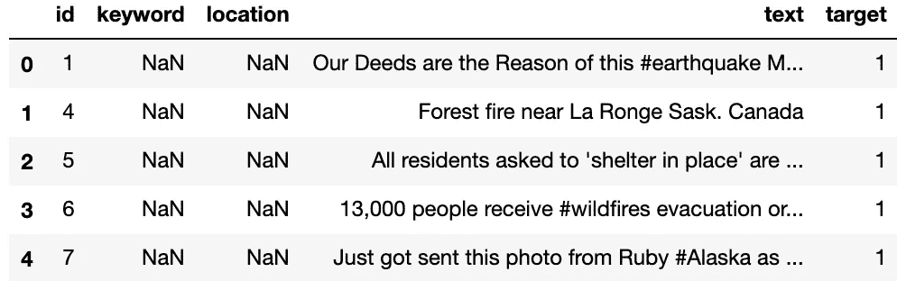
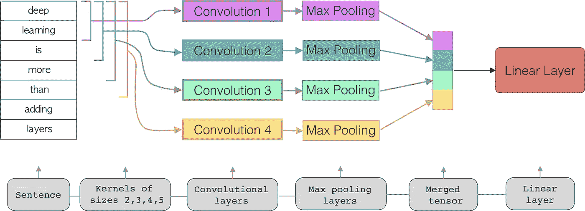
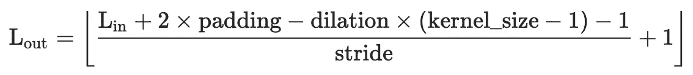
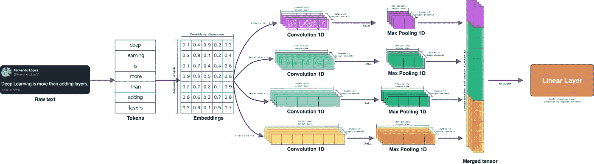

# PyTorch 中基于 CNN 的文本分类

> 原文：<https://towardsdatascience.com/text-classification-with-cnns-in-pytorch-1113df31e79f?source=collection_archive---------3----------------------->

## 使用 PyTorch 中实现的 CNN 构建文本分类器的分步指南。

谢尔比·米勒在 [Unsplash](https://unsplash.com?utm_source=medium&utm_medium=referral) 上的照片

> “深度学习不仅仅是添加层”

这个博客的目的是通过实现卷积神经网络来开发一个逐步的文本分类器。所以，这个博客分为以下几个部分:

*   **简介**
*   **预处理**
*   **车型**
*   **培训**
*   **评估**

所以，让我们开始吧！

# 介绍

可以从不同的方法来解决文本分类问题，例如，考虑单词在给定文本中相对于这些单词在完整语料库中的出现的*出现频率。*

另一方面，存在将文本建模为单词或字符序列的其他方法，这种类型的方法主要利用基于递归神经网络架构的模型。

> 如果你想了解更多关于 LSTM 递归神经网络的文本分类，看看这个博客:[py torch 中 LSTMs 的文本分类](/text-classification-with-pytorch-7111dae111a6)

然而，还有另一种方法，其中文本被建模为给定空间中单词的*分布*。这是通过使用**卷积神经网络**(CNN)实现的。

因此，我们将从最后提到的方法开始，我们将使用基于 CNN 的架构，建立一个模型来分类文本，考虑组成文本的一组单词在空间中的分布。

开始吧！

# **预处理**

本模型所用数据取自 Kaggle 大赛: [*真实与否？NLP 与灾难推文*](https://www.kaggle.com/c/nlp-getting-started)

数据集的第一行如图 1 所示:

图一。数据集头|按作者分类的图像

我们可以看到，需要创建一个预处理管道来*加载文本*，*清理它*，*标记它*，*填充它*和*分割成训练和测试*组。

**载入文字。**由于我们要处理的文本已经在我们的存储库中，我们只需要在本地调用它并删除一些无用的列。

代码 1。加载数据功能

**干净的文字**。在这种情况下，我们需要从文本中删除特殊符号和数字。我们将只使用小写单词。

代码 2。清除文本功能

**词语虚化**。对于标记化，我们将使用来自 *nltk* 库的 *word_tokenize* 函数(一种非常简单的句子标记化方法)。在此之后，我们将需要*生成一个字典*，其中包含数据集中最常用的单词 *x* (这是为了降低问题的复杂性)。因此，正如您在代码 3 的第 3 行中看到的，应用了标记化。在第 14 行中，选择了最常见的" *x* "单词，在第 16 行中构建了单词字典(正如您所看到的，字典从索引 1 开始，这是因为我们保留了索引 0 来应用填充)。

代码 3。标记化和构建词汇功能

到目前为止，每条 tweet 都已经标记化了，但是我们需要将每个单词标记转换成数字格式，因此我们将使用代码 3 中生成的字典将每个单词转换成基于索引的表示形式。

代码 4。从 word 到 idx 函数

**填充**。正如你所想象的，不是所有的 tweetss 都一样长，但是每条 tweet 都有相同的字数是很重要的。这就是我们引入填充的原因。填充是为了标准化每条 tweet 的长度。在这种情况下，我们将用于填充的值将是数字零(我们在构建词汇词典时保留的索引)。

代码 5。填充功能

**分割介绍训练和测试**。这个预处理管道的最后一步是将数据分为训练和测试。为此，我们将使用 *scikit learn* 提供的功能。

代码 6。分割数据功能

完整的预处理类如下所示:

代码 7。预处理类

很好，到目前为止，我们已经完成了所有的预处理，我们已经有了我们的训练和测试集，是时候看看模型了！

# 模型

实现的模型将使用 *n 元单词*，即不同的核大小将应用于同一个句子(指基于 n 元单词的作文)。然后，使用 *max pooling* 函数减少这些内核的每个输出。最后，这些输出中的每一个将被*连接*在*单张量*中，以被引入线性层，该线性层将被激活函数过滤以获得最终结果。

图二。建筑模型|作者图片

> 这里有完整的实现:[https://github . com/FernandoLpz/Text-Classification-CNN-py torch](https://github.com/FernandoLpz/Text-Classification-CNN-PyTorch)

正如我们所见，卷积层没有堆叠。每个卷积层都由一个特定的核大小定义，这个大小就是所讨论的“n 元文法”的定义。此外，每个卷积的每个输出都使用最大池减少。最后，每个张量被连接起来形成一个单一的张量，它将被引入到线性层。

现在让我们看看如何使用 PyTorch 框架在代码中完成所有这些工作。首先，我们需要创建神经网络的构造器，为此，我们将定义一些重要的参数以及卷积、最大池和线性层。

代码 8。文本分类器构造器

从第 16 行到第 19 行，我们为每个卷积定义了*个不同的内核*(记住在这种情况下，*内核大小*充当了 *n-gram* 的大小)。

第 22 行指的是对每层卷积的输出通道数量*的定义。第 24 行是指滑动窗口(内核)时要考虑的跳转次数。*

在第 27 行定义了*嵌入层*。我们可以看到输入单词的数量(词汇量的大小)，包含了一个" *+1* "这是因为我们考虑的索引是指填充，在这种情况下它是索引 0。

从第 30 行到第 33 行，我们定义了每个*卷积层*。同样，从第 36 行到第 39 行，我们定义了每个*最大池层*。

最后在第 42 行，我们定义了*线性层*。值得注意的是，该层的*输入元素*的数量由一个函数定义。这是因为通过应用*卷积*和*最大池*(在不同的内核大小下)，修改了输出张量的大小。同样，这样的输出张量将被连接并简化为一维张量，(*展平*)。这就是为什么我们实现了一个函数来计算线性层的输入大小。

每个*卷积*和*最大汇集*层的输出张量的大小由以下函数定义:

图 3。输出矢量大小| [来源](https://pytorch.org/docs/stable/generated/torch.nn.Conv1d.html)

因此，计算线性图层输入大小的函数由以下公式确定:

代码 9。计算线性图层的输入大小

到目前为止，我们已经定义了构造函数。是时候继续前进了，让我们开始吧！

*forward* 函数将获取*分词*的向量，并通过*嵌入层*。随后，每个*嵌入语句*将通过*卷积*和*最大池层*的每一层，最后，得到的向量将被*串接*和*归约*以引入到*线性层*。

代码 10。正向功能

在第 4 行，输入向量通过*嵌入层*。在第 7、12、17 和 22 行中，*卷积*运算(具有不同的*内核大小*)被应用于嵌入序列。在第 27 行上，每个输出向量被连接，在第 28 行上，该向量被减少到一维(*展平*)。随后，*展平向量*通过一个线性层，其激活函数为 *sigmoid* 。

所以完整的架构看起来会是这样的:

图 3。文本分类模型|按作者分类的图片

太好了，我们已经看到了如何定义神经网络的架构以及前向函数，是时候看看训练函数了，让我们开始吧！

# **培训**

正如我们在预处理阶段看到的，训练和测试数据已经准备好实现了。然而，我们需要将它们转换成基于 torch 的数据类型，并创建批处理生成器。为此，我们将利用 *PyTorch* 框架提供的*数据集*和*数据加载器*模块，实现如下:

代码 11。数据处理程序类

为了使用该类，我们只需要实例化然后初始化数据加载器。

代码 12。数据生成程序

对于训练阶段，我们必须定义数据加载器(我们在上一步中已经完成了)并定义优化器(在本例中，我们使用的是 *RMSprop* 优化器)。一旦一切准备就绪，我们就可以开始训练循环了。

代码 13。培训阶段

在第 15 行，我们对每个*时期*进行迭代。在第 20 行，我们使用*数据加载器*对每个*批次*进行迭代。在第 17 行*模型被设置为训练模式*(这意味着梯度将被更新)。在第 25 行，模型被输入。在第 28 行计算了误差。在第 29 行，存放梯度的变量被清除。在第 34 行计算梯度。在第 37 行，参数被更新。

最后，保存预测，并调用评估函数来获得训练和测试数据的准确性。所以，让我们在下一节看到这一点！

# 估价

太好了，我们终于进入评估环节了。让我们看看这是怎么回事。

这次我们将使用准确性作为衡量模型性能的标准。虽然有预定义的函数可以直接计算，但这次我们将手动计算，即计算*真阳性*以及*假阳性*。

代码 14。评价函数

在这种情况下，我们将 0.5 定义为阈值，以确定结果类的值是正还是负。

恭喜你！我们已经到了这个教程博客的结尾。该准则欢迎任何建议和/或评论。随意分叉或克隆！

> 这里有完整的实现:[https://github . com/FernandoLpz/Text-class ification-CNN-py torch](https://github.com/FernandoLpz/Text-Classification-CNN-PyTorch)

# 结论

在这篇教程博客中，我们学习了如何使用基于卷积的神经网络架构实现 PyTorch 框架来生成文本分类模型。