# TensorFlow 2(无泪)中拥抱人脸变形器的文本分类

> 原文：<https://towardsdatascience.com/text-classification-with-hugging-face-transformers-in-tensorflow-2-without-tears-ee50e4f3e7ed?source=collection_archive---------0----------------------->


[来源](https://medium.com/tensorflow/using-tensorflow-2-for-state-of-the-art-natural-language-processing-102445cda54a)

[拥抱脸变形器包](https://github.com/huggingface/transformers)是一个非常流行的 Python 库，提供了对各种自然语言处理(NLP)任务非常有用的预训练模型。它以前只支持 **PyTorch** ，但截至 2019 年末， **TensorFlow 2** 也支持。虽然该库可以用于许多任务，从自然语言推理(NLI)到问题回答，[文本分类](https://en.wikipedia.org/wiki/Document_classification)仍然是最流行和最实用的用例之一。

[*ktrain*](https://github.com/amaiya/ktrain) 库是 TensorFlow 2 中`tf.keras`的轻量级包装器。它旨在使深度学习和人工智能更容易被初学者和领域专家所应用。从 *0.8* 版本开始， *ktrain* 现在包含了一个**简化界面，可以对人脸变形金刚**进行文本分类。在本文中，我们将向您展示如何使用**拥抱面部变形器**只用几行代码就可以构建、训练和部署一个文本分类模型。

本文的**源代码有两种形式:**

*   [这款谷歌 Colab 笔记本](https://colab.research.google.com/drive/1YxcceZxsNlvK35pRURgbwvkgejXwFxUt)或者
*   一个[教程笔记本](https://nbviewer.jupyter.org/github/amaiya/ktrain/blob/master/tutorials/tutorial-A3-hugging_face_transformers.ipynb)在 *ktrain* 的 GitHub 仓库里

# 入门指南

让我们从安装 *ktrain* 开始。在[确保 TensorFlow 2 安装](https://www.tensorflow.org/install/pip?lang=python3)在您的系统上之后，您可以安装 *ktrain* 与:

```
pip3 install ktrain
```

在本文中，我们将使用[20 个新闻组数据集](http://qwone.com/~jason/20Newsgroups/)构建一个包含四个新闻组类别的小型训练集。目标是建立一个模型，可以预测给定文章的新闻组类别。这将为我们提供一个在相对较小的训练集上观看**变形金刚**的机会，这是迁移学习的强大优势之一。顺便提一下，这是 scikit-learn [使用文本数据教程](https://scikit-learn.org/stable/tutorial/text_analytics/working_with_text_data.html)中使用的相同数据集。让我们使用 scikit-learn 获取[20 个新闻组数据集](http://qwone.com/~jason/20Newsgroups/)，并将所有内容加载到数组中进行训练和验证:

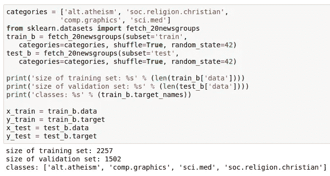

接下来，我们必须从拥抱脸中选择一个预训练的模型，这些模型都在这里的中列出。在撰写本文时，**变压器**库支持 TensorFlow 2 的以下预训练模型:

*   **BERT**:*BERT-base-不区分大小写，BERT-large-不区分大小写，BERT-base-多语言-不区分大小写，以及其他。*
*   **distil Bert**:*distil Bert-base-不区分大小写，distil Bert-base-多语言区分大小写，distil Bert-base-德语区分大小写，以及其他*
*   **艾伯特:** *艾伯特-基-v2，艾伯特-大-v2，其他*
*   罗伯塔基地，罗伯塔大，罗伯塔大
*   **XLM**:*xlm-MLM-xnli 15–1024，xlm-MLM-100–1280，其他*
*   **XLNet**:*XLNet-base-cased，xlnet-large-cased*

# 处理问题

实际上，由于拥抱脸变形金刚库中的 TensorFlow 支持相对较新，在撰写本文时，上面列出的几个模型[会产生错误](https://github.com/huggingface/transformers/issues/2251)。例子包括:

*   `*distilbert-base-multilingual-cased*` *:* 参见[第 2423 期](https://github.com/huggingface/transformers/issues/2423)
*   `*xlnet-base-cased*`:参见[问题 1692](https://github.com/huggingface/transformers/issues/1692)

例如，从 [**变形金刚库**](https://github.com/huggingface/transformers) 的 v2.3.0 开始，`distil-bert-uncased`模型工作得很好，但是`distilbert-base-multilingual-cased`模型在训练期间抛出异常。

拥抱脸团队正在努力解决这样的问题。一些问题已经合并但未发布决议。例如， **transformers-v2.3.0** 中与 *XLNet* 相关的问题可以通过简单地将`modeling_tf_xlnet.py`中的第 555 行从 **transformers** 库中替换为:

```
input_mask = 1.0 - tf.cast(attention_mask, dtype=dtype_float)
```

如本 PR 中[所述。如果遇到某个特定模型的问题，你可以尝试在变形金刚 GitHub 库](https://github.com/huggingface/transformers/pull/1736)上搜索[问题，寻找一个以**变形金刚**库补丁形式的解决方案。](https://github.com/huggingface/transformers/issues)

# 选择蒸馏模型

与此同时，出于本教程的目的，我们将展示一个流行且极其有用的模型，该模型已经过验证，可以在 **transformers** 库的 *v2.3.0* 中工作(撰写本文时的当前版本)。BERT 模型通过在 11 个不同的自然语言处理任务中实现最先进的性能，代表了 2018-2019 年人工智能的重大突破之一。不幸的是，BERT 也是一个非常大且需要大量内存的模型，无论是训练还是推理都很慢。因此，BERT 不太适合生产环境。distill BERT 是 BERT 的“蒸馏”版本，更小更快，同时保留了 BERT 的大部分准确性。出于这些原因，我们将在本教程中使用一个未封装的英语模型:

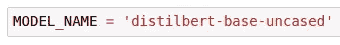

接下来，我们将使用 *ktrain* 轻松快速地构建、训练、检查和评估模型。

# 步骤 1:创建一个转换器实例

*ktrain* 中的`Transformer`类是围绕拥抱脸变形金刚库的简单抽象。让我们通过提供模型名称、序列长度(即`maxlen`参数)并用目标名称列表填充`classes`参数来实例化一个。

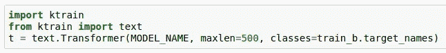

请注意，基于 BERT 的模型的最大序列长度通常为 512。小于`maxlen`标记的文档将被填充，大于`maxlen`标记的文档将被截断。

# 步骤 2:预处理数据集

然后，我们将训练和验证数据集预处理成所选预训练模型(在本例中为 DistilBERT)预期的格式。

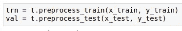

# 步骤 3:创建一个模型并包含学员

接下来，我们定义一个带有预训练权重的分类器，并随机初始化可以微调的最终层。该模型将被包装在一个 *ktrain* `Learner`对象中，这将允许我们轻松地训练和检查该模型，并使用它对新数据进行预测。

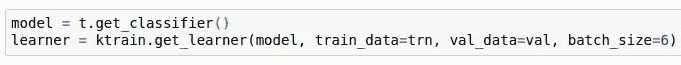

如果您在训练期间遇到内存不足错误，您可以尝试降低上面的`batch_size`或降低步骤 1 中的`maxlen`参数。

# 步骤 4[可选]:估计学习率

我们将使用 *ktrain* 中的学习率查找器来为我们的模型和数据集估计一个好的学习率。

对于基于 BERT 的模型， *2e-5* 和 *5e-5* 之间的学习率通常在大范围的数据集上运行良好。因此，这一步是可选的。

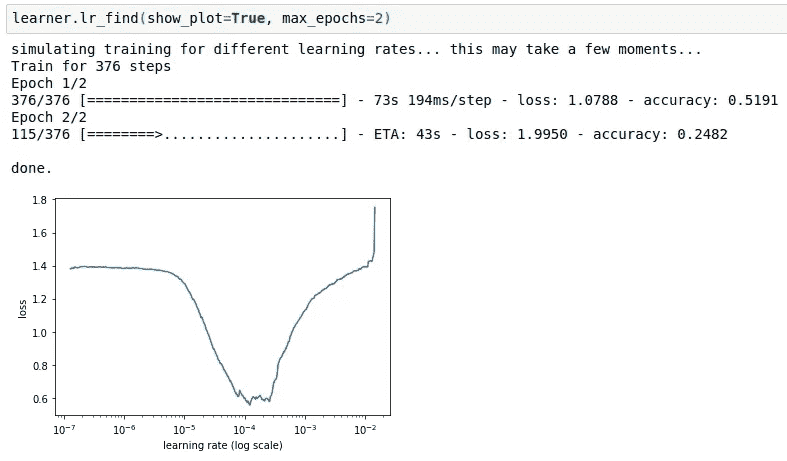

这里，我们将选择与亏损下降相关的最高学习率。让我们选择 5 **e-5** 作为学习率**。**有趣的是，learning rate finder 的估计值(如图所示)与 [Google 报告的通常对 BERT 和其他 transformer 模型最有效的](https://arxiv.org/pdf/1810.04805.pdf)学习率范围一致。

# 第五步:训练模型

对于培训，我们将调用 *ktrain* 中的`fit_onecycle`方法，该方法采用了由 Leslie Smith 提出的[1 周期策略](https://arxiv.org/abs/1803.09820)。一般来说，学习率计划具有增加学习率的初始预热期，然后是逐渐降低学习率的衰减期，这对于基于变压器的模型来说往往工作得很好。

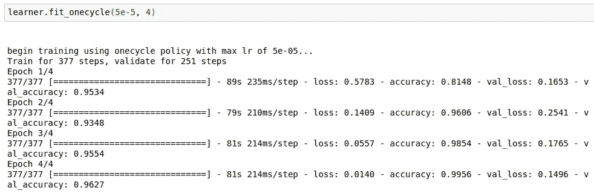

经过四个时期后，我们的验证准确率为 **96.27%，**，这比 SVM 在 [scikit-learn 关于文本分类的教程](https://scikit-learn.org/stable/tutorial/text_analytics/working_with_text_data.html)中达到的 91%的准确率好了不少。

# 步骤 6:检查模型

让我们调用`view_top_losses`方法来检查我们的模型最容易出错的新闻组帖子。

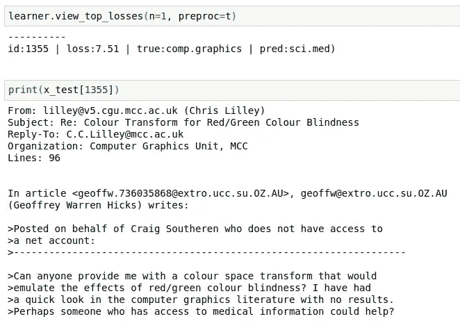

如您所见，在验证集中与 ID 1355 相关联的 newgroup 帖子位于`comp.graphics`新闻组(即计算机图形学)，但主要是关于**色盲**，这是一个医学话题。因此，我们的模型对这篇文章的`sci.med`的预测是可以理解和原谅的。

# 第七步:对新数据进行预测

我们可以实例化一个`Predictor`对象来轻松预测新的例子。

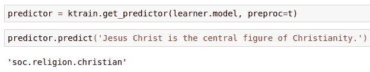

`predictor`也可用于通过 [eli5](https://eli5.readthedocs.io/en/latest/overview.html) 和 [lime](https://github.com/marcotcr/lime) 库解释特定示例的分类来进一步检查模型；

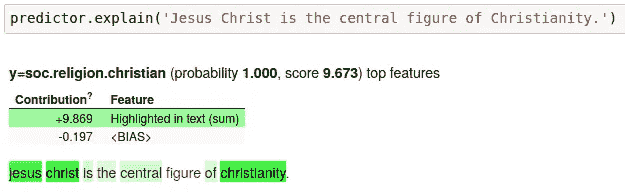

用绿色突出显示的单词似乎导致我们的模型将这个例子放在`soc.religion.christian`类别中。正如你所看到的，突出显示的单词都符合这一类别的直觉。

注意，为了让`explain`工作，您需要首先安装一个分叉版本的 [eli5](https://eli5.readthedocs.io/en/latest/overview.html) 库，该库被修改为支持 TensorFlow Keras:

```
pip3 install git+https://github.com/amaiya/eli5@tfkeras_0_10_1
```

最后，`predictor`对象可以保存到磁盘上，并在以后的实际部署场景中重新加载:

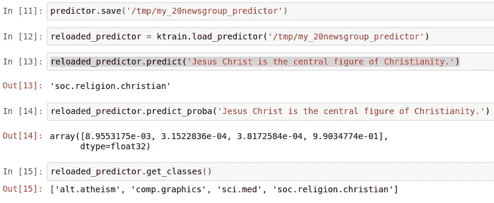

默认情况下，`predict`返回预测的类标签，但是`predict_proba`将返回每个类的预测概率，如上所示。

# 结论

ktrain 可以轻松试验不同的**变压器**型号。例如，传统的 BERT 模型可以很容易地进行训练，以便与上面训练的 DistilBERT 模型进行比较，只需替换如下的`MODEL_NAME`:

```
import ktrain
from ktrain import text
**MODEL_NAME = 'bert-base-uncased'**
t = text.Transformer(MODEL_NAME, maxlen=500,  
                     classes=train_b.target_names)
trn = t.preprocess_train(x_train, y_train)
val = t.preprocess_test(x_test, y_test)
model = t.get_classifier()
learner = ktrain.get_learner(model, train_data=trn, val_data=val, batch_size=6)
learner.fit_onecycle(3e-5, 1)
```

不管选择什么样的`MODEL_NAME`，包装在`Learner`对象中的底层模型只是另一个 **TensorFlow Keras** 模型:

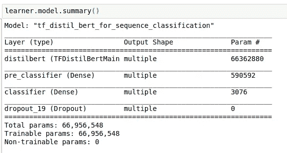

因此，一旦经过训练，如果愿意，可以直接使用 **TensorFlow** 和/或 **transformers** 库本身来管理它。在你的下一个文本分类项目中，请随意尝试一下 ktrain。

更多关于 *ktrain* 的信息，请访问我们的 [GitHub 库](https://github.com/amaiya/ktrain)。