# 基于自然语言处理的文本分类:Tf-Idf vs Word2Vec vs BERT

> 原文：<https://towardsdatascience.com/text-classification-with-nlp-tf-idf-vs-word2vec-vs-bert-41ff868d1794?source=collection_archive---------0----------------------->


## 预处理、模型设计、评估、词袋的可解释性、词嵌入、语言模型

## 摘要

在本文中，我将使用 NLP 和 Python 解释文本多类分类的 3 种不同策略:老式的*单词袋*(使用 Tf-Idf ) *，*著名的*单词嵌入(*使用 Word2Vec)，以及尖端的*语言模型*(使用 BERT)。

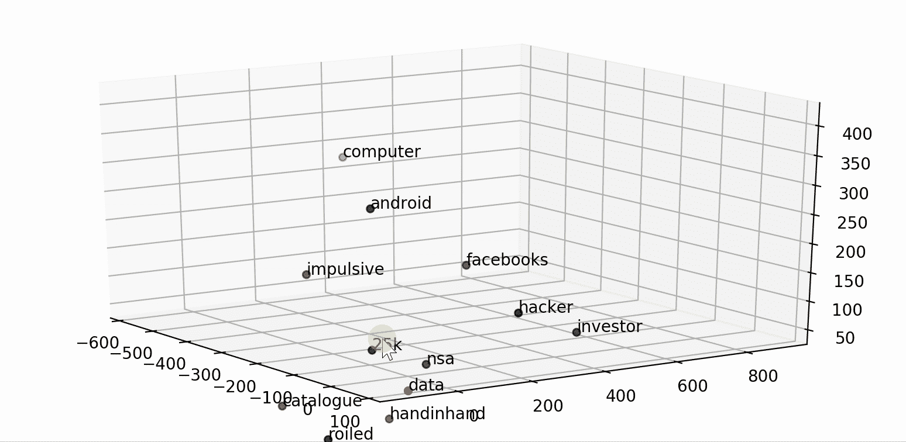

[**【NLP(自然语言处理)**](https://en.wikipedia.org/wiki/Natural_language_processing) 是人工智能领域，研究计算机与人类语言之间的交互，特别是如何给计算机编程，以处理和分析大量自然语言数据。NLP 通常用于文本数据的分类。**文本分类**就是根据文本数据的内容给文本数据分配类别的问题。

有不同的技术可以从原始文本数据中提取信息，并使用它来训练分类模型。本教程比较了老派的*单词袋*(与简单的机器学习算法一起使用)、流行的*单词嵌入*模型(与深度学习神经网络一起使用)和最先进的*语言模型*(与基于注意力的变形金刚的转移学习一起使用)，这些模型已经彻底改变了 NLP 的前景。

我将展示一些有用的 Python 代码，这些代码可以很容易地应用于其他类似的情况(只需复制、粘贴、运行)，并通过注释遍历每一行代码，以便您可以复制这个示例(下面是完整代码的链接)。

[](https://github.com/mdipietro09/DataScience_ArtificialIntelligence_Utils/blob/master/natural_language_processing/example_text_classification.ipynb) [## mdipietro 09/data science _ 人工智能 _ 实用工具

### permalink dissolve GitHub 是超过 5000 万开发人员的家园，他们一起工作来托管和审查代码，管理…

github.com](https://github.com/mdipietro09/DataScience_ArtificialIntelligence_Utils/blob/master/natural_language_processing/example_text_classification.ipynb) 

我将使用“**新闻类别数据集**”，其中为您提供了从*赫芬顿邮报*获得的 2012 年至 2018 年的新闻标题，并要求您将它们分类到正确的类别，因此这是一个多类别分类问题(下面的链接)。

[](https://www.kaggle.com/rmisra/news-category-dataset) [## 新闻类别数据集

### 根据标题和简短描述识别新闻的类型

www.kaggle.com](https://www.kaggle.com/rmisra/news-category-dataset) 

特别是，我将经历:

*   设置:导入包、读取数据、预处理、分区。
*   用 *scikit-learn* 进行特征工程&特征选择&机器学习，用 *lime* 进行测试&评估，可解释性。
*   单词嵌入:用 *gensim* 拟合一个 Word2Vec，用 *tensorflow/keras* 进行特征工程&深度学习，用注意力机制测试&评价，可解释性。
*   语言模型:用*变形金刚*进行特征工程，用*变形金刚*和*tensor flow/keras*测试&评估向预先训练好的 BERT 转移学习。

## 设置

首先，我需要导入以下库:

```
**## for data** import **json** import **pandas** as pd
import **numpy** as np**## for plotting**
import **matplotlib**.pyplot as plt
import **seaborn** as sns**## for processing** import **re**
import **nltk****## for bag-of-words**
from **sklearn** import feature_extraction, model_selection, naive_bayes, pipeline, manifold, preprocessing**## for explainer**
from **lime** import lime_text**## for word embedding**
import **gensim** import gensim.downloader as gensim_api**## for deep learning**
from **tensorflow**.keras import models, layers, preprocessing as kprocessing
from tensorflow.keras import backend as K**## for bert language model**
import **transformers**
```

数据集包含在一个 json 文件中，所以我将首先用 *json* 把它读入一个字典列表，然后把它转换成一个 *pandas* Dataframe。

```
lst_dics = []
with **open**('data.json', mode='r', errors='ignore') as json_file:
    for dic in json_file:
        lst_dics.append( json**.loads**(dic) )**## print the first one**
lst_dics[0]
```

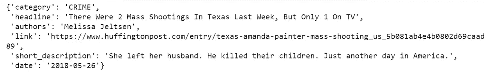

原始数据集包含超过 30 个类别，但是出于本教程的目的，我将使用 3 个类别的子集:娱乐、政治和技术。

```
**## create dtf**
dtf = pd.DataFrame(lst_dics)**## filter categories**
dtf = dtf[ dtf["category"].isin(['**ENTERTAINMENT**','**POLITICS**','**TECH**']) ][["category","headline"]]**## rename columns**
dtf = dtf.rename(columns={"category":"**y**", "headline":"**text**"})**## print 5 random rows**
dtf.sample(5)
```

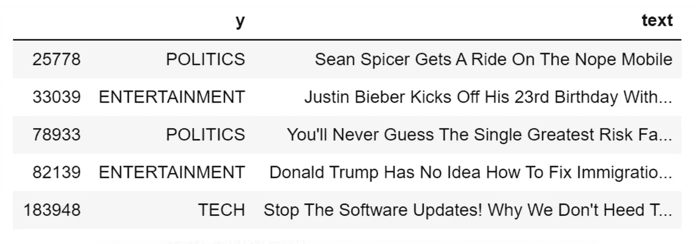

为了理解数据集的组成，我将通过用条形图显示标签频率来查看目标的**单变量分布**。

```
fig, ax = plt.subplots()
fig.suptitle(**"y"**, fontsize=12)
dtf[**"y"**].reset_index().groupby(**"y"**).count().sort_values(by= 
       "index").plot(kind="barh", legend=False, 
        ax=ax).grid(axis='x')
plt.show()
```

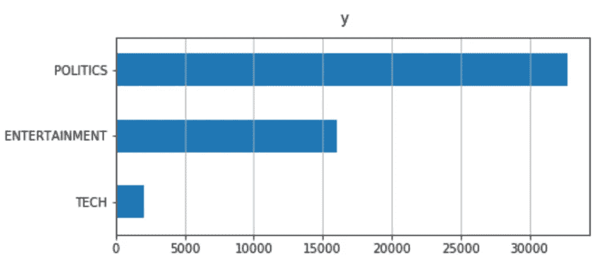

数据集是不平衡的:与其他相比，科技新闻的比例非常小，这将使模型识别科技新闻相当困难。

在解释和构建模型之前，我将给出一个预处理的例子，通过清理文本、删除停用词和应用词汇化。我将编写一个函数，并将其应用于整个数据集。

```
**'''
Preprocess a string.
:parameter
    :param text: string - name of column containing text
    :param lst_stopwords: list - list of stopwords to remove
    :param flg_stemm: bool - whether stemming is to be applied
    :param flg_lemm: bool - whether lemmitisation is to be applied
:return
    cleaned text
'''**
def **utils_preprocess_text**(text, flg_stemm=False, flg_lemm=True, lst_stopwords=None):
    **## clean (convert to lowercase and remove punctuations and   
    characters and then strip)**
    text = re.sub(r'[^\w\s]', '', str(text).lower().strip())

    **## Tokenize (convert from string to list)**
    lst_text = text.split() **## remove Stopwords**
    if lst_stopwords is not None:
        lst_text = [word for word in lst_text if word not in 
                    lst_stopwords]

    **## Stemming (remove -ing, -ly, ...)**
    if flg_stemm == True:
        ps = nltk.stem.porter.PorterStemmer()
        lst_text = [ps.stem(word) for word in lst_text]

    **## Lemmatisation (convert the word into root word)**
    if flg_lemm == True:
        lem = nltk.stem.wordnet.WordNetLemmatizer()
        lst_text = [lem.lemmatize(word) for word in lst_text]

    **## back to string from list**
    text = " ".join(lst_text)
    return text
```

该函数从语料库中删除一组给定的单词。我可以用 *nltk* 为英语词汇创建一个通用停用词列表(我们可以通过添加或删除单词来编辑这个列表)。

```
lst_stopwords = **nltk**.corpus.stopwords.words("**english**")
lst_stopwords
```

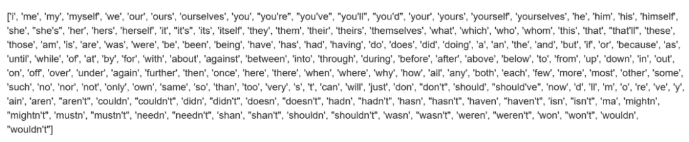

现在，我将对整个数据集应用我编写的函数，并将结果存储在一个名为“ *text_clean* 的新列中，以便您可以选择处理原始语料库或预处理文本。

```
dtf["**text_clean**"] = dtf["text"].apply(lambda x: 
          **utils_preprocess_text**(x, flg_stemm=False, **flg_lemm=True**, 
          **lst_stopwords=lst_stopwords**))dtf.head()
```

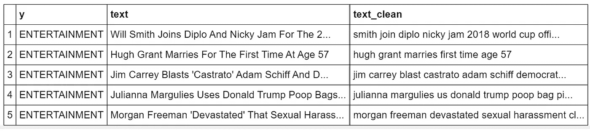

如果你对更深入的文本分析和预处理感兴趣，可以查看[这篇文章](/text-analysis-feature-engineering-with-nlp-502d6ea9225d)。考虑到这一点，我将把数据集划分为训练集(70%)和测试集(30%)，以便评估模型的性能。

```
**## split dataset**
dtf_train, dtf_test = model_selection.**train_test_split**(dtf, test_size=0.3)**## get target**
y_train = dtf_train[**"y"**].values
y_test = dtf_test[**"y"**].values
```

我们开始吧，好吗？

## 词汇袋

[*单词袋*](https://en.wikipedia.org/wiki/Bag-of-words_model) 模型很简单:它从一个文档语料库中构建一个词汇表，并统计这些单词在每个文档中出现的次数。换句话说，词汇表中的每个单词都成为一个特征，一个文档由一个具有相同词汇表长度的向量(一个“单词包”)来表示。例如，让我们用这种方法来表达 3 个句子:

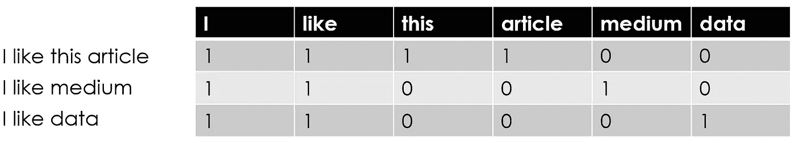

特征矩阵形状: ***文档数量****x****词汇长度*****

**可以想象，这种方法会导致一个显著的维数问题:文档越多，词汇表就越大，因此特征矩阵将是一个巨大的稀疏矩阵。因此，在单词袋模型之前通常要进行重要的预处理(单词清理、停用词去除、词干化/词条化)，目的是减少维数问题。**

**术语频率不一定是文本的最佳表示。事实上，你可以在语料库中找到出现频率最高但对目标变量几乎没有预测能力的常用词。为了解决这个问题，单词包有一个高级变体，它不是简单的计数，而是使用**术语频率-逆文档频率**(或 T[f-Idf](https://en.wikipedia.org/wiki/Tf%E2%80%93idf))**。**基本上，一个词的值随着 count 成正比增加，但是和这个词在语料库中的出现频率成反比。**

**让我们从**特征工程开始，**通过从数据中提取信息来创建特征的过程。我将使用限制为 10，000 个单词的 Tf-Idf 矢量器(因此我的词汇长度将为 10k)，捕获单字母词(即“ *new* ”和“ *york* ”)和双字母词(即“ *new york* ”)。我还将提供经典计数矢量器的代码:**

```
*****## Count (classic BoW)***
*vectorizer = feature_extraction.text.****CountVectorizer****(max_features=10000,* ngram_range=(1,2))

***## Tf-Idf (advanced variant of BoW)***
vectorizer = feature_extraction.text.**TfidfVectorizer**(max_features=10000, ngram_range=(1,2))**
```

**现在，我将在训练集的预处理语料库上使用矢量器来提取词汇并创建特征矩阵。**

```
**corpus = dtf_train["**text_clean**"]vectorizer.fit(corpus)
X_train = vectorizer.transform(corpus)
dic_vocabulary = vectorizer.vocabulary_**
```

**特征矩阵 *X_train* 具有 34，265(训练中的文档数量)x 10，000(词汇长度)的形状，并且它非常稀疏:**

```
**sns.**heatmap**(X_train.todense()[:,np.random.randint(0,X.shape[1],100)]==0, vmin=0, vmax=1, cbar=False).set_title('Sparse Matrix Sample')**
```

**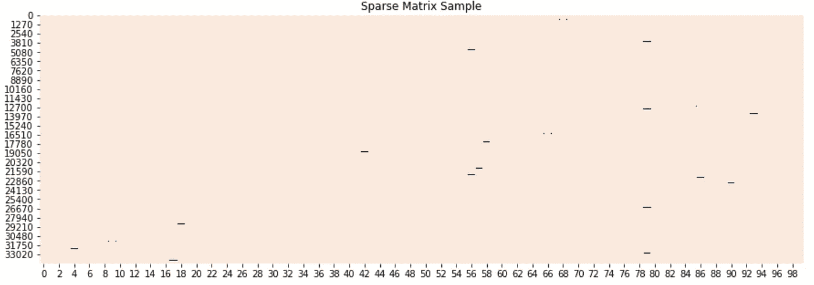**

**来自特征矩阵的随机样本(黑色的非零值)**

**为了知道某个单词的位置，我们可以在词汇表中查找它:**

```
**word = "new york"dic_vocabulary[word]**
```

**如果这个单词存在于词汇表中，这个命令打印一个数字 *N* ，意味着矩阵的第 *N* 个特征就是这个单词。**

**为了删除一些列并降低矩阵维数，我们可以执行一些**特征选择**，即选择相关变量子集的过程。我将如下进行:**

1.  **将每个类别视为二进制(例如，“技术”类别对于技术新闻为 1，对于其他类别为 0)；**
2.  **执行[卡方检验](https://en.wikipedia.org/wiki/Chi-squared_test)以确定特征和(二元)目标是否独立；**
3.  **仅保留卡方检验中具有特定 p 值的要素。**

```
**y = dtf_train["**y**"]
X_names = vectorizer.get_feature_names()
p_value_limit = 0.95dtf_features = pd.DataFrame()
for cat in np.unique(y):
    chi2, p = feature_selection.**chi2**(X_train, y==cat)
    dtf_features = dtf_features.append(pd.DataFrame(
                   {"feature":X_names, "score":1-p, "y":cat}))
    dtf_features = dtf_features.sort_values(["y","score"], 
                    ascending=[True,False])
    dtf_features = dtf_features[dtf_features["score"]>p_value_limit]X_names = dtf_features["feature"].unique().tolist()**
```

**我通过保留统计上最相关的特征，将特征的数量从 10，000 个减少到 3，152 个。让我们打印一些:**

```
**for cat in np.unique(y):
   print("# {}:".format(cat))
   print("  . selected features:",
         len(dtf_features[dtf_features["y"]==cat]))
   print("  . top features:", ",".join(
dtf_features[dtf_features["y"]==cat]["feature"].values[:10]))
   print(" ")**
```

**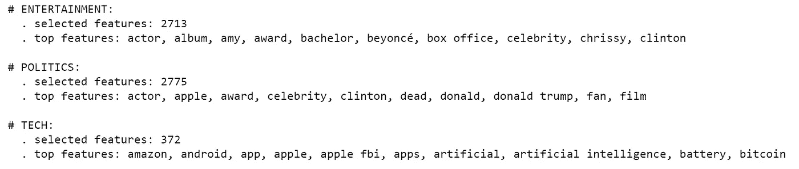**

**我们可以通过给定这组新单词作为输入，在语料库上重新装配矢量器。这将产生更小的特征矩阵和更短的词汇表。**

```
**vectorizer = feature_extraction.text.**TfidfVectorizer**(vocabulary=X_names)vectorizer.fit(corpus)
X_train = vectorizer.transform(corpus)
dic_vocabulary = vectorizer.vocabulary_**
```

**新的特征矩阵 *X_train* 具有 is 34，265(训练中的文档数量)x 3，152(给定词汇的长度)的形状。让我们看看矩阵是否不那么稀疏:**

**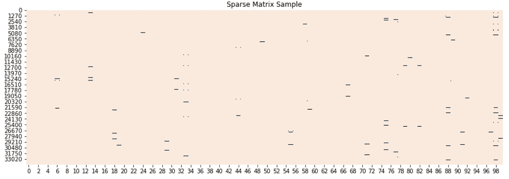**

**来自新特征矩阵的随机样本(黑色非零值)**

**是时候训练一个**机器学习模型**并测试它了。我推荐使用朴素贝叶斯算法:一种概率分类器，它利用了[贝叶斯定理](https://en.wikipedia.org/wiki/Bayes%27_theorem)，这是一种基于可能相关的条件的先验知识使用概率进行预测的规则。该算法最适合这种大型数据集，因为它独立考虑每个特征，计算每个类别的概率，然后预测概率最高的类别。**

```
**classifier = naive_bayes.**MultinomialNB**()**
```

**我将在特征矩阵上训练这个分类器，然后在转换后的测试集上测试它。为此，我需要构建一个 *scikit-learn* 管道:一个转换列表和一个最终估计器的顺序应用。将 Tf-Idf 矢量器和朴素贝叶斯分类器放在一个管道中，使我们能够在一个步骤中转换和预测测试数据。**

```
****## pipeline**
model = pipeline.**Pipeline**([("**vectorizer**", vectorizer),  
                           ("**classifier**", classifier)])**## train classifier** model["classifier"].fit(X_train, y_train)**## test** X_test = dtf_test["text_clean"].values
predicted = model.predict(X_test)
predicted_prob = model.predict_proba(X_test)**
```

**我们现在可以**评估单词袋模型的性能**，我将使用以下指标:**

*   **准确性:模型预测正确的比例。**
*   **混淆矩阵:按类别细分正确和错误预测数量的汇总表。**
*   **ROC:说明在不同阈值设置下真阳性率与假阳性率的图表。曲线下的面积(AUC)表示分类器将随机选择的阳性观察值排列为高于随机选择的阴性观察值的概率。**
*   **Precision:相关实例在检索到的实例中所占的比例。**
*   **Recall:实际检索到的相关实例总数的一部分。**

```
**classes = np.unique(y_test)
y_test_array = pd.get_dummies(y_test, drop_first=False).values **## Accuracy, Precision, Recall**
accuracy = metrics.accuracy_score(y_test, predicted)
auc = metrics.roc_auc_score(y_test, predicted_prob, 
                            multi_class="ovr")
print("Accuracy:",  round(accuracy,2))
print("Auc:", round(auc,2))
print("Detail:")
print(metrics.classification_report(y_test, predicted))

**## Plot confusion matrix**
cm = metrics.confusion_matrix(y_test, predicted)
fig, ax = plt.subplots()
sns.heatmap(cm, annot=True, fmt='d', ax=ax, cmap=plt.cm.Blues, 
            cbar=False)
ax.set(xlabel="Pred", ylabel="True", xticklabels=classes, 
       yticklabels=classes, title="Confusion matrix")
plt.yticks(rotation=0) fig, ax = plt.subplots(nrows=1, ncols=2)
**## Plot roc**
for i in range(len(classes)):
    fpr, tpr, thresholds = metrics.roc_curve(y_test_array[:,i],  
                           predicted_prob[:,i])
    ax[0].plot(fpr, tpr, lw=3, 
              label='{0} (area={1:0.2f})'.format(classes[i], 
                              metrics.auc(fpr, tpr))
               )
ax[0].plot([0,1], [0,1], color='navy', lw=3, linestyle='--')
ax[0].set(xlim=[-0.05,1.0], ylim=[0.0,1.05], 
          xlabel='False Positive Rate', 
          ylabel="True Positive Rate (Recall)", 
          title="Receiver operating characteristic")
ax[0].legend(loc="lower right")
ax[0].grid(True)

**## Plot precision-recall curve** for i in range(len(classes)):
    precision, recall, thresholds = metrics.precision_recall_curve(
                 y_test_array[:,i], predicted_prob[:,i])
    ax[1].plot(recall, precision, lw=3, 
               label='{0} (area={1:0.2f})'.format(classes[i], 
                                  metrics.auc(recall, precision))
              )
ax[1].set(xlim=[0.0,1.05], ylim=[0.0,1.05], xlabel='Recall', 
          ylabel="Precision", title="Precision-Recall curve")
ax[1].legend(loc="best")
ax[1].grid(True)
plt.show()**
```

**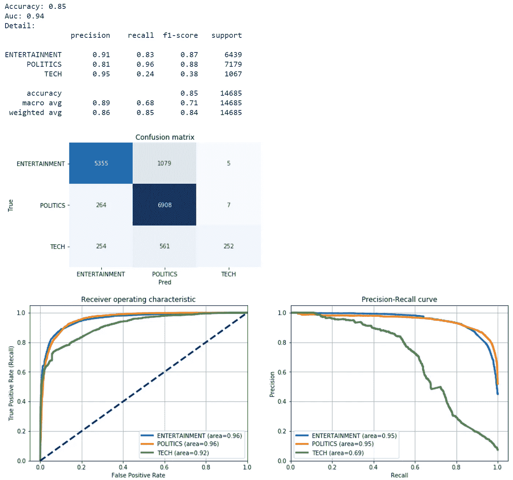**

**BoW 模型对测试集的正确率为 85%(准确率为 0.85)，但很难识别科技新闻(只有 252 个预测正确)。**

**让我们试着理解为什么该模型将新闻归入某一类别，并评估这些预测的**解释能力**。lime 包可以帮助我们建立一个解释器。为了举例说明，我将从测试集中随机观察，看看模型预测了什么，为什么。**

```
****## select observation** i = 0
txt_instance = dtf_test["**text**"].iloc[i]**## check true value and predicted value**
print("True:", y_test[i], "--> Pred:", predicted[i], "| Prob:", round(np.max(predicted_prob[i]),2))**## show explanation**
explainer = lime_text.**LimeTextExplainer**(class_names=
             np.unique(y_train))
explained = explainer.explain_instance(txt_instance, 
             model.predict_proba, num_features=3)
explained.show_in_notebook(text=txt_instance, predict_proba=False)**
```

**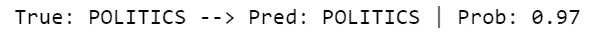****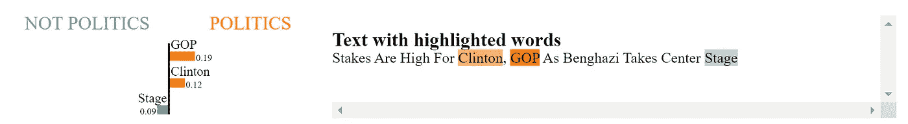**

**这是有道理的:单词“*克林顿*”和“*共和党*”为这个模型指出了正确的方向(政治新闻)，即使单词“*舞台*”在娱乐新闻中更常见。**

## **单词嵌入**

**[*单词嵌入*](https://en.wikipedia.org/wiki/Word_embedding) 是将词汇中的单词映射到实数向量的特征学习技术的统称。这些向量是根据出现在另一个单词之前或之后的每个单词的概率分布来计算的。换句话说，相同上下文的单词通常一起出现在语料库中，因此它们在向量空间中也将是接近的。例如，让我们看一下上一个例子中的三个句子:**

**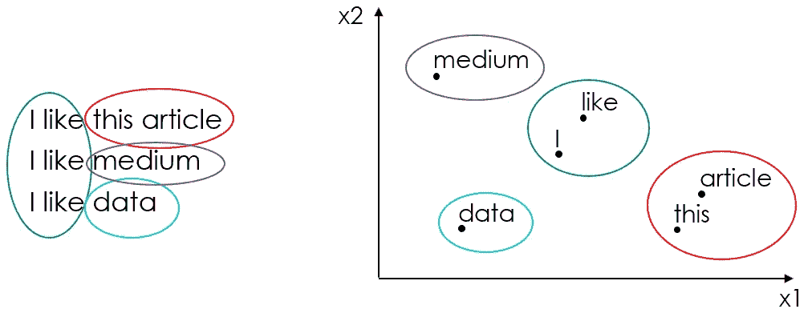**

**嵌入 2D 向量空间的词**

**在本教程中，我将使用这个家族的第一个模型:谷歌的[*word 2 vec*](https://en.wikipedia.org/wiki/Word2vec)*(2013)。其他流行的单词嵌入模型还有斯坦福的[*GloVe*](https://en.wikipedia.org/wiki/GloVe_(machine_learning))*(2014)*和脸书的[*fast text*](https://en.wikipedia.org/wiki/FastText)(2016)。*****

*****Word2Vec** 利用语料库中的每个唯一单词产生通常具有数百维的向量空间，使得语料库中共享共同上下文的单词在空间中彼此靠近。这可以使用两种不同的方法来完成:从单个单词开始预测其上下文( *Skip-gram* )或者从上下文开始预测单词(*连续单词包*)。***

***在 Python 中，你可以像这样从[*genism-data*](https://github.com/RaRe-Technologies/gensim-data)*加载一个预先训练好的单词嵌入模型:****

```
****nlp = gensim_api.load("**word2vec-google-news-300"**)****
```

****我将使用 *gensim 在训练数据语料库上拟合我自己的 Word2Vec，而不是使用预先训练的模型。*在拟合模型之前，需要将语料库转换成 n 元文法列表的列表。在这个特殊的例子中，我将尝试捕获单字母(" *york* ")、双字母(" *new york* ")和三字母(" *new york city* ")。****

```
***corpus = dtf_train["**text_clean**"] **## create list of lists of unigrams**
lst_corpus = []
for string in corpus:
   lst_words = string.split()
   lst_grams = [" ".join(lst_words[i:i+1]) 
               for i in range(0, len(lst_words), 1)]
   lst_corpus.append(lst_grams) **## detect bigrams and trigrams**
bigrams_detector = gensim.models.phrases.**Phrases**(lst_corpus, 
                 delimiter=" ".encode(), min_count=5, threshold=10)
bigrams_detector = gensim.models.phrases.**Phraser**(bigrams_detector)trigrams_detector = gensim.models.phrases.**Phrases**(bigrams_detector[lst_corpus], 
            delimiter=" ".encode(), min_count=5, threshold=10)
trigrams_detector = gensim.models.phrases.**Phraser**(trigrams_detector)***
```

***安装 Word2Vec 时，需要指定:***

*   ***单词向量的目标大小，我用 300；***
*   ***窗口，或句子中当前单词和预测单词之间的最大距离，我将使用语料库中文本的平均长度；***
*   ***训练算法，我将使用 skip-grams (sg=1 ),因为通常它有更好的结果。***

```
*****## fit w2v**
nlp = gensim.models.word2vec.**Word2Vec**(lst_corpus, size=300,   
            window=8, min_count=1, sg=1, iter=30)***
```

***我们有自己的嵌入模型，所以我们可以从语料库中选择任何单词，并将其转换为向量。***

```
***word = "data"
nlp[word].shape***
```

***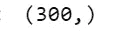***

***我们甚至可以通过应用任何降维算法(即 [TSNE](https://scikit-learn.org/stable/modules/generated/sklearn.manifold.TSNE.html) )来使用它将一个单词及其上下文可视化到一个更小的维度空间(2D 或 3D)中。***

```
***word = "data"
fig = plt.figure()**## word embedding**
tot_words = [word] + [tupla[0] for tupla in 
                 nlp.most_similar(word, topn=20)]
X = nlp[tot_words]**## pca to reduce dimensionality from 300 to 3**
pca = manifold.**TSNE**(perplexity=40, n_components=3, init='pca')
X = pca.fit_transform(X)**## create dtf**
dtf_ = pd.DataFrame(X, index=tot_words, columns=["x","y","z"])
dtf_["input"] = 0
dtf_["input"].iloc[0:1] = 1**## plot 3d**
from mpl_toolkits.mplot3d import Axes3D
ax = fig.add_subplot(111, projection='3d')
ax.scatter(dtf_[dtf_["input"]==0]['x'], 
           dtf_[dtf_["input"]==0]['y'], 
           dtf_[dtf_["input"]==0]['z'], c="black")
ax.scatter(dtf_[dtf_["input"]==1]['x'], 
           dtf_[dtf_["input"]==1]['y'], 
           dtf_[dtf_["input"]==1]['z'], c="red")
ax.set(xlabel=None, ylabel=None, zlabel=None, xticklabels=[], 
       yticklabels=[], zticklabels=[])
for label, row in dtf_[["x","y","z"]].iterrows():
    x, y, z = row
    ax.text(x, y, z, s=label)***
```

******

***这很酷，但是嵌入这个词怎么能用来预测新闻类别呢？嗯，单词向量可以在神经网络中用作权重。这是怎么回事:***

*   ***首先，将语料库转换成单词 id 的填充序列，以获得特征矩阵。***
*   ***然后，创建一个嵌入矩阵，使得 id 为 *N* 的单词的向量位于第*N*行。***
*   ***最后，构建一个具有嵌入层的神经网络，该嵌入层用相应的向量对序列中的每个单词进行加权。***

***让我们从**特征工程**开始，通过使用 *tensorflow/keras* 将给予 Word2Vec 的相同预处理语料库(n 元语法列表的列表)转换成序列列表:***

```
*****## tokenize text**
tokenizer = kprocessing.text.**Tokenizer**(lower=True, split=' ', 
                     oov_token="NaN", 
                     filters='!"#$%&()*+,-./:;<=>?@[\\]^_`{|}~\t\n')
tokenizer.fit_on_texts(lst_corpus)
dic_vocabulary = tokenizer.word_index**## create sequence**
lst_text2seq= tokenizer.texts_to_sequences(lst_corpus)**## padding sequence**
X_train = kprocessing.sequence.**pad_sequences**(lst_text2seq, 
                    maxlen=15, padding="post", truncating="post")***
```

***特征矩阵 *X_train* 的形状为 34，265 x 15(序列数 X 序列最大长度)。让我们想象一下:***

```
***sns.heatmap(X_train==0, vmin=0, vmax=1, cbar=False)
plt.show()***
```

***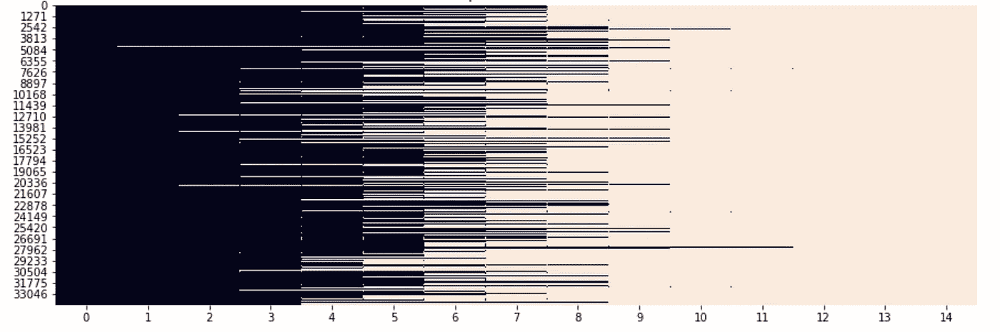***

***特征矩阵(34，265 x 15)***

***语料库中的每个文本现在都是长度为 15 的 id 序列。例如，如果文本中有 10 个标记，那么序列由 10 个 id+5 个 0 组成，这是填充元素(而不在词汇表中的单词的 id 是 1)。让我们打印一个来自训练集的文本如何被转换成一个带有填充和词汇的序列。***

```
***i = 0

**## list of text: ["I like this", ...]**
len_txt = len(dtf_train["text_clean"].iloc[i].split())
print("from: ", dtf_train["text_clean"].iloc[i], "| len:", len_txt)

**## sequence of token ids: [[1, 2, 3], ...]**
len_tokens = len(X_train[i])
print("to: ", X_train[i], "| len:", len(X_train[i]))

**## vocabulary: {"I":1, "like":2, "this":3, ...}**
print("check: ", dtf_train["text_clean"].iloc[i].split()[0], 
      " -- idx in vocabulary -->", 
      dic_vocabulary[dtf_train["text_clean"].iloc[i].split()[0]])

print("vocabulary: ", dict(list(dic_vocabulary.items())[0:5]), "... (padding element, 0)")***
```

***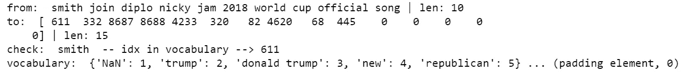***

***在继续之前，不要忘记在测试集上做同样的特性工程:***

```
***corpus = dtf_test["**text_clean**"] **## create list of n-grams**
lst_corpus = []
for string in corpus:
    lst_words = string.split()
    lst_grams = [" ".join(lst_words[i:i+1]) for i in range(0, 
                 len(lst_words), 1)]
    lst_corpus.append(lst_grams) **## detect common bigrams and trigrams using the fitted detectors**
lst_corpus = list(bigrams_detector[lst_corpus])
lst_corpus = list(trigrams_detector[lst_corpus]) **## text to sequence with the fitted tokenizer**
lst_text2seq = tokenizer.texts_to_sequences(lst_corpus) **## padding sequence**
X_test = kprocessing.sequence.**pad_sequences**(lst_text2seq, maxlen=15,
             padding="post", truncating="post")***
```

***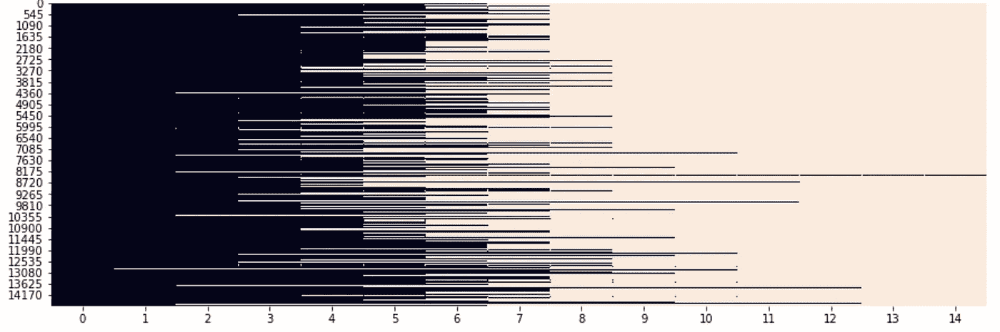***

***x _ 测试(14，697 x 15)***

***我们已经得到了我们的 *X_train* 和 *X_test* ，现在我们需要创建嵌入的**矩阵，它将被用作神经网络分类器中的权重矩阵。*****

```
*****## start the matrix (length of vocabulary x vector size) with all 0s**
embeddings = np.zeros((len(dic_vocabulary)+1, 300))for word,idx in dic_vocabulary.items():
    **## update the row with vector**
    try:
        embeddings[idx] =  nlp[word]
    **## if word not in model then skip and the row stays all 0s**
    except:
        pass***
```

***该代码生成一个形状为 22，338 x 300 的矩阵(从语料库中提取的词汇长度 x 向量大小)。它可以通过单词 id 导航，可以从词汇表中获得。***

```
***word = "data"print("dic[word]:", dic_vocabulary[word], "|idx")
print("embeddings[idx]:", embeddings[dic_vocabulary[word]].shape, 
      "|vector")***
```

***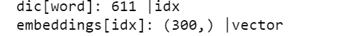***

***终于到了搭建**深度学习模型**的时候了。我将使用我将构建和训练的神经网络的第一个嵌入层中的嵌入矩阵来对新闻进行分类。输入序列中的每个 id 将被用作访问嵌入矩阵的索引。这个嵌入层的输出将是一个 2D 矩阵，对于输入序列中的每个单词 id 有一个单词向量(序列长度×向量大小)。让我们用句子“*我喜欢这篇文章*”作为例子:***

***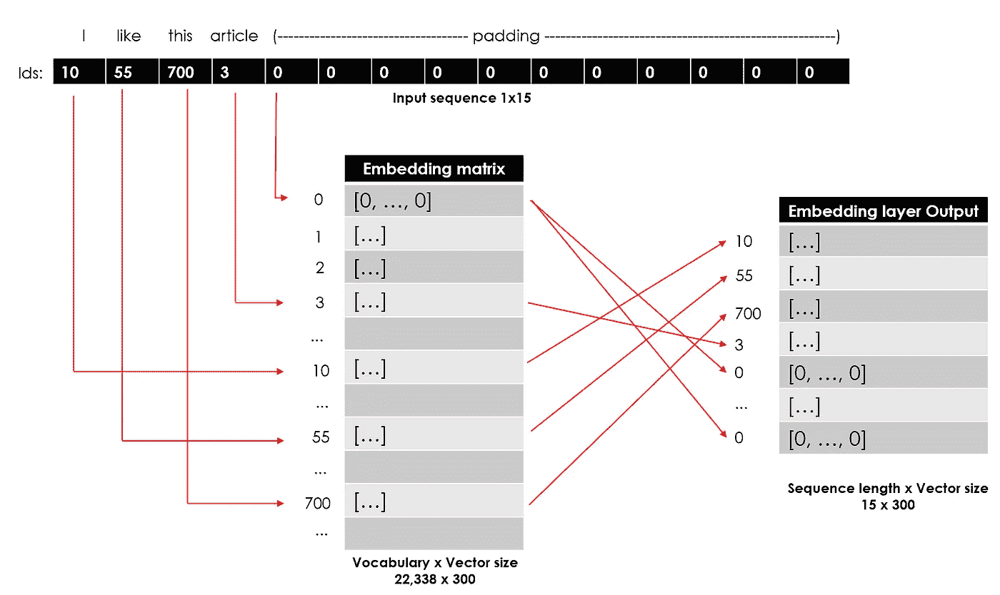***

***我的神经网络结构如下:***

*   ***如前所述，嵌入层将序列作为输入，将单词向量作为权重。***
*   ***一个简单的注意层，不会影响预测，但它将捕获每个实例的权重，并允许我们构建一个好的解释器(它对于预测是不必要的，只是为了解释，所以你可以跳过它)。注意机制在[本文](https://arxiv.org/abs/1409.0473) (2014)中提出，作为序列模型(即 LSTM)问题的解决方案，以理解长文本的哪些部分实际上是相关的。***
*   ***两层双向 LSTM，在两个方向上对序列中的单词顺序进行建模。***
*   ***两个最终的密集层将预测每个新闻类别的概率。***

```
*****## code attention layer**
def **attention_layer**(inputs, neurons):
    x = layers.**Permute**((2,1))(inputs)
    x = layers.**Dense**(neurons, activation="softmax")(x)
    x = layers.**Permute**((2,1), name="**attention**")(x)
    x = layers.**multiply**([inputs, x])
    return x **## input**
x_in = layers.**Input**(shape=(15,))**## embedding**
x = layers.**Embedding**(input_dim=embeddings.shape[0],  
                     output_dim=embeddings.shape[1], 
                     weights=[embeddings],
                     input_length=15, trainable=False)(x_in)**## apply attention**
x = attention_layer(x, neurons=15)**## 2 layers of bidirectional lstm**
x = layers.**Bidirectional**(layers.**LSTM**(units=15, dropout=0.2, 
                         return_sequences=True))(x)
x = layers.**Bidirectional**(layers.**LSTM**(units=15, dropout=0.2))(x)**## final dense layers**
x = layers.**Dense**(64, activation='relu')(x)
y_out = layers.**Dense**(3, activation='softmax')(x)**## compile**
model = models.**Model**(x_in, y_out)
model.compile(loss='sparse_categorical_crossentropy',
              optimizer='adam', metrics=['accuracy'])

model.summary()***
```

***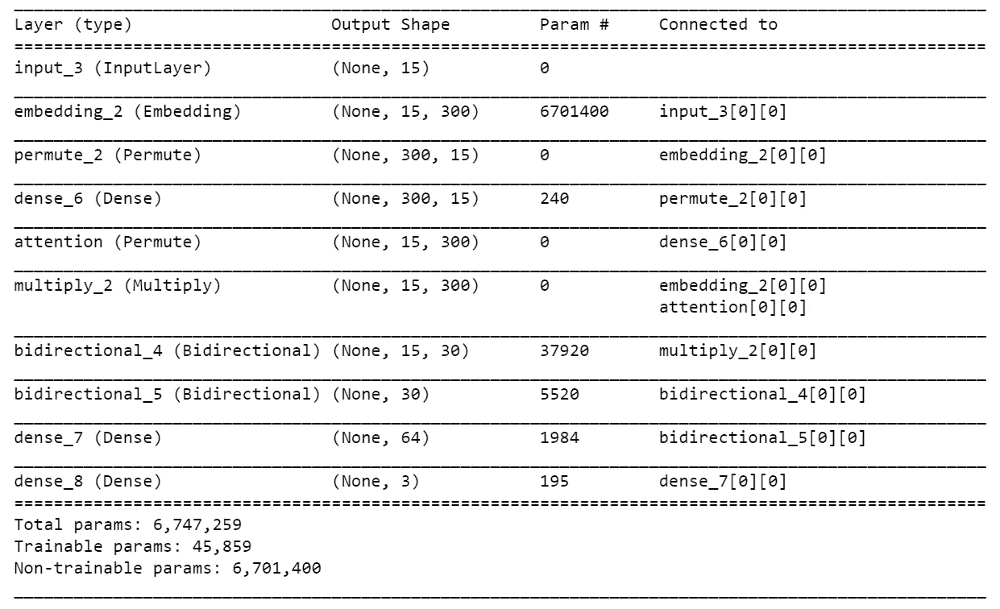***

***现在，我们可以训练模型，并在实际测试集上测试它之前，检查用于验证的训练集子集的性能。***

```
*****## encode y**
dic_y_mapping = {n:label for n,label in 
                 enumerate(np.unique(y_train))}
inverse_dic = {v:k for k,v in dic_y_mapping.items()}
y_train = np.array([inverse_dic[y] for y in y_train])**## train**
training = model.fit(x=X_train, y=y_train, batch_size=256, 
                     epochs=10, shuffle=True, verbose=0, 
                     validation_split=0.3)**## plot loss and accuracy**
metrics = [k for k in training.history.keys() if ("loss" not in k) and ("val" not in k)]
fig, ax = plt.subplots(nrows=1, ncols=2, sharey=True)ax[0].set(title="Training")
ax11 = ax[0].twinx()
ax[0].plot(training.history['loss'], color='black')
ax[0].set_xlabel('Epochs')
ax[0].set_ylabel('Loss', color='black')
for metric in metrics:
    ax11.plot(training.history[metric], label=metric)
ax11.set_ylabel("Score", color='steelblue')
ax11.legend()ax[1].set(title="Validation")
ax22 = ax[1].twinx()
ax[1].plot(training.history['val_loss'], color='black')
ax[1].set_xlabel('Epochs')
ax[1].set_ylabel('Loss', color='black')
for metric in metrics:
     ax22.plot(training.history['val_'+metric], label=metric)
ax22.set_ylabel("Score", color="steelblue")
plt.show()***
```

***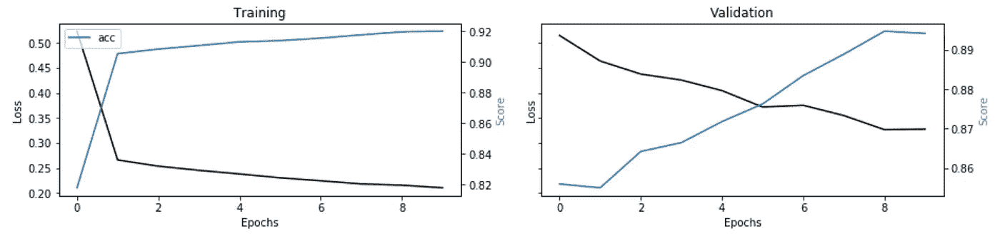***

***不错！在某些纪元中，精确度达到 0.89。为了完成单词嵌入模型的**评估**，让我们预测测试集并比较之前使用的相同度量(度量的代码与之前相同)。***

```
*****## test**
predicted_prob = model.predict(X_test)
predicted = [dic_y_mapping[np.argmax(pred)] for pred in 
             predicted_prob]***
```

******

***该模型的表现与上一个模型一样好，事实上，它也很难对科技新闻进行分类。***

***但是这也是**可以解释的吗？是的，它是！我在神经网络中放置了一个注意力层，以提取每个单词的权重，并了解这些权重对分类一个实例的贡献有多大。因此，我将尝试使用注意力权重来构建一个解释器(类似于上一节中看到的解释器):*****

```
*****## select observation** i = 0
txt_instance = dtf_test["**text**"].iloc[i]**## check true value and predicted value**
print("True:", y_test[i], "--> Pred:", predicted[i], "| Prob:", round(np.max(predicted_prob[i]),2)) **## show explanation
### 1\. preprocess input** lst_corpus = []
for string in [re.sub(r'[^\w\s]','', txt_instance.lower().strip())]:
    lst_words = string.split()
    lst_grams = [" ".join(lst_words[i:i+1]) for i in range(0, 
                 len(lst_words), 1)]
    lst_corpus.append(lst_grams)
lst_corpus = list(bigrams_detector[lst_corpus])
lst_corpus = list(trigrams_detector[lst_corpus])
X_instance = kprocessing.sequence.pad_sequences(
              tokenizer.texts_to_sequences(corpus), maxlen=15, 
              padding="post", truncating="post")**### 2\. get attention weights**
layer = [layer for layer in model.layers if "**attention**" in 
         layer.name][0]
func = K.function([model.input], [layer.output])
weights = func(X_instance)[0]
weights = np.mean(weights, axis=2).flatten()**### 3\. rescale weights, remove null vector, map word-weight**
weights = preprocessing.MinMaxScaler(feature_range=(0,1)).fit_transform(np.array(weights).reshape(-1,1)).reshape(-1)
weights = [weights[n] for n,idx in enumerate(X_instance[0]) if idx 
           != 0]
dic_word_weigth = {word:weights[n] for n,word in 
                   enumerate(lst_corpus[0]) if word in 
                   tokenizer.word_index.keys()}**### 4\. barplot**
if len(dic_word_weigth) > 0:
   dtf = pd.DataFrame.from_dict(dic_word_weigth, orient='index', 
                                columns=["score"])
   dtf.sort_values(by="score", 
           ascending=True).tail(3).plot(kind="barh", 
           legend=False).grid(axis='x')
   plt.show()
else:
   print("--- No word recognized ---")**### 5\. produce html visualization**
text = []
for word in lst_corpus[0]:
    weight = dic_word_weigth.get(word)
    if weight is not None:
         text.append('<b><span style="background-color:rgba(100,149,237,' + str(weight) + ');">' + word + '</span></b>')
    else:
         text.append(word)
text = ' '.join(text)**### 6\. visualize on notebook** print("**\033**[1m"+"Text with highlighted words")
from IPython.core.display import display, HTML
display(HTML(text))***
```

***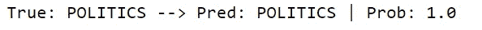******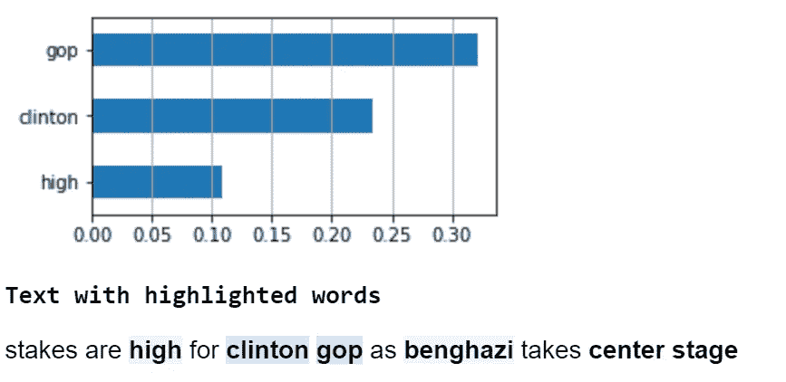***

***就像以前一样，单词“*克林顿*”和“*共和党*”激活了模型的神经元，但这次“*高*”和“*班加西*”也被认为与预测略有关联。***

## ***语言模型***

***[语言模型](https://en.wikipedia.org/wiki/Language_model)，或语境化/动态单词嵌入**，**克服了经典单词嵌入方法的最大限制:多义词歧义消除，一个具有不同含义的单词(例如“ *bank* 或“ *stick* ”)仅通过一个向量来识别。最受欢迎的方法之一是 ELMO (2018)，它没有应用固定的嵌入，而是使用双向 LSTM，查看整个句子，然后为每个单词分配一个嵌入。***

***进入变形金刚:谷歌论文 [*提出的一种新的建模技术*](https://arxiv.org/abs/1706.03762)*(2017)*中展示了顺序模型(如 LSTM)可以完全被注意力机制取代，甚至获得更好的性能。*****

****谷歌的 [**伯特**](https://en.wikipedia.org/wiki/BERT_(language_model)) (来自变形金刚的双向编码器表示，2018)结合了 ELMO 上下文嵌入和几个变形金刚，加上它的双向(这对变形金刚来说是一个很大的新奇)。BERT 分配给单词的向量是整个句子的函数，因此，基于上下文，一个单词可以有不同的向量。让我们用*变压器*试试吧:****

```
***txt = **"bank river"****## bert tokenizer**
tokenizer = transformers.**BertTokenizer**.**from_pretrained**('bert-base-uncased', do_lower_case=True)**## bert model**
nlp = transformers.**TFBertModel**.**from_pretrained**('bert-base-uncased')**## return hidden layer with embeddings**
input_ids = np.array(tokenizer.encode(txt))[None,:]  
embedding = nlp(input_ids)embedding[0][0]***
```

***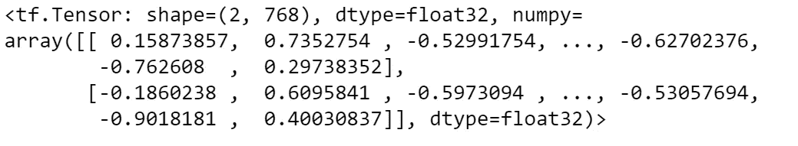***

***如果我们将输入文本更改为“*银行资金*”，我们得到的结果是:***

***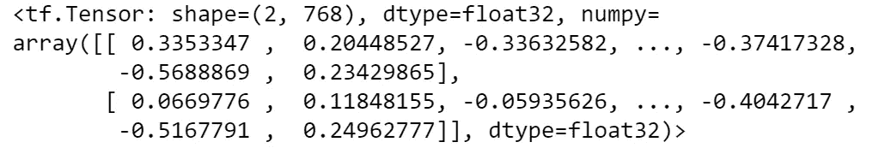***

***为了完成文本分类任务，您可以以 3 种不同的方式使用 BERT:***

*   ***训练它从划痕，并使用它作为分类器。***
*   ***提取单词 embedding，并在嵌入层中使用它们(就像我对 Word2Vec 所做的那样)。***
*   ***微调预训练模型(迁移学习)。***

***我将采用后者，并从一个预训练的较轻版本的 BERT 进行迁移学习，称为[distilt-BERT](https://huggingface.co/transformers/model_doc/distilbert.html)(6600 万个参数，而不是 1.1 亿个！).***

```
*****## distil-bert tokenizer**
tokenizer = transformers.**AutoTokenizer**.**from_pretrained**('distilbert-base-uncased', do_lower_case=True)***
```

***像往常一样，在装配模型之前，有一些特征工程工作要做，但是这次会有点棘手。为了说明我要做的事情，让我们以我们最喜欢的句子“*我喜欢这篇文章*”为例，它必须转换为 3 个向量(id、掩码、段):***

***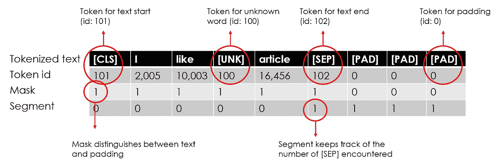***

***形状:3 x 序列长度***

***首先，我们需要选择序列的最大长度。这次我将选择一个更大的数字(即 50 ),因为 BERT 会将未知单词拆分成子标记，直到找到一个已知的单词。例如，如果给定一个像" *zzdata* "这样的造词，伯特会把它拆分成[" *z* "，" *##z* "，" *##data* "]。此外，我们必须在输入文本中插入特殊标记，然后生成掩码和分段。最后，将所有这些放在一个张量中以获得特征矩阵，该矩阵将具有 3(id、掩码、分段)x 语料库中的文档数量 x 序列长度的形状。***

***请注意，我使用原始文本作为语料库(到目前为止，我一直使用 *clean_text* 列)。***

```
***corpus = dtf_train["**text**"]
maxlen = 50 **## add special tokens**
maxqnans = np.int((maxlen-20)/2)
corpus_tokenized = ["[CLS] "+
             " ".join(tokenizer.tokenize(re.sub(r'[^\w\s]+|\n', '', 
             str(txt).lower().strip()))[:maxqnans])+
             " [SEP] " for txt in corpus]

**## generate masks**
masks = [[1]*len(txt.split(" ")) + [0]*(maxlen - len(
           txt.split(" "))) for txt in corpus_tokenized]

**## padding**
txt2seq = [txt + " [PAD]"*(maxlen-len(txt.split(" "))) if len(txt.split(" ")) != maxlen else txt for txt in corpus_tokenized]

**## generate idx**
idx = [tokenizer.encode(seq.split(" ")) for seq in txt2seq]

**## generate segments**
segments = [] 
for seq in txt2seq:
    temp, i = [], 0
    for token in seq.split(" "):
        temp.append(i)
        if token == "[SEP]":
             i += 1
    segments.append(temp)**## feature matrix**
X_train = [np.asarray(idx, dtype='int32'), 
           np.asarray(masks, dtype='int32'), 
           np.asarray(segments, dtype='int32')]***
```

***特征矩阵 *X_train* 的形状为 3×34，265×50。我们可以从特征矩阵中检查随机观察值:***

```
***i = 0print("txt: ", dtf_train["text"].iloc[0])
print("tokenized:", [tokenizer.convert_ids_to_tokens(idx) for idx in X_train[0][i].tolist()])
print("idx: ", X_train[0][i])
print("mask: ", X_train[1][i])
print("segment: ", X_train[2][i])***
```

***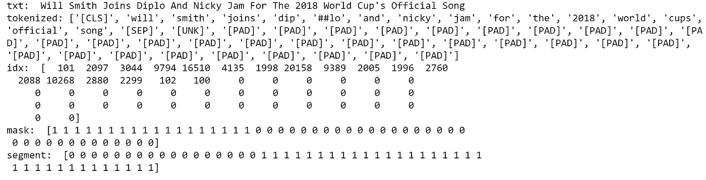***

***您可以将相同的代码应用于 dtf_test["text"]以获得 *X_test* 。***

***现在，我要从预先训练好的 BERT 开始，用迁移学习构建**深度学习模型。基本上，我将使用平均池将 BERT 的输出总结为一个向量，然后添加两个最终的密集层来预测每个新闻类别的概率。*****

***如果您想使用 BERT 的原始版本，下面是代码(记得用正确的标记器重做特性工程):***

```
*****## inputs**
idx = layers.**Input**((50), dtype="int32", name="input_idx")
masks = layers.**Input**((50), dtype="int32", name="input_masks")
segments = layers.Input((50), dtype="int32", name="input_segments")**## pre-trained bert**
nlp = transformers.**TFBertModel.from_pretrained**("bert-base-uncased")
bert_out, _ = nlp([idx, masks, segments])**## fine-tuning**
x = layers.**GlobalAveragePooling1D**()(bert_out)
x = layers.**Dense**(64, activation="relu")(x)
y_out = layers.**Dense**(len(np.unique(y_train)), 
                     activation='softmax')(x)**## compile**
model = models.**Model**([idx, masks, segments], y_out)for layer in model.layers[:4]:
    layer.trainable = Falsemodel.compile(loss='sparse_categorical_crossentropy', 
              optimizer='adam', metrics=['accuracy'])model.summary()***
```

***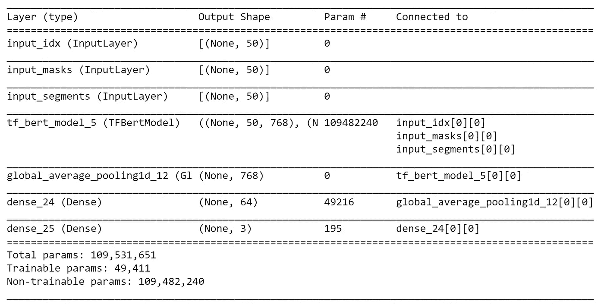***

***正如我所说，我将使用更简单的版本，distilt-BERT:***

```
*****## inputs**
idx = layers.**Input**((50), dtype="int32", name="input_idx")
masks = layers.**Input**((50), dtype="int32", name="input_masks")**## pre-trained bert with config**
config = transformers.DistilBertConfig(dropout=0.2, 
           attention_dropout=0.2)
config.output_hidden_states = Falsenlp = transformers.**TFDistilBertModel.from_pretrained**('distilbert-
                  base-uncased', config=config)
bert_out = nlp(idx, attention_mask=masks)[0]**## fine-tuning**
x = layers.**GlobalAveragePooling1D**()(bert_out)
x = layers.**Dense**(64, activation="relu")(x)
y_out = layers.**Dense**(len(np.unique(y_train)), 
                     activation='softmax')(x)**## compile**
model = models.**Model**([idx, masks], y_out)for layer in model.layers[:3]:
    layer.trainable = Falsemodel.compile(loss='sparse_categorical_crossentropy', 
              optimizer='adam', metrics=['accuracy'])model.summary()***
```

***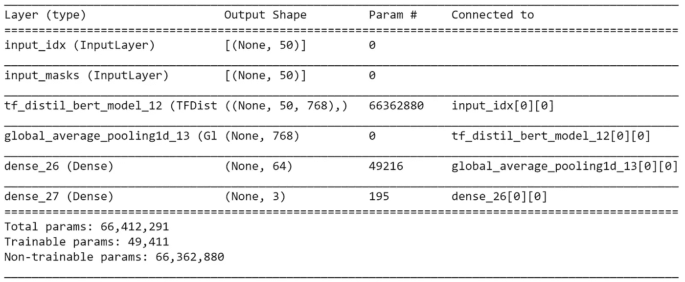***

***让我们**训练、测试、评估**这个坏小子(评估的代码相同):***

```
*****## encode y**
dic_y_mapping = {n:label for n,label in 
                 enumerate(np.unique(y_train))}
inverse_dic = {v:k for k,v in dic_y_mapping.items()}
y_train = np.array([inverse_dic[y] for y in y_train])**## train**
training = model.fit(x=X_train, y=y_train, batch_size=64, 
                     epochs=1, shuffle=True, verbose=1, 
                     validation_split=0.3)**## test**
predicted_prob = model.predict(X_test)
predicted = [dic_y_mapping[np.argmax(pred)] for pred in 
             predicted_prob]***
```

***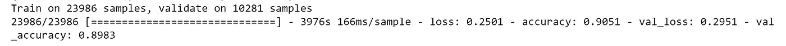******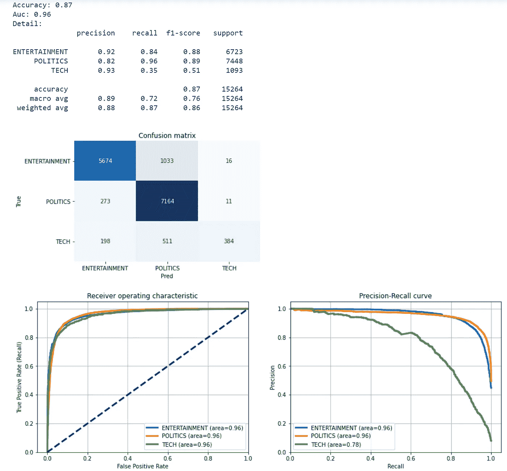***

***BERT 的性能比以前的型号略好，事实上，它比其他型号能识别更多的科技新闻。***

## ***结论***

***这篇文章是演示**如何将不同的 NLP 模型应用到多类分类用例**的教程。我比较了 3 种流行的方法:使用 Tf-Idf 的单词包、使用 Word2Vec 的单词嵌入和使用 BERT 的语言模型。我经历了特征工程&选择，模型设计&测试，评估&可解释性，比较每一步中的 3 个模型(如果可能的话)。***

***我希望你喜欢它！如有问题和反馈，或者只是分享您感兴趣的项目，请随时联系我。***

> ***👉[我们来连线](https://linktr.ee/maurodp)👈***

> ***本文是 Python 的系列文章 **NLP 的一部分，参见:*****

***[](/ai-chatbot-with-nlp-speech-recognition-transformers-583716a299e9) [## 带 NLP 的 AI 聊天机器人:语音识别+变形金刚

### 用 Python 构建一个会说话的聊天机器人，与你的人工智能进行对话

towardsdatascience.com](/ai-chatbot-with-nlp-speech-recognition-transformers-583716a299e9) [](/text-summarization-with-nlp-textrank-vs-seq2seq-vs-bart-474943efeb09) [## 使用 NLP 的文本摘要:TextRank vs Seq2Seq vs BART

### 使用 Python、Gensim、Tensorflow、Transformers 进行自然语言处理

towardsdatascience.com](/text-summarization-with-nlp-textrank-vs-seq2seq-vs-bart-474943efeb09) [](/text-analysis-feature-engineering-with-nlp-502d6ea9225d) [## 使用自然语言处理的文本分析和特征工程

### 语言检测，文本清理，长度，情感，命名实体识别，N-grams 频率，词向量，主题…

towardsdatascience.com](/text-analysis-feature-engineering-with-nlp-502d6ea9225d) [](/text-classification-with-no-model-training-935fe0e42180) [## 用于无模型训练的文本分类的 BERT

### 如果没有带标签的训练集，请使用 BERT、单词嵌入和向量相似度

towardsdatascience.com](/text-classification-with-no-model-training-935fe0e42180)***