# 用于无模型训练的文本分类的 BERT

> 原文：<https://towardsdatascience.com/text-classification-with-no-model-training-935fe0e42180?source=collection_archive---------1----------------------->


## 如果没有带标签的训练集，请使用 BERT、单词嵌入和向量相似度

## 摘要

您是否因为没有带标签的数据集而难以对文本数据进行分类？在本文中，我将使用 BERT 和 Python 解释如何执行一种基于相似性的“无监督”文本分类。

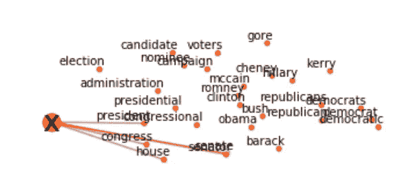

作者图片

[**【NLP(自然语言处理)**](https://en.wikipedia.org/wiki/Natural_language_processing) 是人工智能领域，研究计算机与人类语言之间的交互，特别是如何给计算机编程以处理和分析大量自然语言数据。NLP 通常用于文本数据的分类。**文本分类**就是根据文本数据的内容给文本数据分配类别的问题。为了执行分类用例，您需要一个用于机器学习模型训练的标记数据集。如果你没有，会发生什么？

这种情况在现实世界中发生的次数比你想象的要多。如今，人工智能被大肆宣传，以至于企业甚至在没有数据的情况下也想使用它。特别是，大多数非技术人员并没有完全理解“目标变量”的概念，以及它在监督机器学习中是如何使用的。那么，当你有文本数据但没有标签时，如何构建一个分类器呢？在本教程中，我将解释一种应用 W2V 和 BERT 通过词向量相似度对文本进行分类的策略。

我将展示一些有用的 Python 代码，这些代码可以很容易地应用于其他类似的情况(只需复制、粘贴、运行)，并通过注释遍历每一行代码，以便您可以复制这个示例(下面是完整代码的链接)。

[](https://github.com/mdipietro09/DataScience_ArtificialIntelligence_Utils/blob/master/natural_language_processing/example_text_classification.ipynb) [## mdipietro 09/data science _ 人工智能 _ 实用工具

### permalink dissolve GitHub 是超过 5000 万开发人员的家园，他们一起工作来托管和审查代码，管理…

github.com](https://github.com/mdipietro09/DataScience_ArtificialIntelligence_Utils/blob/master/natural_language_processing/example_text_classification.ipynb) 

我将使用“**新闻类别数据集**，其中为您提供了从*赫芬顿邮报*获得的 2012 年至 2018 年的新闻标题，并要求您将它们分类到正确的类别，因此这是一个多类别分类问题(下面的链接)。

[](https://www.kaggle.com/rmisra/news-category-dataset) [## 新闻类别数据集

### 根据标题和简短描述识别新闻的类型

www.kaggle.com](https://www.kaggle.com/rmisra/news-category-dataset) 

特别是，我将经历:

*   设置:导入包，读取数据。
*   预处理:清理文本数据。
*   创建目标集群:使用 Word2Vec 和 *gensim* 构建目标变量。
*   特征工程:用*变形金刚*和 BERT *嵌入单词。*
*   模型设计和测试:通过余弦相似性将观察值分配给集群，并评估性能。
*   可解释性:理解模型如何产生结果。

## 设置

首先，我需要导入以下包:

```
**## for data** import **json** import **pandas** as pd
import **numpy** as np
from **sklearn** import metrics, manifold**## for processing** import **re**
import **nltk****## for plotting**
import **matplotlib**.pyplot as plt
import **seaborn** as sns**## for w2v**
import **gensim** import gensim.downloader as gensim_api**## for bert**
import **transformers**
```

数据集包含在一个 json 文件中，所以我将首先用 *json* 把它读入一个字典列表，然后把它转换成一个 *pandas* Dataframe。

```
lst_dics = []
with **open**('data.json', mode='r', errors='ignore') as json_file:
    for dic in json_file:
        lst_dics.append( json**.loads**(dic) )**## print the first one**
lst_dics[0]
```

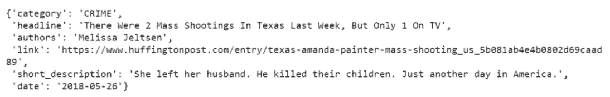

作者图片

原始数据集包含超过 30 个类别，但是出于本教程的目的，我将使用 3 个类别的子集:娱乐、政治和技术。

```
**## create dtf**
dtf = pd.DataFrame(lst_dics)**## filter categories**
dtf = dtf[ dtf["category"].isin(['**ENTERTAINMENT**','**POLITICS**','**TECH**'])        ][["category","headline"]]**## rename columns**
dtf = dtf.rename(columns={"category":"**y**", "headline":"**text**"})**## print 5 random rows**
dtf.sample(5)
```

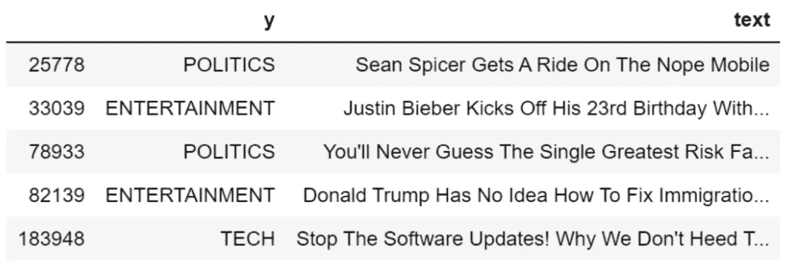

作者图片

如您所见，数据集还包括一个目标变量。我不会将它用于建模，只是用于性能评估。

所以我们有一些原始的文本数据，我们的任务是把它分成我们一无所知的 3 类(娱乐、政治、科技)。这是我计划要做的:

*   清理数据并将其嵌入向量空间，
*   为每个类别创建一个主题聚类并将其嵌入向量空间，
*   计算每个文本向量和主题聚类之间的相似度，然后将其分配给最接近的聚类。

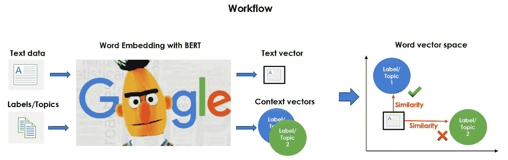

作者图片

这就是为什么我称之为“一种无监督的文本分类”。这是一个非常基本的想法，但是执行起来会很棘手。

现在都准备好了，让我们开始吧。

## 预处理

绝对的第一步是对数据进行预处理:清理文本、删除停用词和应用词汇化。我将编写一个函数，并将其应用于整个数据集。

```
**'''
Preprocess a string.
:parameter
    :param text: string - name of column containing text
    :param lst_stopwords: list - list of stopwords to remove
    :param flg_stemm: bool - whether stemming is to be applied
    :param flg_lemm: bool - whether lemmitisation is to be applied
:return
    cleaned text
'''**
def **utils_preprocess_text**(text, flg_stemm=False, flg_lemm=True, lst_stopwords=None):
    **## clean (convert to lowercase and remove punctuations and   
    characters and then strip)**
    text = re.sub(r'[^\w\s]', '', str(text).lower().strip())

    **## Tokenize (convert from string to list)**
    lst_text = text.split() **## remove Stopwords**
    if lst_stopwords is not None:
        lst_text = [word for word in lst_text if word not in 
                    lst_stopwords]

    **## Stemming (remove -ing, -ly, ...)**
    if flg_stemm == True:
        ps = nltk.stem.porter.PorterStemmer()
        lst_text = [ps.stem(word) for word in lst_text]

    **## Lemmatisation (convert the word into root word)**
    if flg_lemm == True:
        lem = nltk.stem.wordnet.WordNetLemmatizer()
        lst_text = [lem.lemmatize(word) for word in lst_text]

    **## back to string from list**
    text = " ".join(lst_text)
    return text
```

该函数从语料库中删除一组给定的单词。我可以用 *nltk* 为英语词汇创建一个通用停用词列表(我们可以通过添加或删除单词来编辑这个列表)。

```
lst_stopwords = **nltk**.corpus.stopwords.words("**english**")
lst_stopwords
```

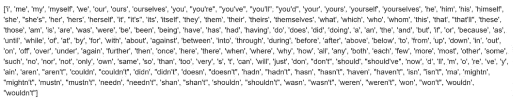

作者图片

现在，我将对整个数据集应用该函数，并将结果存储在一个名为“ *text_clean* 的新列中，我将把它用作语料库。

```
dtf["**text_clean**"] = dtf["text"].apply(lambda x: 
          **utils_preprocess_text**(x, flg_stemm=False, **flg_lemm=True**, 
          **lst_stopwords=lst_stopwords**))dtf.head()
```

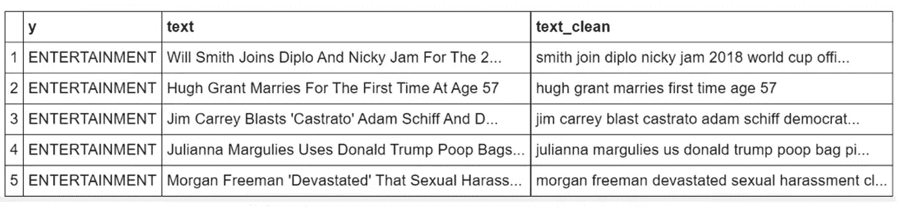

作者图片

我们有了预处理的语料库，因此下一步是构建目标变量。基本上，我们在这里:

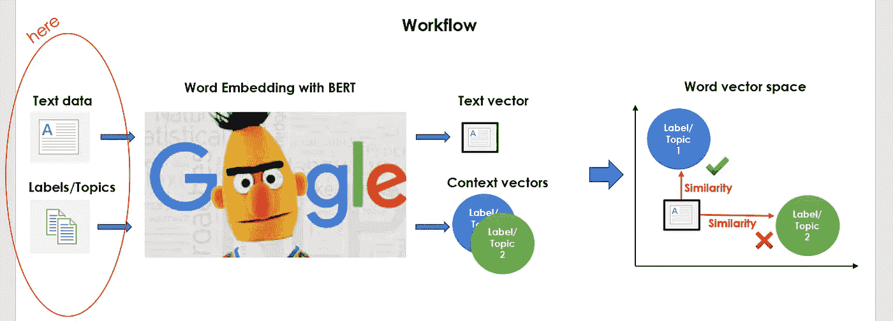

作者图片

## 创建目标集群

本节的目标是创建一些可以代表每个类别的上下文的关键字。通过进行一些文本分析，你可以很容易地发现，出现频率最高的 3 个词是“*电影*”、“*王牌*”和“*苹果*”(关于详细的文本分析教程，你可以查看[这篇文章](/text-analysis-feature-engineering-with-nlp-502d6ea9225d))。我建议从这些关键词开始。

让我们以政治类别为例:单词“ *trump* ”可以有不同的含义，因此我们需要添加关键字来避免多义性问题(例如，“ *donald* ”、“ *republican* ”、“ *white house* ”、“ *obama* ”)。这项任务可以手动执行，或者您可以使用预先训练的 NLP 模型的帮助。您可以从[*genism-data*](https://github.com/RaRe-Technologies/gensim-data)*中加载一个预训练的单词嵌入模型，如下所示:*

```
*nlp = gensim_api.load("**glove-wiki-gigaword-300**")*
```

*gensim 包有一个非常方便的功能，可以将任何给定单词的最相似的单词返回到词汇表中。*

```
*nlp.**most_similar**(["**obama**"], topn=3)*
```

*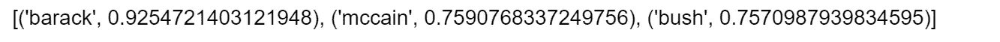*

*作者图片*

*我将使用它为每个类别创建一个关键字字典:*

```
***## Function to apply**
def **get_similar_words**(lst_words, top, nlp):
    lst_out = lst_words
    for tupla in nlp.most_similar(lst_words, topn=top):
        lst_out.append(tupla[0])
    return list(set(lst_out)) **## Create Dictionary {category:[keywords]}** dic_clusters = {}dic_clusters["**ENTERTAINMENT**"] = get_similar_words([**'celebrity','cinema','movie','music'**], 
                  top=30, nlp=nlp)dic_clusters[**"POLITICS"**] = get_similar_words([**'gop','clinton','president','obama','republican'**]
                  , top=30, nlp=nlp)dic_clusters["**TECH**"] = get_similar_words([**'amazon','android','app','apple','facebook',
                   'google','tech'**], 
                   top=30, nlp=nlp) **## print some**
for k,v in dic_clusters.items():
    print(k, ": ", v[0:5], "...", len(v))*
```

*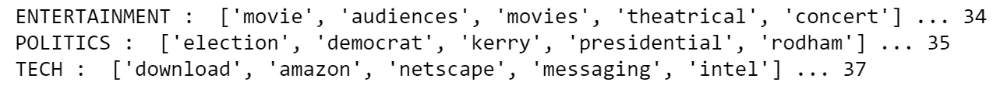*

*作者图片*

*让我们通过应用降维算法(即 [TSNE](https://scikit-learn.org/stable/modules/generated/sklearn.manifold.TSNE.html) )来尝试在 2D 空间中可视化那些关键词。我们希望确保集群之间能够很好地分离。*

```
***## word embedding** tot_words = [word for v in **dic_clusters**.values() for word in v]
X = nlp[tot_words] **## pca**
pca = manifold.**TSNE**(perplexity=40, n_components=2, init='pca')
X = pca.fit_transform(X) **## create dtf**
dtf = pd.DataFrame()
for k,v in **dic_clusters**.items():
    size = len(dtf) + len(v)
    dtf_group = pd.DataFrame(X[len(dtf):size], columns=["x","y"], 
                             index=v)
    dtf_group["cluster"] = k
    dtf = dtf.append(dtf_group) **## plot**
fig, ax = plt.subplots()
sns.**scatterplot**(data=dtf, x="x", y="y", hue="cluster", ax=ax)ax.legend().texts[0].set_text(None)
ax.set(xlabel=None, ylabel=None, xticks=[], xticklabels=[], 
       yticks=[], yticklabels=[])for i in range(len(dtf)):
    ax.annotate(dtf.index[i], 
               xy=(dtf["x"].iloc[i],dtf["y"].iloc[i]), 
               xytext=(5,2), textcoords='offset points', 
               ha='right', va='bottom')*
```

*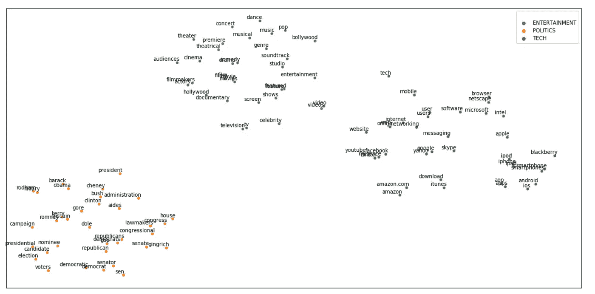*

*作者图片*

*酷，他们看起来已经足够孤立了。娱乐集群比政治集群更接近科技集群，这是有道理的，因为像“*苹果*”和“ *youtube* ”这样的词可以同时出现在科技和娱乐新闻中。*

## *特征工程*

*是时候将我们预处理的语料库和我们创建的目标聚类嵌入到同一个向量空间中了。基本上，我们是这样做的:*

*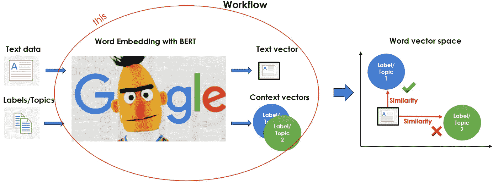*

*作者图片*

*是的，我在用 [**BERT**](https://en.wikipedia.org/wiki/BERT_(language_model)) 做这个。的确，您可以利用任何单词嵌入模型(即 Word2Vec、Glove 等)，甚至是我们已经加载的定义关键字的模型，所以为什么要费心使用如此沉重和复杂的语言模型呢？这是因为 BERT 没有应用固定的嵌入，而是查看整个句子，然后给每个单词分配一个嵌入。因此，BERT 分配给一个单词的向量是整个句子的函数，因此一个单词可以基于上下文具有不同的向量。*

*我将使用包 *transformers* 加载原始预训练版本的 BERT，并给出一个动态嵌入的示例:*

```
*tokenizer = transformers.**BertTokenizer**.from_pretrained('**bert-base-
            uncased'**, do_lower_case=True)nlp = transformers.**TFBertModel**.from_pretrained(**'bert-base-uncased'**)*
```

*让我们使用该模型将字符串" *river bank* "转换成向量，并打印分配给单词" *bank* "的向量:*

```
*txt = **"river bank"****## tokenize**
idx = tokenizer.encode(txt)
print("tokens:", tokenizer.convert_ids_to_tokens(idx))
print("ids   :", tokenizer.encode(txt))**## word embedding**
idx = np.array(idx)[None,:]
embedding = nlp(idx)
print("shape:", embedding[0][0].shape)**## vector of the second input word**
embedding[0][0][2]*
```

*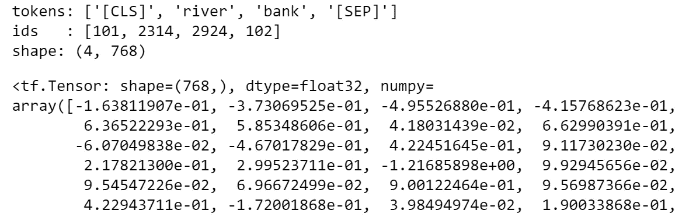*

*作者图片*

*如果您对字符串“*金融银行*”做同样的处理，您会发现分配给单词“*银行*的向量因上下文而异。请注意，BERT 记号赋予器在句子的开头和结尾插入特殊记号，其向量空间的维数为 768(为了更好地理解 BERT 如何处理文本，您可以查看[这篇文章](/text-classification-with-nlp-tf-idf-vs-word2vec-vs-bert-41ff868d1794))。*

*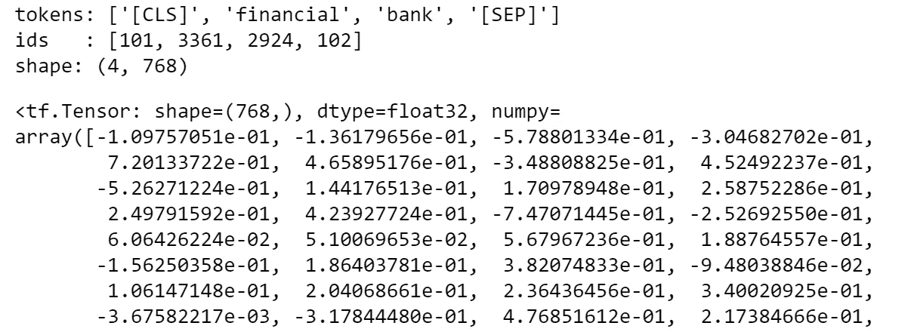*

*作者图片*

*说了这么多，计划是用 BERT Word Embedding 用一个数组(shape: number of tokens x 768)表示每篇文本，然后把每篇文章汇总成一个均值向量。*

*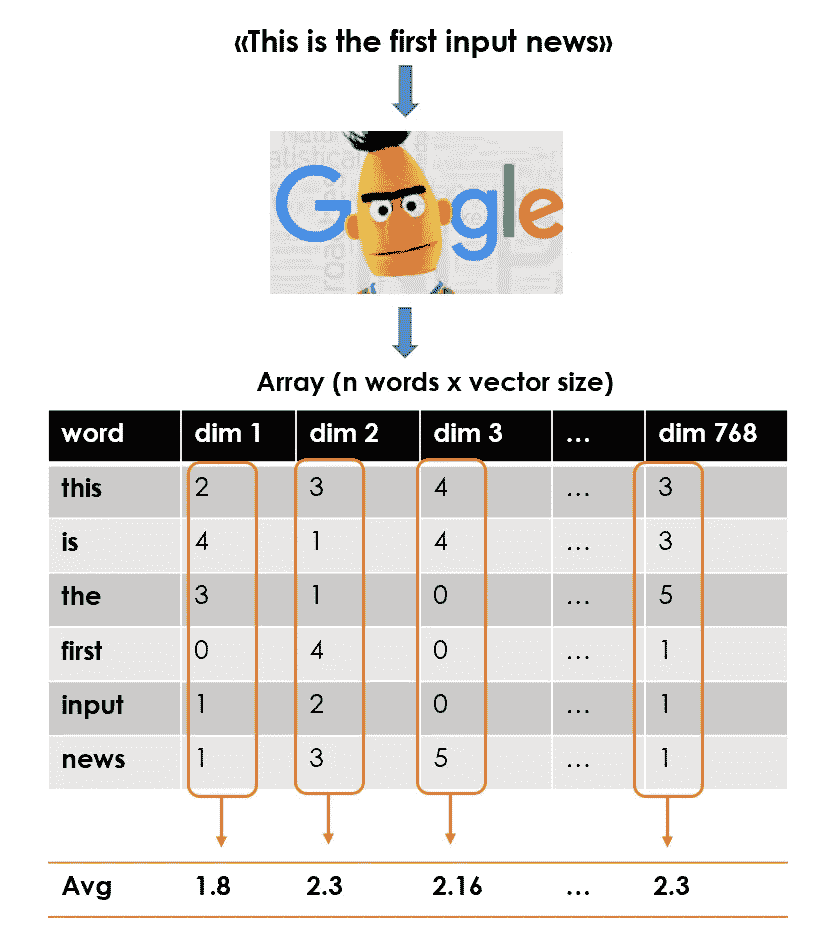*

*作者图片*

*因此，最终的特征矩阵将是一个形状为:文档数(或均值向量)x 768 的数组。*

```
***## function to apply** def **utils_bert_embedding**(txt, tokenizer, nlp):
    idx = tokenizer.encode(txt)
    idx = np.array(idx)[None,:]  
    embedding = nlp(idx)
    X = np.array(embedding[0][0][1:-1])
    return X**## create list of news vector**
lst_mean_vecs = [**utils_bert_embedding**(txt, tokenizer, nlp)**.mean(0)** 
                 for txt in dtf["**text_clean**"]]**## create the feature matrix (n news x 768)**
X = np.array(lst_mean_vecs)*
```

*我们可以对目标集群中的关键字做同样的事情。事实上，每个标签都由一个单词列表来标识，帮助 BERT 理解集群中的上下文。因此，我将创建一个字典标签:聚类均值向量。*

```
*dic_y = {k:**utils_bert_embedding**(v, tokenizer, nlp)**.mean(0)** for k,v
         in dic_clusters.items()}*
```

*我们开始时只有一些文本数据和 3 个字符串(*“娱乐”、“政治”、“技术”*)，现在我们有了一个特征矩阵和一个目标变量… ish。*

## *模型设计和测试*

*最后，是时候建立一个模型，根据与每个目标聚类的相似性对新闻进行分类了。*

*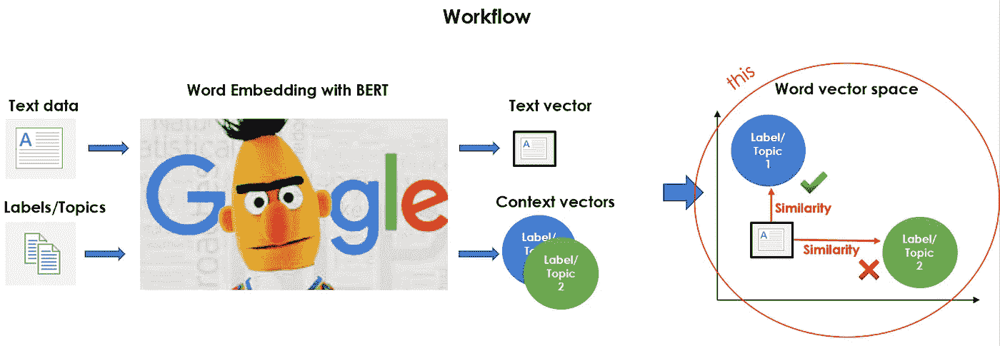*

*作者图片*

*我将使用 [**余弦相似度**](https://en.wikipedia.org/wiki/Cosine_similarity) ，这是一种基于两个非零向量之间的角度余弦的相似性度量，它等于归一化为长度都为 1 的相同向量的内积。您可以轻松地使用 [*scikit 的余弦相似性实现-learn*](https://scikit-learn.org/stable/modules/generated/sklearn.metrics.pairwise.cosine_similarity.html) *，*它采用 2 个数组(或向量)并返回一个分数数组(或单个分数)。在这种情况下，输出将是一个具有形状的矩阵:新闻数量 x 标签数量(3，娱乐/政治/技术)。换句话说，每行将代表一篇文章，并包含每个目标聚类的一个相似性得分。*

*为了运行通常的评估指标(准确性、AUC、精确度、召回率等)，我们必须重新调整每一行的分数，使它们的总和为 1，并决定文章的类别。我将选择得分最高的一个，但设置一些最低阈值并忽略得分非常低的预测可能是明智的。*

*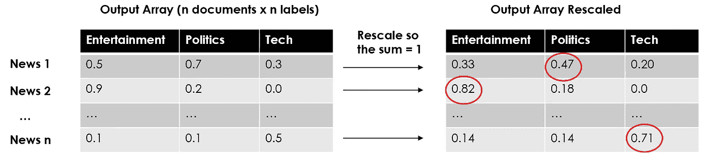*

*作者图片*

```
***#--- Model Algorithm ---#****## compute cosine similarities**
similarities = np.array(
            [metrics.pairwise.**cosine_similarity**(X, y).T.tolist()[0] 
             for y in dic_y.values()]
            ).T**## adjust and rescale**
labels = list(dic_y.keys())
for i in range(len(similarities)): **### assign randomly if there is no similarity**
    if sum(similarities[i]) == 0:
       similarities[i] = [0]*len(labels)
       similarities[i][np.random.choice(range(len(labels)))] = 1 **### rescale so they sum = 1**
    similarities[i] = similarities[i] / sum(similarities[i]) **## classify the label with highest similarity score** predicted_prob = similarities
predicted = [labels[np.argmax(pred)] for pred in predicted_prob]*
```

*就像在经典的监督用例中一样，我们有一个具有预测概率的对象(这里它们是调整后的相似性分数),另一个具有预测标签。让我们检查一下我们做得如何:*

```
*y_test = dtf[**"y"**].values
classes = np.unique(y_test)
y_test_array = pd.get_dummies(y_test, drop_first=False).values **## Accuracy, Precision, Recall**
accuracy = metrics.accuracy_score(y_test, predicted)
auc = metrics.roc_auc_score(y_test, predicted_prob, 
                            multi_class="ovr")
print("Accuracy:",  round(accuracy,2))
print("Auc:", round(auc,2))
print("Detail:")
print(metrics.classification_report(y_test, predicted)) **## Plot confusion matrix**
cm = metrics.confusion_matrix(y_test, predicted)
fig, ax = plt.subplots()
sns.heatmap(cm, annot=True, fmt='d', ax=ax, cmap=plt.cm.Blues, 
            cbar=False)
ax.set(xlabel="Pred", ylabel="True", xticklabels=classes, 
       yticklabels=classes, title="Confusion matrix")
plt.yticks(rotation=0)
fig, ax = plt.subplots(nrows=1, ncols=2) **## Plot roc**
for i in range(len(classes)):
    fpr, tpr, thresholds = metrics.roc_curve(y_test_array[:,i],  
                           predicted_prob[:,i])
    ax[0].plot(fpr, tpr, lw=3, 
              label='{0} (area={1:0.2f})'.format(classes[i], 
                              metrics.auc(fpr, tpr))
               )
ax[0].plot([0,1], [0,1], color='navy', lw=3, linestyle='--')
ax[0].set(xlim=[-0.05,1.0], ylim=[0.0,1.05], 
          xlabel='False Positive Rate', 
          ylabel="True Positive Rate (Recall)", 
          title="Receiver operating characteristic")
ax[0].legend(loc="lower right")
ax[0].grid(True) **## Plot precision-recall curve** for i in range(len(classes)):
    precision, recall, thresholds = metrics.precision_recall_curve(
                 y_test_array[:,i], predicted_prob[:,i])
    ax[1].plot(recall, precision, lw=3, 
               label='{0} (area={1:0.2f})'.format(classes[i], 
                                  metrics.auc(recall, precision))
              )
ax[1].set(xlim=[0.0,1.05], ylim=[0.0,1.05], xlabel='Recall', 
          ylabel="Precision", title="Precision-Recall curve")
ax[1].legend(loc="best")
ax[1].grid(True)
plt.show()*
```

*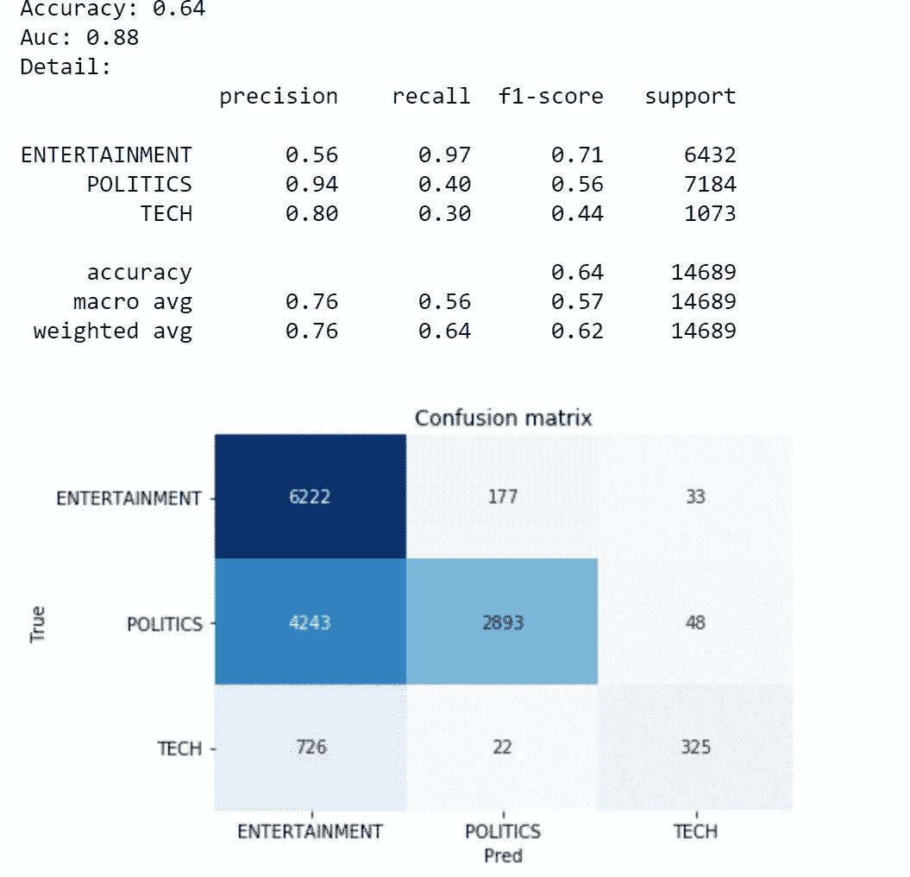**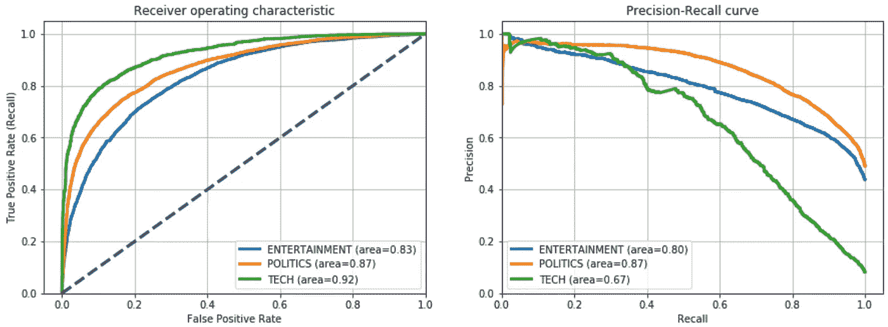*

*作者图片*

*好吧，我第一个说这不是我见过的最好的准确度。另一方面，考虑到我们没有训练任何模型，我们甚至虚构了目标变量，这一点也不差。主要问题是分类为娱乐的 4k 以上的政治观察，但这些性能可以通过微调这两个类别的关键字来轻松改善。*

## *可解释性*

*让我们试着理解是什么让我们的算法用一个类别而不是其他类别对新闻进行分类。让我们从语料库中随机观察一下:*

```
*i = 7**txt_instance** = dtf[**"text_clean"**].iloc[i]print("True:", y_test[i], "--> Pred:", predicted[i], "| 
      Similarity:", round(np.max(predicted_prob[i]),2))
print(txt_instance)*
```

*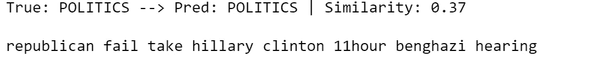*

*作者图片*

*这是一个正确分类的政治观察。大概，“*共和党*”和“*克林顿*”这两个词给了伯特正确的暗示。我将在 2D 空间中可视化文章的平均向量，并绘制与目标聚类的最高相似度。*

```
***## create embedding Matrix** y = np.concatenate([embedding_bert(v, tokenizer, nlp) for v in 
                    dic_clusters.values()])
X = embedding_bert(txt_instance, tokenizer,
                   nlp).mean(0).reshape(1,-1)
M = np.concatenate([y,X]) **## pca**
pca = manifold.**TSNE**(perplexity=40, n_components=2, init='pca')
M = pca.fit_transform(M)
y, X = M[:len(y)], M[len(y):] **## create dtf clusters**
dtf = pd.DataFrame()
for k,v in dic_clusters.items():
    size = len(dtf) + len(v)
    dtf_group = pd.DataFrame(y[len(dtf):size], columns=["x","y"], 
                             index=v)
    dtf_group["cluster"] = k
    dtf = dtf.append(dtf_group) **## plot clusters**
fig, ax = plt.subplots()
sns.**scatterplot**(data=dtf, x="x", y="y", hue="cluster", ax=ax)
ax.legend().texts[0].set_text(None)
ax.set(xlabel=None, ylabel=None, xticks=[], xticklabels=[], 
       yticks=[], yticklabels=[])
for i in range(len(dtf)):
    ax.annotate(dtf.index[i], 
               xy=(dtf["x"].iloc[i],dtf["y"].iloc[i]), 
               xytext=(5,2), textcoords='offset points', 
               ha='right', va='bottom') **## add txt_instance** ax.scatter(x=X[0][0], y=X[0][1], c="red", linewidth=10)
           ax.annotate("x", xy=(X[0][0],X[0][1]), 
           ha='center', va='center', fontsize=25) **## calculate similarity** sim_matrix = metrics.pairwise.**cosine_similarity**(X, y) **## add top similarity**
for row in range(sim_matrix.shape[0]): **### sorted {keyword:score}**
    dic_sim = {n:sim_matrix[row][n] for n in 
               range(sim_matrix.shape[1])}
    dic_sim = {k:v for k,v in sorted(dic_sim.items(), 
                key=lambda item:item[1], reverse=True)} **### plot lines**
    for k in dict(list(dic_sim.items())[0:5]).keys():
        p1 = [X[row][0], X[row][1]]
        p2 = [y[k][0], y[k][1]]
        ax.plot([p1[0],p2[0]], [p1[1],p2[1]], c="red", alpha=0.5)plt.show()*
```

*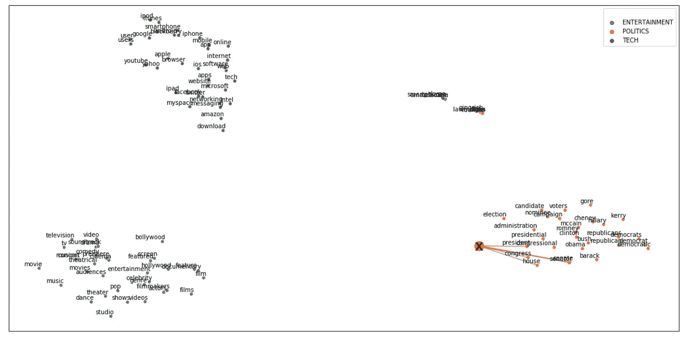*

*作者图片*

*让我们放大一下感兴趣的集群:*

**

*作者图片*

*总的来说，我们可以说均值向量非常类似于政治聚类。让我们将文章分解成令牌，看看哪些令牌“激活”了正确的集群。*

```
***## create embedding Matrix** y = np.concatenate([embedding_bert(v, tokenizer, nlp) for v in 
                    dic_clusters.values()])
X = embedding_bert(txt_instance, tokenizer,
                   nlp).mean(0).reshape(1,-1)
M = np.concatenate([y,X]) **## pca**
pca = manifold.**TSNE**(perplexity=40, n_components=2, init='pca')
M = pca.fit_transform(M)
y, X = M[:len(y)], M[len(y):] **## create dtf clusters**
dtf = pd.DataFrame()
for k,v in dic_clusters.items():
    size = len(dtf) + len(v)
    dtf_group = pd.DataFrame(y[len(dtf):size], columns=["x","y"], 
                             index=v)
    dtf_group["cluster"] = k
    dtf = dtf.append(dtf_group) **## add txt_instance** tokens = tokenizer.convert_ids_to_tokens(
               tokenizer.encode(txt_instance))[1:-1]
dtf = pd.DataFrame(X, columns=["x","y"], index=tokens)
dtf = dtf[~dtf.index.str.contains("#")]
dtf = dtf[dtf.index.str.len() > 1]
X = dtf.values
ax.scatter(x=dtf["x"], y=dtf["y"], c="red")
for i in range(len(dtf)):
     ax.annotate(dtf.index[i], 
                 xy=(dtf["x"].iloc[i],dtf["y"].iloc[i]), 
                 xytext=(5,2), textcoords='offset points', 
                 ha='right', va='bottom') **## calculate similarity** sim_matrix = metrics.pairwise.**cosine_similarity**(X, y) **## add top similarity**
for row in range(sim_matrix.shape[0]): **### sorted {keyword:score}**
    dic_sim = {n:sim_matrix[row][n] for n in 
               range(sim_matrix.shape[1])}
    dic_sim = {k:v for k,v in sorted(dic_sim.items(), 
                key=lambda item:item[1], reverse=True)} **### plot lines**
    for k in dict(list(dic_sim.items())[0:5]).keys():
        p1 = [X[row][0], X[row][1]]
        p2 = [y[k][0], y[k][1]]
        ax.plot([p1[0],p2[0]], [p1[1],p2[1]], c="red", alpha=0.5)plt.show()*
```

*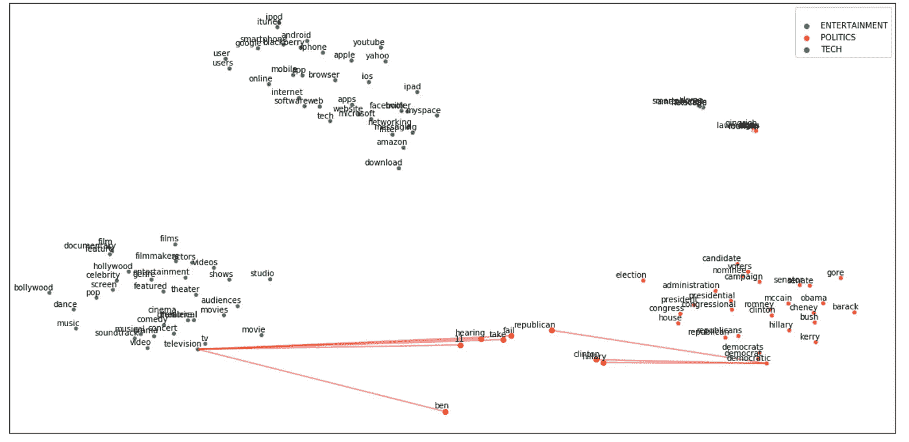*

*作者图片*

*正如我们所想，文本中有一些词明显与政治相关，但其他一些词更类似于娱乐的一般上下文。*

*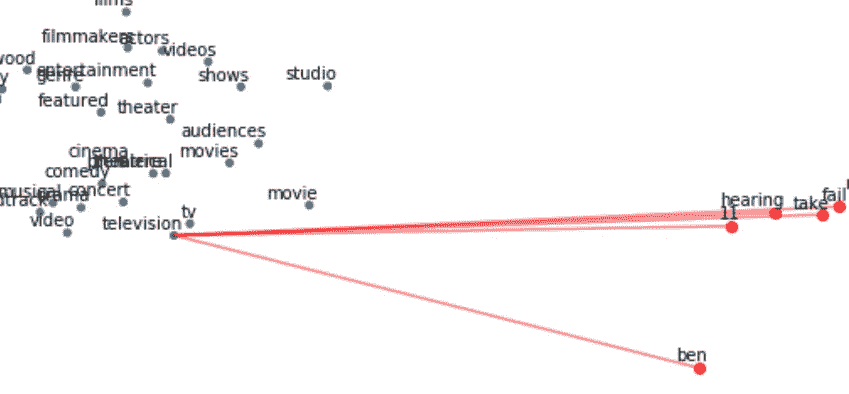**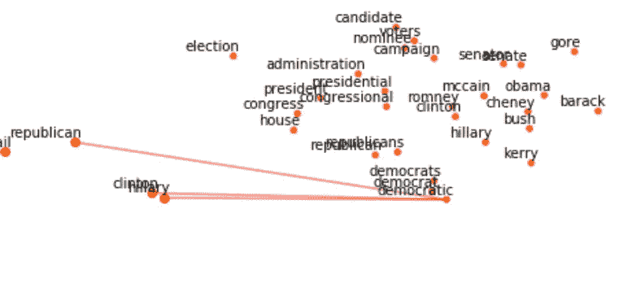*

*作者图片*

## *结论*

*这篇文章是一个教程，演示了当一个带标签的训练集不可用时如何执行文本分类。*

*我使用预先训练的单词嵌入模型来构建一组关键字，以将目标变量置于上下文中。然后我用预先训练好的 BERT 语言模型把那些词和语料库转换到同一个向量空间。最后，我计算文本和关键词之间的余弦相似度，以确定每篇文章的上下文，并使用该信息来标记新闻。*

*这种策略不是最有效的，但它肯定是有效的，因为它能让你迅速获得好的结果。此外，一旦获得标记数据集，该算法可以用作监督模型的基线。*

*我希望你喜欢它！如有问题和反馈，或者只是分享您感兴趣的项目，请随时联系我。*

> *👉[我们来连线](https://linktr.ee/maurodp)👈*

> *本文是使用 Python 的**NLP**系列的一部分，参见:*

*[](/text-summarization-with-nlp-textrank-vs-seq2seq-vs-bart-474943efeb09) [## 使用 NLP 的文本摘要:TextRank vs Seq2Seq vs BART

### 使用 Python、Gensim、Tensorflow、Transformers 进行自然语言处理

towardsdatascience.com](/text-summarization-with-nlp-textrank-vs-seq2seq-vs-bart-474943efeb09) [](/text-analysis-feature-engineering-with-nlp-502d6ea9225d) [## 使用自然语言处理的文本分析和特征工程

### 语言检测，文本清理，长度，情感，命名实体识别，N-grams 频率，词向量，主题…

towardsdatascience.com](/text-analysis-feature-engineering-with-nlp-502d6ea9225d) [](/text-classification-with-nlp-tf-idf-vs-word2vec-vs-bert-41ff868d1794) [## 基于自然语言处理的文本分类:Tf-Idf vs Word2Vec vs BERT

### 预处理、模型设计、评估、词袋的可解释性、词嵌入、语言模型

towardsdatascience.com](/text-classification-with-nlp-tf-idf-vs-word2vec-vs-bert-41ff868d1794) [](/ai-chatbot-with-nlp-speech-recognition-transformers-583716a299e9) [## 带 NLP 的 AI 聊天机器人:语音识别+变形金刚

### 用 Python 构建一个会说话的聊天机器人，与你的人工智能进行对话

towardsdatascience.com](/ai-chatbot-with-nlp-speech-recognition-transformers-583716a299e9)*