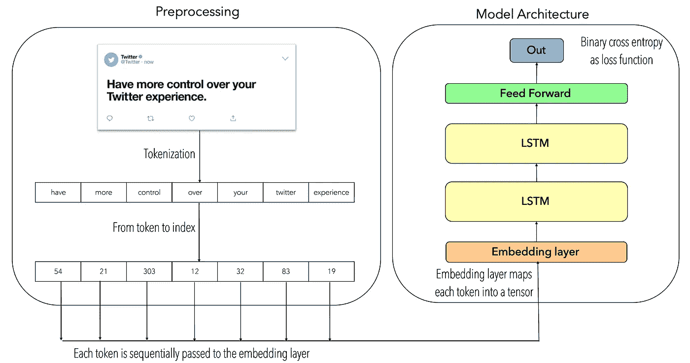
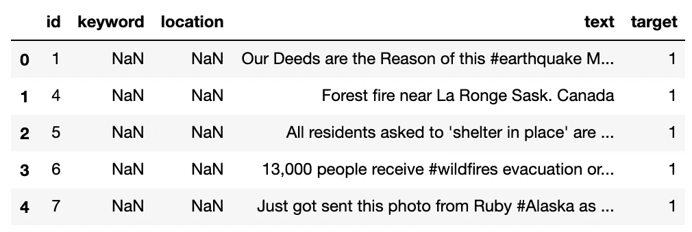
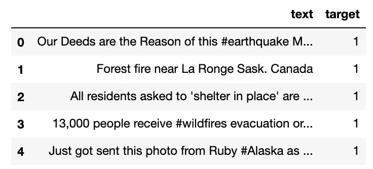

# PyTorch 中基于 LSTMs 的文本分类

> 原文：<https://towardsdatascience.com/text-classification-with-pytorch-7111dae111a6?source=collection_archive---------15----------------------->

## *在 PyTorch 中使用 LSTMs 实现的文本分类基线模型*

> 问题仍然悬而未决:如何学习语义学？什么是语义学？基于 DL 的模型能够学习语义吗？

# 介绍

这篇博客的目的是解释如何基于 LSTMs 构建一个文本分类器，以及如何使用 PyTorch 框架来构建它。

我想从下面这个问题开始:*如何对文本进行分类？*在不同的前提下，从不同的角度提出了几种方法，但是*哪一种是最合适的呢？*。停下来问自己一个有趣的问题:*作为人类，我们如何对文本进行分类？*，*我们的大脑在对文本进行分类时考虑了什么？*。这类问题很难回答。

目前，我们可以访问一系列不同的文本类型，如电子邮件、电影评论、社交媒体、书籍等。在这个意义上，文本分类问题将由想要分类的内容来确定(例如*是否想要对给定文本的极性进行分类？是不是打算把一套影评按类别分类？是否打算按主题对一组文本进行分类？*)。在这方面，文本分类的问题大部分时间被归类在以下任务下:

*   **情感分析**
*   **新闻分类**
*   **话题分析**
*   **问题解答**
*   **自然语言推理**

为了深入这个热门话题，我真的推荐看一看这篇论文: [*基于深度学习的文本分类:综合复习*](https://arxiv.org/pdf/2004.03705.pdf) *。*

# 方法学

该模型的两个关键是:标记化和递归神经网络。标记化是指将文本拆分成一组句子或单词(即*标记)*的过程。在这方面，*标记化技术*可以在序列级或*单词级*应用。为了理解*标记化*的基础，可以看一下: [*信息检索简介*](https://nlp.stanford.edu/IR-book/html/htmledition/tokenization-1.html) *。*

另一方面，RNNs(递归神经网络)是一种神经网络，众所周知，它能很好地处理序列数据，例如文本数据。在这种情况下，实现了一种特殊的 RNN，即 LSTMs(长短期记忆)。lstm 是 RNNs 的*改进*版本之一，本质上 lstm 在处理*长句时表现更好。*为了更深入的了解什么是 RNNs 和 LSTMs，可以看一下: [*了解 LSTMs 网络*。](https://colah.github.io/posts/2015-08-Understanding-LSTMs/)

因为这个博客的想法是提出一个文本分类的基线模型，所以文本预处理阶段是基于标记化技术的，这意味着每个*文本句子*将被*标记化*，然后每个*标记*将被转换成其基于索引的表示。然后，每个基于索引的*记号语句将顺序地通过嵌入层，该嵌入层将输出每个记号的嵌入表示，这些记号通过两层 LSTM 神经网络，然后最后的 LSTM 隐藏状态将通过双线层神经网络，该网络输出由 sigmoid 激活函数过滤的单个值。下图描述了模型架构:*



图一。模型架构

# **预处理**

这个项目中使用的数据集取自一场 *k* [*aggle 竞赛*](https://www.kaggle.com/c/nlp-getting-started) ，该竞赛旨在预测*哪些推文是关于真实灾难的，哪些不是。*本质上，数据集是关于一组用 1 和 0 标记的原始格式的推文(1 表示真正的灾难，0 表示不是真正的灾难)。看一下数据集的头部，它看起来像:



图二。推文数据集的头

正如我们所看到的，有些列必须删除，因为它们毫无意义，因此删除不必要的列后，结果数据集将如下所示:



图 3。格式化数据集

此时，我们已经可以应用标记化技术，并将每个标记转换成基于索引的表示；下面的代码片段解释了这个过程:

代码片段 1。预处理

有一些固定的超参数值得一提。例如， *max_len = 10* 指的是每个序列的最大长度，而 *max_words = 100* 指的是给定整个语料库要考虑的前 100 个频繁出现的单词。函数 *prepare_tokens()* 将整个语料库转换成一组记号序列。函数 *sequence_to_token()* 将每个标记转换成其索引表示。

# 模型

作为输入层，它被实现为嵌入层。这个嵌入层获取每个令牌，并将其转换为嵌入的表示。这种嵌入的表示然后通过两个堆叠的 LSTM 层。最后，LSTM 的最后一个隐藏状态通过一个二线性层神经网络。下面的代码片段显示了用 PyTorch 编写的上述模型架构。

代码片段 2。模型架构

因此，让我们分析一下展示的模型架构的一些重要部分。在第 16 行中，嵌入层被初始化，它接收参数: *input_size* ，它指的是词汇表的大小， *hidden_dim* ，它指的是输出向量的维数，以及 *padding_idx* ，它用零来完成不满足所需序列长度的序列。

在第 17 行中，LSTM 层被初始化，它接收参数: *input_size* ，它指的是嵌入令牌的维度， *hidden_size* ，它指的是隐藏和单元状态的维度， *num_layers* ，它指的是堆叠的 LSTM 层的数量，以及 *batch_first* ，它指的是输入向量的第一维度，在这种情况下，它指的是批量大小。

在第 18 行和第 19 行，线性层被初始化，每个层接收参数: *in_features* 和 *out_features* ，分别表示输入和输出尺寸。

# 培训阶段

为了准备好训练阶段，首先，我们需要准备如何将序列输入到模型中。为此，PyTorch 提供了两个非常有用的类: *Dataset* 和 *DataLoader。*Dataset*class*class*的目的是提供一种简单的批量迭代数据集的方法。*数据加载器*的目的是创建*数据集*类的可迭代对象。下面的代码片段展示了这两个类的最小化实现。*

*代码片段 3。数据集和数据集加载器*

*现在，是时候迭代训练集了。首先，让我们看看培训阶段是什么样子的:*

*代码片段 4。培训阶段*

*第 2 行定义了优化器。从第 4 行开始，实现了历元上的循环。值得一提的是，在 PyTorch 中，我们需要"*打开*训练模式"，正如您在第 9 行中看到的，尤其是当我们必须从"*训练模式*切换到"*评估模式*(我们将在后面看到)时，这样做是很有必要的。本质上，训练模式允许对梯度的更新，而评估模式取消对梯度的更新。*

*需要强调的是，在第 11 行，我们使用由 *DatasetLoader* 创建的对象进行迭代。在 PyTorch 中，计算损失函数、计算梯度、通过实现一些优化器方法来更新参数以及使梯度为零是相对容易的。如我们所见，在第 20 行中，通过将 *binary_cross_entropy* 实现为损失函数来计算损失，在第 24 行中，误差被向后传播(即梯度被计算)，在第 30 行中，通过将 *RMSprop* 实现为优化器来更新每个参数，然后梯度被释放以开始新的时期。*

# *估价*

*评估部分与我们在培训阶段所做的非常相似，主要区别是从*培训模式*变为*评估模式。**

*代码片段 5。评估阶段*

*正如我们所见，在第 6 行中，模型被更改为*评估模式*，同时跳过第 9 行中的渐变更新。然后，通过 *DatasetLoader* 对象迭代测试集(第 12 行)，同样，预测值保存在第 21 行的*预测列表*中。*

*最后，我们只需要计算精度。为了记住精度是如何计算的，让我们看一下公式:*

```
*Accuracy = (True Positives + True Negatives) / Number of samples*
```

*在这方面，精度计算如下:*

*代码片段 6。精确度计算*

# *结论*

*在这篇博客中，我们已经解释了文本分类的重要性，以及在不同观点下解决文本分类问题的不同方法。*

*以 LSTMs 神经网络为模型核心，实现了文本分类的基线模型，同时利用 PyTorch 作为深度学习模型框架的优势，对模型进行了编码。这个模型中使用的数据集取自一个 Kaggle 竞赛。这个数据集是由推文组成的。在预处理步骤中，展示了一种处理文本数据的特殊技术，即*标记化*。*

## *未来的工作*

*正如前面提到的，这个博客的目的是为文本分类任务提供一个基线模型。值得一提的是，文本分类的问题超出了两层 LSTM 体系结构，在该体系结构中，文本在基于标记的方法下进行预处理。最近的工作通过实施基于变压器的架构(例如 [BERT](https://jalammar.github.io/a-visual-guide-to-using-bert-for-the-first-time/) )展示了令人印象深刻的结果。然而，通过遵循这一思路，可以通过移除基于标记的方法并代之以实现基于单词嵌入的模型(例如， [word2vec-gensim](https://radimrehurek.com/gensim/models/word2vec.html) )来改进所提出的模型。同样，可以应用双向 LSTMs 来捕捉更多的上下文(以向前和向后的方式)。*

*完整的代码可在[https://github . com/FernandoLpz/Text-Classification-lst ms-py torch](https://github.com/FernandoLpz/Text-Classification-LSTMs-PyTorch)获得*

*随意克隆或者叉:)*