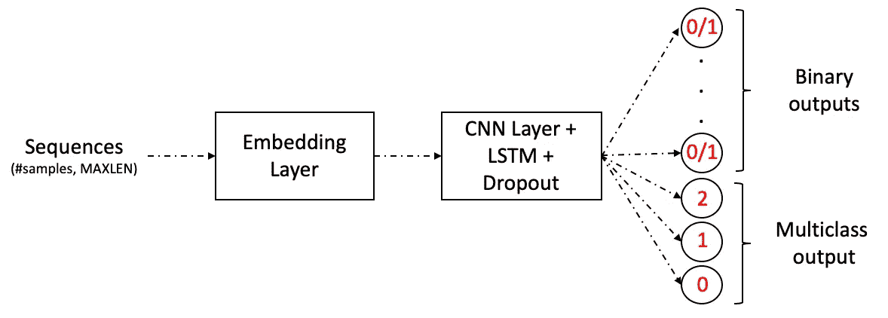

# Keras 中多输出多损失的文本分类器

> 原文：<https://towardsdatascience.com/text-classifier-with-multiple-outputs-and-multiple-losses-in-keras-4b7a527eb858?source=collection_archive---------15----------------------->

## 使用 Keras 构建多标签分类器似乎不是一项困难的任务，但当你处理一个高度**不平衡的数据集**时，它有 30 多个不同的标签和多个丢失，这可能会变得非常棘手。

在本帖中，我们将详细介绍多标签分类器的定义、多重损失、文本预处理，并逐步解释如何在 Keras 中构建多输出 RNN-LSTM。

我们将要处理的数据集由自然灾害信息组成，这些信息被分为 36 个不同的类别。数据集由[图八](https://appen.com/)提供。输入消息示例:

```
['Weather update - a cold front from Cuba that could pass over Haiti',
 'Is the Hurricane over or is it not over',
 'Looking for someone but no name',
 'UN reports Leogane 80-90 destroyed. Only Hospital St. Croix functioning. Needs supplies desperately.',
 'says: west side of Haiti, rest of the country today and tonight']
```

# 什么是多标签分类问题？

在解释它是什么之前，让我们先来看一个更常见的分类类型的定义:Multiclass。在一个多类中，类是互斥的，也就是说，你一次只能分类一个类。例如，如果您有几个类:{Car，Person，Motorcycle}，那么您的模型必须输出:Car 或 Person 或 Motorcycle。对于这类问题，使用 Softmax 函数进行分类:


神经网络中的 Softmax 分类函数

对于多标签分类，一个数据样本可以属于多个类别。从上面的例子中，您的模型可以对同一个样本进行分类:Car 和 Person(假设每个样本是一个可能包含这 3 个类的图像)。

在所研究的数据集中，有 36 个不同的类，其中 35 个有一个**二进制输出** : 0 或 1；并且其中 1 个具有 3 个可能的类别**(多类别情况):** 0、1 或 2。

# 多重损失

在同一个模型中使用多个损失函数意味着您正在执行不同的任务，并在这些任务之间共享模型的一部分。有时，你可能会想，也许为每种不同类型的输出建立不同的模型更好，但在某些情况下，共享你的神经网络的某些层有助于模型更好地概括。

Keras 如何处理多次亏损？

从 [Keras 文档](https://keras.io/models/model/)、*“…模型将最小化的损失值将是所有单个损失的加权和，由* `*loss_weights*` *系数加权。*”。因此，最终损失是每个损失的加权和，传递给`*loss*`参数。

在所研究的案例中，将使用两种不同的损失:

*   对于**二进制类，**使用的度量将是具有相应`binary_crossentropy`损失的`binary_accuracy`。由于每个输出只有两个可能的类别(0 或 1)，因此`sigmoid`功能将被用作激活功能。
*   对于**多类**输出**，**，使用的度量将是具有相应`sparse_categorical_crossentropy`损耗的`sparse_categorical_accuracy`。对于该输出，有 3 个可能的类别:0、1 和 2，这样将使用`softmax`激活功能。与传统的`categorical_crossentropy`损耗不同，第一种损耗不需要对输出 **Y** 进行一键编码。因此，不用将输出转换为:[1，0，0]，[0，1，0]和[0，0，1]，我们可以将其保留为整数:[0]，[1]和[2]。需要强调的是，这两种损失属于同一个等式:


类别交叉熵和稀疏类别交叉熵的损失函数

# 文本预处理

就像任何其他 NLP 问题一样，在将文本输入数据应用到模型中之前，我们必须对其进行预处理。在这个数据集中，标点符号，网址链接和“@”被删除。尽管“@”提到给消息增加了一些信息，但它没有给分类模型增加价值。标签(' #') 可能包含有用的信息，因为它们通常与事件相关。因此，它们被保留下来，只删除了“#”字符。

*停用词*(一种语言中最常见的词)移除和词条化也应用于数据集。

文本样本被格式化为张量，可以使用 Keras 实用程序将其输入神经网络:

上述过程主要包括 3 个步骤:

*   首先，将记号赋予器实例(T7)适配到语料库，基于词频创建词汇索引。每个单词都映射到一个索引，所以每个单词都有一个唯一的整数值，整数越小，单词出现的频率越高。要保留的单词大小由`num_words`参数定义，即词汇量。只会保留最常用的词。在我们的数据集中，单词映射如下:

```
print(tokenizer.word_index){'water': 1, 'people': 2, 'food': 3, 'need': 4, 'help': 5, 'please': 6, 'earthquake': 7, 'would': 8, 'area': 9, 'like': 10, 'said': 11, 'country': 12,...}
```

*   然后使用`tokenizer.texts_to_sequences`方法将输入的句子映射成整数。从我们的例子来看:

```
'weather update cold front cuba could pa haiti'
```

映射到:

```
[138, 1480, 335, 863, 2709, 80, 411, 18]
```

*   最后，为了创建嵌入，我们所有的句子需要长度相同。因此，我们使用`pad_sequences`给每个句子填充零。

# 多输出多损耗 RNN

为了构建这个模型，我们将使用 [Keras functional API](https://keras.io/getting-started/functional-api-guide/) ，而不是 [Sequential API](https://keras.io/models/sequential/) ，因为前者允许我们构建更复杂的模型，例如多输出和输入问题。

为了总结我们到目前为止的成果:

*   每个输入样本是 MAXLEN (50)大小的整数向量
*   每个样本将被分为 36 个不同的类别，其中 35 个类别具有**二进制输出** : 0 或 1；并且其中 1 个具有 **3 个可能的类别(多类别情况):** 0、1 或 2。

## 模型架构

在本节中，我们将使用 Keras 嵌入层来训练我们自己的嵌入。

嵌入层将以下内容作为输入:

*   **input_dim** :我们选择的词汇量
*   **output_dim** :嵌入的大小。在我们的例子中，它被设置为 50d。
*   **输入长度**:输入序列的长度。在我们的例子中:MAXLEN

为了加快训练时间，在 LSTM 之前增加了卷积层。CNN 更有可能从句子中提取局部和深层特征。你可以在这篇文章中读到更多关于 CNN 和 RNN 组合的内容。

## 输出层

大多数输出类都是二进制的，但其中一个是多类输出。如“多重损耗”部分所述，所用损耗为:`binary_crossentropy`和`sparse_categorical_crossentropy`。

由于数据集高度不平衡，添加了`class_weight`参数以减少不平衡分布。将为每个输出创建一个**密集层**。输出将存储在一个数组中，而每个输出的度量和损失将存储在相应的字典中。

上面的代码遍历每个输出二进制列并创建一个密集层，将相应的度量和损失保存到一个字典中。

下面的代码对单个多类输出列应用相同的过程。

对于每个输出，我们以字典格式定义每个类的权重:

然后，我们可以实例化一个模型类并训练我们的模型:

该模型遵循以下格式:



RNN 的图形表示

显然，对于多标签输出，Keras 有一个[未解决的问题](https://github.com/keras-team/keras/issues/8011)与`class_weights`和`binary_crossentropy`。上面提出的解决方案(为每个输出添加一个密集图层)是一个有效的解决方案。

# 结论

在这篇文章中，我们使用 Keras functional API 构建了一个 RNN 文本分类器，具有多个输出和丢失。我们浏览了关于多重损失的解释，以及多标签和多类别分类问题之间的区别。

你可以在[这里](https://github.com/DanielDaCosta/RNN-Keras)查看完整的代码和额外的分析！在这篇文章中，我们训练了我们自己的嵌入，在 GitHub Repo 中，你可以检查使用[预训练手套向量](https://nlp.stanford.edu/projects/glove/)重新训练的相同模型。

# 参考

[](https://medium.com/towards-artificial-intelligence/keras-for-multi-label-text-classification-86d194311d0e) [## 多标签文本分类的 Keras

### 使用 Keras 进行多标签文本分类的 CNN 和 LSTMs 体系结构

medium.com](https://medium.com/towards-artificial-intelligence/keras-for-multi-label-text-classification-86d194311d0e) [](https://stats.stackexchange.com/questions/323961/how-to-define-multiple-losses-in-machine-learning) [## 机器学习中如何定义多重损失？

### begingroup$使用两个损失意味着您对优化这两个损失都感兴趣。它可能来自于你是…

stats.stackexchange.com](https://stats.stackexchange.com/questions/323961/how-to-define-multiple-losses-in-machine-learning) [](https://stackoverflow.com/questions/49404309/how-does-keras-handle-multiple-losses) [## keras 如何处理多次亏损？

### 来自模型文档:loss: String(目标函数的名称)或目标函数。参见损失。如果模型有…

stackoverflow.com](https://stackoverflow.com/questions/49404309/how-does-keras-handle-multiple-losses)  [## 多热点稀疏分类交叉熵

### 在进行多类分类时，会大量使用类别交叉熵损失。它比较预测的标签…

cwiki.apache.org](https://cwiki.apache.org/confluence/display/MXNET/Multi-hot+Sparse+Categorical+Cross-entropy) [](https://www.kaggle.com/rajmehra03/a-detailed-explanation-of-keras-embedding-layer) [## Keras 嵌入层的详细说明

### 使用 Kaggle 笔记本探索和运行机器学习代码|使用来自多个数据源的数据

www.kaggle.com](https://www.kaggle.com/rajmehra03/a-detailed-explanation-of-keras-embedding-layer)