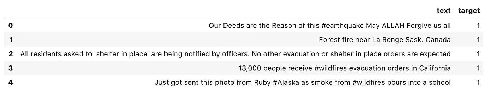
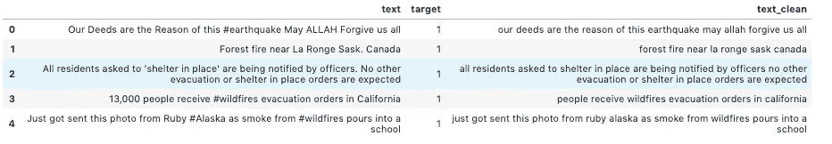
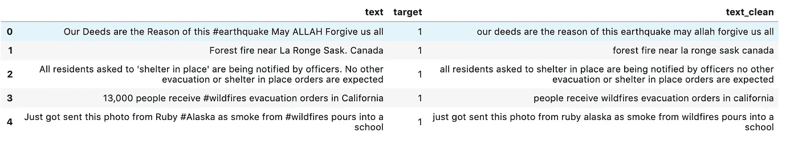
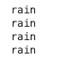
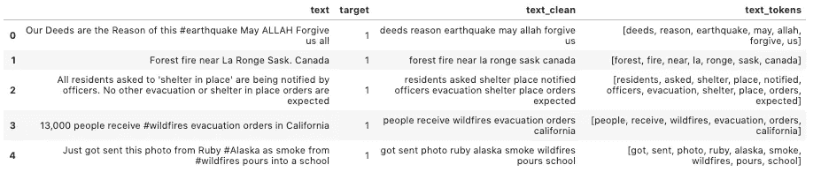
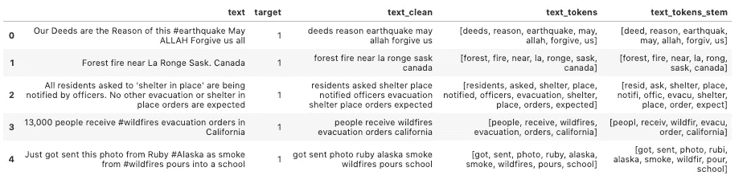
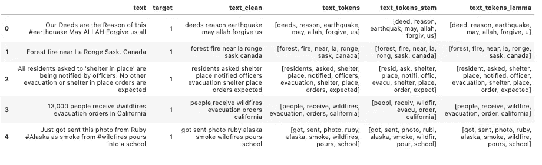
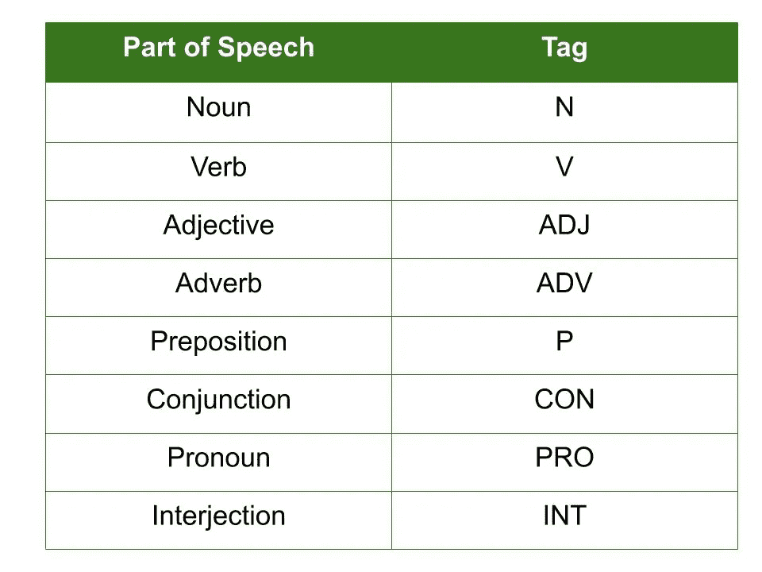
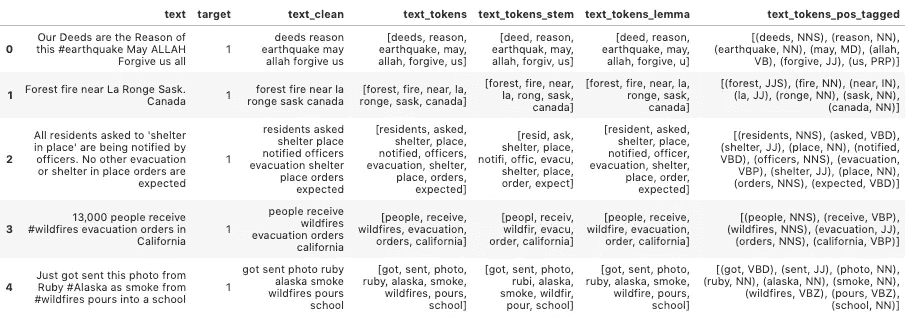
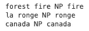

# 自然语言处理中的文本清洗方法

> 原文：<https://towardsdatascience.com/text-cleaning-methods-for-natural-language-processing-f2fc1796e8c7?source=collection_archive---------6----------------------->


保罗·花冈在 [Unsplash](https://unsplash.com/s/photos/language?utm_source=unsplash&utm_medium=referral&utm_content=creditCopyText) 上的照片

## 为 NLP 准备数据的 5 种 python 方法

自然语言处理被定义为“将计算技术应用于自然语言和语音的分析和合成”。为了执行这些计算任务，我们首先需要将文本语言转换为机器可以理解的语言。

在下面的帖子中，我将描述为自然语言处理准备文本数据的最常见步骤。我将讨论一些可用于执行这些步骤的工具，并提供一些示例 python 代码来执行它们。

在整篇文章中，我将使用一个取自 Kaggle 的数据集，该数据集可以从[这里](https://www.kaggle.com/c/nlp-getting-started/data)下载。这个数据集由来自推文的文本和一个目标变量组成，该变量将推文分类为真正的灾难和非灾难。下面的代码使用 pandas 将数据读入数据框。为了简单起见，我删除了除文本和目标变量之外的所有列。

```
import pandas as pd
pd.set_option('display.max_colwidth', -1)train_data = pd.read_csv('train.csv')
cols_to_drop = ['id', 'keyword', 'location']
train_data = train_data.drop(cols_to_drop, axis=1)
train_data.head()
```



## 1)标准化

处理语言数据的关键步骤之一是去除噪声，以便机器可以更容易地检测数据中的模式。文本数据包含大量干扰，这些干扰以特殊字符的形式出现，如标签、标点符号和数字。所有这些如果出现在数据中，计算机都很难理解。因此，我们需要处理数据以去除这些元素。

此外，注意单词的大小写也很重要。如果我们包含相同单词的大写和小写版本，那么计算机会将它们视为不同的实体，即使它们可能是相同的。

下面的代码执行这些步骤。为了跟踪我们对文本所做的更改，我将干净的文本放在了一个新的列中。输出显示在代码下方。

```
import redef  clean_text(df, text_field, new_text_field_name):
    df[new_text_field_name] = df[text_field].str.lower()
    df[new_text_field_name] = df[new_text_field_name].apply(lambda elem: re.sub(r"(@[A-Za-z0-9]+)|([^0-9A-Za-z \t])|(\w+:\/\/\S+)|^rt|http.+?", "", elem))  
    # remove numbers
    df[new_text_field_name] = df[new_text_field_name].apply(lambda elem: re.sub(r"\d+", "", elem))

    return dfdata_clean = clean_text(train_data, 'text', 'text_clean')data_clean.head()
```



## 2)停用词

停用字词是常见的字词，对于某些计算过程来说，这些字词提供的信息很少，或者在某些情况下会引入不必要的噪声，因此需要将其移除。对于文本分类任务来说尤其如此。

在其他情况下，不建议删除停用词，或者需要更仔细地考虑。这包括由于删除停用词而失去一段文本意义的任何情况。例如，如果我们正在构建一个聊天机器人，并从短语“**我不高兴**”中删除单词“**而不是**，那么算法实际上可能会解释相反的意思。这对于聊天机器人或情感分析等用例尤为重要。

[自然语言工具包](https://www.nltk.org/) (NLTK) python 库内置了移除停用词的方法。下面的代码使用它来删除 tweets 中的停用词。

```
import nltk.corpus
nltk.download('stopwords')from nltk.corpus import stopwords
stop = stopwords.words('english')data_clean['text_clean'] = data_clean['text_clean'].apply(lambda x: ' '.join([word for word in x.split() if word not in (stop)]))
data_clean.head()
```



## 3)词干

词干化是将单词还原为其词根形式的过程。比如“ **rain** ”、“ **raining** ”和“ **rained** ”这几个词就非常相似，在很多情况下，意思是一样的。堵塞的过程会将这些还原为“雨”的根形式。这也是一种减少噪音和数据维数的方法。

NLTK 库也有执行词干提取任务的方法。下面的代码使用 PorterStemmer 来阻止我上面的例子中的单词。从输出中可以看到，所有的单词现在都变成了“rain”。

```
from nltk.stem import PorterStemmer 
from nltk.tokenize import word_tokenizeword_list = ['rains', 'raining', 'rain', 'rained']ps = PorterStemmer()
for w in word_list:
    print(ps.stem(w))
```



在我们对数据进行词干提取之前，我们需要对推文进行标记。这是一种用于将文本拆分成其组成部分(通常是单词)的方法。下面的代码使用 NLTK 来完成这项工作。我已经将输出放到了一个名为“text_tokens”的新列中。

```
import nltk 
nltk.download('punkt')from nltk.tokenize import sent_tokenize, word_tokenizedata_clean['text_tokens'] = data_clean['text_clean'].apply(lambda x: word_tokenize(x))data_clean.head()
```



下面的代码使用 NLTK 中的 PorterStemmer 方法对 text_tokens 应用词干，并将处理后的文本输出到新列。

```
def word_stemmer(text):
    stem_text = [PorterStemmer().stem(i) for i in text]
    return stem_textdata_clean['text_tokens_stem'] = data_clean['text_tokens'].apply(lambda x: word_stemmer(x))
data_clean.head()
```



## 4)词汇化

词汇化的目标与词干化的目标是一样的，因为它旨在将单词简化为它们的根形式。然而，众所周知，词干处理是一种相当粗糙的方法。另一方面，词汇化是一种工具，它执行完整的词法分析，以更准确地找到单词的词根或“词汇”。

同样，NLTK 可以用来执行这项任务。

```
nltk.download('wordnet')
from nltk.stem import WordNetLemmatizerdef word_lemmatizer(text):
    lem_text = [WordNetLemmatizer().lemmatize(i) for i in text]
    return lem_textdata_clean['text_tokens_lemma'] = data_clean['text_tokens'].apply(lambda x: word_lemmatizer(x))
data_clean.head()
```



## 5)词性标注和组块

词性标注是一种对单词进行分类的方法，它提供了一些与单词在语音中的使用方式有关的信息。

有八个主要的词类，它们都有相应的标签。这些显示在下表中。



NLTK 库有一个执行词性标注的方法。下面的代码对我们数据集中的 tweets 执行 POS 标记，并返回一个新列。

```
def word_pos_tagger(text):
    pos_tagged_text = nltk.pos_tag(text)
    return pos_tagged_textnltk.download('averaged_perceptron_tagger')data_clean['text_tokens_pos_tagged'] = data_clean['text_tokens'].apply(lambda x: word_pos_tagger(x))
data_clean.head()
```



组块建立在词性标注的基础上，它使用词性标注中的信息从文本中提取有意义的短语。在许多类型的文本中，如果我们把一切都简化为单个单词，我们可能会失去很多意义。例如，在我们的推文中，我们有很多位置名称和其他短语，这些都是很重要的。

如果我们拿这句话“**la ronge sask 附近的森林大火**”这个地名“ **la ronge** ”和“**森林大火**”这几个字就传达了一个我们可能不想失去的重要意义。

spaCy python 库对此有一个方法。如果我们把这种方法应用到上面的句子中，我们可以看到它分离出了合适的短语。

```
import spacy
nlp = spacy.load('en')text = nlp("forest fire near la ronge sask canada")
for chunk in text.noun_chunks:
    print(chunk.text, chunk.label_, chunk.root.text)
```



本文给出了一些最流行的方法的简要概述，这些方法用于清理准备用于自然语言处理的文本数据。为了更深入地了解这些概念和工具，这篇博客 [nlpforhackers.io](https://nlpforhackers.io/complete-guide-to-spacy/) 是我的最爱之一。

如果你对将机器学习技术应用于这些数据感兴趣，我上周写了一篇文章，介绍如何让你的[第一次提交给这个数据集来自的 Kaggle 竞赛](/how-to-enter-your-first-kaggle-competition-4717e7b232db)。

感谢阅读！