# 基于图转换器的知识图文本生成

> 原文：<https://towardsdatascience.com/text-generation-from-knowledge-graphs-with-graph-transformers-c84156ddd446?source=collection_archive---------27----------------------->

结构概要

鉴于变压器模型开发的速度和 GPT-3 改变世界的影响，这篇 2019 年的论文有点不合时宜。然而，作为一个有认知科学背景的人，我喜欢模型，因为它们的结构而不是原始的计算能力，可以帮助揭开认知过程的帷幕。该模型试图解决表示长期依赖关系的问题。

语言生成大致包括两个部分，规划和实现。实现纯粹是生成语法文本的任务，不管它的意义、与其他文本的关系或整体意义。规划是确保文本中实体之间的长期依赖关系得到解决，以及项目以正确的方式在语义上相互关联的过程。在下一个短语中，关键实体是约翰，伦敦，英国，酒保。

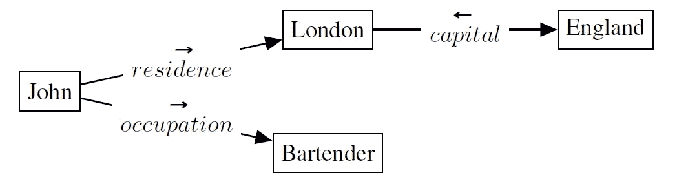

Moryossef，2019 |【https://arxiv.org/abs/1904.03396 

规划是管理那些实体和它们之间的关系，实现是产生短语“约翰，他是一名酒保，住在英国的首都伦敦”(Moryossef，2019)。

GraphWriter 根据标题中的单词和构建的知识图生成摘要。本文的贡献包括:

*   一种新的图形转换器编码器，将序列转换器应用于图形结构输入
*   展示了如何将 IE 输出转换成一个连通的无标签图，以用于基于注意力的编码器
*   与科学文本配对的知识图表数据集，用于进一步研究

在输入进入编码器之前(稍后会详细介绍)，必须以正确的方式进行排列。这个模型的输入有两个渠道，标题，以及实体和关系的知识图。

# 资料组

为此，引入了议程数据集——基于取自语义学者语料库的前 12 次人工智能会议的 4 万篇论文标题和摘要。(Ammar 等人，2018 年)在下面的图表创建和预处理之后，数据集被输入到模型中。完整的回购，包括数据集，可在[这里](https://github.com/rikdz/GraphWriter)获得。

# 图形预处理:

创建知识图表:

1.  应用了栾等人(2017)的 NER/IE SciIE 系统，该系统提取实体并对它们进行标记，以及创建共指标注
2.  然后，这些注释被折叠成单个带标签的边

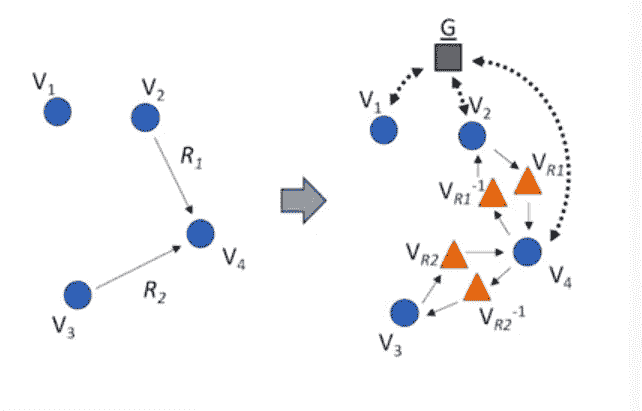

Koncel-Kedziorski(艾伦研究所)| 2019

3.然后，使用添加的全局节点将每个图转换为连通图，所有其他节点都连接到该全局节点。

4.然后，每个带标签的边被表示每个方向上的关系的两个节点所代替，并且新的边是不带标签的。这允许图形被表示为邻接矩阵，这是容易处理的必要前提。

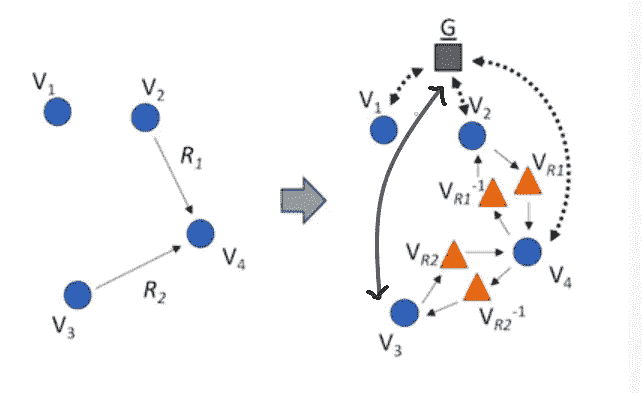

Koncel-Kedziorski(艾伦研究所)| 2019

这个图形成的一个关键特征是增加了一个全局节点 G，所有的实体都连接到这个节点上，这个节点把不连通的图变成了连通的图。因此，最终产品是一个连通的、无标号的二分图。

# 模型架构:

该模型使用编码器-解码器架构，以未标记的二分图和标题作为输入。

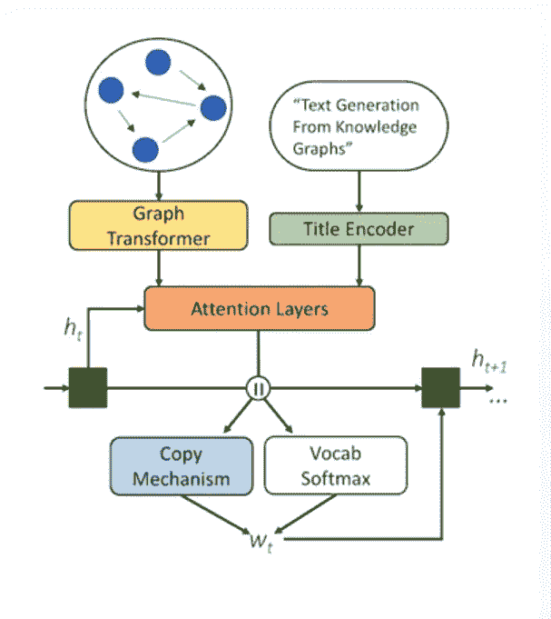

Koncel-Kedziorski(艾伦研究所)| 2019

**标题编码器**:标题用 BiLSTM 编码，使用 512 维嵌入。没有预先训练的单词嵌入被用于此。

**图形编码器**:

第一步是，通过关注 **v** 的邻域中的所有其他顶点，每个顶点表示 **v** i 被上下文化。

然后，图形编码器通过连接由 N 个注意力头部产生的注意力权重的乘积来创建一组顶点嵌入。


然后用“块”网络增加这些嵌入，所述“块”网络由每个两层的多个堆叠块组成，具有以下形式:

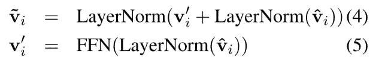

最终结果是一个实体、关系及其与全局节点的上下文的列表，称为*图上下文化顶点编码*。

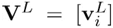

# 解码器(图形和标题)

解码器是基于注意力的，具有复制机制，用于从知识图中的实体和标题中的单词复制输入。它还在每个时间步长 ***t*** *使用隐藏状态 **h** t。*

根据用编码器创建的编码，使用多头注意力来计算上下文向量 Cg 和 Cs

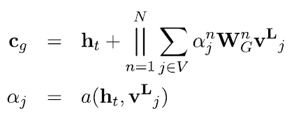

这里，Cs(标题上下文向量)的计算方式与 Cg 相同。这两者连接在一起形成 Ct，即总的上下文向量。

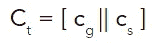

根据该上下文向量，从标题中的单词或实体名称复制标记的概率是通过总上下文向量乘以 Wcopy 来计算的。

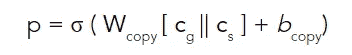

最终的下一个令牌概率分布是:

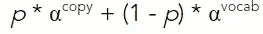

# 实验

GraphWriter 与 GAT(用图形注意力替换了图形转换器)、EntityWriter(类似 GraphWriter，但不使用图形结构)、Rewriter (Wang 等人，2018)(仅使用标题编码)进行比较。

**使用的人工和自动评估指标:**

*   领域专家判断摘要是否符合标题。最佳-最差标度(Louviere 和 Woodworth，1991 年)
*   蓝色(帕皮尼尼等人，2002 年)
*   METEOR (Denkowski 和 Lavie，2014 年)(生成的输出与原始摘要相比，在单字频率上的精确度和召回率)

**自动评估:**

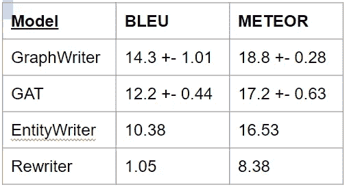

**人类评价:**

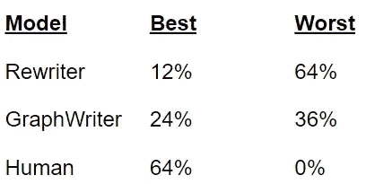

这篇论文有一个特别的地方让我有点失望；“主题专家”是计算机专业的本科生。虽然本科生毕业时可以知道很多东西，但我不知道他们通常对计算机科学的学术论文有多熟悉。

关于人类对抽象质量的判断，我认为最能说明问题的是，虽然人类的产出并不总是被认为是最好的，但也从来不是最差的。这让我怀疑，这些生成的摘要中有一些相对缺乏经验的本科生不太清楚的东西，但尽管如此，还是提醒他们有些不对劲。

在研究了用于生成的解码机制之后，问题是最终有多少被复制了，有多少被生成了？为此，我给作者 Rik Koncel-Kedziorski 发了电子邮件，要他提供的摘要和原始文档的副本。

**原文摘要**:

```
we present a learning architecture for lexical semantic classification problems that supplements task-specific training data with background data encoding general '' world knowledge '' . the learning architecture compiles knowledge contained in a dictionary-ontology into additional training data , and integrates task-specific and background data through a novel hierarchical learning architecture . experiments on a word sense disambiguation task provide empirical evidence that this '' hierarchical learning architecture '' outperforms a state-of-the-art standard '' flat '' one .
```

**graph writer 生成的摘要**:

```
in this paper , we present a novel learning architecture for lexical semantic classification problems , in which a learning architecture can be trained on a large amount of training data . in the proposed learning architecture , a hierarchical learning architecture is learned to select the most informative examples from the source domain to the target domain . the learning architecture is trained in a hierarchical learning architecture , where the background data is learned from the training data in the target domain . the learning architecture is trained on data from the source domain and a target domain in the target domain . experimental results show that the proposed learning architecture is effective in improving the performance of lexical semantic classification problems .
```

# 分析:

这里调查的一个关键问题是知识是否有帮助，以某种显式编码的形式，而不是仅仅被一个有许多参数的模型吸收。在这种情况下，它做到了。Rewriter 是一家总部位于 LSTM 的模型，它只使用标题词来生成摘要，在所有选择的评估指标中表现最差。EntityWriter 比 GraphWriter 使用更多的信息，是一个有效的控件，因为它使用提取的相同实体，但没有图形提供的上下文。它比没有使用任何形式的知识表现更好，但仍然优于使用由图创建的上下文的模型。

我认为在这里不要认为 GraphWriter 与 GPT-3 在合理的人类输出方面存在直接竞争是很重要的，它显然不是，我非科学地调查过的那些从来没有过的专家也不难分辨哪个是人类产生的，哪个显然不是。但是，这不是测试，也不是目标。测试是使用结构化领域知识的系统是否会比不使用结构化领域知识的系统做得更好，比如 EntityWriter，在这种情况下，确实如此。

# 参考资料:

[](https://github.com/rikdz/GraphWriter) [## rikdz/GraphWriter

### 这个库包含了我们的论文《用图形转换器从知识图生成文本》的源代码

github.com](https://github.com/rikdz/GraphWriter) 

Amit Moryossef、Yoav Goldberg 和 Ido Dagan。2019.一步一步:在神经数据到文本的生成中将计划与实现分开。计算语言学协会北美分会 2019 年会议录:人类语言技术，第 1 卷(长论文和短论文)，第 2267-2277 页，明尼苏达州明尼阿波利斯。计算语言学协会

莫里塞夫，戈德堡，达甘，[https://arxiv.org/abs/1904.03396](https://arxiv.org/abs/1904.03396)

孔塞尔-凯济奥尔斯基，[https://arxiv.org/abs/1904.02342](https://arxiv.org/abs/1904.02342)