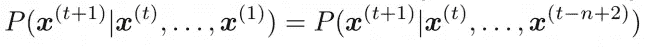
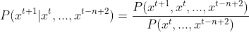
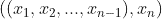

# 使用 N 元模型的文本生成

> 原文：<https://towardsdatascience.com/text-generation-using-n-gram-model-8d12d9802aa0?source=collection_archive---------4----------------------->


迪伦·卢在 [Unsplash](https://unsplash.com?utm_source=medium&utm_medium=referral) 上的照片

当我了解到机器能够通过使用一些简单的统计和概率技术来生成新文本时，我对人工智能，特别是自然语言处理(NLP)的兴趣就爆发了。在这篇文章中，我想分享这个非常简单和直观的创建文本生成模型的方法。

# 背景

众所周知，语言具有顺序性，因此单词在文本中出现的顺序非常重要。这个特性允许我们理解一个句子的上下文，即使缺少一些单词(或者偶然发现一个意思未知的单词)。考虑下面的例子:

> "玛丽被卓帕卡布拉发出的可怕声音吓坏了."

没有一些先前的背景，我们不知道“卓帕卡布拉”到底是什么，但我们可能会说，我们不会高兴在现实生活中遇到这种生物。

句子中单词的这种依赖性可以给我们一些关于丢失单词性质的线索，有时我们甚至不需要知道整个上下文。在上面的例子中，通过只看由发出的*噪声，我们在直觉层面上可以说下面的单词应该是一个**名词**而不是某个其他词类。*

这让我们想到了 N 元语法背后的概念，它的正式定义是“来自给定文本样本的 N 个项目的连续序列”。主要的想法是，给定任何文本，我们可以把它分成一个一元(1-gram)、二元(2-gram)、三元(3-gram)等的列表。

> 例如:
> 
> 文字:“我去跑步了”
> 
> 单字:[(I)，(got)，(running)]
> 
> 二元模型:[(我，去，(去，运行)]

正如你所注意到的，单词“go”出现在两个二元模型中:(I，**go**)和(**go**，running)。

另一种更直观的方式来看待它


句子中三元组的例子。图片由奥列格·鲍里索夫拍摄。

# 理论

使用 n-gram 生成文本的主要思想是假设 n-gram 的**最后一个单词** (x^{n})可以从同一个 n-gram 中出现的其他单词(x^{n-1}，x^{n-2}，… x)推断出来，我称之为**上下文**。

因此，该模型的主要简化是，我们不需要跟踪整个句子来预测下一个单词，我们只需要回头寻找 *n-1* 标记。这意味着主要的假设是:



太好了！最美妙的是，为了计算上面的概率，我们只需要应用简单的条件概率规则



> 例如:使用三元模型(n=3)
> 
> 正文:“玛丽害怕是因为 __”
> 
> 因为我们使用三元模型，所以我们删除了句子的开头:“Mary 被吓到了”，并且我们只需要计算“因为”的可能延续。假设从数据集我们知道有以下可能的延续:“我”，“噪音”。因此，我们需要计算:
> 
> P(噪音|因为)和 P(我|因为)

在计算出概率后，有多种方法来选择给定所有候选的最终单词。**一种**方法是产生具有最高条件概率的单词(如果 *n* 很小，这个选项可能不是最好的，因为它会陷入循环)。

**另一个**(也是更好的)选项是根据条件概率半随机地输出单词“*”。从而具有较高概率的单词将有较高的机会被产生，而具有较低概率的其他单词有机会被产生。*

**

*照片由 [Clément H](https://unsplash.com/@clemhlrdt?utm_source=medium&utm_medium=referral) 在 [Unsplash](https://unsplash.com?utm_source=medium&utm_medium=referral) 上拍摄*

# *密码*

*理论到此为止，让我们进入实现部分。[我的 github 上有源代码](https://github.com/olegborisovv/NGram_LanguageModel)。*

*首先，我们需要一些源文本，从中我们将训练我们的*语言模型*。理想情况下，我们希望有一些大的书(甚至多本书)，因为我们不仅希望有大量的词汇，而且我们有兴趣看到尽可能多的不同排列或单词。这里我将使用玛丽·雪莱写的《弗兰肯斯坦》,但是你可以使用你选择的任何其他书(为了方便你可以使用[古腾堡计划](https://www.gutenberg.org/)链接)。*

*我希望代码尽可能简单，这样就不需要安装任何外部包。除此之外，我还做了一些代码优化，以减少计算时间，使有效的推理过程。*

*在我们实现 N 元语法语言模型之前，让我们实现一些辅助函数:一个用于执行标记化(拆分句子中的单词)，另一个用于将结果标记合并到 N 元语法中。*

*对于标记化，最好使用一些外部库，如 NLTK 或 spaCy，但是对于我们的目的，自定义标记化器就足够了。*

*现在我们来看看`get_ngrams`函数。*

*正如我们之前提到的，为了预测位置 *n* 的标记，我们必须查看我们的 N-gram 的所有先前的 *n-1* 标记。所以我们要用一个类型为`((context), current_word)`的元组来表示我们的 N-gram:*

**

*当我们需要生成一个句子的第一个标记时，问题就出现了，因为没有前面的上下文可用。为了解决这个问题，我们可以引入一些像`<START>`这样的前导标签，这将确保在任何推断点上，我们总是使用正确的 N 元语法。例如，如果我们想从文本“*我买了一辆红色汽车*”中获取所有的 3 克:*

> *[((' <start>'，'<start>')，'我')，</start></start>*
> 
> *(('<start>'，'我'，'买')，</start>*
> 
> *(('我'，'买'，'甲')，*
> 
> *(('买了'，' a '，'红')，*
> 
> *(('甲'，'红'，'车')，*

*很好，现在让我们创建我们的 N 元模型:*

*在初始化中，我们必须指定，什么是我们的 n 元文法的 *n* 值，除此之外，我还创建了*上下文*和 *ngram_counter* 字典。字典作为键，它有上下文，作为值，它存储给定上下文的可能延续的列表。例如:*

```
*>> self.context
>> {(red, car): [names, wallpapers, game, paint ...],
    (weather, in): [London, Bern, Paris, ...]}*
```

*因此，在某种程度上，这本*上下文*词典立即向我们展示了我们可以使用哪些候选词来生成相对随机的、有一定意义的文本(仍然比盲目生成一堆单词要好)。*

*字典只是计算一个特定的 N-gram 在我们的训练集中出现过多少次。*

*为了更新我们的语言模型，我们将提供书中的每个单独的句子，并将使用与我们的 N 元语法相对应的信息来更新字典。*

*正如在本文的理论部分提到的，在给定上下文的情况下，要计算下一个单词的概率，我们只需要应用简单的条件概率规则。*

*现在让我们转到文本生成部分。*

*在我们开始文本生成之前，我们首先必须为我们的系统提供一些**上下文**，在我们的例子中，它将是重复*n–1*次的开始标记`<START>`。*

*之后，我们可以通过使用我们的“半随机”方法生成我们的第一个`random_token`。然后，我们重复我们的过程，直到生成了一定数量的令牌(由`token_count`变量指定)。*

***注意**:当我们到达生成中的句号`.`时，由于我们更新语言模型的方式，系统将不知道如何继续。因此，每次我们的模型生成一个句号时，我们都需要重新初始化上下文队列`context_queue`。*

*太好了！一切都设置好了，让我们运行我们的模型，看看我们能产生什么句子！*

*部分结果如下:*

> *n=1，“我的关心。这是命中注定的。。对于费利克斯的话，安不哪措激动”*
> 
> *n=2，“我同情他，多么沉重；但我已经到达，但他们断言，我不允许潮湿和”*
> 
> *n=3，”我继续他们的单个后代。最后，我从一个生于自由的人那里得知*
> 
> *n=4，”我继续以这种方式走着，在此期间，我享受着幸福的感觉。你仍能聆听”*
> 
> *n=5，“我继续以这种方式走了一段时间，我担心德蒙的失望的影响。”*

*看到生成的文本如何随着我们增加 *n* 而改进是很酷的，然而这并不奇怪，因为随着 N 元模型大小的增加，我们开始从训练集复制原始文本，在我们的例子中是 book。*

*事实上，对于 *n > 5* 生成的文本仍然是“我继续以这种方式行走了一段时间，试图通过身体锻炼来减轻负重”。*

# *结束语*

*我仍然感到印象深刻的是，我们使用 N 元语法和简单概率规则的过于简化的语言模型仍然能够产生一些新的文本，对读者来说有一定的意义。*

*当然，这样一个天真的模型不可能写出像人类一样的文章，也不可能像 GPT 3 号那样表演，因为它有很多缺点。这种系统可能陷入循环，或者不能跟踪长期的上下文关系。但这是对自然语言处理和语言建模的第一次很好的介绍，因为它强调了句子中上下文的重要性。*

*敬请关注更多关于人工智能和自然语言处理的文章。*