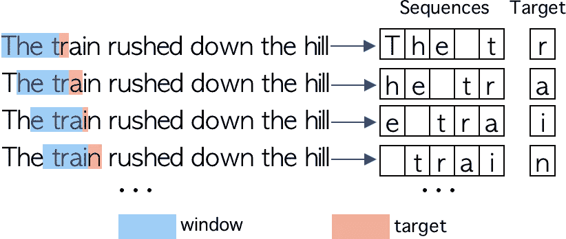
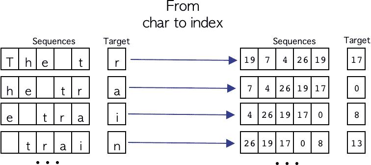
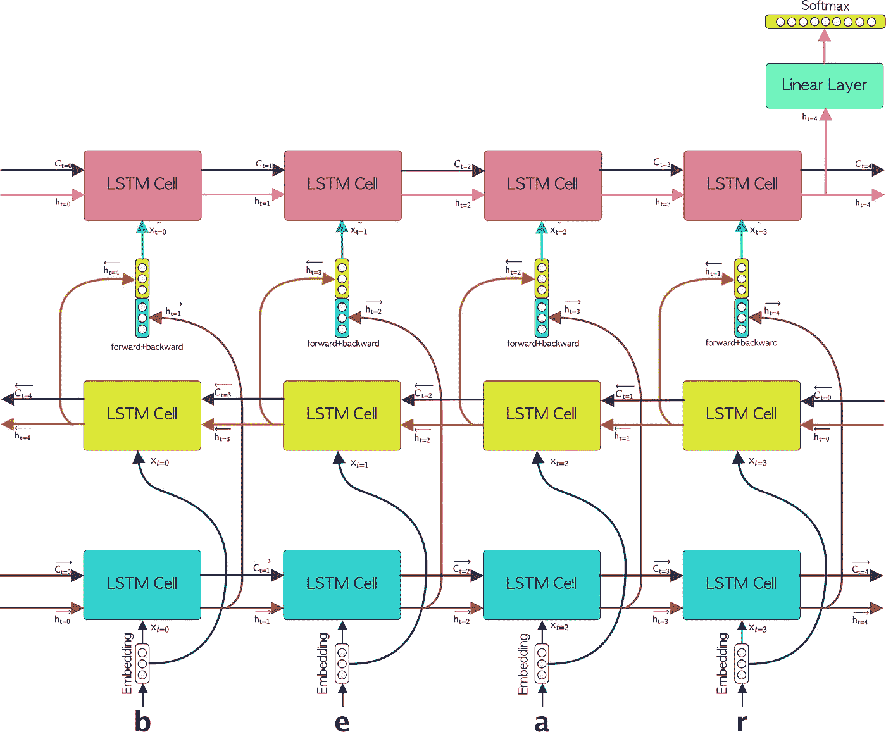
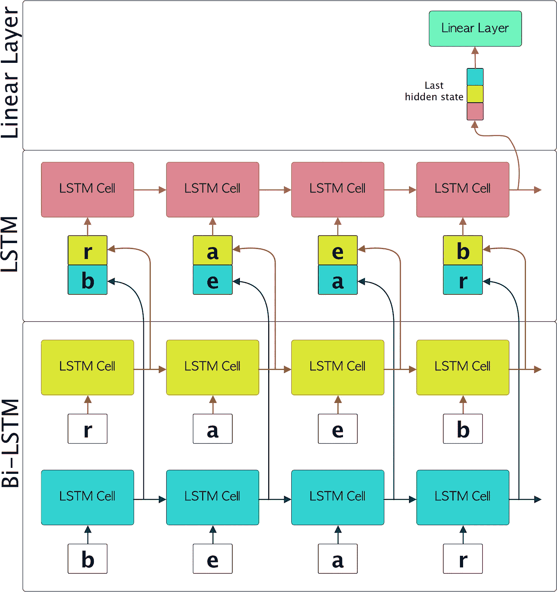

# 用 PyTorch 中的双 LSTM 生成文本

> 原文：<https://towardsdatascience.com/text-generation-with-bi-lstm-in-pytorch-5fda6e7cc22c?source=collection_archive---------5----------------------->

## 通过使用 PyTorch 的 LSTMCells 从头开始创建双 LSTM 模型来构建文本生成模型的分步指南


帕特里克·托马索在 [Unsplash](https://unsplash.com?utm_source=medium&utm_medium=referral) 上的照片

> “没有规定怎么写。有时它来得容易而完美:有时它就像钻岩石，然后用炸药把它炸出来”——欧内斯特·海明威

这篇博客的目的是解释如何通过实现一个基于 LSTMs 的强大架构来构建一个用于文本生成的端到端模型。

博客分为以下几个部分:

*   **简介**
*   **文本预处理**
*   **序列生成**
*   **模型架构**
*   **培训阶段**
*   **文本生成**

您可以在以下网址找到完整的代码:[https://github . com/FernandoLpz/Text-Generation-BiLSTM-py torch](https://github.com/FernandoLpz/Text-Generation-BiLSTM-PyTorch)

# 介绍

这些年来，各种各样的提案被推出来*模拟自然语言*，但是这是怎么回事呢？“*建模自然语言*的想法指的是什么？我们可以认为“*建模自然语言*”指的是对组成语言的语义和语法进行推理，本质上是这样，但它走得更远。

如今，**自然语言处理** ( **NLP** )领域通过不同的方法和技术处理涉及语言的推理、理解和建模的不同任务。NLP(自然语言处理)领域在过去的十年中发展非常迅速。许多模型从不同的角度提出了不同的 NLP 任务。同样，最受欢迎的提议中的共同点是实现基于**深度学习**的模型。

正如已经提到的， **NLP** 领域解决了大量的问题，特别是在这篇博客中，我们将通过利用基于*深度学习的模型*来解决*文本生成*的问题，例如*递归神经网络* **LSTM** 和**双 LSTM** 。同样，我们将使用当今最复杂的框架之一来开发深度学习模型，具体来说，我们将使用来自 **PyTorch** 的**LSTMCell**类来开发所提议的架构。

> 如果你想深入了解 **LSTM** 的机制，以及它是如何在 **PyTorch** 中实现的，看一看这个令人惊叹的解释: [*从 LSTM 细胞到带有 PyTorch*](/from-a-lstm-cell-to-a-multilayer-lstm-network-with-pytorch-2899eb5696f3) 的多层 LSTM 网络

## **问题陈述**

给定一个文本，神经网络将通过字符序列来学习给定文本的语义和语法。随后，将随机抽取一个字符序列，并预测下一个字符。

所以，让我们开始吧！

# 文本预处理

首先，我们需要一个我们将要使用的文本。有不同的资源在那里你可以找到不同的纯文本文本，我推荐你看一看 [*古腾堡项目*](https://www.gutenberg.org/) 。

在这种情况下，我将使用由*乔治·伯德·格林内尔*所著的《印第安人中的*杰克》这本书，你可以在这里找到这本书: [*链接到本书*](https://www.gutenberg.org/cache/epub/46205/pg46205.txt) 。所以，第一章的第一行看起来像:*

```
The train rushed down the hill, with a long shrieking whistle, and then began to go more and more slowly. Thomas had brushed Jack off and thanked him for the coin that he put in his hand, and with the bag in one hand and the stool in the other now went out onto the platform and down the steps, Jack closely following.
```

如您所见，文本包含大写、小写、换行符、标点符号等。建议做的是尝试将文本改编为一种形式，这种形式允许我们以更好的方式处理它，并且主要降低我们将要开发的模型的复杂性。所以我们将把每个字符转换成小写形式。同样，最好将文本作为一个字符列表来处理*，也就是说，我们将拥有一个字符列表，而不是一个“*大字符串*”。将文本作为一个字符序列的目的是为了在生成序列时更好地处理模型(我们将在下一节中详细讨论)。*

所以让我们开始吧！

代码片段 1。预处理

正如我们所看到的，在第 2 行中，我们定义了要使用的字符，所有其他符号都将被丢弃，我们只保留“*空白字符*”符号。在第 6 行和第 10 行，我们正在读取*原始文件*，并将其转换成小写形式。在第 14 行和第 19 行的循环中，我们创建了一个表示整本书的字符串，并生成了一个字符列表。在第 23 行，我们通过只保留第 2 行定义的字母来过滤*文本列表*。

因此，一旦文本被加载和预处理，我们将从这样的文本:

```
text = "The train rushed down the hill."
```

有这样一个字符列表:

```
text = ['t','h','e',' ','t','r','a','i','n',' ','r','u','s','h','e','d',' ','d','o','w','n',
' ','t','h','e',' ','h','i','l','l']
```

我们已经有了完整的文本，作为一个字符列表。众所周知，我们不能将*原始字符*直接引入神经网络，我们需要一个*数字表示*，因此，我们需要将每个字符转换成一个数字表示。为此，我们将创建一个字典来帮助我们保存等价的"*字符索引*"和" i *索引字符*"。

所以，让我们开始吧！

代码片段 2。词典创作

我们可以注意到，在第 11 行和第 12 行创建了" *char-index* "和" *index-char* "字典。

到目前为止，我们已经展示了如何加载文本并以字符列表的形式保存它，我们还创建了几个字典来帮助我们对每个字符进行编码解码。现在，是时候看看我们将如何生成将被引入模型的序列了。那么，让我们进入下一部分吧！

# 序列生成

序列生成的方式完全取决于我们将要实现的模型的类型。如前所述，我们将使用 **LSTM** 类型的递归神经网络，它顺序接收数据(时间步长)。

对于我们的模型，我们需要形成给定长度的序列，我们称之为“ ***窗口*** ”，其中要预测的字符( ***目标*** )将是 ***窗口*** 旁边的字符。每个序列将由 ***窗口*** 中包含的字符组成。为了形成一个序列， ***窗口*** 被一次向右切割一个字符。要预测的字符将始终是跟随 ***窗口*** 的字符。我们可以在图 1 中清楚地看到这个过程。



图一。序列生成。在这个例子中，窗口大小为 4，这意味着它将包含 4 个字符。目标是作者的窗口|图像旁边的第一个字符

到目前为止，我们已经看到了如何以简单的方式生成字符序列。现在我们需要将每个字符转换成其各自的数字格式，为此我们将使用预处理阶段生成的字典。这个过程可以在图 2 中看到。



图二。作者将字符转换为数字格式|图片

很好，现在我们知道了如何使用一次滑动一个字符的*窗口生成字符序列，以及如何将字符转换成数字格式，下面的代码片段显示了所描述的过程。*

*代码片段 3。序列生成*

*太棒了，现在我们知道如何预处理原始文本，如何将它转换成字符列表，以及如何生成数字格式的序列。现在我们进入最有趣的部分，模型架构。*

# *模型架构*

*正如你已经在这篇博客的标题中读到的，我们将利用**双 LSTM** 递归神经网络和标准 **LSTMs** 。本质上，我们利用这种类型的神经网络，因为它在处理序列数据(如文本类型数据)时具有巨大的潜力。同样，也有大量的文章提到了基于递归神经网络的架构的使用(例如 **RNN、**T10、LSTM、 **GRU、**、**比-LSTM** 等)。)进行文本建模，具体为文本生成[1，2]。*

> *所提出的神经网络的架构包括一个**嵌入**层，接着是一个**双 LSTM** 以及一个 **LSTM** 层。紧接着，后者 **LSTM** 连接到一个**线性层**上。*

## *方法学*

*该方法包括将每个字符序列传递到**嵌入**层，这将为组成该序列的每个元素生成一个矢量形式的表示，因此我们将形成一个嵌入字符的*序列。随后，嵌入字符*的*序列的每个元素将被传递到**双 LSTM** **层**。随后，将产生组成**双 LSTM****正向 LSTM** 和**反向 LSTM** 的**lstm 的每个输出的级联。紧接着，每个*向前+向后*连接的向量将被传递到 **LSTM** **层**，从该层中**最后一个隐藏状态**将被用于馈送到**线性层**。这个最后的**线性层**将具有作为激活函数的 **Softmax 函数**，以便表示每个字符的概率。图 3 显示了所描述的方法。****

**

*图 3。比尔斯特姆-LSTM 模型。在这张图片中，作者将单词“熊”通过比尔斯特姆-LSTM 模型进行文本生成*

*太棒了，到目前为止，我们已经解释了文本生成模型的架构以及实现的方法。现在我们需要知道如何用 **PyTorch 框架**完成所有这些，但是首先，我想简单解释一下 **Bi-LSTM** 和 **LSTM** 是如何一起工作的，以便稍后看到我们如何在代码中完成，所以让我们看看 **Bi-LSTM** **网络**是如何工作的。*

## *双 LSTM & LSTM*

*一辆标准 **LSTM** 和一辆**比 LSTM** 的关键区别在于，这辆 ***比 LSTM*** *是由* ***2 个 lstm***组成的，更好的说法是“*向前****【LSTM***和“*向后* ***LSTM*** ”。基本上，*前进* ***LSTM*** 按原顺序接收，而*后退****LSTM****按相反顺序接收。随后，根据要做的事情，两个**lstm**的每个时间步的每个**隐藏状态**可以被加入，或者只有两个**lstm**的**最后状态**将被操作。在提议的模型中，我们建议为每个时间步加入两个隐藏状态**。****

****太好了，现在我们明白了**双 LSTM** 和 **LSTM** 的主要区别。回到我们正在开发的例子，图 4 显示了每个字符序列在通过模型时的演变。****

********

****图 4。比尔斯特姆-LSTM 模型。一个简单的例子显示了每个角色在通过作者的模型|图像时的演变****

****很好，一旦关于 **Bi-LSTM** 和 **LSTM** 之间的交互的一切都清楚了，让我们看看如何仅使用来自伟大的 **PyTorch** 框架的 **LSTMCells** 在代码中实现这一点。****

****所以，首先让我们了解一下我们如何构造 **TextGenerator** 类的构造函数，让我们看看下面的代码片段:****

****代码片段 4。文本生成器类的构造函数****

****正如我们所看到的，从第 6 行到第 10 行，我们定义了用于初始化神经网络每一层的参数。需要特别提到的是 *input_size* 等于词汇表的*大小(也就是我们的字典在预处理中生成的包含的元素个数)。同样，要预测的*类的数量*也与词汇表的大小相同，并且 *sequence_length* 指的是*窗口*的大小。*****

***另一方面，在第 20 行和第 21 行，我们定义了两个**lstmcell**，它们组成了**双 LSTM** ( *向前*和*向后*)。在第 24 行中，我们定义了 **LSTMCell** ，它将被馈送以**双 LSTM** 的输出。值得一提的是**隐藏状态**的大小是**双 LSTM** 的两倍，这是因为**双 LSTM** 的输出是级联的。稍后在第 27 行我们定义了**线性层**，稍后将被 **softmax** 函数过滤。***

***一旦定义了构造函数，我们需要为每个 **LSTM** 创建包含**单元格状态** ( *cs* )和**隐藏状态** ( *hs* )的张量。因此，我们按如下方式进行:***

***代码片段 5。权重初始化***

***太棒了，一旦定义了将包含**隐藏状态**和**单元状态**的张量，就该展示整个架构的组装是如何完成的了，让我们开始吧！***

***首先，让我们看看下面的代码片段:***

***代码片段 6。BiLSTM + LSTM +线性层***

***为了更好的理解，我们将用一些定义的值来解释这个集合，这样我们就可以理解每个张量是如何从一层传递到另一层的。假设我们有:***

```
***batch_size = 64
hidden_size = 128
sequence_len = 100
num_classes = 27***
```

***因此, *x* 输入张量将有一个形状:***

```
***# torch.Size([batch_size, sequence_len])
x : torch.Size([64, 100])***
```

***然后，在第 2 行中，通过嵌入层传递了 *x* 张量，因此输出的大小为:***

```
***# torch.Size([batch_size, sequence_len, hidden_size])
x_embedded : torch.Size([64, 100, 128])***
```

***值得注意的是，在第 5 行，我们正在对 *x 嵌入张量*进行**整形**。这是因为我们需要将*序列长度*作为第一维度，本质上是因为在**双 LSTM** 中，我们将迭代每个序列，因此整形后的张量将具有一个形状:***

```
***# torch.Size([sequence_len, batch_size, hidden_size])
x_embedded_reshaped : torch.Size([100, 64, 128])***
```

***紧接着，在第 7 行和第 8 行中定义了*向前*和*向后*列表。在那里我们将存储**双 LSTM 的**隐藏状态**。*****

***所以是时候给双 LSTM 喂食了。首先，在第 12 行我们迭代了 ***前进的 LSTM*** ，我们还保存了每个*时间步* ( **hs_forward** )的**隐藏状态**。在第 19 行，我们正在迭代向后的****LSTM***，同时我们正在保存每个*时间步* ( **hs_backward** )的**隐藏状态**。你可以注意到循环是以同样的顺序进行的，不同的是它是以相反的形式读出的。每个**隐藏状态**将具有以下形状:****

```
****# hs_forward : torch.Size([batch_size, hidden_size])
hs_forward : torch.Size([64, 128])# hs_backward : torch.Size([batch_size, hidden_size])
hs_backward: torch.Size([64, 128])****
```

****太好了，现在让我们看看如何喂养最新的 **LSTM 层**。为此，我们利用*前进*和*后退*列表。在第 26 行中，我们正在遍历每个**隐藏状态**，对应于第 27 行中**连接的*向前*和*向后*。值得注意的是，通过**连接**两个**隐藏状态**，张量的维数将增加 2X，即张量将具有以下形状:******

```
****# input_tesor : torch.Size([bathc_size, hidden_size * 2])
input_tensor : torch.Size([64, 256])****
```

****最后，LSTM 将返回一个**大小的隐藏状态**:****

```
****# last_hidden_state: torch.Size([batch_size, num_classes])
last_hidden_state: torch.Size([64, 27])****
```

****最后， **LSTM** 的**最后隐藏状态**将通过 l **线性层**，如第 31 行所示。因此，完整的转发函数如下面的代码片段所示:****

****代码片段 7。正向功能****

****恭喜你！至此，我们已经知道如何在 **PyTorch** 中使用 **LSTMCell** 组装神经网络。现在是时候看看我们如何进行培训了，让我们进入下一部分。****

# ****培训阶段****

****太好了，我们来参加**培训**。为了执行**训练**我们需要初始化*模型*和*优化器*，稍后我们需要为每个*时期*和每个*小批量*进行迭代，让我们开始吧！****

****代码片段 8。培训阶段****

****一旦模型被**训练**，我们将需要**保存神经网络的权重**，以便稍后使用它们**生成文本**。为此我们有两个选择，第一个是定义一个固定数量的历元 s，然后保存权重，第二个是确定一个停止函数*以获得模型的最佳版本。在这种特殊情况下，我们将选择第一个选项。在一定数量的时期下训练模型之后，我们如下保存权重:*****

****代码片段 9。节省重量****

****完美，到目前为止我们已经看到了如何**训练文本生成器**以及如何**保存权重**，现在我们将进入这个博客的顶部，文本生成**！那么让我们进入下一部分。******

# ****文本生成****

****太棒了，我们已经到了博客的最后一部分，**文本生成**。为此，我们需要做两件事:第一件是**加载训练好的权重**，第二件是**从一组序列**中随机抽取一个样本作为开始生成下一个字符的模式。所以让我们来看看下面的代码片段:****

****代码片段 10。文本生成器****

****因此，通过在以下特征下训练模型:****

```
******window : 100
epochs : 50
hidden_dim : 128
batch_size : 128
learning_rate : 0.001******
```

****我们可以生成以下内容:****

```
******Seed:** *one of the prairie swellswhich gave a little wider view than most of them jack saw quite close to the***Prediction:** *one of the prairie swellswhich gave a little wider view than most of them jack saw quite close to the* wnd banngessejang boffff **we** outheaedd **we band** r hes tller a reacarof t t alethe ngothered uhe th wengaco ack fof ace ca  e s alee bin  cacotee tharss th **band** fofoutod **we we** ins sange trre anca y w farer **we** sewigalfetwher d e  **we** n s shed **pack** wngaingh tthe **we the we** javes t supun f **the** har **man** bllle s ng ou   y anghe ond **we** nd ba a  **she** t t anthendwe wn **me** anom ly tceaig t i isesw arawns t d ks wao thalac tharr jad  d anongive **where** **the** awe w we he is ma mie cack seat sesant sns t imes hethof riges **we he d** ooushe **he hang out** f t thu inong bll llveco **we see** s **the he** haa **is** s igg merin ishe d t san wack owhe o or th we sbe se **we we** inange t ts wan br seyomanthe harntho thengn  th me ny **we** ke in acor offff  of wan  s arghe **we** t angorro **the** wand **be** **thing** a sth t tha alelllll willllsse of s wed w brstougof bage orore **he** anthesww **were** ofawe ce qur **the he** sbaing tthe bytondece nd t llllifsffo acke o t **in** ir **me** hedlff scewant pi t bri pi owasem **the** awh thorathas th **we** hed ofainginictoplid **we me******
```

****正如我们所看到的，生成的文本可能没有任何意义，但是有一些单词和短语似乎形成了一个想法，例如:****

```
****we, band, pack, the, man, where, he, hang, out, be, thing, me, were****
```

****恭喜你，我们已经到了博客的结尾！****

# ****结论****

****在这篇博客中，我们展示了如何使用 **PyTorch 的 LSTMCell** 和基于递归神经网络 **LSTM** 和**双 LSTM 实现一个架构来制作一个端到端的文本生成模型。******

****重要的是要说明，文本生成的建议模型可以通过不同的方式进行改进。一些建议的想法将是增加*待训练的文本语料库*的大小，*增加历元*的数量以及每个 **LSTM 的*存储器大小*。**另一方面，我们可以想到一个基于**卷积 LSTM** 的有趣架构(可能是另一个博客的主题)。****

## ****参考****

****[1] [LSTM 对 GRU 对双向 RNN 的脚本生成](https://arxiv.org/pdf/1908.04332.pdf)****

****[2] [调查:深度学习中的文本生成模型](https://www.sciencedirect.com/science/article/pii/S1319157820303360)****