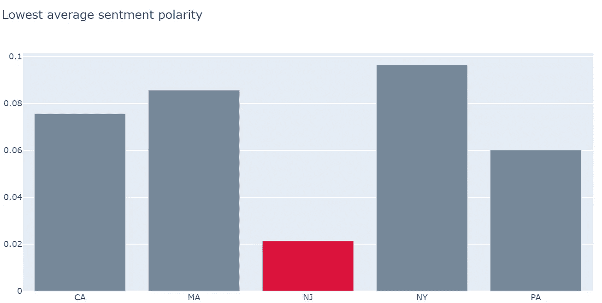

# “让美国重返工作岗位的计划”的文本挖掘评论

> 原文：<https://towardsdatascience.com/text-ming-comments-of-a-plan-to-get-america-back-to-work-ba82a843ebe7?source=collection_archive---------16----------------------->


戴夫·米库达在 [Unsplash](https://unsplash.com/s/photos/new-york-busy?utm_source=unsplash&utm_medium=referral&utm_content=creditCopyText) 上拍摄的照片

## 经济，公共卫生，冠状病毒，NLP

上周, [**、托马斯·L·弗里德曼**](https://www.nytimes.com/by/thomas-l-friedman)**在《纽约时报》上发表的一篇文章引起了我的兴趣:“让美国重返工作岗位的计划”。它提倡对新冠肺炎疫情采取数据驱动的方法:也就是说，限制冠状病毒的感染和死亡人数，同时根据最佳数据和专家建议，最大限度地加快我们安全地让工人重返工作场所的速度。**

**在另一篇专栏文章中，他提供了如何逐步完成这一任务的详细计划。**

**我很想知道他的读者是如何看待这件事的，所以我决定对这个专栏的评论做一个文本分析:[一个让美国恢复工作的计划](https://www.nytimes.com/2020/03/22/opinion/coronavirus-economy.html)。在我准备这篇文章的时候，我已经得到了 1000 多条评论。[数据](https://raw.githubusercontent.com/susanli2016/NLP-with-Python/master/data/comment_backToWork.csv)可以在[这里](https://raw.githubusercontent.com/susanli2016/NLP-with-Python/master/data/comment_backToWork.csv)找到，随意摆弄。**

## **数据预处理**

**comment_preprocessing.py**

****

**图 1**

*   **在 state 列中，有些是完整的州名，有些是缩写。我们将把它们转换成缩写。**
*   **一些用户没有标明他们来自哪个州，只标明美国。来自加拿大任何一个省的用户都会被归类到加拿大。**
*   **下面这段代码是从 [Python 字典里借来的，用来把美国各州翻译成两个字母的代码](https://gist.github.com/rogerallen/1583593)。**

**state_abbrev.py**

**电子设计自动化(Electronic Design Automation)**

**state_group.py**

****

**图 2**

**加州有最多的读者在评论区发表意见，紧随其后的是纽约。马萨诸塞州、宾夕法尼亚州和新泽西州稍微落后一些。**

**comment_len.py**

****

**图 3**

*   **在上面的分布图中，我们可以看到评论长度是一个右螺旋分布，在平均值的两边有很多峰值。**
*   **概率密度峰值在 50 个词左右。然而，一些评论可以短到不到 10 个字，而另一些评论可以长到略少于 300 个字。**

**注释 _ 状态 _ 长度. py**

****

**图 4**

**前五个州的评论长度分布非常相似。**

**comment_word.py**

****

**图 5**

**不出意外，评论中最常用的词是“人、病毒、经济”等等。**

**comment_bigram.py**

****

**图 5**

*   **从评论中的热门人物，我们可以看到，人们普遍更关心的是健康而不是经济。**
*   **他们中的一些人认为这种方法是群体免疫。**
*   **他们中的一些人羡慕韩国的成功。**
*   **他们中的许多人表达了他们对疾病致死率的不确定性。**

**我们将使用 [TextBlob](https://textblob.readthedocs.io/en/dev/) 来计算情绪极性，该极性位于[-1，1]的范围内，其中 1 表示积极情绪，-1 表示消极情绪。**

**comment_polarity.py**

****

**图 6**

*   **从上面的图中，我们可以看到情绪极性分布看起来接近正态分布。**
*   **还有一个接近 0 的显著峰值，和另一个接近 0.1 的峰值。这表明评论一般倾向于使用简单的语言。**
*   **平均情绪极性为 0.077，处于低位。**

**polarity_state.py**

****

**图 7**

**看起来新泽西州读者的情绪极性分布有点偏左。**

**avg_polarity.py**

****

**图 8**

**果然，新泽西州读者的评论平均情绪极性得分最低。在某种程度上，我们在新泽西没有纽约或加州那么多的读者评论。**

## **Word2vec**

**我们将使用 [Gensim](https://radimrehurek.com/gensim/models/word2vec.html) 来训练 word2vec 嵌入评论。关于每行代码如何工作的详细解释可以在[另一篇文章](/understanding-word2vec-embedding-in-practice-3e9b8985953)中找到。**

**comment_w2v.py**

**现在，我们可以试着找出与“人”最相似的词:**

```
w2v_model.wv.most_similar(positive=['people'])
```

****

**图 9**

**找出与“病毒”最相似的单词:**

```
w2v_model.wv.most_similar(positive=['virus'])
```

****

**图 10**

**找出与“经济”最相似的单词:**

```
w2v_model.wv.most_similar(positive=['economy'])
```

****

**图 11**

**有趣的是，“健康”和“经济”之间有多么相似:**

```
w2v_model.wv.similarity('health', 'economy')
```

****

# **主成分分析**

**PCA 是一种降维方法，它采用几个维度的向量并将其压缩成一个更小的向量，同时保留原始向量中的大部分信息。**

**我们将使用 PCA 来可视化以下 12 个关键词向量。**

**comment_pca.py**

****

**图 12**

1.  **“经济”、“工作”、“风险”、“传染”等词汇在情节底部形成一簇，表示它们经常一起使用。这是有道理的，因为经济与人们承担被感染的风险密切相关。**
2.  **“健康”和“护理”这两个词都在图的右端，因为它们经常一起使用。**
3.  **“接近”、“测试”、“病毒”和“需要”这几个词在剧情中间形成一簇，表示它们经常一起使用。**

## **结束了**

*   **综上所述，许多发表意见的读者认为，为了实施这样一个恢复工作的计划，需要进行积极的大规模测试作为基础。**
*   **许多发表意见的读者认为该计划可能会将人们置于危险之中。**
*   **鉴于目前的情况，大多数发表意见的读者听起来并不乐观或积极。**

**[Jupyter 笔记本](https://github.com/susanli2016/NLP-with-Python/blob/master/Comment_backToWork.ipynb)可以在 GitHub 上找到。保持安全和健康。**