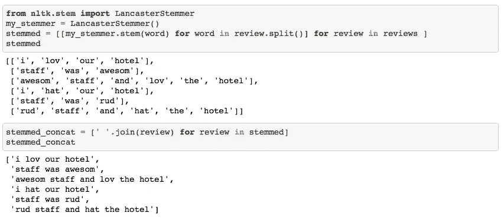

# 虚拟文本挖掘:用 Python 进行情感分析

> 原文：<https://towardsdatascience.com/text-mining-for-dummies-text-classification-with-python-98e47c3a9deb?source=collection_archive---------20----------------------->

## 20 行代码中任何 NLP 项目的通用步骤

这篇短文展示了任何文本挖掘项目的一般步骤。如果你想用笔记本来记录，你可以从 [**这里的**](https://jooskorstanje.com/Text_mining_for_dummies.html) 拿到笔记本。

这个目标不是给出文本挖掘的详尽概述，而是快速启动您的思维，并给出进一步增强的想法。

**第一步:数据**
出于教学目的，我们从一个非常非常小的 6 篇评论的数据集开始。数据通常来自网络搜集评论网站，因为它们是同时具有原始文本和数字评估的良好数据源。

**第 2 步:数据准备**
数据通常需要比本例中更多的清理，例如 regex 或 python 字符串操作。

文本挖掘的真正挑战是将文本转换成数字数据。这通常分两步完成:

*   词干化/词目化:将所有单词还原到它们的“基本形式”,以使单词计数更容易
*   矢量化:应用基于字数的算法(更高级)
*   在这个例子中，我使用了一个 LancasterStemmer 和一个 CountVecotrizer，这是众所周知且易于使用的方法。

**步骤 2a: LancasterStemmer 将单词恢复到它们的基本形式**

**步骤 2b:count vectorizer 应用单词包(基本上是单词计数)进行矢量化(这意味着将文本数据转换为数字数据)**

**第三步:机器学习**
既然文本已经被转换成数字数据，就使用任何你可以对常规数据使用的方法吧！

我希望这个简短的例子对你的旅程有所帮助。不要犹豫，在评论中提出任何问题。感谢阅读！

完整笔记本链接:[**在这里。**](http://jooskorstanje.com/Text_mining_for_dummies.html)