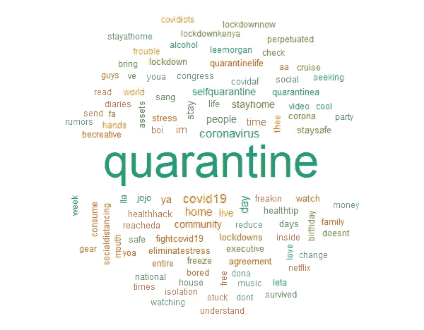
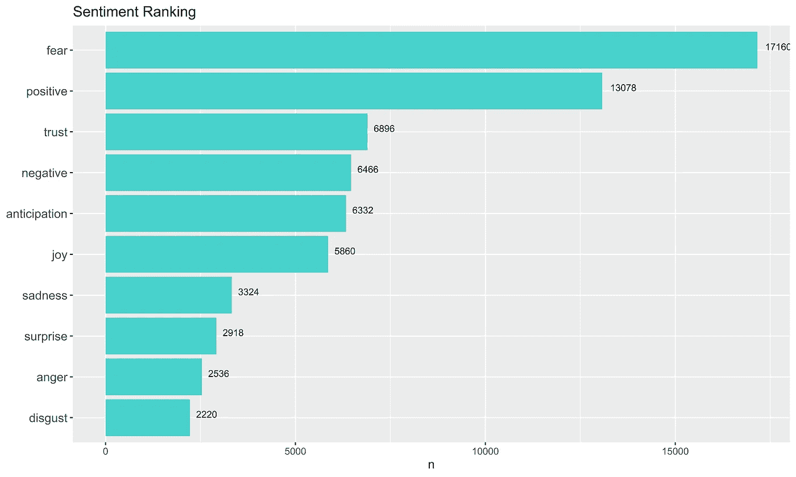

# 文本挖掘:冠状病毒隔离期间，人们在家做什么？

> 原文：<https://towardsdatascience.com/text-mining-what-are-people-doing-at-home-during-the-coronavirus-quarantine-77511172b72e?source=collection_archive---------18----------------------->

## 对人们在冠状病毒封锁期间的所作所为和感受的探索性和感性分析


莎伦·麦卡琴在 [Unsplash](https://unsplash.com?utm_source=medium&utm_medium=referral) 上的照片

随着越来越多的国家宣布全国范围的关闭，大多数人被要求呆在家里并被隔离。我想知道在这个“关闭”期间，人们是如何度过时间的，他们的感受是什么，所以我分析了这篇文章中的一些推文，希望这些数据能给我一些启示。

## 导入和预处理数据集

对于数据集，我使用 twitteR 库从 Twitter 中提取了 20，000 条带有“#quarantine”和“#stayhome”标签的推文。

在将数据导入 R 之后，我们需要对 tweets 进行预处理并将其标记为单词(标记)以供分析

```
tweet_words <- tweets %>%
  select(id,
         screenName,
         text,
         created) %>%
  mutate(created_date = as.POSIXct(created, format="%m/%d/%Y %H")) %>%
  mutate(text = replace_non_ascii(text, replacement = "", remove.nonconverted = TRUE)) %>%
  mutate(text = str_replace_all(text, regex("@\\w+"),"" )) %>%
  mutate(text = str_replace_all(text, regex("[[:punct:]]"),"" )) %>%
  mutate(text = str_replace_all(text, regex("http\\w+"),"" )) %>%
  unnest_tokens(word, text)
```

## 从数据集中移除常用(停用)词

在对数据集进行标记化和预处理后，我们需要删除停用词，如“for”、“the”、“an”等。对分析没用的。

```
**#Remove stop words**
my_stop_words <- tibble(
  word = c(
    "https","t.co","rt","amp","rstats","gt",
    "cent","aaya","ia","aayaa","aayaaaayaa","aaaya"
  ),
  lexicon = "twitter"
)**#Prepare stop words tibble**
all_stop_words <- stop_words %>%
  bind_rows(my_stop_words)**#Remove numbers**
suppressWarnings({
  no_numbers <- tweet_words %>%
    filter(is.na(as.numeric(word)))
})**#Anti-join the stop words and tweets tibbles**
no_stop_words <- no_numbers %>%
  anti_join(all_stop_words, by = "word")
```

我们还可以使用下面的代码快速检查一下从数据集中删除了多少停用词:

```
tibble(
  total_words = nrow(tweet_words),
  after_cleanup = nrow(no_stop_words)
)
```

结果会是这样的:


右边的数字(155，940)是去掉停用词后剩下的令牌数。

此时，我们的数据集应该是干净的，可以进行分析了！

## 词频分析

进行文本挖掘的一种常见方法是查看词频。首先，让我们看看我们的推文中最常见的一些词。



单字单词云

排名前五的单词是:

*   隔离—出现 13358 次
*   covid 19–出现了 1628 次
*   冠状病毒——出现了 1566 次
*   日—出现了 1200 次
*   家——出现了 1122 次

显然，隔离与冠状病毒/新冠肺炎疫情有关，人们都呆在家里以避免接触病毒。

```
**Unigram word cloud**
no_stop_words %>%
  count(word) %>%
  with(wordcloud(word, n, max.words = 100, random.order = FALSE,scale=c(4,0.7), 
colors=brewer.pal(8, "Dark2"),random.color = TRUE))
```

## 最常见的积极和消极的话

获得词频后，我们可以使用“NRC”词典给每个单词分配一个标签(正面或负面)。然后，我们可以创建一个词云标签。


最常见的正面词和负面词的词云

从云这个词我们知道，在这个隔离期，大部分人都是压力大，无聊的。但从好的方面来看，我们也了解到人们正在发出善意的信息，告诉他人保持安全和健康。

```
**#Positive and negative terms word cloud**
no_stop_words %>%
  inner_join(get_sentiments("bing"), by = c("word" = "word")) %>%
  count(word, sentiment, sort = TRUE) %>%
  acast(word ~ sentiment, value.var = "n", fill = 0) %>%
  comparison.cloud(colors = brewer.pal(2, "Dark2"),
                   max.words = 100)
```

## 情感分析

情感分析帮助我们从文本数据中识别表达的文本和观点。它帮助我们理解人们对某一特定话题的态度和感受。



提取的推文的情感排名

虽然人们担心冠状病毒，但我们大多数人都保持乐观。令人惊讶的是，在隔离期间，人们发的积极词汇比消极词汇多。

```
**#Sentiment ranking**
nrc_words <- no_stop_words %>%
  inner_join(get_sentiments("nrc"), by = "word")sentiments_rank <- nrc_words %>%
  group_by(sentiment) %>%
  tally %>%
  arrange(desc(n))**#ggplot** sentiments_rank %>%
  #count(sentiment, sort = TRUE) %>%
  #filter(n > 700) %>%
  mutate(sentiment = reorder(sentiment, n)) %>%
  ggplot(aes(sentiment, n)) +
  geom_col(fill = "mediumturquoise") +
  xlab(NULL) +
  coord_flip() +
  ggtitle("Sentiment Ranking") +
  geom_text(aes(x = sentiment, label = n), vjust = 0, hjust = -0.3, size = 3)
```

## 情感内省——弄清人们的情感

通过使用“NRC”词典，我们还可以将这些词分为八种情绪类型以及积极和消极的术语。

分配标签后，我们可以将情感分组，并生成如下所示的词频图。还要注意的是，一些术语如音乐和金钱可以在多个情感标签下找到。


基于上述情感标签的几点见解:

*   在这段呆在家里的时间里，人们把自己推向金钱，(不)生日，音乐和艺术
*   人们在谈论什么政府:国会和协议

```
**#Ten types of emotion chart**
tweets_sentiment <- no_stop_words %>%
  inner_join(get_sentiments("nrc"), by = c("word" = "word"))tweets_sentiment %>%
  count(word, sentiment, sort = TRUE)**#ggplot**
tweets_sentiment %>%
 **# Count by word and sentiment**
  count(word, sentiment) %>%
  # Group by sentiment
  group_by(sentiment) %>%
  **# Take the top 10 words for each sentiment**
  top_n(10) %>%
  ungroup() %>%
  mutate(word = reorder(word, n)) %>%
  ggplot(aes(word, n, fill = sentiment)) +
  geom_col(show.legend = FALSE) +
  facet_wrap(~ sentiment, scales = "free") +
  coord_flip() +
  ggtitle("Word frequency based on emotion")
```

## 可视化单词关系

在进行文本挖掘时，单词关系的可视化很重要。通过将单词排列成“网络”图，我们可以看到单词在数据集中是如何相互连接的。

首先，我们需要将数据集标记为二元模型(两个单词)。然后，我们可以将单词排列成连接节点的组合，以便可视化。


“隔离”数据集的网络图

```
**#Tokenize the dataset into bigrams**
tweets_bigrams <- tweets %>%
  select(id,
  #       screenName,
         text,
         created) %>%
  mutate(created_date = as.POSIXct(created, format="%m/%d/%Y %H")) %>%
  mutate(text = replace_non_ascii(text, replacement = "", remove.nonconverted = TRUE)) %>%
  mutate(text = str_replace_all(text, regex("@\\w+"),"" )) %>%
  mutate(text = str_replace_all(text, regex("[[:punct:]]"),"" )) %>%
  mutate(text = str_replace_all(text, regex("http\\w+"),"" )) %>%
  unnest_tokens(bigram, text, token = "ngrams", n = 2)**#Separate the bigrams into unigrams**
bigrams_separated <- tweets_bigrams %>%
  separate(bigram, c("word1", "word2"), sep = " ")**#Remove stop words**
bigrams_filtered <- bigrams_separated %>%
  filter(!word1 %in% all_stop_words$word) %>%
  filter(!word2 %in% all_stop_words$word)**#Combine bigrams together**
bigrams_united <- bigrams_filtered %>%
  unite(bigram, word1, word2, sep = " ")
```

来自网络图的一些有趣见解:

*   隔离期间，人们在推特上写日记
*   在隔离期间，人们听李·摩根的爵士乐
*   在隔离期间，Jojo 的现场表演越来越受欢迎
*   自我隔离是对抗新冠肺炎的一种方式，人们对消除压力的健康窍门和技巧感兴趣

## 词语相关分析——那么人们对社交距离有什么感觉呢？

隔离或社会距离可能在情感上具有挑战性，我想更多地了解人们在这一时期的感受。

单词相关性使我们能够了解一对单词在一个数据集中出现的频率。它让我们对一个特定的单词及其与其他单词的联系有了更多的了解。

从单词 cloud 中，我们知道“压力”和“无聊”频繁出现在我们的数据集中。于是，我提取了三个词出来:“无聊”、“压力”、“卡住”来看看它的词关联。


隔离期间、待在家中期间的感觉的词相关性

从“无聊”、“压力”和“卡住”的词相关性得到的启示:

*   当人们感到无聊时，他们用抖音和游戏来消磨时间
*   无聊几乎概括了 2020 年大多数人的生活
*   封锁造成了压力，人们在网上寻找减轻压力的方法
*   当人们“被困”在家里时，他们会在网飞看恐怖电影/系列

## 单词相关性分析——那么，人们在家打发时间都在做什么呢？

为了了解在这段待在家里隔离的时间里，人们在家里做些什么来打发时间，我提取了三个词，“玩”、“读”和“看”，以获得更多的见解。


隔离期间和在家期间操作的单词相关性

从“玩”、“读”和“看”的词相关性得到的启示:

*   大多数人可能在家里玩游戏、看电影和视频来打发时间
*   人们花时间给他们的孩子读书
*   在此期间，人们也终于有时间阅读了

## 单词相关性分析—生日、金钱和社区…

三个词频繁出现在情绪标签表中，它们是“生日”、“社区”和“金钱”所以，我研究了这个词和其他词的关系。


从“生日”、“社区”和“金钱”的词相关性得到的启示:

*   生日派对取消了。相反，人们在推特上表达他们的愿望
*   人们同意金钱不能阻止我们感染病毒的观点

## 结论

在冠状病毒关闭期间，我们能够深入了解人们的感受以及他们在做什么，同时仍然遵循社交距离规则。

我们获得的一些主要见解包括:

*   人们对冠状病毒的情况感到紧张，但仍然保持乐观
*   Tiktok 和网飞在居家隔离期间被广泛使用
*   人们花更多的时间和孩子在一起，在艺术、音乐和电影上

大家呆在家里，注意安全！

***编者按:*** [*走向数据科学*](http://towardsdatascience.com/) *是一份以数据科学和机器学习研究为主的中型刊物。我们不是健康专家或流行病学家，本文的观点不应被解释为专业建议。想了解更多关于疫情冠状病毒的信息，可以点击* [*这里*](https://www.who.int/emergencies/diseases/novel-coronavirus-2019/situation-reports) *。*