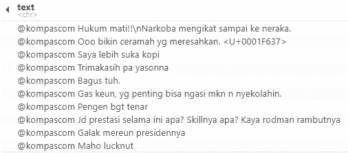
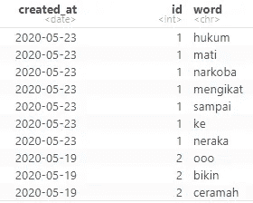

# 基于 R 的文本挖掘:收集和清理数据

> 原文：<https://towardsdatascience.com/text-mining-with-r-gathering-and-cleaning-data-8f8b0d65e67c?source=collection_archive---------23----------------------->


凯文·Ku 在 [Unsplash](https://unsplash.com/s/photos/code?utm_source=unsplash&utm_medium=referral&utm_content=creditCopyText) 上的照片

## 印度尼西亚最大媒体评论的推文案例研究。

T ext Mining 是挖掘基于文本格式的数据的过程。这个过程可以获取大量信息，例如人们正在谈论的话题，分析他们对某种话题的情绪，或者了解在给定时间哪些词使用频率最高。

Twitter 是印度尼西亚最受欢迎的社交媒体之一。我也是它的使用者之一。根据 Statcounter 的数据，印度尼西亚有 7.4%的人口在使用互联网。

Twitter 为人们提供了一个平台，在这里他们可以发表自己的意见，也可以根据自己的需要获取信息。这些推文包含大量有待发现的信息。因此，对于那些想要参与文本挖掘的人来说，Twitter 是一个很好的游乐场。

在这篇文章中，我将向你展示如何在 Twitter 上进行文本挖掘，特别是来自印度尼西亚最大的媒体之一 Kompas 的印度尼西亚网民的评论。本文只解释了如何使用 r 收集和清理数据。

在下一篇文章中，我将通过探索、情感分析和主题建模向您展示这些文本数据是如何包含大量信息的。

# **攻击计划**

在我向您展示如何进行文本挖掘之前，让我向您概述一下我们将会遇到的步骤:

1.  **使用 Twitter API 收集数据**
2.  **数据清理**
3.  **探索**
4.  **主题建模**
5.  **情感分析**

> 在这篇文章中，我将只向你展示第一步和第二步。其余的将在下一篇文章中讨论。

# **收集数据**

我们要做的第一步是从 Twitter 上收集数据。在你收集推文之前，你必须考虑一些方面，比如你想要达到的目标是什么，你想把推文带到哪里，是通过使用一些查询进行搜索还是从一些用户那里收集。

> 注意:确保您有访问 API 的 Twitter API 密钥。你可以在这里注册并阅读更多信息

在这种情况下，我们只想知道印度尼西亚网民给出的评论是什么，他们在谈论什么，以及推文中的情绪如何。

我们必须从新闻媒体账户获取评论的原因是，他们的评论涉及广泛的话题，而且他们的垃圾推文较少。

我所说的垃圾推文，例如使用某种标签但不谈论它的推文，或者换句话说，断章取义的推文。

基于这个目标，我们将从账户的提及中收集推文，该账户的用户名是 kompascom。如果我们只想获取对它的回复，我们可以使用一个特殊的关键字，即 to: <username here="">。就像下面这段代码一样，</username>

```
**# Import the library**
library(rtweet)**# Note: Use your own token** 
twitter_token <- create_token(
  app = appname,
  consumer_key = key,
  consumer_secret = secret,
  access_token = "xxx",
  access_secret = "xxx"
)**# Search the tweets**
news_tweets <- search_tweets("to:kompascom", n = 18000, include_rts = F)**# Select specific columns only**
data_fix <- news_tweets %>%
              # Remove Duplicate
              distinct(text, .keep_all = T) %>%
              # Take The Text Only
              select(created_at, text)**# Create id column as the tweet identifier** data_fix["id"] <- 1:nrow(data_fix)**# Convert the created_at to date format**
data_fix$created_at <- as.Date(data_fix$created_at, format = "%Y-%m-%d") 
```

在这种情况下，我们将获取大约 18000 条回复用户名的推文。运行代码后，我们得到了大约 16746 条推文和 90 个专栏。我们不会使用所有的专栏，相反，我们只从推文中选择日期和文本，并且我们还会删除彼此重复的推文。此外，我们必须创建一个 id 列作为 tweet 的标识符。因此，我们将有 16418 条推文和 3 个专栏。

# 数据清理

数据清理是一个重要的步骤，比文本挖掘中的任何步骤都要花费更多的时间。它之所以重要，是因为我们要删除对其意义没有任何影响的单词和符号。这里有一些还不干净的推文的例子，



从上面我们可以看到，一些推文中包含了我们移除的单词和符号，比如提及(即@ kompascom)、hashtags(即#COVID19)、转义序列(即\n)、UTF 符号(即)等等。

除此之外，我们必须删除对 tweet 的语义没有任何影响的词，我们称之为停用词。印度尼西亚语中的停用词的例子有 tidak、ya、bukan、karena、untuk 等等。对于停用词，我们将使用这个 GitHub 资源库，您可以在这里 下载[。](https://github.com/safieranurul/Cleaning-Text-Bahasa-Indonesia/blob/master/ID-Stopwords.txt)

当我们清理推文时，还有一个额外的挑战需要我们去做。大多数印尼人写推文时会缩短，有很多单词，但意思是一样的。

例如，在印度尼西亚语中，如果我们想说“不”，我们会说“tidak”。这个单词有很多书写形式，有“tak”，“ga”，“gak”，甚至他们会使用额外的字母来强调这个单词，如“tidakkkk”。这会让那些想用印尼语分析推文的人头疼。

正因为如此，我们没有任何快速的方法来清理它，所以我们必须给一些时间来做它。

> 边注，为了使我们的工作更容易，我们不会删除有附加字母的单词，相反，我们只删除停用词和符号。这是因为这个词不经常出现，所以我们分析这个的时候就忽略了。

这是我们将要使用的代码，

```
**# Get the text column**
text <- data_fix$text**# Set the text to lowercase**
text <- tolower(text)**# Remove mentions, urls, emojis, numbers, punctuations, etc.**
text <- gsub("@\\w+", "", text)
text <- gsub("https?://.+", "", text)
text <- gsub("\\d+\\w*\\d*", "", text)
text <- gsub("#\\w+", "", text)
text <- gsub("[^\x01-\x7F]", "", text)
text <- gsub("[[:punct:]]", " ", text)**# Remove spaces and newlines**
text <- gsub("\n", " ", text)
text <- gsub("^\\s+", "", text)
text <- gsub("\\s+$", "", text)
text <- gsub("[ |\t]+", " ", text)**# Put the data to a new column**
data_fix["fix_text"] <- text
head(data_fix$fix_text, 10)
```

你可能会对 gsub 函数的工作原理感到困惑。让我给你解释一下。gsub 函数有 3 个参数，它们是使用正则表达式的单词和符号的模式，对它的替换，然后是我们想要处理的字符串或向量。

正则表达式基本上是一种寻找某种格式的单词的模式。在这个例子中，如果您想要删除提及，那么这个模式将看起来像' @\\w+'，其中@是这个模式的开始。然后\\w 标记每个单词字符，范围从 a-z、A-Z 到数字，如 0-9。最后，+表示向它显示一个或多个字符。如果它与模式匹配，那么该单词将被替换为给定的单词或空字符串。

此外，我们必须清理文本，我们必须把它变成一个整洁的数据格式，我们还必须删除停用词。代码看起来像这样，

```
library(tidytext)**# Remove Stopwords**
stop_id <- scan(paste(getwd(), "/stopwords-id.txt", sep=""), character(), sep="\n")**# Create dataframe of the stop words**
stop_words <- data.frame(
  word <- stop_id,
  stringsAsFactors = F
)
colnames(stop_words) <- "word"**# Convert to tidy format**
tidy_text <- data_fix %>%
  select(created_at, id, fix_text) %>%
  **# Tokenize the word from the tweets**
  unnest_tokens(input = fix_text, output = word) %>%
  **# Remove stop words**
  anti_join(stop_words, by="word")
```

在我们清理和整理推文之后，这是它看起来的样子，



有了这些，我们就可以继续探索它了。

# **结论**

总之，Twitter 是分析文本数据的一个很好的数据集。我们可以从它那里获得很多信息，比如分析它的情绪，知道谈论的话题，等等。印度尼西亚是推特的最大用户之一。因此，有大量的信息需要挖掘和分析。

除了它的潜力，还有一些障碍来分析印尼推文，特别是俚语。正因为如此，我们必须解决分析印度尼西亚推文的公开挑战，以使信息更有价值。

# 参考

[1] *印尼社交媒体统计*。【https://gs.statcounter.com/social-media-stats/all/indonesia
【2】西尔格，j .和罗宾逊，D. *用 R: A Tidy 方法进行文本挖掘* (2017)。奥赖利媒体公司。