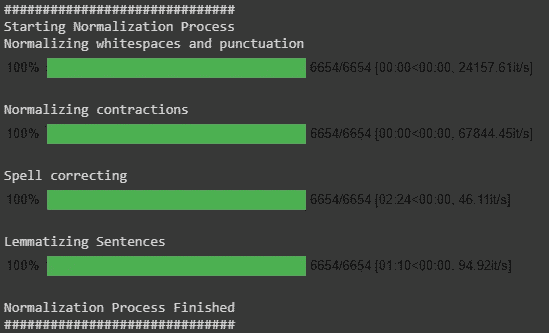
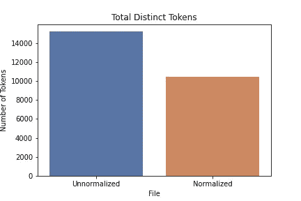
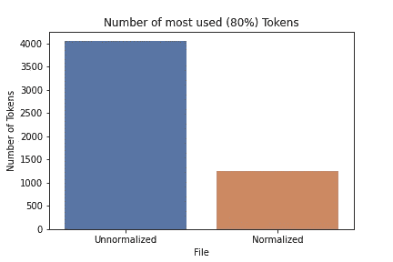
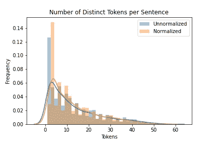
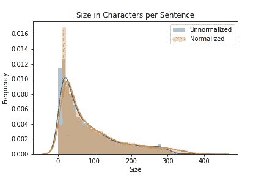
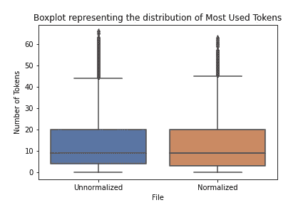
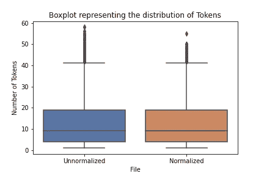

# 文本规范化

> 原文：<https://towardsdatascience.com/text-normalization-7ecc8e084e31?source=collection_archive---------8----------------------->


图片由来自 Unsplash 的 [Markus Winkler 提供，由作者编辑。](https://unsplash.com/photos/cxoR55-bels)

## 为什么，什么，怎么做

在[的前几篇文章](https://medium.com/@tfduque/dissecting-natural-language-processing-layer-by-layer-an-introductory-overview-d11cfff4f329)中，我们花了一些时间解释和实现 NLP 中一些最重要的预处理技术。然而，我们在真实的文本情境中玩得太少了。现在是时候做点工作了。

我们在关于词干的文章中讨论了文本规范化。然而，词干并不是文本规范化中最重要的(甚至是最常用的)任务。我们前面还介绍了其他一些规范化技术，如 [**标记化**](https://medium.com/analytics-vidhya/tokenization-building-a-tokenizer-and-a-sentencizer-c19a00393c19)**[**句子化**](https://medium.com/analytics-vidhya/building-a-stemmer-492e9a128e84) **和** [**词汇化**](https://medium.com/analytics-vidhya/how-to-build-a-lemmatizer-7aeff7a1208c) 。但是还有其他一些小任务用来完成这个重要的预处理步骤，这些将在本文中讨论。**

**请记住，没有适用于所有情况的“正确的”标准化任务集或列表。事实上，随着我们对 NLP 研究的深入，我们越来越了解 NLP 并不像人们想象的那样普遍。虽然有许多有趣的通用工具箱和预制管道，但更精确的系统是那些根据环境量身定制的系统。**

**因此，请不要把本文中列出的规范化步骤当作硬性规则，而是作为进行文本规范化的指南。同样重要的是要指出，在一些罕见的情况下，您可能不希望对输入进行规范化—在这些情况下，更多的变化和错误是重要的或至关重要的(例如，考虑测试校正算法)。**

# **了解我们的目标—为什么我们需要标准化**

**让我们从清楚地定义我们想要使用规范化技术的地方开始。自然语言作为一种人类资源，往往遵循其创造者随机性的内在本质。这意味着，当我们“生产”自然语言时，我们将随机状态印入其中。计算机不太擅长处理随机性(尽管这一点正随着机器学习算法的使用而最小化)。**

**当我们规范化一个自然语言资源时，我们试图减少其中的随机性，使它更接近预定义的“标准”。这有助于减少计算机必须处理的不同信息量，从而提高效率。**

****

**通过标准化，我们希望使“文本分布”更接近“正态”分布。图片取自[维基百科](https://pt.wikipedia.org/wiki/Distribui%C3%A7%C3%A3o_normal#/media/Ficheiro:Normal_Distribution_PDF.svg)。**

> **当我们规范化一个自然语言资源时，我们试图减少其中的随机性**

**在那篇关于词干的文章中，我提到规范化试图使事物更接近“正态分布”。从某种意义上说，当我们对自然语言输入进行规范化时，我们希望让事情“如预期的那样”，以“良好”和“可预测”的形式进行，就像遵循正态分布的概率分布一样。**

**撇开数学不谈，我们可以讨论一下将输入归一化到我们的 NLP 系统中的**好处**。**

**首先，通过减少变化，我们有更少的输入变量需要处理，提高了整体性能并避免了错误否定(想象一下软件日志行如果没有输入错误就会触发警告的情况)。对于专家系统和信息检索任务来说，这是非常正确的(想象一下，如果谷歌的搜索引擎只匹配你输入的精确单词！).**

****

**在某种意义上，标准化可以比作“去除锐边”。图片来自国会大厦的[建筑师。](https://www.aoc.gov/explore-capitol-campus/blog/two-thumbs-taking-edge)**

**第二，特别是在谈论机器学习算法时，如果我们使用简单的旧结构，如单词包或 TF-IDF 字典，规范化会减少输入的维数；或者降低创建嵌入所需的处理量。**

**第三，规范化有助于在密码破译输入被传递到我们的决策 NLP 算法之前对其进行处理。在这种情况下，我们确保我们的输入在被处理之前遵循“契约”。**

**最后，如果做得正确，归一化对于从我们的自然语言输入中可靠地提取统计数据是非常重要的——就像在其他领域(如时间序列分析)一样，归一化对于 NLP 数据科学家/分析师/工程师来说是重要的一步。**

# **我们想让什么正常化？**

**这是一个重要的问题。在做文本规格化的时候，我们要确切的知道我们要规格化什么，为什么要规格化。此外，输入的目的有助于形成我们将要应用的标准化输入的步骤。我们对标准化最感兴趣的有两件事:**

*   ****句子结构:**是否应该总是以一个标点符号结尾？可以有重复的标点符号吗？我们应该去掉所有的标点符号吗？此外，可以使用更具体的结构(如达到主语动词宾语)，但更难实现。**
*   **T2:这是需要注意的核心问题之一。大多数时候，我们希望自己的词汇量越小越好。原因是，在 NLP 中，单词是我们的关键特征，当我们在这些方面的变化较少时，我们可以更好地实现我们的目标。**

**在实践中，我们可以通过分解成更简单的问题来对这两个方面进行规范化。以下是最常见的一些:**

> **→删除重复的空格和标点符号。**
> 
> **→去除重音符号(如果您的数据包含“外国”语言的发音符号，这有助于减少与编码类型相关的错误)。**
> 
> **→去除大写字母(通常，使用小写单词会产生更好的结果。然而，在某些情况下，大写字母对于提取信息非常重要，比如姓名和地点)。**
> 
> **→移除或替换特殊字符/表情符号(例如:移除标签)。**
> 
> **→缩写的替代(英语中很常见；例如:“我是”→“我是”)。**
> 
> **→将单词数字转换成数字(例如:“23”→“23”)。**
> 
> **→替换其类型的值(例如:“50 美元”→“钱”)。**
> 
> **→缩略词规范化(如:“US”→“United States”/“U . s . a”)和缩写规范化(如:“btw”→“by the way”)。**
> 
> **→标准化日期格式、社会安全号码或其他具有标准格式的数据。**
> 
> **→拼写纠正(可以说一个单词可以有无限种拼写错误的方式，因此拼写纠正通过“纠正”来减少词汇的变化)——如果您正在处理开放的用户输入，如推文、即时消息和电子邮件，这非常重要。**
> 
> **→通过词干化或词条化去除性别/时间/年级变化。**
> 
> **→用生僻字代替较常见的同义词。**
> 
> **→停止单词去除(与其说是一种归一化技术，不如说是一种降维技术，但为了方便提及，我们把它留在这里)。**

**在本文中，我将只讨论其中一些的实现。**

# **怎么做正规化**

**为了选择我们将要使用的标准化步骤，我们需要一个特定的任务。对于本文，我们将假设我们想要提取 2020 年 3 月底期间提取的一组 3000 条推文对*# cov 白痴*标签的情绪，以了解世界各地的人们对新冠肺炎疫情的行为。**

**我提前得到了这些推文，可以在这里下载。我还继续使用这个名为[better-promaly](https://pypi.org/project/better-profanity/)的漂亮工具检查文本中的诅咒，如果你愿意，可以将它添加到你的规范化管道中。它们也不包含写内容的人。**

**然而，我没有继续努力删除每条推文中的名字或检查任何政治立场、假货等，因为这不是本文的目的，可能需要另一整篇文章(关于自动审查)。**

*****我想澄清的是，我对推文的内容不承担任何责任，因为它们是由作者在决定在 twitter 上发布他们的言论的那一刻有意识地公开的。我刚刚批量下载了微博。考虑到这一点，让我们继续(下面是一篇介绍如何使用 python 挖掘推文的好文章的链接)。*****

**[](https://www.earthdatascience.org/courses/earth-analytics-python/using-apis-natural-language-processing-twitter/get-and-use-twitter-data-in-python/) [## 使用 Tweepy 在 Python 中获取和使用 Twitter 数据

### 完成本教程后，您将能够:连接到 twitter RESTful API，使用…

www.earthdatascience.org](https://www.earthdatascience.org/courses/earth-analytics-python/using-apis-natural-language-processing-twitter/get-and-use-twitter-data-in-python/) 

特别是对于这种情况，我们想要应用以下步骤:**去除重复的空白和标点符号；收缩的替代；拼写更正。同样，我们已经讨论过** [**词汇化**](https://medium.com/analytics-vidhya/how-to-build-a-lemmatizer-7aeff7a1208c) 。所以，我们正在使用它。

在我们完成代码部分之后，我们将对应用上述规范化步骤的结果进行统计分析。

关于规范化的一个重要的事情是**函数的顺序很重要**。我们可以说规范化是 NLP 预处理管道中的一个管道。如果不小心，我们可能会删除对后续步骤很重要的信息(比如在 lemmatizing 之前删除停用词)。


就像在生产线上一样，标准化步骤的顺序很重要。图片由 Pinterest 的 [Pattama Pon](https://br.pinterest.com/pin/456833955944489156/) 提供。

我们甚至可以将这些步骤分成两个连续的组:*“预标记化* *步骤】*(用于修改句子结构的步骤)和*“后标记化步骤”(*用于仅修改单个标记的步骤 *)* ，以避免重复标记化步骤。然而，为了简单起见，我们使用一个简单的。split()函数。

在我们将 tweets 解析成字符串列表后，我们可以开始创建函数了。*顺便说一句，我在列表周围使用了这个叫做 tqdm 的漂亮模块，所以一旦我们应用了标准化过程，我们就有了漂亮的进度条*。以下是需要的导入:

```
from symspellpy.symspellpy import SymSpell, Verbosity
import pkg_resources
import re, string, json
import spacy
from tqdm import tqdm
#Or, for jupyter notebooks:
#from tqdm.notebook import tqdm
```

## *删除重复的空格和重复的标点符号(和 URL):*

*   完成简单的正则表达式替换。还有改进的空间，但是做到了我们所期望的(这样，我们就不会有多种尺寸的沉默和感叹号标记)。我们删除了 URL，因为这大大减少了我们拥有的不同标记的数量(我们首先这样做，因为标点替换可能会杀死它)。

## 缩写的替代:

*   使用来自维基百科的缩写列表，我们遍历句子，并用缩写替换它们的实际单词(这得益于在标记化之前发生，因为一个标记被分成两个)。这有助于以后更好地构建句子。名单可以从[这里](https://gist.githubusercontent.com/Sirsirious/c70400176a4532899a483e06d72cf99e/raw/e46fa7620c4f378f5bf39608b45cddad7ff447a4/english_contractions.json)下载。

## 拼写更正:

*   这是一个棘手的问题。这可能(并且将会)导致一些不必要的变化(大多数拼写纠正词典缺少重要的上下文单词，因此它们被认为是拼写错误)。所以你要有意识地使用它。做这件事有许多方法。我选择使用一个名为 [symspellpy](https://pypi.org/project/symspellpy/) 的模块，它真的很快(这很重要！)而且工作做得相当不错。另一种方法是[训练一个深度学习模型，根据上下文进行拼写纠正](https://medium.com/@thomasdecaux/build-a-spell-checker-with-word2vec-data-with-python-5438a9343afd)，但这完全是另一回事。

## 词汇化:

*   如果您一直关注我的系列文章，那么您应该知道我已经实现了自己的 lemmatizer。然而，为了简单起见，我在这里选择使用 good old spaCy。它既快速又简单，但是您可以使用任何您想要的其他工具。我还决定删除(替换)任何标签，并在这里提及。对于情感分析，我们并不真的需要它们。

最后，我们将所有步骤连接在一个“管道”功能中:



在 Google Colab 笔记本上运行的规范化管道。图片作者。

# 结果

所以，你可能想知道:应用这些任务的结果是什么？我运行了一些计数函数并绘制了一些图表来帮助解释，但我必须明确一件事:**数字不是表达文本规范化**重要性的最佳方式。

相反，当应用于下游 NLP 应用程序时，文本规范化通过提高效率、准确性和其他相关分数来发挥其最佳作用。我会指出一些我们可以通过统计数据清楚看到的好处。

首先，我们可以清楚地看到不同令牌的总数减少了。在这个具体的例子中，我们减少了大约 32%的令牌数量。



在对我们的数据进行标准化之后，我们将令牌的数量减少了大约 32%。图片作者。

```
Distinct words in unnormalized: 15233–80% of the text correspond to 4053 distinct words. 
Distinct words in normalized: 10437–80% of the text correspond to 1251 distinct words.
```

现在，一个更大的不同发生在普通令牌的数量上。这些记号是对应于所有记号的大约 80%的记号。通常，我们有大约 10-20%的标记，占文本的 80%。

通过应用标准化，**我们将最常见的令牌数量减少了 69%** ！太多了！这也意味着，我们插入这些数据的任何机器学习技术都将能够更好地推广。



归一化后，最常见的标记数减少了 69%。图片作者。

现在，关于文本规范化的一件重要的事情是，为了使它有用，规范化的文本必须保留默认的自然语言结构。我们可以从数据分布本身看出这一点。一个例子是，如果做得好，规范化后句子不会小很多，也不会大很多。

这呈现在下面的直方图中，直方图表明，虽然归一化后 1 大小的句子较少，2 大小的句子较多，但分布的其余部分遵循未归一化数据的结构(另外，请注意，我们的曲线倾向于稍微接近正态分布曲线)。



标准化对整个句子结构几乎没有影响。图片作者。

另一个帮助我们形象化的工具是[箱线图](https://blog.bioturing.com/2018/05/22/how-to-compare-box-plots/)。它显示了我们的数据是如何分布的，包括平均值、四分位数和异常值。总之，我们希望我们的中线与非标准化数据的中线相同(或接近)。我们还希望我们的盒子(大部分数据的分布)保持在类似的位置。如果我们能够增加盒子的大小，这意味着我们在中位数周围的数据比标准化之前更多(这是好的)。此外，我们希望减少离群点(那些在我们胡须范围之外的点)。



在标准化之后，我们能够增加四分位范围(大多数标记所在的位置)。我们也保持了相同的中线，减少了异常值。这意味着我们没有破坏我们的文本，但使它不那么复杂=)。图片作者。

如果您想了解我是如何实现这些结果的，同时能够访问和运行我上面提到的所有代码，请查看下面的 Colab 笔记本:

[](https://colab.research.google.com/drive/1U_C_4wAtlWQdaA84yVwHUCdkvQWEd7r9) [## 谷歌联合实验室

### NLP 系列—文本规范化

colab.research.google.com](https://colab.research.google.com/drive/1U_C_4wAtlWQdaA84yVwHUCdkvQWEd7r9) 

# 结论

在这篇文章中，我希望能够解释什么是文本规范化，为什么我们应该这样做，以及如何去做。此外，我试图提出一些证明，证明它的工作(没有提出它的好处)。

如果您一直在关注这个系列，并且在问自己关于我正在开发的工具集，以及我是否给它添加了规范化，那么答案是肯定的！我只是没有在这里使用它，以使它更容易解释。但简而言之，我添加了一些功能，允许(大部分)提到的规范化步骤直接应用于我们的文档或句子结构(并使用我们之前开发的标记化工具)。

您可以通过查看以下提交的状态来了解我的情况:

[](https://github.com/Sirsirious/NLPTools/tree/1c2e3efd740f1ede57d316d8f4edf18cce295103) [## 各种/各种工具

### 在我的中级 NLP 解释系列中创建的一组 NLP 工具。-先生/女士

github.com](https://github.com/Sirsirious/NLPTools/tree/1c2e3efd740f1ede57d316d8f4edf18cce295103) 

现在我们有了许多工具，我们必须开始应用它们。但是在此之前， [**如何才能将文本转化为特征供机器学习算法使用**](https://tfduque.medium.com/how-to-turn-text-into-features-478b57632e99) ？这是下一篇文章的题目！

## 这里有几个链接和一份额外研究文件:

 [## 文本规范化

### 它是 NLP 管道的一部分，用于预处理文本数据规范化=将一些语言模型应用于…

mlwiki.org](http://mlwiki.org/index.php/Text_Normalization) [](https://www.aclweb.org/anthology/W18-3902/) [## 文本标准化的编码器-解码器方法

### 摘要文本规范化的任务是映射非规范语言，典型的语音转录和…

www.aclweb.org](https://www.aclweb.org/anthology/W18-3902/)**