# 基于数据描述的文本预处理

> 原文：<https://towardsdatascience.com/text-preprocessing-with-data-describe-7ba175cf8447?source=collection_archive---------43----------------------->

## 使用新的 Python EDA 包清理杂乱和无结构的文本


图片来自 [Unsplash](https://unsplash.com/photos/HeNrEdA4Zp4)

有没有像无结构文字这么乱的东西？大概不会。无论是谁发明了大写字母、标点符号和停用词，显然都没有考虑到这些东西对主题建模的影响，而只关心它们对人类的可读性。他们真不体谅人。足够幸运的是，我们不必费力地清理我们自己的非结构化文本，因为我们之前的人已经编写了工具，可以让我们轻松地做到这一点。

[Data-description](https://data-describe.ai/)就是这样一个工具，它是一个开源包，是为了让数据科学家用来加速他们的探索性数据分析过程。虽然这个包除了处理文本之外还有更多特性，但本文的剩余部分将探索使用 data-describe 清理混乱的数据，并在之后展示它的一些主题建模功能。*充分披露:我是数据描述的作者之一，所以我不是一个不带偏见的来源。然而，这不仅仅是一个无耻的插件，所以继续阅读，看看这个工具到底有多有用。*

我们可以从导入 data-describe 中的文本预处理函数以及我们将使用的 scikit-learn 数据集开始。这些类别是随机挑选的，所以请随意试验，看看不同的结果。

```
from data_describe.text.text_preprocessing import *from sklearn.datasets import fetch_20newsgroupscategories = ['rec.sport.baseball', 'rec.autos', 'sci.med', 'sci.space']
text_docs = fetch_20newsgroups(subset='train', categories=categories)['data']
```

让我们来看看我们多样化语料库中的第一个文档:

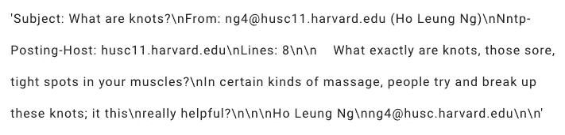

作者图片

恶心。大量的换行符、大写字母和标点符号需要去掉。我们的工作是注定要做的。让我们从“标记化”我们的文本开始，或者将单个字符串文档分割成一个单词列表。

当我们浏览这个文本预处理模块的单个函数时，有两件事情要记住:

1.  对于显示的每个预处理函数，输出将是一个字符串列表
2.  在代码中，各个预处理函数将被另一个函数“to_list”包装。这是因为这些函数是生成器，这意味着它们遍历一个列表来返回值。这为更高效的处理(如多重处理)提供了可扩展性。

```
tokens = to_list(tokenize(text_docs))
tokens[0]
```

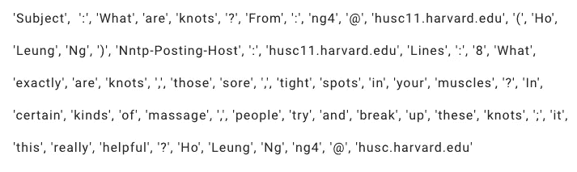

作者图片

因此，在这一点上，我们已经把我们的文档变成了一个单词列表，或者称为“单词包”格式。我们的下一步是确保一切都是小写。

```
lower = to_list(to_lower(tokens))
lower[0]
```

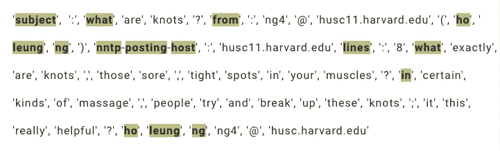

已经改成小写的单词全部高亮显示。(图片由作者提供)

进步！接下来，我们将删除标点符号。这个功能可以删除或替换标点符号。默认情况下，仅当标点符号是尾随/前导实例时才删除标点符号，但也可以设置为删除所有标点符号实例。

```
no_punct = to_list(remove_punct(lower))
no_punct[0]
```

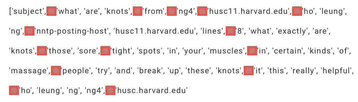

红色块用于标识以前包含标点符号的区域。(图片由作者提供)

删除标点符号后，我们可以继续删除数字和任何包含数字的单词。

```
no_digits = to_list(remove_digits(no_punct))
no_digits[0]
```

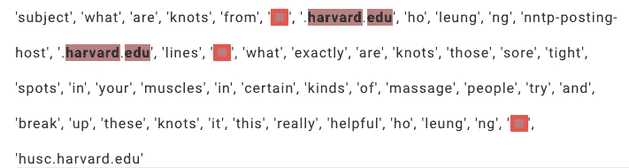

红色块用于标识以前包含数字或带数字的单词的区域。(图片由作者提供)

下一个函数将删除文本中的空格或单个字符。

```
no_single_char_and_space = to_list(remove_single_char_and_spaces(no_digits))
no_single_char_and_space[0]
```

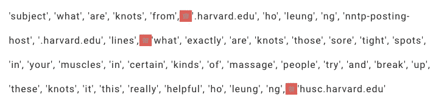

红色块用于标识以前包含空格或单个字符的区域。(图片由作者提供)

接下来是停用词的删除。在主题建模中，其思想是通过文档中对文档意义至关重要的重要单词来分隔文本文档。为此，在这个意义上帮助不大的常用词，如“the”、“what”、“thes”等。从文档中删除。虽然下面的函数从文档中删除了所有 NLTK 定义的停用词，但是该函数也可以将附加的自定义停用词列表作为参数来删除这些停用词。

```
no_stopwords = to_list(remove_stopwords(no_single_char_and_space))
no_stopwords[0]
```

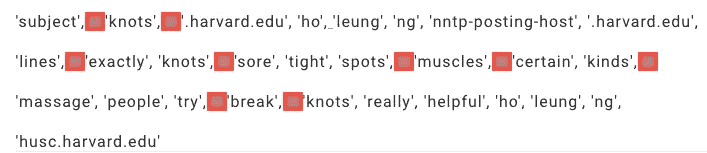

红色块用于标识以前包含停用词的区域。(图片由作者提供)

后续功能可用于对文档进行“词汇化”或“词干化”。这个想法是将相似的单词组合在一起，这样在进行主题建模时就可以识别它们。例如，对单词“breaking”和“broke”进行词汇化将返回“break”。同样，复数和单数单词将被视为相同。这两种不同技术的主要区别在于，词汇化的单词仍然是真实的单词，而对于词干化的单词则不是这样。下面的例子。

```
lem_docs = to_list(lemmatize(no_stopwords))
lem_docs[0]
```

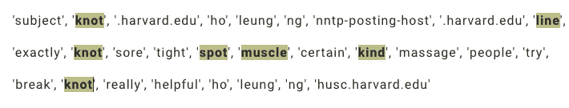

已被词条化的单词被突出显示。(图片由作者提供)

```
stem_docs = to_list(stem(no_stopwords))
stem_docs[0]
```

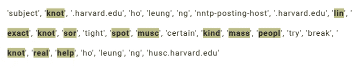

突出显示已被词干化的单词。(图片由作者提供)

完成所有这些后，我们可以将单词列表返回到单字符串文本文档格式。

```
clean_text_docs = to_list(bag_of_words_to_docs(no_stopwords))
clean_text_docs[0]
```

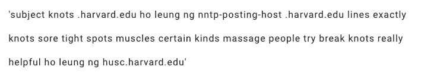

作者图片

因此，从最初的未处理的文本文档开始，我们已经走过了很长的路。此时，每个人可能都想知道是否真的有必要输入所有这些函数来完成这项工作？不要担心！有一个功能，只需快速按下一个按钮，就可以应用所有这些步骤。但是等等！如果有必要在所有预处理过程中应用自定义步骤，该怎么办？再说一次，不用担心！定制函数可以混合到预处理中。下一段代码将演示如何操作。

查看其中的一些文档，似乎需要比一般的预处理步骤更多的步骤来从中提取相关信息。


作者图片

提示正则表达式。

```
import re
pattern = re.compile(r"[\s\S]*\nLines:([\s\S]*)")def extract_lines(docs):
    for doc in docs:
        extract = pattern.match(doc).groups(0)[0]
        yield extract
```

让我们看看在上面的正则表达式模式上匹配后文档是什么样子。

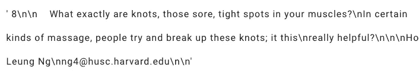

作者图片

从文档中删除主题和发件人(剧透:文档是电子邮件)似乎是一个好主意，这样可以确保文档的内容在我们进行主题建模时仍然相关。这就把我们带到了圣杯预处理函数(注意:来自 data-describe 的函数可以在自定义管道中使用字符串指定，而自定义函数作为函数对象输入)。

```
clean_text_docs = preprocess_texts(text_docs, custom_pipeline=[
    extract_lines,
    'tokenize',
    'to_lower',
    'remove_punct',
    'remove_digits',
    'remove_single_char_and_spaces',
    'remove_stopwords',
    'stem',
    'bag_of_words_to_docs'
])
clean_text_docs[0]
```

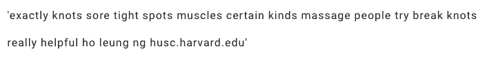

作者图片

好多了。至此，我们已经为主题建模做好了准备。数据描述在这里也有帮助，它有一个“小部件”,允许选择主题建模，无论是 LDA、LSA、LSI、NMF 还是 SVD。虽然这一切都是可定制的，以及主题的数量和许多其他参数，如果没有输入参数，该函数将自动检查两个主题到十个主题的模型的一致性值。具有最高一致性值的主题的数量是将被返回的模型。

```
from data_describe.text.topic_modeling import topic_modellda_model = topic_model(clean_text_docs, model_type='LDA')
```

我们可以做的第一件事是查看每个主题最重要的单词，这可以通过在新的单元格中显示模型对象来完成。

```
lda_model
```

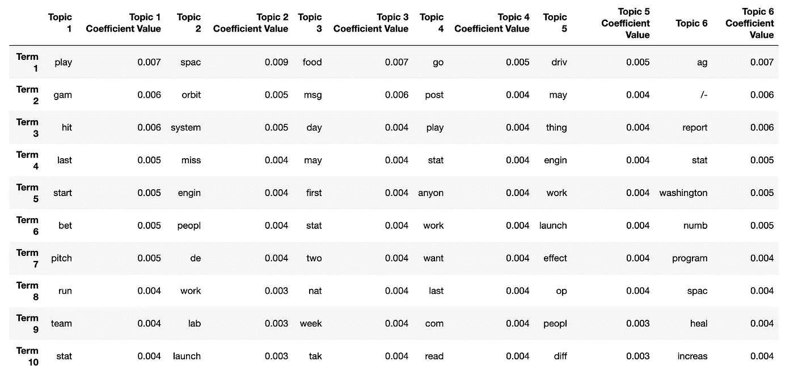

作者图片

这里我们可以做一些观察。我们必须记住，这些单词是作为预处理管道的一部分进行词干提取的。一般看题目，“题目 1”明显是关于棒球的，“题目 2”明显是关于外太空的。模型是如何决定主题数量为 6 的？让我们来看看不同主题数量的每个模型的一致性值。

```
lda_model.elbow_plot()
```

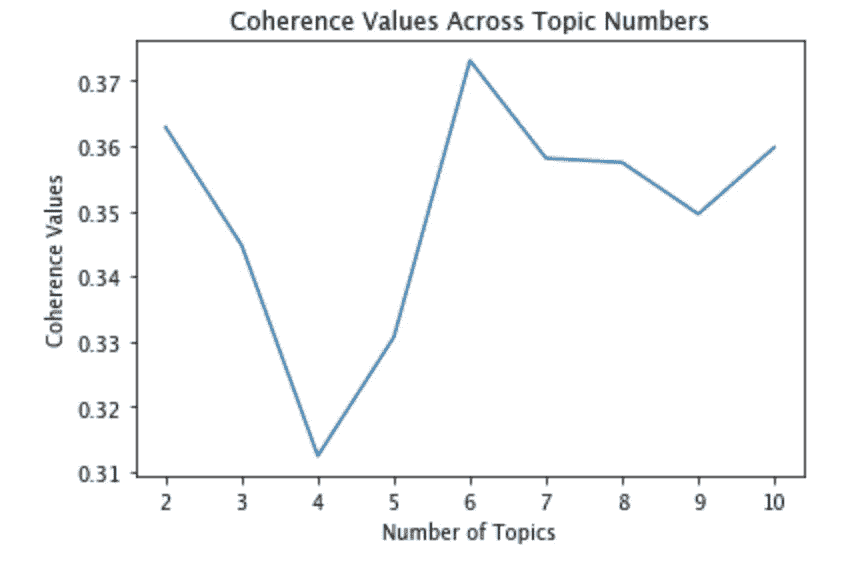

作者图片

正如所料，具有六个主题的模型的一致性值最高。接下来，我们可以查看与每个主题相关的热门文档。自然，文档比 Pandas 可能习惯的要长，所以我们可以首先增加数据帧的列宽。

```
pd.set_option('display.max_colwidth', 500)
top_docs = lda_model.top_documents_per_topic(clean_text_docs_regex)
top_docs = top_docs[['Topic 1', 'Topic 2']]
top_docs.head(3)
```

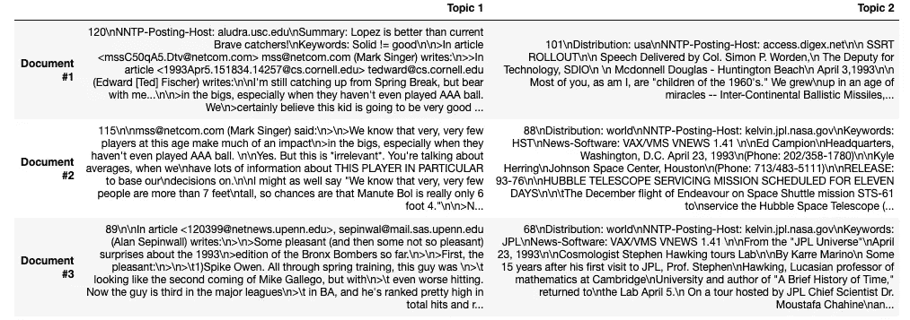

作者图片

我们可以仔细看看下面主题 1 的顶部文档。

```
top_docs['Topic 1'].iloc[0][:700]
```

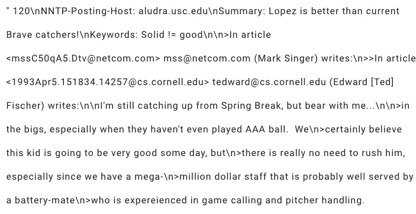

作者图片

正如所料，这份文件是关于棒球的。纵观我们的主题，我们看到，虽然前两个主题的含义很清楚，但其他主题并不清楚。这可能有许多不同的原因。众所周知，主题建模在较长的文档中效果更好，但在较短的文本中效果不佳，比如上面提到的电子邮件。可能需要更多的正则表达式处理来处理电子邮件中的引用线程和回复链。也许需要更多的调整，从查看词频开始(这还不是 data-describe 的一个特性，但是我们很乐意接受贡献的努力！).EDA 只是建模过程中的第一步，这就是 data-describe 要帮助的。

上面提到的所有内容都是对使用 data-describe 的文本预处理和主题建模的很好介绍，但这只是对该包特性的皮毛。其他包括数据汇总、聚类、关联、热图、分布图、功能排名、散点图、维度缩减等，同时还提供对大数据和敏感数据的支持。作者(包括我自己)和开源社区正在不断地添加新的特性和增强功能，因此，如果您有任何问题，请随时联系我们，或者立即开始投稿！