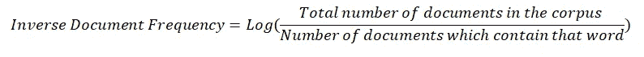
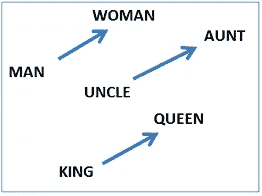
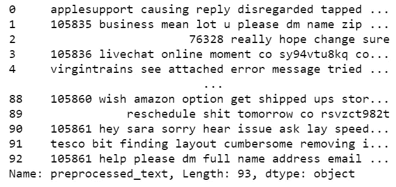

# Twitter 数据的文本处理技术

> 原文：<https://towardsdatascience.com/text-processing-techniques-on-twitter-data-69233296c778?source=collection_archive---------27----------------------->


图片来自 [Pixabay](https://pixabay.com/photos/twitter-social-media-media-social-793050/)

## 使文本数据模型就绪

有大量文本格式的数据。对机器来说，分析文本格式的数据是最复杂的任务，因为机器很难理解文本背后的语义。为此，我们将文本数据处理成机器可理解的格式。

> 文本处理只是将文本格式的数据转换成数值(或向量)，这样我们就可以将这些向量作为机器的输入，并使用代数的概念来分析数据。

但是，当我们执行这种转换时，可能会丢失数据。关键是在转换和保留数据之间保持平衡。

在处理文本之前，文本的预处理是必不可少的。要快速浏览一下什么是文本预处理，请查看这篇文章。

[](https://medium.com/@ramyavidiyala/a-handbook-to-text-preprocessing-cc9693bf3c12) [## 文本预处理手册

### 自然语言处理的第一步

medium.com](https://medium.com/@ramyavidiyala/a-handbook-to-text-preprocessing-cc9693bf3c12) 

**在本文中，我们将讨论执行文本处理的各种技术。**

在开始之前，让我们先了解几个常用术语。

*   每个文本数据点称为一个 ***文档***
*   整套文件叫做 ***文集***

可以使用以下技术来完成文本处理，

1.  一袋单词
2.  TF-IDF
3.  Word2Vec

现在让我们开始详细研究每种技术。

# 1.一袋单词

单词包通过使用一个独特单词的字典来完成文档到矢量的简单转换。这只需两步即可完成，

## **第一步:构建字典**

以向量形式创建数据语料库中所有唯一单词的字典。设语料库中唯一词的数量为，*‘d’*。所以每个单词是一个维度，因此这个字典向量是一个 *d 维向量。*

## **步骤 2:构建载体**

对于每个文档，比如说，*r*ᵢ*t23】我们创建一个向量，比如说， *v* ᵢ.
现在，这种具有 *d 尺寸*的 *v* ᵢ有两种构造方式:*

1.  对于每个文档，根据字典构建 *v* ᵢ，使得字典中的每个单词按照该单词在文档中出现的次数来再现。
2.  对于每个文档，根据字典构造 *v* ᵢ，使得字典中的每个单词被再现，

*   如果该单词出现在文档中，则为 1，或者
*   如果文档中没有该单词，则为 0

这种类型被称为**二进制包字**。

现在，我们有了每个文档的向量和一个字典，该字典有一组数据语料库的唯一单词。这些向量可以通过以下方式进行分析

*   在 d 维空间中绘图或
*   计算向量之间的距离以获得相似度(向量越差，越相似)

## 词汇袋的局限性:

*   **问题:**包词不考虑词的语义。意思是具有相同语义的单词如美味、可口被分成两个不同的单词。
    **解决方案:**使用词干化和词汇化等技术对数据进行预处理。
*   **问题:**单词包没有保留文档的顺序信息，这意味着“不好”，这显然是不好的。一袋字把它归类为‘不好’和‘好’，显然不好。
    **解决方案:**不是创建每个单元格都是一个单词的向量，我们可以创建每个单元格都有两个单词的向量(称为**二字组**)或三个单词的向量(称为**三字组**)。使用这些**n-gram**，可以保留顺序信息。然而，当我们使用 n-grams 而不是 uni-gram 时，特征的维数增加了。

# 2.术语频率—逆文档频率

这里有三个元素——单词、文档、语料库。词频——逆文档频率，简称 TF-IDF，利用这些之间的关系将文本数据转化为向量。

> **词频**说的是一个词和一个文档之间的关系。鉴于，**逆文档频率**表示单词和语料库之间的关系。

## 步骤 1:计算词频

***词频*** 是单词 *w* ⱼ在文档 *r* ᵢ.出现的概率并且计算如下:


用数学公式计算**复习中每个单词的词频**

> 如果一个词在某篇评论中的词频是**高**则暗示该词在该篇评论中是**频繁**。如果一个单词在评论中的词频**低**意味着，该单词在该评论中**罕见**。

## 步骤 2:计算 IDF

***逆文档频率*** 表示该词在整个语料库中出现的频率。并且计算如下:



计算**逆文档频率的数学公式**

> 如果逆文档频率**低**，则暗示该词在语料库中**频繁**。如果逆文档频率是**高**，则暗示该词在语料库中是**稀有**。

使用对数而不是简单的反比的原因是缩放。概率范围在 0 和 1 之间的术语频率。当我们简单地取这个反比时，它将是一个巨大的值，因此整个 TF-IDF 值将偏向 IDF。这是在 IDF 术语中使用日志的一个简单且被广泛接受的原因。

> **评论中一个词的 TF-IDF** 是 TF(word，review) *IDF(word，document corpus)。

现在在每个文档的向量形式中，我们有这个单词的 TF-IDF。*使用 TF-IDF 值将文档转换成矢量称为* ***TF-IDF 矢量化。***

TF-IDF 矢量化对以下单词给予高度重视

*   在文档中频繁出现(来自 TF)
*   语料库中罕见(来自 IDF)

# 3.Word2Vec

在单词袋和 TF-IDF 中，我们将*句子转换成矢量*。但是在 Word2Vec 中，我们将 *word 转换成一个向量*。因此得名，word2vec！

Word2Vec 将大型文本语料库作为其输入，并产生一个向量空间，通常具有数百个维度，语料库中的每个唯一单词都被分配一个空间中的相应向量。单词向量位于向量空间中，使得语料库中共享共同上下文的单词在空间中彼此靠近。

## 优势:

1.  每个单词在空间上更接近具有相同语义的单词(意思像女人、女孩)
2.  它保留了单词之间的关系(男人对女人的向量平行于国王对王后的向量)



# 履行

在本文中，我们将在 Kaggle 的 Twitter 数据集上使用客户支持。

[](https://www.kaggle.com/thoughtvector/customer-support-on-twitter) [## Twitter 上的客户支持

### Twitter 上最大品牌的 300 多万条推文和回复

www.kaggle.com](https://www.kaggle.com/thoughtvector/customer-support-on-twitter) 

## 关于数据集:

Twitter 数据集上的客户支持是一个大型的现代推文和回复语料库，有助于自然语言理解和会话模型的创新，并用于研究现代客户支持实践和影响。该数据集提供了 Twitter 上消费者和客户支持代理之间的大量现代英语对话。

让我们使用预处理过的数据，并对其执行每个文本预处理。让我们看看预处理的数据

```
data["preprocessed_text"]
```



预处理数据

## 实现单词包

Sckit learns 为我们提供了许多图书馆。这使得我们很容易在一行代码中实现任何功能。

```
from sklearn.feature_extraction.text import CountVectorizer
```

Sckit learn 提供了 CountVectorizer 来执行单词包。

```
bow=CountVectorizer( min_df=2, max_features=1000)
bow.fit(data['preprocessed_text'])
bow_df=bow.transform(data['preprocessed_text']).toarray()
```

创建计数矢量器对象，用预处理后的数据进行拟合、变换。 *bow_df* 是一个稀疏向量，它包含的 0 的数量多于 1。

## 实施 TF-IDF

```
from sklearn.feature_extraction.text import TfidfVectorizer
```

Sckit learn 提供 tfidf 矢量器来执行 TF-IDF 矢量化。

```
tfidf = TfidfVectorizer( min_df=2, max_features=1000)
tfidf.fit(data['preprocessed_text'])
tfidf_df=bow.transform(data['preprocessed_text']).toarray()
```

*tfidf_df* 包含文档中每个单词在 1000 维向量中的 tf-idf 值。

## Word2vec 的实现

谷歌提供了一个庞大的向量列表，这些向量是在谷歌新闻的海量数据上训练出来的。要使用这些向量，我们需要导入 Gensim。

```
import gensim
tokenize=data['preprocessed_text'].apply(lambda x: x.split())
w2vec_model=gensim.models.Word2Vec(tokenize,min_count = 1, size = 100, window = 5, sg = 1)
w2vec_model.train(tokenize,total_examples= len(data['preprocessed_text']),epochs=20)
```

输出:(18237，22200)个数据点。这意味着文本的 18237 个数据点现在被转换成 22200 维向量。

# 什么时候用什么？

这个问题没有明显的答案:它确实取决于应用程序。

例如，**单词包**通常用于*文档分类*应用，其中每个单词的出现被用作训练分类器的特征。

TF-IDF 被谷歌等*搜索引擎*用作内容的排名因素。

当应用程序是关于理解单词的上下文，或者检测单词的相似性，或者将给定的文档翻译成另一种语言，这需要关于文档的大量信息时， **Word2vec** 就派上了用场。

谢谢你的阅读。以后我会写更多初学者友好的帖子。请在[媒体](https://medium.com/@ramyavidiyala)上关注我，以便了解他们。我欢迎反馈，可以通过 Twitter [ramya_vidiyala](https://twitter.com/ramya_vidiyala) 和 LinkedIn [RamyaVidiyala](https://www.linkedin.com/in/ramya-vidiyala-308ba6139/) 联系我。快乐学习！

­­­­