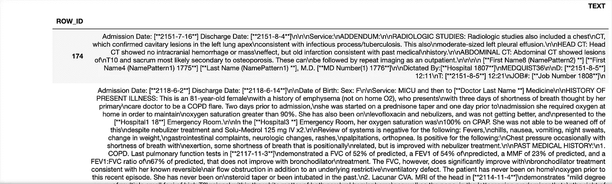
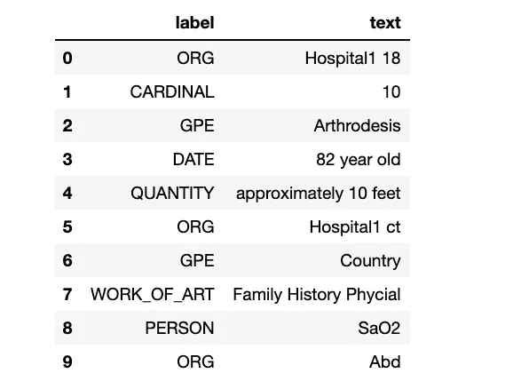
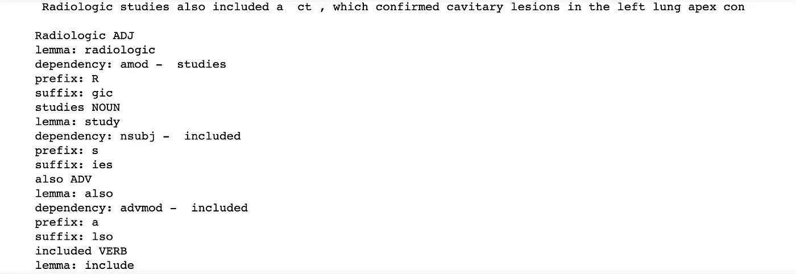
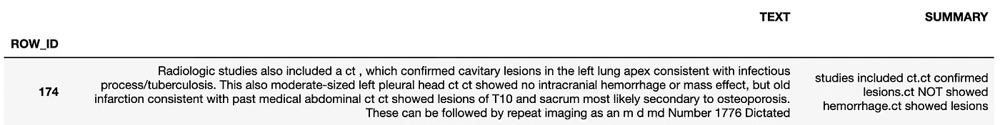

# 用于主题建模和聚类的文本摘要

> 原文：<https://towardsdatascience.com/text-summarization-for-clustering-documents-2e074da6437a?source=collection_archive---------47----------------------->

## 将冗长的文本简化为简短的摘要

这是使用自然语言处理(NLP)分析医疗图表系列的第 2 部分

在[第一部分](https://medium.com/@tyagigaurika27/nlp-preprocessing-clinical-data-to-find-sections-461fdadbec77)中，我们谈到了清理文本和提取图表注释的部分，这可能对分析师的进一步注释有用。因此，如果他们只是寻找“过敏”或“社会历史”，减少他们手动浏览整个图表笔记的时间。

# NLP 任务:

1.  [预处理和清洗](https://medium.com/@tyagigaurika27/nlp-preprocessing-clinical-data-to-find-sections-461fdadbec77)
2.  **文本摘要—我们在这里**
3.  [使用潜在狄利克雷分配(LDA)的主题建模](https://medium.com/@tyagigaurika27/nlp-topic-modeling-to-identify-clusters-ca207244d04f)
4.  [聚类](https://medium.com/@tyagigaurika27/identifying-relationships-in-clinical-text-nlp-clustering-929eb04b5942)

> 如果你想自己尝试整个代码或者跟随，请访问我在 GitHub 上发布的 jupyter 笔记本:[https://GitHub . com/gaurikatyagi/Natural-Language-Processing/blob/master/introduction % 20 to % 20 NLP-Clustering % 20 text . ipynb](https://github.com/gaurikatyagi/Natural-Language-Processing/blob/master/Introdution%20to%20NLP-Clustering%20Text.ipynb)

# 数据:

资料来源:https://mimic.physionet.org/about/mimic/

医生在他们的电脑上做笔记，80%的记录是没有结构的。这使得信息处理更加困难。我们不要忘记，解释医疗术语也不是一件容易的事情。它需要大量的上下文来解释。让我们看看我们有什么:



按作者分类的图像:作为输入的文本数据

# 文本摘要

**Spacy** 不擅长识别医疗保健文档的“命名实体识别”。见下文:

```
doc = nlp(notes_data["TEXT"][178])
text_label_df = pd.DataFrame({"label":[ent.label_ for ent in doc.ents], 
                                  "text": [ent.text for ent in doc.ents]
                                 })

display(HTML(text_label_df.head(10).to_html()))
```



作者提供的图片:医疗行业术语中的词性标注表现不佳

但是，这并不意味着它不能用来总结我们的文本。使用“词性标注”来识别文本中的依存关系仍然很棒。让我们看看:

```
# Process the text
doc = nlp(notes_data["TEXT"][174][:100])
print(notes_data["TEXT"][174][:100], "\n")
# Iterate over the tokens in the doc
for token in doc:
    if not (token.pos_ == 'DET' or token.pos_ == 'PUNCT' or token.pos_ == 'SPACE' or 'CONJ' in token.pos_):
        print(token.text, token.pos_)
        print("lemma:", token.lemma_)
        print("dependency:", token.dep_, "- ", token.head.orth_)
        print("prefix:", token.prefix_)
        print("suffix:", token.suffix_)
```



作者图片:依赖性识别

所以，我们可以总结一下课文；基于依赖性跟踪。YAYYYYY！！！

这是总结的结果！(顺便说一句，我试图缩小我的 jupyter 笔记本以向您显示文本差异，但仍未能捕捉到完整的图表注释。我也将分别粘贴这些内容，或者您可以在 Github 页面上查看我的输出(在顶部提到)。



作者图片:摘要文本

我们如何将整个文档的要点变成简洁明了的短语，这不是很好吗？这些摘要将用于主题建模(第 3 节)和第 4 节的文档聚类。