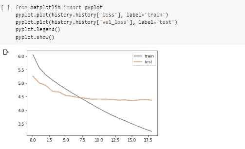

# 使用编码器-解码器网络从零开始进行文本摘要

> 原文：<https://towardsdatascience.com/text-summarization-from-scratch-using-encoder-decoder-network-with-attention-in-keras-5fa80d12710e?source=collection_archive---------4----------------------->

## 从新闻文章中总结出有意义的标题

在学生时代，我们大多数人都会遇到英语试卷中的阅读理解部分。我们会得到一段或一篇文章，根据这段或一篇文章，我们需要回答几个问题。

[绿色变色龙](https://unsplash.com/@craftedbygc?utm_source=medium&utm_medium=referral)在 [Unsplash](https://unsplash.com?utm_source=medium&utm_medium=referral) 上的照片

作为人类，我们该如何完成眼前的任务呢？我们通读整篇文章，理解提出问题的背景，然后写出答案。有没有一种方法可以让我们使用人工智能和深度学习技术来模仿我们的这种行为？

自动文本摘要是机器学习和自然语言处理中的一个常见问题。解决这个问题有两种方法。

1.  **摘要** -摘要文本摘要通过从原始文本中提取最重要的句子来形成最终摘要。我们做一些提取文本摘要来解决简单的阅读理解练习。TextRank 是一种非常流行的抽取式无监督文本摘要技术。

**2。另一方面，抽象摘要**-抽象文本摘要**，**是一种通过重新措辞或使用新单词生成新句子来生成摘要的技术，而不是简单地提取重要句子。例如，阅读理解中的一些问题可能不是直截了当的，在这种情况下，我们会重新措辞或使用新单词来回答这些问题。

我们人类可以很容易地完成这两种文本摘要。在这篇博客中，让我们看看如何使用深度学习技术实现抽象文本摘要。

**问题陈述**

给定一篇新闻文章，我们将对其进行总结，并生成适当的标题。

每当任何媒体账户在 Twitter 或任何社交网站上分享新闻故事时，他们都会提供一个简洁的标题/点击诱饵，让用户点击链接并阅读文章。

媒体公司经常提供耸人听闻的标题，作为点击诱饵。这是一种常用来增加网站点击率的技术。

我们的问题陈述是生成给定文章文本的标题。为此，我们使用 news_summary 数据集。您可以在此下载数据集

CNN 的一条推文，标题是关于 COVID 19 的一篇文章

在我们浏览代码之前，让我们学习一些构建抽象文本摘要器所需的概念。

## 序列对序列模型

像多层感知器(MLP)这样的技术很适合你的输入数据是矢量，如果你的输入数据是图像，卷积神经网络(CNN)也很适合。

如果我的输入 x 是一个序列呢？如果 x 是一串单词。在大多数语言中，词序很重要。我们需要以某种方式保持单词的顺序。

这里的核心思想是，如果输出依赖于输入序列，那么我们需要建立一种新型的神经网络，它重视序列信息，以某种方式保留并利用序列信息。

Google Translate 是 seq2seq 模型应用程序的一个很好的例子

我们可以对任何涉及序列信息的问题建立 Seq2Seq 模型。在我们的例子中，我们的目标是构建一个文本摘要生成器，其中输入是一长串单词(在文本正文中)，输出是一个摘要(也是一个序列)。因此，**我们可以将此建模为多对多 Seq2Seq 问题。**

一个多对多的 seq2seq 模型有两个构件- **编码器**和**解码器。** *编解码架构主要用于解决输入输出序列长度不同的序列对序列(Seq2Seq)问题。*

通常，递归神经网络(RNNs)的变体，即门控递归神经网络(GRU)或长短期记忆(LSTM)，优选作为编码器和解码器组件。这是因为它们能够通过克服梯度消失的问题来捕捉长期依赖性。

## 编码器-解码器架构

让我们看看编码器-解码器架构的高级概述，然后看看它在训练和推理阶段的详细工作。

直观地看，这是我们的编码器-解码器网络中发生的情况:

1.我们将输入(在我们的例子中是来自新闻文章的文本)提供给编码器单元。编码器读取输入序列，并在称为内部状态向量的东西中总结信息(在 LSTM 的情况下，这些被称为隐藏状态和单元状态向量)。

2.编码器生成称为上下文向量的东西，作为输入传递给解码器单元。编码器生成的输出被丢弃，只有上下文向量被传递给解码器。

3.解码器单元基于上下文向量生成输出序列。

我们可以分两个阶段设置编码器-解码器:

*   培训阶段
*   推理阶段

# 培训阶段

## A.编码器

在每一个时间步的训练阶段，我们从一个句子中一个接一个地按顺序输入单词给编码器。例如，如果有一个句子“我是一个好孩子”，那么在时间步 t=1，单词 I 被馈送，然后在时间步 t=2，单词 am 被馈送，等等。

比方说，我们有一个由字 x1、x2、x3、x4 组成的序列 x，那么训练阶段的编码器如下所示:

培训阶段

LSTM 单元的初始状态是零矢量或者它是随机初始化的。现在 h1，c1 是当序列 x 的字 x1 作为输入被馈送时，在时间步长 t=1 的 LSTM 单元的状态。

类似地，h2、c2 是当序列 x 的字 x2 作为输入被馈送时，LSTM 单元在时间步长 t=2 的状态，等等。

最后一个时间步长的隐藏状态(hi)和单元状态(ci)用于初始化解码器。

## B.解码器

现在，解码器的初始状态被初始化为编码器的最终状态。这直观地意味着解码器被训练成根据编码器编码的信息开始生成输出序列。

**<开始>** 和< **结束>** 是在将目标序列馈送到解码器之前添加到目标序列(在我们的例子中是我们想要预测的标题)的特殊标记。

解码测试序列时目标序列未知。因此，我们通过将第一个字发送到解码器来开始预测目标序列，该第一个字通常是<**开始>标记。而< **end >** 记号表示句子结束。**

解码器架构

# 推理阶段

现在在推断阶段，我们希望我们的解码器预测我们的输出序列(在我们的例子中是标题)。训练后，在目标序列未知的新源序列上测试该模型。因此，我们需要建立推理架构来解码一个测试序列

推理阶段

在每个时间步长，我的解码器中的 LSTM 单元给我输出 y，y，y …y^k.，其中 k 是输出序列的长度。在时间步长 t=1 时，产生输出 y，在时间步长 t=2 时，产生输出 y ^2，依此类推。

但是在前面提到的测试阶段，我们不知道目标序列的长度。我们如何解决这个问题？或者换句话说，我们如何解码测试序列。同样，我们遵循以下步骤:

1.  对整个输入序列进行编码，并用编码器的内部状态初始化解码器
2.  传递<**开始>令牌作为解码器的输入**
3.  用内部状态运行解码器一个时间步长
4.  输出将是下一个单词的概率。将选择具有最大概率的单词。
5.  在下一个时间步长将采样字作为输入传递给解码器，并用当前时间步长更新内部状态
6.  重复步骤 3–5，直到我们生成<**end>令牌或达到目标序列的最大长度。**

## 编码器-解码器网络的缺点

1.  在编码器-解码器网络中，编码器生成一个上下文向量，作为输入传递给解码器。现在，如果我们的输入序列很大(在我们的例子中，来自新闻文章的文本大部分都很大)，一个单独的上下文向量就不能捕捉输入序列的本质。
2.  **编码器很难将长序列记忆到固定长度的向量中**
3.  。双语评价替角**得分**，简称 **BLEU** ，是一个将生成的句子评价为参考句子的度量标准。完全匹配导致 1.0 的**分数**，而完全不匹配导致 0.0 的**分数**。

研究人员观察到，随着源文本和参考文本的句子长度增加，BLEU 分数会下降。它的表现还算不错——直到句子长度达到 20，之后分数就会下降。

对于我们的任务，源和目标句子长度都大于 20，因此我们需要克服编码器-解码器网络的这一缺点。

## 注意力的概念

1.  当人们阅读任何冗长的段落时，他们会注意某些单词，然后他们会将注意力转移到接下来的几个单词上，以此类推。
2.  直觉地想到你的老师在你的历史试卷上批改你的 10 分答案。老师会带着一把钥匙，钥匙上有一些重要的要点/单词。所以在你的答题纸中，你的老师会在答案中寻找这些重要的单词。更注重的是关键词。
3.  因此，当给定一个冗长的输入序列时，人类将注意力从一个单词序列转移到另一个单词序列
4.  **因此，我们可以增加源序列中产生目标序列的特定部分的重要性，而不是查看源序列中的所有单词。**这是注意力机制背后的基本思想。
5.  注意机制利用双向 RNN。常规 RNN 是单向的，因为序列是从第一个单词到最后一个单词处理的。在双向 RNN 中，我们将有一个正向和反向连接。
6.  所以除了前向连接，每个神经元还有一个后向连接。
7.  从神经元的前向和后向连接产生的输出被连接在一起，以给出输出 y1^,y2^and 等等。因此，我们将有两个反向传播，一个用于反向的正向路径，另一个用于正向的反向路径。
8.  上下文向量只不过是编码器输出的加权和。

注意机制

根据所关注的上下文向量的导出方式，存在 2 种不同类别的注意机制:

*   全局注意力-在这里，注意力被放在所有的源位置上。换句话说，**编码器的所有隐藏状态被考虑用于导出关注上下文向量:**
*   局部注意力——在这里，注意力只放在少数几个源位置上。**仅考虑编码器的几个隐藏状态来导出关注上下文向量。**

我们将利用全球的注意力来完成手头的任务。

# 代码走查

现在我们已经学习了所有的概念，让我们深入研究代码。首先，让我们导入所有必需的库

# 自定义关注层

Keras 没有正式支持关注层。因此，我们既可以实现我们的注意力层，也可以使用第三方实现。对于这个博客，我们将选择后者。你可以在这里 从[T5 下载注意力层，并将其复制到另一个名为 **attention.py** 的文件中，然后我们可以导入相同的文件。](https://github.com/thushv89/attention_keras/blob/master/layers/attention.py)

现在让我们阅读我们的数据集。由于计算的限制，我们将只从数据集中加载 20000 行。

阅读我们的数据集-我们可以看到标题和新闻文章文本对。

# 文本预处理

现在我们需要清理我们的文本，我们对文本和标题对执行以下步骤:

1.  删除多余的空格
2.  扩大收缩
3.  删除特殊字符
4.  小写所有文本

我们使用以下函数来扩展收缩

我们使用下面的函数预处理文本和标题对:

上面的代码片段对文章文本进行预处理。同样的代码也可以用于标题列。

在这里，正文是我们的来源，标题是我们的目标。我们需要添加开始和结束标记到我们的目标序列，即我们前面看到的标题。

为标题添加开始和结束标记(sostok 和 eostok)。

现在我们将添加一个新的功能字数。我们将为文本和标题添加此功能。然后让我们看看文字和标题的字数百分比。这将有助于我们对文本长度的分布有一个整体的了解。这将帮助我们确定序列的最大长度

让我们得到文本字数的百分位值。

文本字数的百分比值

让我们看看文本字数从 90 到 100 的百分位值

文本字数的 90-100%值

我们将第 95 个百分位数即 62 作为我们的最大文本长度。类似地，我们绘制了标题的百分位值，并将 15 作为标题的最大长度。

文本和标题的最大长度

**测试列车拆分**

在继续构建我们的模型之前，我们需要对我们的数据进行测试训练分割。我们使用 sklearn 来做同样的事情。我们将使用 70 %的数据作为训练数据，并在剩余的 30 %上评估性能。

列车测试分离

# 用于文本的预训练单词嵌入

我们之前看到，我们在每个时间步向编码器发送文本序列。来自输入序列的字在每个时间步长被传递到编码器网络。在它作为输入被传递到编码器单元之前，我们添加一个嵌入层。

## 什么是单词嵌入？

一个**嵌入**是一个相对低维的空间，你可以将高维向量转化到其中。嵌入使得在大量输入上进行机器学习变得更加容易，比如表示单词的稀疏向量。理想情况下，嵌入通过在嵌入空间中将语义相似的输入放在一起来捕获输入的一些语义。嵌入可以跨模型学习和重用。

来源-【analyticsvidhya.com 

例如，“椰子”和“北极熊”是语义完全不同的词，所以合理的嵌入空间应该将它们表示为相距很远的向量。但是“厨房”和“晚餐”是有关联的词，所以它们应该紧密地嵌在一起。

通过将降维技术应用于文本语料库中单词之间的共现统计数据集来计算单词嵌入。这可以通过神经网络(“word2vec”技术)或矩阵分解来完成。

**手套嵌入**

最普遍使用的嵌入技术之一是手套嵌入。GloVe 代表“单词表示的全局向量”。我们将使用手套嵌入我们的输入文本序列(你可以在这里阅读手套)。

具体来说，我们将使用在 2014 年英语维基百科转储上计算的 40 万个单词的 100 维手套嵌入。你可以在这里下载它们

现在我们需要检查手套语料库中有多少来自输入文本序列语料库的单词。这非常重要，因为我们的模型将只学习手套语料库中的单词。我们可以使用下面的代码来检查这一点:

我们观察到在手套向量和我们的语料库中出现的单词的百分比接近 73%,这是非常好的。

## 标记化

任何机器学习或深度学习模型都无法直接理解文本。我们需要把它转换成数字。我们可以通过标记化来做到这一点。

**标记化**是将文本分割成一组有意义的片段的过程。这些东西被称为**令牌**。比如，我们可以把一段文字分成单词，也可以分成句子。记号赋予器构建词汇表并将单词序列转换成整数序列。

我们对文本和标题进行标记，然后将其转换为整数，然后填充到最大长度(我们在上一节中已经达到了这个最大长度)

接下来，让我们构建字典，将索引转换为目标和源词汇的单词

在前面的部分中，我们已经加载了手套模型。现在让我们从手套模型中获得文本序列的权重矩阵。在手套嵌入中没有找到的字将被初始化为零向量。我们可以使用下面这段代码来获得权重矩阵:

# 构建我们的模型

我们通过垂直堆叠 3 个 LSTMs 来构建编码器，水平轴是时间轴。堆叠有助于增加模型的复杂性，也有助于更好地表示我们的输入文本序列。

堆叠的 LSTM 模型看起来会像这样:

(我们仅对编码器架构使用堆栈，不对解码器使用堆栈，如下图所示。)

堆叠架构(图片来源-[https://towardsdatascience . com/time-series-forecasting-with-deep-stacked-单向-双向-lstms-de7c099bd918](/time-series-forecasting-with-deep-stacked-unidirectional-and-bidirectional-lstms-de7c099bd918) )

我们可以使用下面的代码来构建我们的模型:

一些重要术语

*   **Return Sequences = True:** 当 Return Sequences 参数设置为 **True** 时，LSTM 为每个时间步长产生隐藏状态和单元格状态
*   **返回状态=真:**当返回状态= **真**时，LSTM 只产生最后一个时间步长的隐藏状态和单元格状态
*   **初始状态:**用于初始化第一个时间步长的 LSTM 内部状态
*   **latent_dim** :表示隐藏单元的数量。

让我们看看我们的模型摘要:

模型摘要

现在我们看到有不可训练的参数。这些参数来自我们的嵌入矩阵的权重向量。我们已经将可训练设置为假，因此我们的模型不会学习这些权重。

我们现在将继续编译我们的模型

现在让我们检查一下我们的模型并保存最好的权重。此外，让我们用 3 的耐心为我们的模型定义早期停止(这意味着如果验证损失在 3 个时期后没有减少，则训练停止)

现在让我们用 128 的批量训练我们的模型

训练我们的模型

我们绘制了纪元与价值损失图

纪元 vs 价值损失

我们观察到 val 损失在第 18 个时期后没有减少，因此我们停止了训练。

现在，我们为我们的模型构建推理，如前面几节所讨论的

现在我们在下面定义一个函数，它是推理过程(解码测试序列)的实现

现在让我们定义函数，将文本和标题的整数序列转换为单词序列:

最后，我们有预测功能，让我们看看我们的模型如何执行！

以下是我们的模型做出的一些预测。预测可能不是很好，因为我们已经在更少的数据点(大约 15 K)上训练了我们的模型。

即使预测的和实际的标题在文字上不完全匹配，但是传达了相同的意思。这是我们在非常小的数据集上训练我们的模型所得到的相当不错的结果。谷歌/脸书/亚马逊在千兆/万亿字节的数据上训练模型:)。

# 未来的工作

我们仍然可以通过以下方式在很大程度上改进我们的模型

1.  **增加数据集的大小**-由于计算限制，我们取了大约 20k 个点。如果我们有高端 GPU 可用，这个模型可以在更大的数据集上训练，从而改善结果。
2.  **使用 BERT 嵌入** — BERT(来自 Transformers 的双向编码器表示)是一种最先进的语言表示模型。我们可以使用 BERT 为我们的文本序列获得上下文化嵌入。我们还可以使用 BERT 句子片段标记器来标记我们的输入文本序列。尽管 BERT 确实需要大量的计算能力。
3.  **双向 lstm 的使用-** 我们之前讨论过，对于编码器解码器，我们注意使用双向 lstm。然而，我们用单向 LSTM 构建了我们的模型。双向 LSTM 能够从两个方向捕获上下文，并产生更好的上下文向量。
4.  尝试使用波束搜索来解码序列
5.  **根据 **BLEU 分数评估**您的模型的性能。**

# 参考

1.  AAIC
2.  [www.analyticsvidhya.com](http://www.analyticsvidhya.com)
3.  [https://arxiv.org/abs/1706.03762](https://arxiv.org/abs/1706.03762)
4.  [https://towards data science . com/text-summarying-using-deep-learning-6e 379 ed 2e 89 c](/text-summarization-using-deep-learning-6e379ed2e89c)
5.  [https://www . analyticsvidhya . com/blog/2019/06/comprehensive-guide-text-summarying-using-deep-learning-python/](https://www.analyticsvidhya.com/blog/2019/06/comprehensive-guide-text-summarization-using-deep-learning-python/)