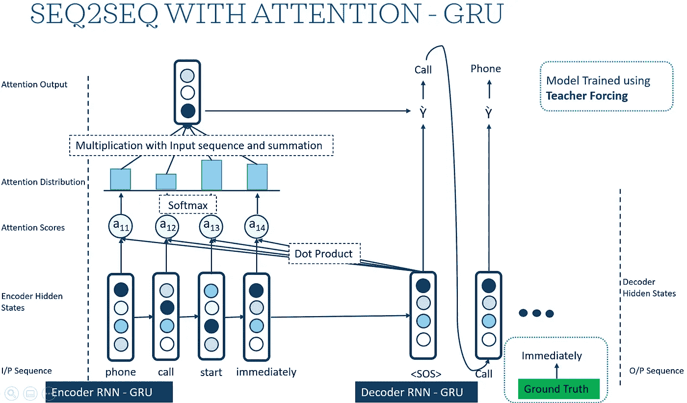
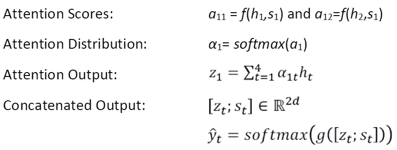
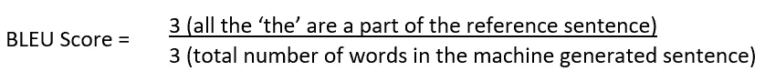
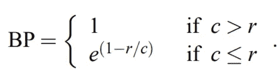
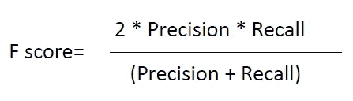

# 使用深度神经网络的文本摘要

> 原文：<https://towardsdatascience.com/text-summarization-using-deep-neural-networks-e7ee7521d804?source=collection_archive---------7----------------------->

## 基于 seq2seq 模型的文摘综述


[农旺](https://unsplash.com/@californong?utm_source=medium&utm_medium=referral)在 [Unsplash](https://unsplash.com?utm_source=medium&utm_medium=referral) 上的照片

# **简介**

每天产生的文本数据量在复杂性和数量上都在快速增长。社交媒体、新闻文章、电子邮件、短信(清单还在继续..)，产生海量信息，浏览冗长的文字材料变得繁琐(也很无聊！).谢天谢地，随着深度学习的进步，我们可以建立模型来缩短长文本，并产生清晰连贯的摘要，以节省时间并有效地理解关键点。

我们可以将文本摘要大致分为两种类型:

**1。提取摘要:**这种技术包括从输入的句子中提取重要的单词/短语。基本思想是通过从输入句子中选择最重要的单词来创建摘要

**2。抽象概括:**这种技术包括生成全新的短语来捕捉输入句子的意思。潜在的想法是把重点放在形式上——旨在生成语法摘要，因此需要高级语言建模技术。

在本文中，我们将使用 PyTorch 建立一个序列 2 序列(编码器-解码器)模型，使用 GRU 进行简单的点积注意力，并评估他们的注意力得分。我们将进一步研究像 BLEU、ROUGE 这样的指标来评估我们的模型。

**使用的数据集:** 我们将使用 wikihow 数据集，该数据集包含大约 200，000 对长序列文章及其标题。该数据集是可用于摘要的大规模数据集之一，文章的长度变化很大。这些文章在写作风格上非常多样化，这使得摘要问题更具挑战性和趣味性。

*关于数据集的更多信息:*[*https://arxiv.org/abs/1810.09305*](https://arxiv.org/abs/1810.09305)

# **数据预处理**

预处理和清理是一个重要的步骤，因为在不干净和混乱的数据上建立模型会反过来产生混乱的结果。在将数据输入模型之前，我们将应用以下清理技术:

1.  将所有文本转换为小写以便进一步处理
2.  解析 HTML 标签
3.  正在删除()和[]之间的文本
4.  缩略映射—替换单词的缩略版本(例如，不能被替换为不能等等)
5.  删除撇号
6.  删除标点符号和特殊字符
7.  使用 nltk 库删除停用词
8.  仅保留长单词，即长度大于 3 的单词

我们将首先以字典的形式定义缩写:

```
## Find the complete list of contractions on my Github Repocontraction_mapping = {"ain't": "is not", "aren't": "are not"}
stop_words = set(stopwords.words('english'))**def** text_cleaner(text,num): str = text.lower()
  str = BeautifulSoup(str, "lxml").text
  str = re.sub("[\(\[].*?[\)\]]", "", str)
  str = ' '.join([contraction_mapping[t] **if** t **in** contraction_mapping      **else** t **for** t **in** str.split(" ")])
  str = re.sub(r"'s\b","",str)
  str = re.sub("[^a-zA-Z]", " ", str)

  **if**(num==0):
      tokens = [w **for** w **in** str.split() **if** **not** w **in** stop_words]
  **else**:
      tokens=str.split() long_words=[]

  **for** i **in** tokens:
      **if** len(i)>3:          *#removing short words*
          long_words.append(i)

  **return** (" ".join(long_words)).strip()*#calling the above function*
clean_text = []
clean_summary = []**for** t **in** df['text']:
    clean_text.append(text_cleaner(t,0))**for** t **in** df['headline']:
    clean_summary.append(text_cleaner(t,0))
```

# **深度模型设计**

在将训练数据输入我们的深度模型之前，我们将每个单词表示为一个热点向量。然后，我们将需要每个单词的唯一索引，以将其用作网络的输入和输出。

为此，我们将创建一个助手类 *Lang* ，它具有*单词- >索引*和*索引- >单词*映射以及每个单词的计数。
为了读取模型中的数据，我们以列表的形式创建了输入和输出对(Pairs- > [Input，Output])

# **Seq2seq 模型，注意使用 GRU 和教师强制**

我们将使用 seq2seq(编码器-解码器架构)模型，关注简单的点积。选择这种架构的基本思想是，我们手头有一个多对多的问题(n 个单词作为输入，m 个单词作为输出)。下图显示了该模型的详细架构图。



作者图片

该架构中有四个主要组件:

> **编码器:***seq 2 seq 模型的编码器层从输入文本中提取信息，并将其编码成单个向量，即上下文向量。
> 基本上，对于每个输入单词，编码器都会生成一个隐藏状态和一个向量，将这个隐藏状态用于下一个输入单词。*
> 
> *我们使用* ***GRU(门控递归单元)*** *用于编码器层，以便捕捉长期依赖性——减轻使用普通 RNNs 时遇到的消失/爆炸梯度问题。
> GRU 单元一次读取一个字，并使用更新和复位门，计算隐藏状态内容和单元状态。*
> 
> **我发现下面两个链接对获得更多关于 GRU 工作的信息很有用:**
> [门控递归神经网络序列建模的经验评估](https://arxiv.org/abs/1412.3555)
> [门控递归单元(GRU)](https://d2l.ai/chapter_recurrent-modern/gru.html)
> 
> **解码器:***seq 2 seq 模型的解码器层使用编码器最后的隐藏状态即上下文向量，生成输出字。一旦句子被编码，解码过程就开始，并且在每个步骤/时间，解码器被给予隐藏状态和输入令牌。
> 在初始时间戳/状态，第一隐藏状态是上下文向量，输入向量是 SOS(字符串开始)。当到达 EOS(句子结束)时，解码过程结束。
> SOS 和 EOS 标记分别显式添加在每个句子的开头和结尾。*
> 
> **注意机制:** *利用编码器-解码器架构，将编码后的上下文向量传递给解码器，生成输出句子。*现在*如果输入的句子很长，单个上下文向量无法捕捉所有重要信息怎么办。* ***这就是注意力进入画面的地方！！！***
> 
> *使用注意力的主要直觉是让模型聚焦/注意输入文本最重要的部分。*塞翁失马，焉知非福，*也有助于克服消失渐变问题。
> 注意力有不同的类型——加法、乘法，但是，我们将使用基本的点积注意力作为我们的模型。*
> 
> **1。注意力分数**首先通过计算编码器(h)和解码器(s)隐藏状态
> **2 的点积来计算。**这些注意力分数通过 Softmax 层转换成**分布(α)** 。
> **3。**然后计算隐藏状态(z) 的**加权和。
> **4。**该 z 然后与 s 连接，并通过 softmax 层使用**“贪婪算法”**(通过计算 argmax)生成单词**
> 
> *在这种架构中，我们不是直接使用最后一个编码器隐藏状态的输出，而是提供所有编码器隐藏状态的加权组合。这有助于模型关注长序列中的重要单词。*
> 
> ***支持方程***



> ***教师强制:*** *一般来说，对于递归神经网络，一个状态的输出作为输入馈入下一个状态。这个过程导致收敛缓慢，从而增加了训练时间。*
> 
> ***什么是老师强制*** *老师强制通过向模型馈送实际值/地面真实值来解决这个收敛缓慢的问题。这种技术背后的基本直觉是，不是将解码器预测的输出作为下一个状态的输入，而是将基本事实或实际值馈送给模型。如果该模型预测了一个错误的单词，则可能导致所有被预测的其他单词都不正确的情况。因此，如果模型预测/生成了错误的单词，教师强制输入实际值，从而校正模型。*
> 
> *教师强制是一种快速有效的训练 RNNs 的方法，然而，当生成的序列与训练过程中看到的不同时，这种方法可能导致* **更脆弱/不稳定的模型***。
> 为了处理此类问题，我们将采用一种方法，随机选择使用地面实况输出或前一时间步生成的输出作为当前时间步的输入。*
> 
> *下面的代码片段展示了教师强制的动态实现*

```
teacher_forcing_ratio = 0.5use_teacher_forcing = **True** **if** random.random() < teacher_forcing_ratio **else** **False**

    **if** use_teacher_forcing:
        *# Teacher forcing: Feed the target as the next input*
        **for** di **in** range(target_length):
            decoder_output, decoder_hidden, decoder_attention = decoder(
                decoder_input, decoder_hidden, encoder_outputs)
            loss += criterion(decoder_output, target_tensor[di])
            decoder_input = target_tensor[di]  *# Teacher forcing*

    **else**:
        *# W/O teacher forcing: use own predictions as the next input*
        **for** di **in** range(target_length):
            decoder_output, decoder_hidden, decoder_attention = decoder(
                decoder_input, decoder_hidden, encoder_outputs)
            topv, topi = decoder_output.topk(1)
            decoder_input = topi.squeeze().detach()  *# detach from history as input*

            loss += criterion(decoder_output, target_tensor[di])
            **if** decoder_input.item() == EOS_token:
                **break**
```

# 模型评估指标

对于我们的文本摘要问题，可以有多个正确的答案，因为我们没有一个正确的输出，所以我们可以使用不同的参数来评估我们的模型，如召回率、精确度、F 分数。下面是我们将使用的一些指标:

**BLEU(双语评估替角):**该度量的基础是精度，其值在[0，1]之间，其中 1 表示完全匹配，0 表示完全不匹配。这个度量基本上是通过比较作为参考句子的一部分的机器生成的单词的数量与机器生成的输出中的单词总数来计算的。让我们借助一个例子来理解这一点:

参考句子:*门被锁上*
机器输出:*The*
BLEU Score =**1**



上面的机器输出是一个极端的情况，但是，为了克服这个问题，BLEU 分数是以这样一种方式计算的，即生成的句子中的每个单词将被 ***剪切*** 到该单词在参考句子中出现的次数。
这基本上确保了如果一个单词出现的次数比它在参考句子中出现的次数多——在评估相似度时不会被考虑。
应用上述规则后，我们得到修改后的 ***BLEU 分数为 1/3***

*我们再来看看另一个极端的例子:*

参考句子:*门被锁上*
机器输出: **BLEU 得分:* ***1(即使应用以上规则)****

*在这种情况下，在生成的句子的长度小于参考句子的情况下，引入 ***简洁罚分(BP)*** ，即，如果生成的句子小于参考句子，则对 BLEU 分数有罚分，然而，当生成的句子长于参考句子时，不引入罚分。*

***简洁罚分**定义为-*

**

*其中，
r 是有效参考语料长度
c 是生成/候选句子的长度*

*这个指标是由 Kishore Papineni 在 2002 年首次提出的。有关此指标的更多详细信息，请参考以下链接:
[BLEU:一种自动评估机器翻译的方法](https://www.aclweb.org/anthology/P02-1040.pdf)*

***ROUGE(面向回忆的理解，用于 Gisting 评估):***

*ROUGE 基本上是一种**面向回忆的措施**，它通过比较参考句子中机器生成的单词数量与参考句子中的总单词数量来工作。*

*这个指标更直观，因为每次我们向池中添加一个引用，我们就扩展了交替摘要的空间。因此，当我们有多个引用时，应该首选这个指标。*

*ROUGE 的实现与 BELU 非常相似，但是，还有其他底层实现，如 LCS(最长公共子序列)和 skip-gram 等。我们可以使用 python 库 ROUGE 直接使用 **ROUGE-N 实现**。*

*更多的细节，你可以参考下面的文章:
[ROUGE:一个自动评估摘要的包](https://www.aclweb.org/anthology/W04-1013.pdf)*

*我们已经看到了基于精度的指标(BLEU)和面向召回的指标(ROUGE)，但是，如果我们希望我们的评估基于召回和精度，我们可以使用 ***F-Score*** 作为评估度量。*

**

***结果:**实现代码可以在我的 [Github](https://github.com/shivamduseja/) 上找到。*

*该模型在 Google Colab Pro(T4 和 P100 GPU - 25GB 高内存虚拟机)上运行了约 6-7 个小时，它似乎在较短的摘要(~50 个单词)上运行良好。然而，可以通过 ***进一步调整超参数*** (学习率、优化器、损失函数、隐藏层、动量、迭代等)来优化模型。)*

# *下一步…*

1.  *双向/堆叠 GRU 单元可用于提高性能*
2.  *实施不同类型的注意机制——倍增注意、多头注意等。*
3.  *可以使用波束搜索而不是贪婪算法来选择输出字*

# *参考*

1.  *[注意力是你所需要的一切](https://arxiv.org/pdf/1706.03762.pdf)*
2.  *[https://py torch . org/tutorials/intermediate/seq 2 seq _ translation _ tutorial . html](https://pytorch.org/tutorials/intermediate/seq2seq_translation_tutorial.html)*
3.  *【https://www.aclweb.org/anthology/W04-1013.pdf *