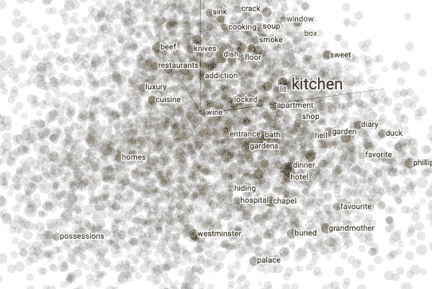
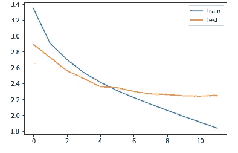

# 具有手套嵌入的文本摘要..

> 原文：<https://towardsdatascience.com/text-summarization-with-glove-embeddings-1e969ef9a452?source=collection_archive---------21----------------------->

## 基于注意力的 LSTM 编解码器模型的手套嵌入文本摘要。


安妮·斯普拉特在 [Unsplash](https://unsplash.com?utm_source=medium&utm_medium=referral) 上的照片

这个故事是我们之前的[博客文章](/lets-give-some-attention-to-summarising-texts-d0af2c4061d1)的延续，在那里我们已经讨论了文本摘要的基础，各种方法以及我们如何实现一个编码器-解码器模型(注意)来解决手头的问题。

简单回顾一下，文本摘要是从多种文本资源(如书籍、新闻文章、博客帖子、研究论文、电子邮件和推文)中生成简明而有意义的文本摘要的过程。

我们已经看到编码器-解码器(seqtoseq)模型是摘要任务的完美选择，所以我们将继续使用该架构。除此之外，我们将使用 **GloVe 预训练单词嵌入**让我们的模型领先一步，并检查它在理解语言语义和总结方面是否真的表现得更好。

# 什么是单词嵌入？

“单词嵌入”是一组旨在将语义映射到几何空间的自然语言处理技术。这是通过将数字向量与字典中的每个单词相关联来实现的，使得任何两个向量之间的距离(例如，L2 距离或更常见的余弦距离)将捕获两个相关单词之间的部分语义关系。这些向量形成的几何空间称为*嵌入空间*。

例如，“ ***椰子*** ”和“ ***北极熊”*** 是语义完全不同的单词，因此合理的嵌入空间会将它们表示为相距很远的向量。但是“ ***厨房*** ”和“ ***晚餐*** ”是关联词，所以应该是嵌得比较近的。

理想情况下，在一个好的嵌入空间中，从“厨房”到“晚餐”的“路径”(一个向量)将精确地捕捉这两个概念之间的语义关系。在这种情况下，关系是“x 出现的地方”，因此您会期望向量`kitchen - dinner`(两个嵌入向量的差，即从晚餐到厨房的路径)捕捉这种“x 出现的地方”关系。基本上，我们应该有向量恒等式:`dinner + (where x occurs) = kitchen`(至少近似)。如果事实确实如此，那么我们可以用这样一个关系向量来回答问题。例如，从一个新的向量开始，例如“工作”，并应用这个关系向量，我们应该得到一些有意义的东西，例如`work + (where x occurs) = office`，回答“工作发生在哪里？”。

通过对文本语料库中单词之间的共现统计数据集应用降维技术来计算单词嵌入。这可以通过神经网络(“word2vec”技术)或矩阵分解来完成。

我们可以玩这个漂亮的[张量流投影仪](https://projector.tensorflow.org/)，更好地理解单词嵌入。



所有与厨房相关的单词。

# 为什么要嵌入手套？

两个最常见的单词嵌入是: **Word2Vec** 和 **GloVe，**而且这两个都同样受欢迎。但是 [GloVe](https://nlp.stanford.edu/projects/glove/) (单词表示的全局向量)顾名思义更适合保存**全局上下文**，因为它通过估计给定单词与其他单词共现的概率来创建全局共现矩阵。在这里，为了进行总结，全局环境是必要的，所以我们继续使用 GloVe，但是在大多数用例中，两者之间很少有选择。

具体来说，我们将使用在 2014 年英语维基百科转储上计算的 40 万个单词的 100 维手套嵌入。你可以在这里下载它们[(警告:点击这个链接将开始一个 822MB 的下载)。](http://nlp.stanford.edu/data/glove.6B.zip)

# 编码时间:


照片由 [Arian Darvishi](https://unsplash.com/@arianismmm?utm_source=medium&utm_medium=referral) 在 [Unsplash](https://unsplash.com?utm_source=medium&utm_medium=referral) 上拍摄

这是 LSTM 编码器-解码器模型的完整[代码](https://gist.github.com/sayakmisra/9f12e5c86c38c69b2678b8b58e719082)，添加了注意力和手套嵌入。

我们不讨论模型架构的细节，因为我们在之前的[博客文章](/lets-give-some-attention-to-summarising-texts-d0af2c4061d1)中已经讨论过了，并转而关注于向其添加手套嵌入和评估性能。

## 下载并解压手套

首先，让我们下载并解压缩手套嵌入。

```
!wget 'http://nlp.stanford.edu/data/glove.6B.zip'!unzip '/content/glove.6B.zip'
```

## 制备嵌入层

接下来，我们通过解析预训练嵌入的数据转储来计算将单词映射到已知嵌入的索引:

```
embeddings_index = {}
f = open(os.path.join(GLOVE_DIR, 'glove.6B.100d.txt'))
for line in f:
    values = line.split()
    word = values[0]
    coefs = np.asarray(values[1:], dtype='float32')
    embeddings_index[word] = coefs
f.close()

print('Found %s word vectors.' % len(embeddings_index))
```

此时，我们可以利用我们的`embedding_index`字典和`word_index`来计算我们的嵌入矩阵:

```
EMBEDDING_DIM = 100
embedding_matrix = np.zeros((len(word_index) + 1, EMBEDDING_DIM))
for word, i in word_index.items():
    embedding_vector = embeddings_index.get(word)
    if embedding_vector is not None:
        # words not found in embedding index will be all-zeros.
        embedding_matrix[i] = embedding_vector
```

我们将这个嵌入矩阵加载到一个`Embedding`层中。注意，我们设置`trainable=False`是为了防止权重在训练过程中被更新。以前我们使用默认的`Embedding`层，带有`trainable=True`，它通过训练过程学习嵌入。

```
embedding_layer = Embedding(len(word_index) + 1,
                            EMBEDDING_DIM,
                            weights=[embedding_matrix],
                            input_length=MAX_SEQUENCE_LENGTH,
                            trainable=False)
```

这里，我们使用 100 维手套嵌入，嵌入保存在 glove.6B.100d.txt 中。

一个`Embedding`层应该被输入整数序列，即形状`(samples, indices)`的 2D 输入。这些输入序列应该被填充，以便它们在一批输入数据中具有相同的长度(尽管如果您没有向层传递一个明确的`input_length`参数，`Embedding`层能够处理不同长度的序列)。

`Embedding`层所做的只是将整数输入映射到嵌入矩阵中相应索引处的向量，即序列`[1, 2]`将被转换为`[embeddings[1], embeddings[2]]`。这意味着`Embedding`层的输出将是一个形状为`(samples, sequence_length, embedding_dim)`的 3D 张量。

## 培训绩效:



培训和测试损失

我们得到大约 2.25 的验证损失，这与我们在没有手套嵌入的情况下得到的损失相似。

## 测试:

```
**Review**: tried several tassimo discs gevalia best coffee ever tasted coffee snob love coffee  
**Original summary:** great coffee  
**Predicted summary:** best coffee ever**Review**: almonds unbelievable amount salt love salt top bought brand stores never salty maybe machine went wacko processing cannot eat unless take time try wipe salt talks forever  
**Original summary:** too salty to eat  
**Predicted summary:** not the best**Review:** sure much nourishment hair getting shampoo dandruff nice job cleaning hair leaving tangle free somewhat conditioned using pantene pro shampoo compares favorably pantene like way bottle made easy open dispensing far like way hair coming shampooing seem little better started used bottle seen little improvement really much improvement would say shampoo would worth trying nice job cleaning smells nice bottle easy use relatively inexpensive keep mind make many shampoos one person likes another hate  
**Original summary**: seems like an excellent shampoo  
**Predicted summary:**  great for hair
```

从上面的例子中我们可以看到，它在大多数用例中表现得相当好。

这里是完整实现的 [colab-notebook](https://gist.github.com/sayakmisra/9f12e5c86c38c69b2678b8b58e719082) 。

# 使用手套嵌入真的能提高性能吗？

长话短说，**号**

虽然该模型可能在某些情况下产生更好的摘要，但不能肯定它在所有示例中都有更好的结果。这背后的主要原因是我们在这里有足够的记录(准确地说是 100000 条)供我们在编码器-解码器模型中的嵌入层学习语言的语义，所以即使没有预先训练的嵌入，它也表现得相当好。

# 那么，我们什么时候应该使用预先训练好的嵌入呢？

如果我们有一个短的数据集，预训练模型(如 GloVe)可以在结果上有很大的改进。如果数据集中的记录数量较少，嵌入层将无法生成自己的正确嵌入，在这种情况下，使用预先训练的嵌入将提高性能准确性。

# 结论

在这里，我们已经看到了如何将预训练嵌入添加到现有的 LSTM 编码器-解码器架构中，虽然结果没有出现太多尖峰，但它可以在较小的数据集上表现出色。

如果我们能够利用**迁移学习**的真正精髓，通过使用预训练语言模型的状态，如:**，**巴特**， **T5** ，我们可以进一步大幅改进总结过程。在我们的下一个故事中，我们将深入研究这些模型的细节，以及它们如何精彩地概括文本。**

# **参考**

1.  **[https://www.kaggle.com/snap/amazon-fine-food-reviews](https://www.kaggle.com/snap/amazon-fine-food-reviews)**
2.  **[https://blog . keras . io/using-pre-trained-word-embedding-in-a-keras-model . html](https://blog.keras.io/using-pre-trained-word-embeddings-in-a-keras-model.html)**
3.  **[https://projector.tensorflow.org/](https://projector.tensorflow.org/)**