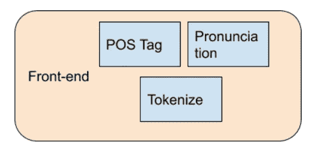
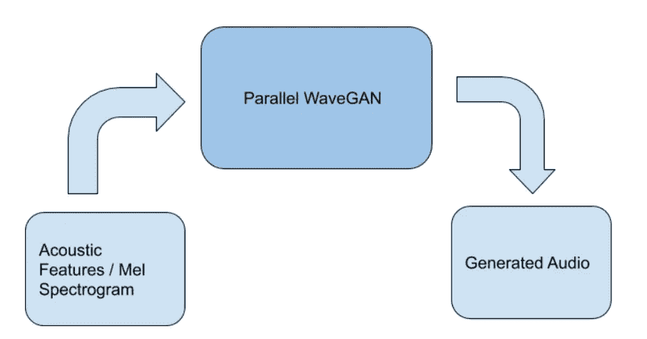

# 使用 Tacotron-2 进行文本到语音转换，使用 ESPnet 进行快速语音转换。

> 原文：<https://towardsdatascience.com/text-to-speech-with-tacotron-2-and-fastspeech-using-espnet-3a711131e0fa?source=collection_archive---------20----------------------->

## 端到端神经文本到语音的初学者指南..

迈克尔·马森在 [Unsplash](https://unsplash.com?utm_source=medium&utm_medium=referral) 上的照片

顾名思义，文本到语音(TTS)朗读文本。它将书面文字作为输入，并将其转换为音频。TTS 可以帮助那些不想花力气去阅读一本书、博客或文章的人。在本文中，我们将看到如何在我们对 TTS 一无所知的情况下创建一个 TTS 引擎。

# 文本到语音体系结构

我们的 TTS 架构

上图是我们将要遵循的架构的简单表示。我们将详细研究每一个组件，我们将使用 [**ESPnet**](https://github.com/espnet/espnet) 框架来实现目的。

## 前端

我们的前端。

它主要有三个组成部分:

1.  **词性标注器:**对输入文本进行词性标注。
2.  **分词:**将句子分词。
3.  **发音:**根据发音将输入文本分解成音素。例如你好，你好→ HH AH0 L OW，HH AW1 AA1 R Y UW1。这是通过一个字素到音素的转换器来完成的，在这种情况下，我们使用一个神经预训练的 [G2P(字素到音素)模型](https://github.com/Kyubyong/g2p)。该模型旨在将英语字素(拼写)转换为音素(发音)。为了简单地说明这个 G2P 模型的工作，我们可以说，如果我们想知道某个单词的发音，它会查阅字典，如果该单词没有存储在字典中，它会使用基于 TensorFlow 的 seq2seq 模型来预测音素。

## 序列到序列回归器:

序列-2-序列回归器。

我们将使用预先训练的 seq-to-seq 回归器，它输入语言特征(音素)并输出声学特征(Mel-spectrogram)。在这里，我们将使用 Tacotron-2(谷歌的)和 Fastspeech(脸书的)进行操作。因此，让我们快速了解一下这两种情况:

## Tacotron-2

Tacotron-2 架构。图片[来源](https://ai.googleblog.com/2017/12/tacotron-2-generating-human-like-speech.html)。

[Tacotron](https://ai.googleblog.com/2017/12/tacotron-2-generating-human-like-speech.html) 是一个人工智能驱动的语音合成系统，可以将文本转换为语音。Tacotron 2 的神经网络架构直接从文本中合成语音。它基于卷积神经网络(CNN)和递归神经网络(RNN)的组合来工作。

## 快速演讲

FastSpeech 的整体架构。(a)前馈变压器。(b)前馈变压器块。长度调节器。持续时间预测值。MSE 损失表示预测持续时间和提取持续时间之间的损失，它只存在于训练过程中。图片[来源](https://www.microsoft.com/en-us/research/blog/fastspeech-new-text-to-speech-model-improves-on-speed-accuracy-and-controllability/)。

**(a)、(b)前馈变压器:**

[FastSpeech](https://www.microsoft.com/en-us/research/blog/fastspeech-new-text-to-speech-model-improves-on-speed-accuracy-and-controllability/) 采用了新颖的前馈变压器结构，抛弃了常规的编码器-注意力-解码器框架，如上图所示。前馈变压器的主要组件是前馈变压器模块(FFT 模块，如图(b)所示)，由自关注和 1D 卷积组成。FFT 块用于从音素序列到 mel 谱图序列的转换，在音素侧和 mel 谱图侧分别有 *N* 个堆叠块。独特的是，在它们之间有一个长度调节器，用于桥接音素和 Mel-频谱图序列之间的长度不匹配。(注意:音素是语音的微小而独特的声音。)

**(c)长度调节器:**

该型号的长度调节器如上图所示。由于音素序列的长度小于 mel 谱图序列的长度，所以一个音素对应于几个 mel 谱图。对准一个音素的 mel 频谱图的数量被称为*音素持续时间*。长度调节器根据持续时间扩展隐藏的音素序列，以便匹配 mel 谱图序列的长度。我们可以按比例增加或减少音素持续时间来调整语速，也可以改变空白标记的持续时间来调整单词之间的间隔，以便控制部分韵律。

**(d)持续时间预测值:**

持续时间预测器对于长度调节器能够确定每个音素的持续时间非常关键。如上图所示，持续时间预测器由两层 1D 卷积和一个线性层组成，用于预测持续时间。持续时间预测器堆叠在音素侧的 FFT 块上，并且通过均方误差(MSE)损失函数与 FastSpeech 联合训练。音素持续时间的标签是从自回归教师模型中编码器和解码器之间的注意力对准中提取的。

## 波形发生器/声码器:

声码器

我们将使用预先训练的序列到序列模型，该模型输入声学特征(Mel 频谱图)并输出波形(音频)。这里我们将使用并行 WaveGAN 声码器。这里一个 [**生成对抗网络** ( **【甘)**](https://en.wikipedia.org/wiki/Generative_adversarial_network) 架构用于从 Mel-spectrograms 生成波形，关于这个架构的更多信息可以在[这里](https://arxiv.org/pdf/1910.11480.pdf)找到。

## 履行

我们已经使用[**ESPnet**](https://github.com/espnet/espnet)**框架实现了上述架构。它提供了一个惊人的结构来轻松实现上述所有预训练的模型，并集成它们。这是完整的文本到语音转换实现的笔记本。**

# **结论**

**我们使用 Tacotron-2、Fastspeech、Parallel WaveGAN 等各种预训练模型实现了一个神经 TTS 系统。我们可以进一步尝试其他可能产生更好结果的模型。**

# **参考**

1.  **[https://github.com/kan-bayashi/ParallelWaveGAN](https://github.com/kan-bayashi/ParallelWaveGAN)**
2.  **[https://github.com/espnet/espnet](https://github.com/espnet/espnet)**
3.  **[https://www . Microsoft . com/en-us/research/blog/fast speech-new-text-to-speech-model-improves-on-speed-accuracy-and-control ability/](https://www.microsoft.com/en-us/research/blog/fastspeech-new-text-to-speech-model-improves-on-speed-accuracy-and-controllability/)**
4.  **[https://ai . Google blog . com/2017/12/taco tron-2-generating-human-like-speech . html](https://ai.googleblog.com/2017/12/tacotron-2-generating-human-like-speech.html)**
5.  **[http://media . speech . zone/images/interspeech 2017 _ tutorial _ Merlin _ for _ publication _ watered _ compressed _ v2 . pdf](http://media.speech.zone/images/Interspeech2017_tutorial_Merlin_for_publication_watermarked_compressed_v2.pdf)**
6.  **https://arxiv.org/pdf/1910.11480.pdf**