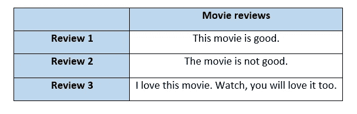
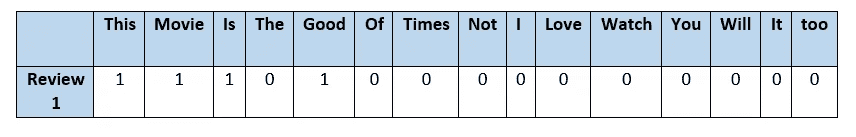
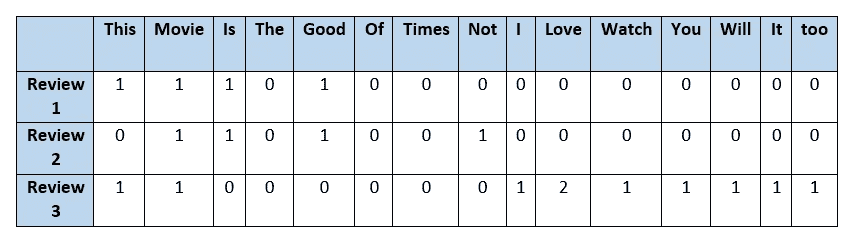
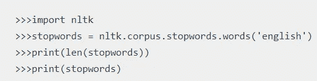
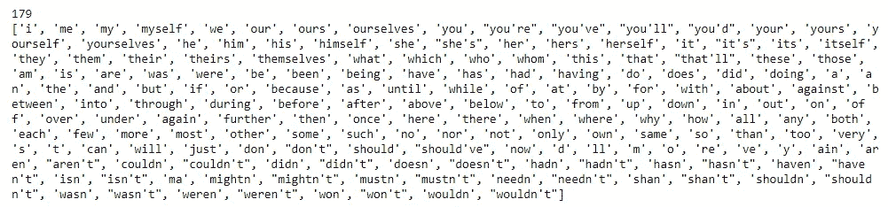
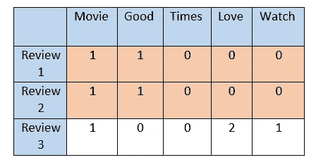

# 文本矢量化:单词包(BoW)

> 原文：<https://towardsdatascience.com/text-vectorization-bag-of-words-bow-441d1bfce897?source=collection_archive---------20----------------------->

## 如何将文本特征转换成矢量

图片由[阿玛多·洛雷罗](https://unsplash.com/photos/BVyNlchWqzs)拍摄，来自 Unsplash

文本数据用于自然语言处理(NLP)，它使用自然语言在人类和机器之间进行交互。文本数据有助于分析电影评论、使用亚马逊评论的产品等。但这里出现的问题是**在建立机器学习模型时，如何处理文本数据？**

通过各种技术将文本数据转换成实值向量。一种这样的方法是**单词包(BoW)，**，这将在本文中讨论。但是**为什么我们要把文本转换成矢量呢？为什么不能用文本数据建立机器学习模型？**

## 需要文本矢量化

假设我们有一个产品的评论。客户提供的文本评论长度不同。通过将文本转换成数字，我们可以用有限长度的向量来表示评论。这样，无论文本长度如何，每次评论的向量长度都是相等的。

单词包是文本到向量的最简单的表示。向量的每一列代表一个单词。行中每个单元格中的值显示一个单词在句子中出现的次数。

**例子**

作者图片

第一步是找到一个独特单词的**词汇表**(忽略标点符号和大小写)。上面例子中的词汇:

**【这个，电影，是，那个，好，的，时代，不是，我，爱，看，你，会，它，太】**

在我们的词汇中，有 15 个独特的单词。所以**每一条影评都用一个 15 维的向量来表示**(每个词代表一个维度)。对于第一次审查:

作者图片

对应于每个单词的值显示了一个单词在评论中出现的次数。类似地，15 维向量表示剩余的评论。

作者图片

在现实问题中，文本数据在矢量化之前必须进行预处理。预处理包括删除标点符号，将所有单词转换为小写，以及删除对文本没有任何价值的不必要的单词。

在自然语言处理(NLP)中，不必要的单词被称为**停用词**。nltk 库已经包含了停用词列表。英语中有 179 个停用词。

作者图片

作者图片

我们将看到我们的例子后，删除停用词。

词汇**——【电影，好，时代，爱情，看点】**

作者图片

请注意，review 1 和 2 的向量是相同的，因为“not”出现在停用词中。该模型认为两个评论是相同的，因为两者的向量是相等的。这个问题的一个解决方案是使用 **n 元语法。**

## n-grams

n 元语法是 n 个单词的相邻序列。n 可以是任何正整数。

例如，“单词包”是三个字母，“文本矢量化”是两个字母。

在我们的例子中，我们使用了一元语法。这意味着每个单词都被认为是一个特征。删除停用词将删除诸如“not”之类可能有用的词。基于单字的单词包(BoW)不考虑序列信息。为了考虑序列信息，我们使用**二元语法、三元语法**等。

在我们的例子中，如果我们使用二元语法，词汇可以改为:

**【这部电影，电影是，是好的，这部电影，不是，不是好的，我爱，爱这个，看电影，看你，你会，会爱，爱它，它太】**

因此，n-grams 将比基于单-gram 的模型给出更好的结果。

## 弓的缺点

1.  向量的长度可以很长，大部分值为零。从计算上来说，如果词汇量很大，效率就不高。
2.  基于单字的 BoW 无法捕捉文本的上下文。二元模型和三元模型可以完成这项工作，但是计算量很大。

## 结论

单词包是一种文本矢量化技术，可以将文本转换为有限长度的向量。boW 模型易于实现和理解。单词袋有一些缺点，可以通过使用先进的技术来克服。

感谢阅读！