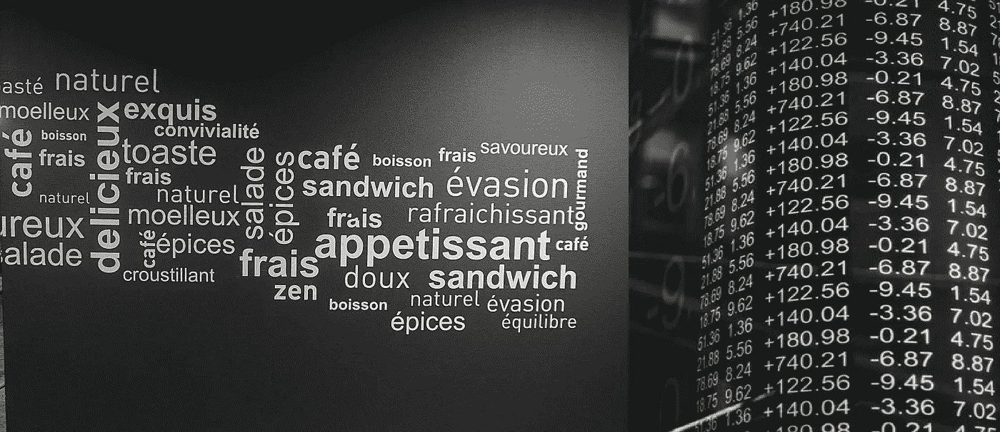
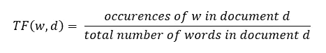
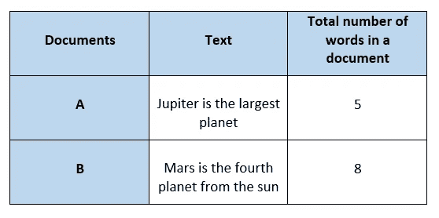
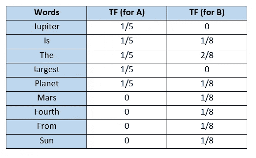
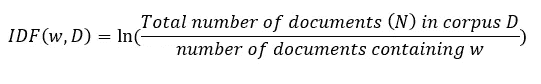
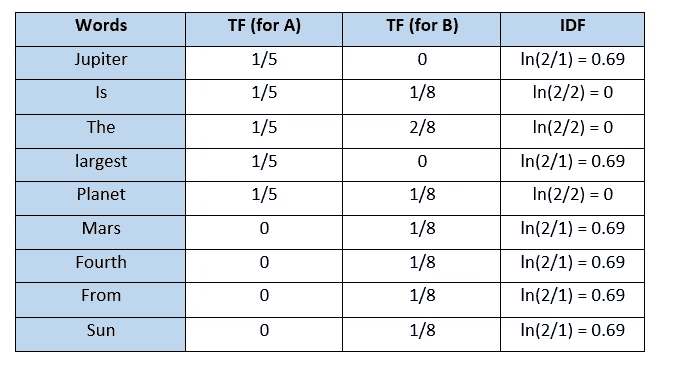
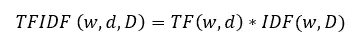
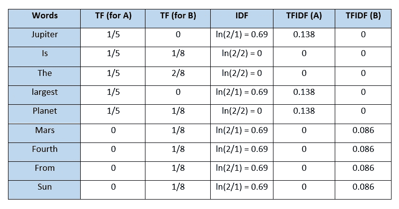

# 文本矢量化:词频—逆文档频率(TFIDF)

> 原文：<https://towardsdatascience.com/text-vectorization-term-frequency-inverse-document-frequency-tfidf-5a3f9604da6d?source=collection_archive---------6----------------------->

## 一种将文本转换成有限长度向量的技术

图片由[赫尔曼](https://www.pexels.com/photo/black-and-white-design-text-wall-241832/)(左)和[泰勒·伊斯顿](https://unsplash.com/photos/faixctm2YRQ)(右)拍摄

单词包(BoW)通过计算文档中单词的出现次数将文本转换为特征向量。它没有考虑到文字的重要性。**词频—逆文档频率(TFIDF)** 基于词袋(BoW)模型，该模型包含关于文档中不太相关和更相关的词的见解。文本中一个词的重要性在信息检索中具有重要意义。

**例** —如果你在搜索引擎上搜索某个东西，借助 TFIDF 值，搜索引擎可以给我们与我们的搜索最相关的文档。

我们将详细讨论 TFIDF 如何告诉我们哪个单词更重要？我们将首先分别研究术语频率(TF)和逆文档频率(IDF ),然后在最后将它们结合起来。

## 术语频率(TF)

它是一个单词(w)在文档(d)中出现频率的度量。TF 被定义为单词在文档中出现的次数与文档中单词总数的比率。公式中的分母项是归一化，因为所有语料库文档的长度都不同。

作者图片

**例子**

作者图片

第一步是制作一个独特单词的词汇表，并计算每个文档的 TF。TF 对于频繁出现在文档中的单词会更大，而对于文档中不常见的单词会更小。

作者图片

## 反向文档频率(IDF)

它是衡量一个单词重要性的标准。词频(TF)不考虑词的重要性。有些词如 of、and 等。可能最常见，但意义不大。IDF 基于每个单词在语料库 d 中的频率为其提供权重

单词(w)的 IDF 定义为

作者图片

在我们的例子中，由于语料库中有两个文档，N=2。

作者图片

## 术语频率—反向文档频率(TFIDF)

它是 TF 和 IDF 的产物。

*   TFIDF 给予语料库(所有文档)中不常见的单词更多的权重。
*   TFIDF 为在文档中出现频率较高的单词提供了更高的重要性。

作者图片

作者图片

应用 TFIDF 后，A 和 B 文档中的文本可以表示为一个 TFIDF 向量，其维数等于词汇表中的单词。对应于每个单词的值表示该单词在特定文档中的重要性。

**为什么我们在 IDF 公式中使用 Ln？**

TFIDF 是 TF 与 IDF 的产物。由于 TF 值介于 0 和 1 之间，因此不使用 ln 会导致某些单词的高 IDF，从而支配 TFIDF。我们不希望这样，因此，我们使用 **ln** ，这样 IDF 就不会完全控制 TFIDF。

## TFIDF 的缺点

它无法捕捉到**语义**。例如，**滑稽**和**幽默**是同义词，但是 TFIDF 没有抓住这一点。此外，如果词汇表很大，TFIDF 的计算开销会很大。

## 结论

词频—逆文档频率(TFIDF)是一种基于词袋(BoW)模型的文本矢量化技术。它比 BoW 模型表现得更好，因为它考虑了单词在文档中的重要性。主要的限制是它不能捕捉单词的语义。TFIDF 的这种局限性可以通过 word2Vec 等更高级的技术来克服。

感谢阅读！