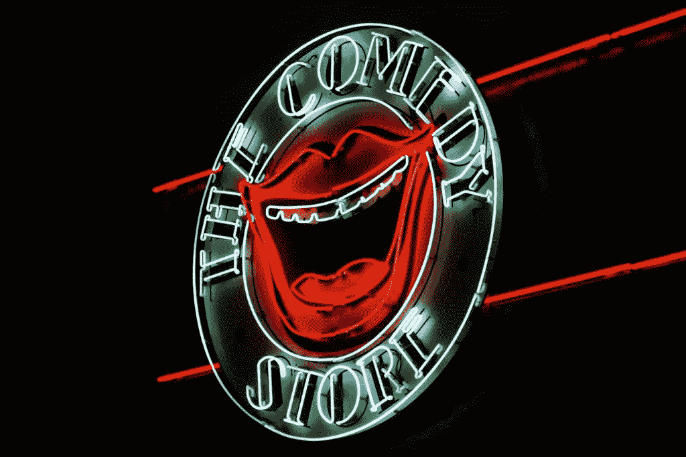
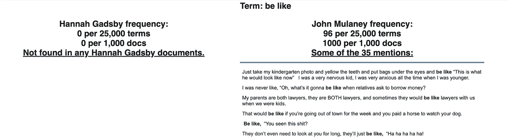
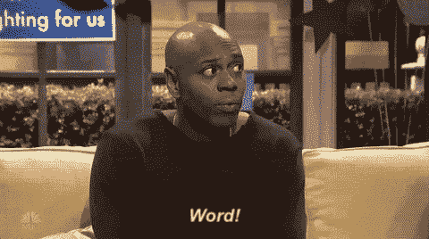
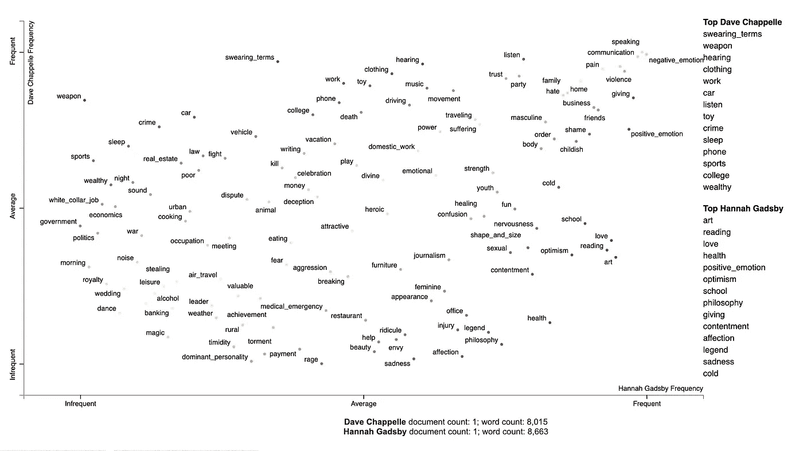
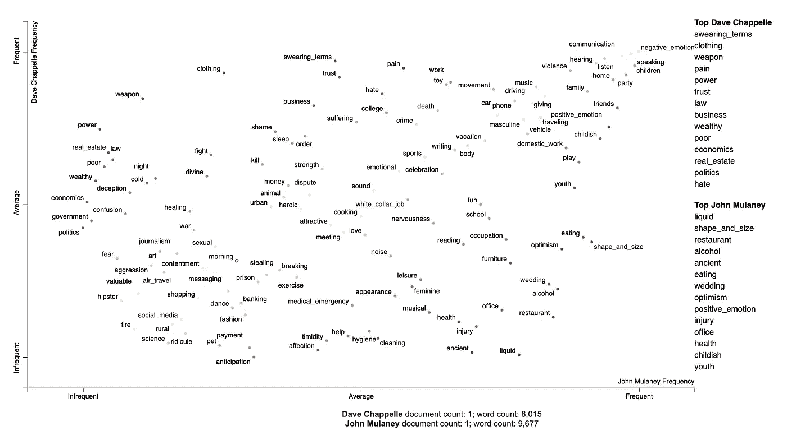
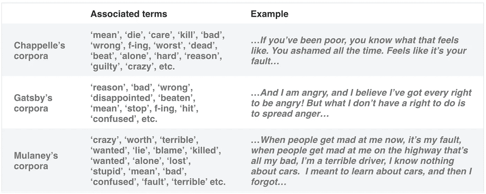
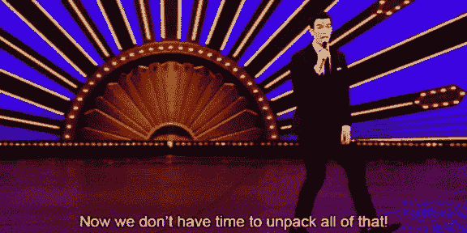

# 具有分散文本的单口喜剧的文本可视化

> 原文：<https://towardsdatascience.com/text-visualization-of-stand-up-comedy-with-scattertext-2ec2fa21139d?source=collection_archive---------53----------------------->

## 使用现代公开可用的工具，文本分析和可视化变得简单而有趣

自然语言处理(NLP)是机器学习的一个分支，处理和分析人类语言，包括语音和文本。数据可视化是指一套用于以视觉格式呈现数据的技术，这种格式更容易被人脑消化并从中发现模式。随着包括文本在内的数据量的增长，用于文本处理、分析和可视化的工具也在发展。



*照片由* [*博戈米尔*](https://unsplash.com/@bogomi?utm_source=unsplash&utm_medium=referral&utm_content=creditCopyText) *&* [*弗雷德里克*](https://unsplash.com/@callmefred?utm_source=unsplash&utm_medium=referral&utm_content=creditCopyText)

在本文中，我将展示文本分析和可视化可以变得简单而有趣，并且借助现代公开可用的工具，每个人都可以做到这一点，即使没有太多的编程经验。

为了让这篇文章更有趣，我选择了分析起来有趣的开源数据。使用单口喜剧电视特别节目脚本和 NLP 技术来比较不同喜剧演员的想法是受本教程[的启发。](https://github.com/adashofdata/nlp-in-python-tutorial)

本文撰写时(2020 年 3 月)，以下单口喜剧电视特别节目在 IMDB 中最受欢迎:

*   大卫·查普尔:棍子和石头
*   汉娜·加斯比:纳内特
*   约翰·木兰尼:新城市

# 预处理

我从《阁楼的碎片》中搜集了上述节目的剧本，这是一本以电影评论、单口喜剧剧本、采访等为特色的数字杂志。使它们可用于非盈利和教育目的。使用公开可用的工具，我试图首先了解舞台人物，每个喜剧演员最具特征的词语，以及喜剧演员之间词语使用的差异。

在预处理步骤中，我删除了括号中表示被观众打断的文本(例如“[观众笑]”)。

```
data_df['transcript'] =  [re.sub(r'([\(\[]).*?([\)\]])','', str(x)) for x in data_df['transcript']]
```

然后我使用散点图(Kessler，2017)，这是一种围绕散点图构建的公共可用工具，是对最常用词和词云进行排序等传统技术的替代方法。

```
!pip install scattertext
import scattertext as st
```

# 用散文本可视化语料库差异

为了生成我们的第一个可视化，我选择了第一对喜剧演员进行比较，并按照原始教程的步骤进行。我使用 Spacy 将抄本解析成记号。为了构建一个分散文本语料库，我将 category_col 参数设置为“comedian ”,并将解析后的文本传递给 parsed_col 参数。在最后一步中，我将可视化结果写入一个 HTML 文件，以便在浏览器中显示。我指定并命名我希望出现在 y 轴上的类别(即“汉娜·加兹比”)，命名我希望与加兹比的抄本进行比较的类别(即“约翰·木兰尼”)，并调整其他参数(如 width_in_pixels 和 minimum_term_frequency)。

```
# chose the comedians to compare
pair1 = 'Hannah Gadsby', 'John Mulaney'
df_pair1 = data_df[data_df['comedian'].isin(pair1)]# parse speech text using spaCy
nlp = spacy.load('en')
df_pair1['parsed'] = df_pair1.transcript.apply(nlp)# convert dataframe into Scattertext corpus
corpus_pair1 = st.CorpusFromParsedDocuments(df_pair1, category_col='comedian', parsed_col='parsed').build()# visualize term associations
html = produce_scattertext_explorer(corpus_pair1,
                                    category='Hannah Gadsby',
                                    category_name='Hannah Gadsby',
                                    not_category_name='John Mulaney',
                                    width_in_pixels=1000,
                                    minimum_term_frequency=5
                                    )
file_name = 'terms_pair1.html'
open(file_name, 'wb').write(html.encode('utf-8'))
IPython.display.HTML(filename=file_name)
```

通过这几行代码，我得到了一个非常简洁的文本可视化。


图 1

图 1 显示了一个比较汉娜·盖斯比和约翰·木兰尼抄本的散点图的例子。一个点的坐标表示这个词被盖斯比或穆拉尼使用的频率。y 轴上的点越高，Gadsby 使用的就越多，x 轴上的点越靠右，Mulaney 使用的就越多。与喜剧演员之一高度相关的术语出现在图表的左上角或右下角，以及停用词(语言中最常见的词，如“the”、“and”等。)出现在右上角。在加兹比和穆拉尼的记录中不常出现的单词出现在左下角。蓝色的点与加兹比有关，红色的点与穆拉尼有关。通过点击一个点，我得到了关于一个术语在 Gadsby 和 Mulaney 的抄本中的相对使用的统计数据，并且看到了该术语出现的抄本的摘录(图 2)。



图 2

让我们看看我能从中获得的一些快速见解。

穆兰妮用了很多“像”(和“像”)这样的词……*我从来没有像“哦，当亲戚问我借钱的时候会是什么样子？*加兹比使用“因为”的频率几乎是穆拉尼的三倍(每 25k 项 199 次，而穆拉尼每 25k 项 69 次)……*非常聪明，因为这很有趣……因为这是真的。*

穆拉尼是一个神经质的人… *只是对很多事情太过焦虑，我一直都很紧张，甚至不是关于生活中的重大事情，只是关于日常情况。当盖斯比学习艺术史时… *你不会在喜剧节目中听到太多关于艺术史的长篇大论，所以…不客气。这些展示了两位喜剧演员在他们的材料中使用的示例主题。**

顺便问一下，为什么我没有用查佩尔的文字记录来可视化术语关联？嗯，有太多的“术语”模糊不清…



*2016 年大卫·夏佩尔在周六夜现场(GIF 来源:*[https://gph.is/2ePdMRF](https://gph.is/2ePdMRF)*)*

# 使用 Empath 可视化主题

在下一个例子中，我使用 Chappelle 的文字记录来可视化移情主题。

Empath (Fast et al .，2016)是一种跨词汇类别(或主题)分析文本的工具，它也可以从文本中生成新的类别(例如，“出血”和“打孔”术语生成类别*暴力*)。

为了用分散文本可视化 Empath 主题，我安装了 Empath，一个开源 Python 库，并创建了一个提取主题的语料库。我使用[源代码](https://github.com/JasonKessler/scattertext)为我们的数据调整它。结果如图 3 所示。

```
!pip install empath# chose the comedians to compare
pair2 = 'Dave Chappelle', 'Hannah Gadsby'
df_pair2 = data_df[data_df['comedian'].isin(pair2)]# parse speech text using spaCy
nlp = spacy.load('en')
df_pair2['parsed'] = df_pair2.transcript.apply(nlp)# create a corpus of extracted topics
feat_builder = st.FeatsFromOnlyEmpath()
empath_corpus_pair2 = st.CorpusFromParsedDocuments(df_pair2,
                                             category_col='comedian',
                                             feats_from_spacy_doc=feat_builder,
                                             parsed_col='parsed').build()# visualize Empath topics
html = produce_scattertext_explorer(empath_corpus_pair2,
                                    category='Dave Chappelle',                                       
                                    category_name='Dave Chappelle',
                                    not_category_name='Hannah Gadsby',
                                    width_in_pixels=1000,
                                    use_non_text_features=True,
                                    use_full_doc=True,                              topic_model_term_lists=feat_builder.get_top_model_term_lists())
file_name = 'empath_pair2.html'
open(file_name, 'wb').write(html.encode('utf-8'))
IPython.display.HTML(filename=file_name)
```

图 3 显示了从 Chappelle 和 Gadsby 的材料中提取的移情主题的比较。一个点的坐标表明了这些主题在查佩尔或盖斯比的抄本中出现的频率。Chappelle 最常出现的话题(即 Empath 工具生成的词汇范畴)是‘脏话 _ 术语’，Gadsby 的是‘艺术’。在右上角，我看到了与两位喜剧演员高度相关的话题。其中包括“负面情绪”，以及似乎与之相关的“暴力”、“痛苦”和“仇恨”。“武器”和“犯罪”位于左上角，与 Chappelle 相关，而“愤怒”和“悲伤”为红色，表示与 Gadsby 的关联更强。也就是说，这两个电视特别节目似乎涵盖了各种各样的困难话题…



图 3

如果我为 Chappelle 和 Mulaney 创建一个类似的文本可视化(图 4)，我仍然会在右上角看到“负面情绪”，尽管其他类别如“暴力”、“痛苦”、“仇恨”现在都在左侧。这意味着现在这些类别主要只与一个喜剧演员(查佩尔)相关联。如果我看右边的主题或红色的主题，我实际上看不到任何可以直观地归类为“负面情绪”的东西。



图 4

与之前类似，我可以点击类别(例如“负面情绪”)来查看文字记录的摘录，以及每个喜剧演员的类别是由哪些词产生的。



*约翰·木兰尼:小子华丽，2018 (GIF 来源:*[https://tenor.com/3bVP.gif](https://tenor.com/3bVP.gif)*)*

这种快速的文本可视化分析有助于你决定今晚在网飞看哪些单口喜剧电视特别节目吗？

# 结论

本文旨在探索新的公开可用的自然语言可视化和分析工具。我使用基于浏览器的分散文本工具来比较舞台角色，并可视化三个受欢迎的喜剧演员之间的词汇使用差异。选择散射文本是因为它的简单性、漂亮的交互式可视化和很酷的集成功能，如主题提取。[原教程](https://github.com/JasonKessler/scattertext)提供了更多不同的散点图变体。该工具还会定期更新有趣的特性。下一步是对它们进行测试。

*本文首发于 2020 年 3 月 20 日* [*Dain 工作室网站*](https://dainstudios.com/2020/03/20/text-visualization-of-stand-up-comedy-with-scattertext/) *。*

# 参考资料:

凯斯勒，J. S. (2017)。Scattertext:一个基于浏览器的工具，用于可视化语料库的不同之处。 *arXiv 预印本 arXiv:1703.00565* 。

Fast，e .，陈，b .，&伯恩斯坦，M. S. (2016 年 5 月)。移情:理解大规模文本中的主题信号。在*2016 年中国计算机学会计算系统中人的因素会议论文集*(第 4647–4657 页)。[https://arxiv.org/pdf/1602.06979.pdf](https://arxiv.org/pdf/1602.06979.pdf)